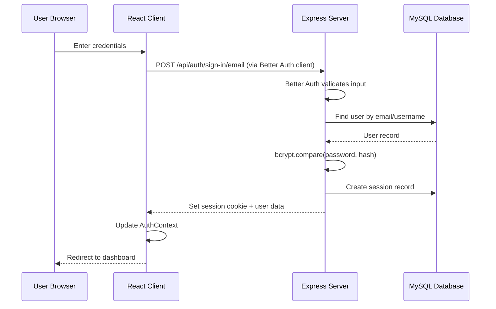
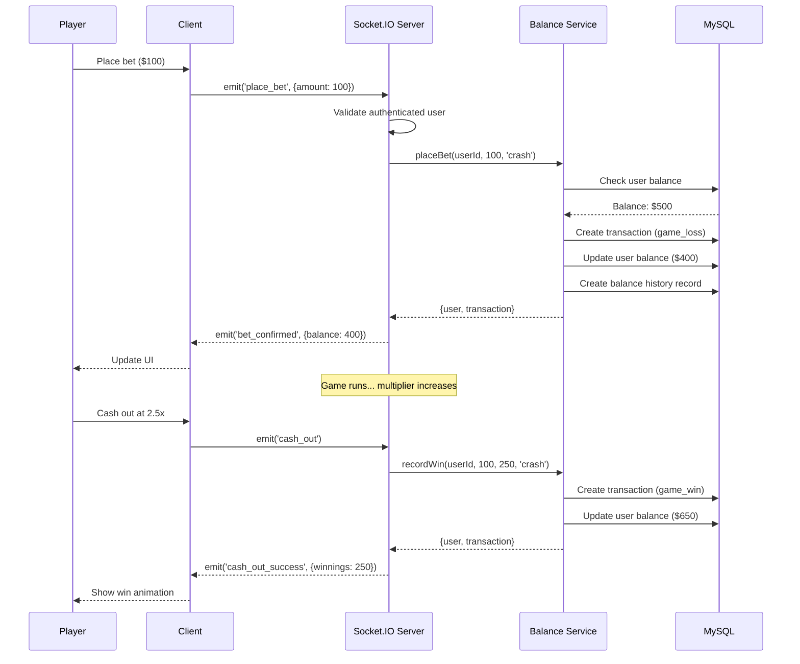
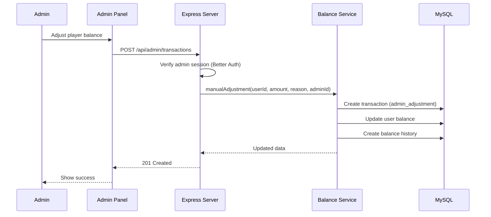
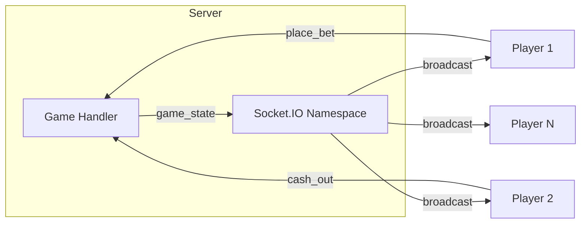

# Data Flow

## Authentication Flow

## Game Bet Flow (Crash Example)

## Admin Balance Adjustment Flow

## Real-time Game State Flow

## Transaction Types

| Type | Direction | Trigger |
|------|-----------|---------|
| `deposit` | Credit (+) | Admin deposit |
| `withdrawal` | Debit (-) | Admin withdrawal |
| `game_win` | Credit (+) | Player wins game |
| `game_loss` | Debit (-) | Player places bet |
| `admin_adjustment` | Either | Admin manual change |
| `bonus` | Credit (+) | System bonus |
| `login_reward` | Credit (+) | Daily login reward |

## Related Documents

- [System Architecture](./system-architecture.md)
- [Socket Architecture](./socket-architecture.md)
- [API Reference](../04-api/rest-api.md)
- [Balance Service](../03-features/balance-system.md)
