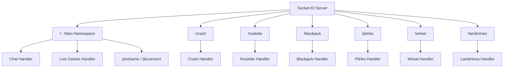
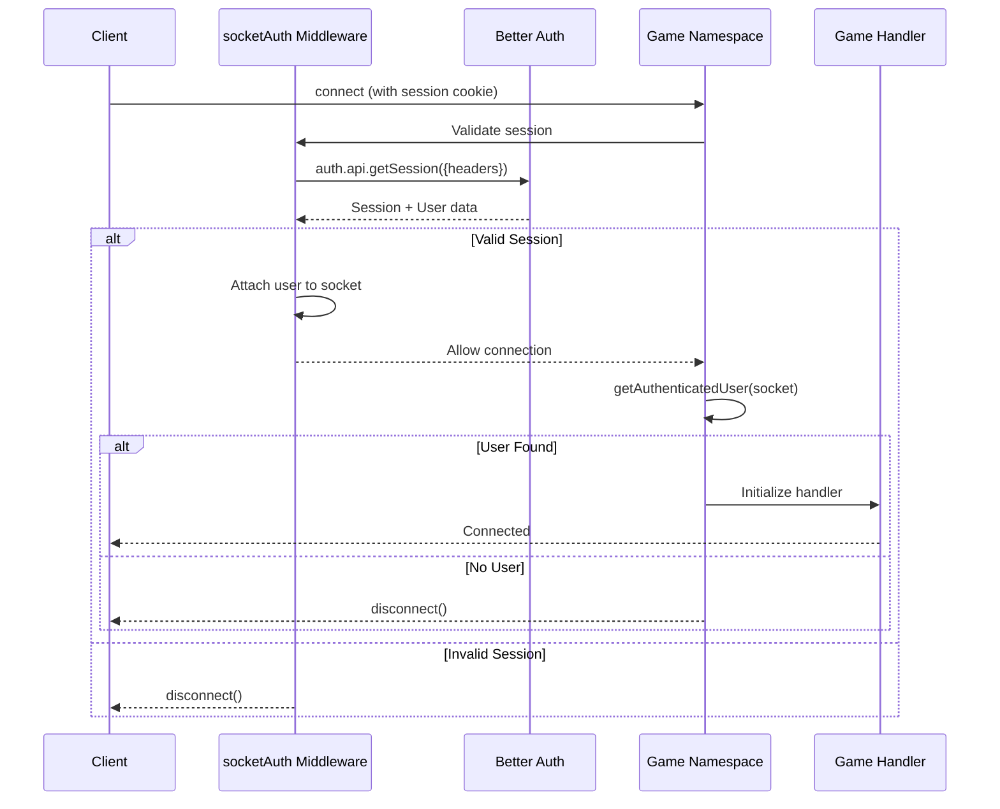
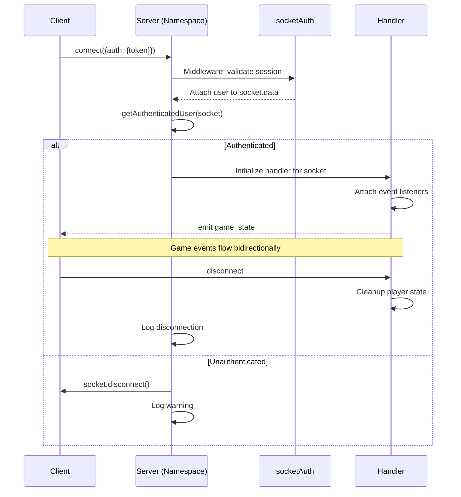

# Socket.IO Architecture

## Namespace Design

Each game operates in its own Socket.IO namespace, providing isolation and independent connection management. Two additional handlers (chat and live games) operate on the main namespace.



## Authentication Flow

All game namespaces use the `socketAuth` middleware that validates Better Auth session tokens before allowing connections. After the middleware passes, each namespace's connection handler verifies the authenticated user via `getAuthenticatedUser(socket)` and disconnects unauthenticated sockets.



## Namespace Status

All six game namespaces are active and wired in `server/server.ts`.

| Namespace | Handler File | Status | Init Pattern |
|-----------|-------------|--------|--------------|
| `/crash` | `crashHandler.ts` | Active | Namespace-level (startup) |
| `/roulette` | `rouletteHandler.ts` | Active | Per-connection function |
| `/landmines` | `landminesHandler.ts` | Active | Per-connection function |
| `/blackjack` | `blackjackHandler.ts` | Active | Class-based (per-connection) |
| `/plinko` | `plinkoHandler.ts` | Active | Per-connection function |
| `/wheel` | `wheelHandler.ts` | Active | Per-connection function |
| Main `/` | `server.ts` | Active | joinGame, disconnect |
| Main `/` | `chatHandler.ts` | Active | Startup init |
| Main `/` | `liveGamesHandler.ts` | Active | Startup init |

---

## Handler Initialization Patterns

The codebase uses three distinct patterns for initializing socket handlers. Each pattern suits different game architectures.

### Pattern 1: Namespace-Level Init (Crash)

The handler is imported once at server startup. It receives the namespace and attaches its own `connection` listener internally. The server also registers its own `connection` handler on the same namespace for logging and auth verification.

```typescript
// Imported once at startup - handler manages its own connection listeners
import('./src/socket/crashHandler.js')
  .then((mod: any) => {
    const init = mod?.default || mod;
    if (typeof init === 'function') init(crashNamespace);
  });

// Server still handles auth verification on connection
crashNamespace.on('connection', (socket) => {
  const user = getAuthenticatedUser(socket);
  if (!user) { socket.disconnect(); return; }
  // Crash handler is initialized at namespace level above
});
```

**When to use:** For games with shared global state (e.g., crash game rounds where all players participate in the same round). The handler needs to manage state across all connections.

### Pattern 2: Per-Connection Function (Roulette, Landmines, Plinko, Wheel)

The handler function is dynamically imported and called for each new socket connection. It receives `(io, socket, user)` as arguments.

```typescript
namespace.on('connection', (socket) => {
  const user = getAuthenticatedUser(socket);
  if (!user) { socket.disconnect(); return; }

  // Handler initialized per-connection with io, socket, and user
  import('./src/socket/rouletteHandler.js')
    .then((mod: any) => {
      const init = mod?.initRouletteHandlers || mod?.default?.initRouletteHandlers;
      if (typeof init === 'function') init(io, socket, user);
    });
});
```

The import resolution tries multiple export paths to support different module formats:
- `mod?.initXxxHandlers` -- named export
- `mod?.default?.initXxxHandlers` -- named export on default
- `mod?.default` -- default export fallback

**When to use:** For games where each player has independent state, or where the handler attaches event listeners directly to the individual socket.

### Pattern 3: Class-Based (Blackjack)

A handler class is instantiated per-connection with the namespace, then `handleConnection(socket)` is called to wire up the individual socket.

```typescript
namespace.on('connection', (socket) => {
  const user = getAuthenticatedUser(socket);
  if (!user) { socket.disconnect(); return; }

  import('./src/socket/blackjackHandler.js')
    .then((mod: any) => {
      const HandlerClass = mod?.default || mod?.BlackjackHandler;
      if (HandlerClass && typeof HandlerClass === 'function') {
        const handler = new HandlerClass(blackjackNamespace);
        handler.handleConnection(socket);
      }
    });
});
```

**When to use:** For games with complex per-session state that benefits from encapsulation in a class instance (e.g., blackjack tables with dealer logic, card decks, and multiple hand states).

### Main Namespace Handlers (Chat, Live Games)

Chat and live games handlers are initialized once at startup on the main namespace. They receive the `io` server instance and attach their own listeners.

```typescript
// Initialized once at server startup
import('./src/socket/chatHandler.js')
  .then((mod: any) => {
    const init = mod?.default || mod?.initChatHandlers;
    if (typeof init === 'function') init(io);
  });

import('./src/socket/liveGamesHandler.js')
  .then((mod: any) => {
    const init = mod?.default || mod?.initLiveGamesHandlers;
    if (typeof init === 'function') init(io);
  });
```

---

## Connection Lifecycle



---

## Common Socket Events

### Client to Server
| Event | Payload | Description |
|-------|---------|-------------|
| `place_bet` | `{amount, options?}` | Place a game bet |
| `cash_out` | `{}` | Cash out (crash) |
| `game_action` | `{action, data}` | Game-specific action |
| `joinGame` | `gameType` | Join main namespace room |

### Server to Client
| Event | Payload | Description |
|-------|---------|-------------|
| `game_state` | `{state, data}` | Current game state |
| `bet_confirmed` | `{balance}` | Bet accepted |
| `game_result` | `{outcome, winnings}` | Game outcome |
| `error` | `{message}` | Error notification |
| `player_joined` | `{username}` | New player connected |

---

## Middleware Stack

All game namespaces share the same middleware configuration:

1. **`socketAuth`** -- Validates the Better Auth session token from the session cookie. On success, attaches user data to the socket. On failure, rejects the connection.

The main namespace (`/`) does not apply `socketAuth` by default, but individual event handlers (like `joinGame`) check for `(socket as any).user` and disconnect unauthenticated sockets.

---

## Optional Redis Adapter

When Redis is available, the server configures `@socket.io/redis-adapter` for horizontal scaling. This allows multiple server instances to share socket state:

```typescript
const pubClient = RedisService.getClient();
const subClient = RedisService.getSubscriber();
if (pubClient && subClient) {
  const { createAdapter } = await import('@socket.io/redis-adapter');
  io.adapter(createAdapter(pubClient, subClient));
}
```

If Redis is unavailable, the server falls back to the default in-memory adapter (single-instance only).

---

## Related Documents

- [System Architecture](./system-architecture.md)
- [Data Flow](./data-flow.md)
- [Socket.IO Events API](../04-api/socket-events.md)
