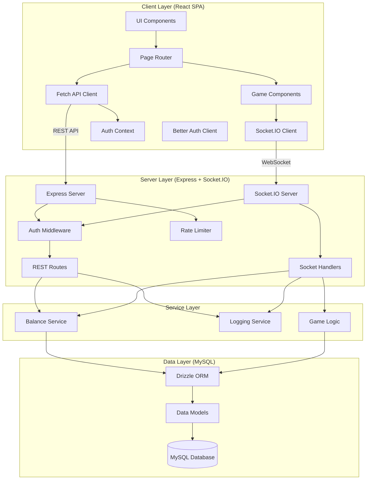
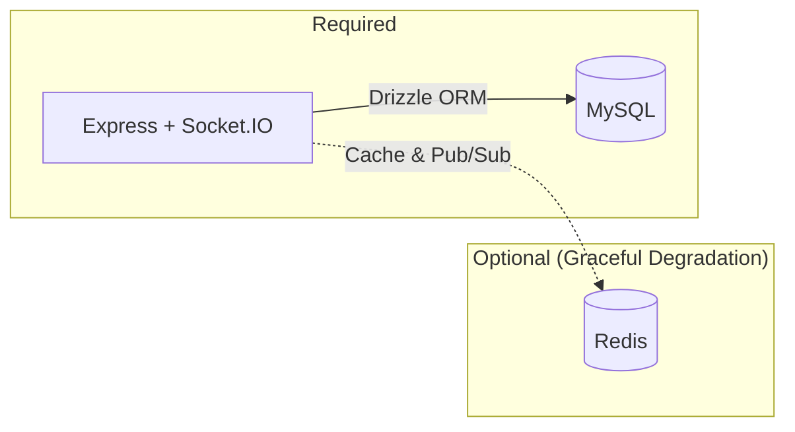

# System Architecture

## High-Level Overview

Platinum Casino follows a classic client-server architecture with real-time communication via WebSockets. The system is divided into four primary layers.

## Component Architecture

### 1. Client Layer

The frontend is a React Single Page Application built with Vite, using React Router v6 for navigation and Tailwind CSS v4 for styling.

**Key patterns:**
- **Context-based auth** - `AuthContext` manages user state, login/logout
- **Route guards** - `AuthGuard` and `AdminGuard` protect routes
- **Per-game socket services** - Each game has its own socket service module
- **Error boundaries** - Global `ErrorBoundary` wraps the app
- **Toast notifications** - `ToastContext` for user feedback

### 2. Server Layer

The Express server handles both REST API requests and Socket.IO WebSocket connections.

**Key patterns:**
- **Namespace isolation** - Each game has its own Socket.IO namespace (`/crash`, `/roulette`, etc.)
- **Middleware chain** - CORS, Helmet, Morgan, Rate Limiting, Better Auth sessions
- **Dynamic imports** - Game handlers loaded via `import()` for modularity
- **Graceful shutdown** - SIGINT/SIGTERM handlers close DB connections

### 3. Service Layer

Business logic is encapsulated in service classes.

| Service | Responsibility |
|---------|---------------|
| `BalanceService` | All balance operations: bets, wins, adjustments, history |
| `LoggingService` | Structured logging via Winston (game events, auth, system) |
| Game Handlers | Per-game logic (crash multiplier, plinko physics, etc.) |

### 4. Data Layer

MySQL database accessed through Drizzle ORM with typed schemas.

**11 tables:** users, session, account, verification, transactions, gameSessions, gameLogs, balances, gameStats, messages, loginRewards

## Optional Services

- **Redis** is optional. When available, it provides balance caching (5s TTL), game stats caching (60s TTL), and Socket.IO pub/sub for horizontal scaling.
- Without Redis, the application functions normally using database-only operations.

## Related Documents

- [Data Flow](./data-flow.md)
- [Socket Architecture](./socket-architecture.md)
- [Technology Stack](../01-overview/technology-stack.md)
- [Database Schema](../09-database/schema.md)
- [Better Auth Integration](../13-integrations/better-auth-integration.md)
- [Redis Integration](../13-integrations/redis-integration.md)
