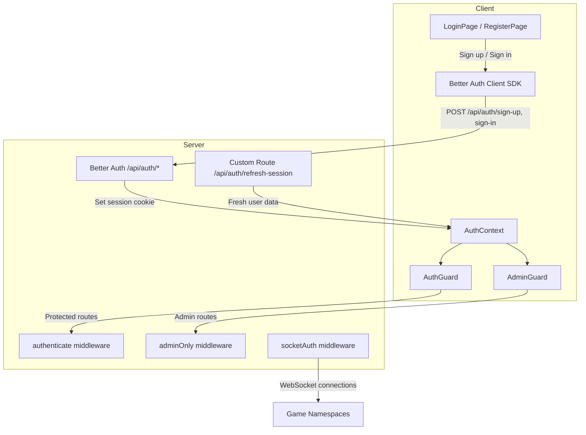
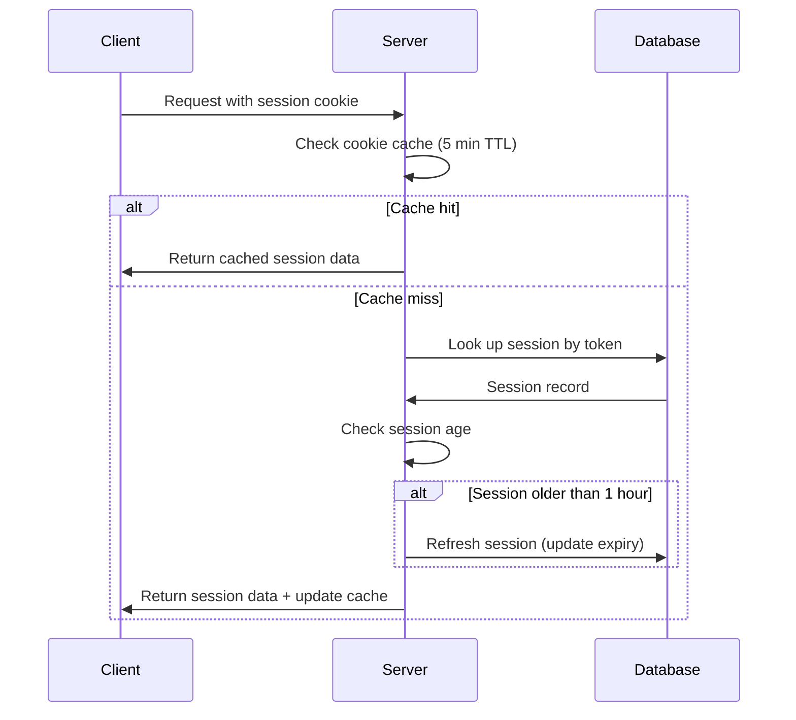
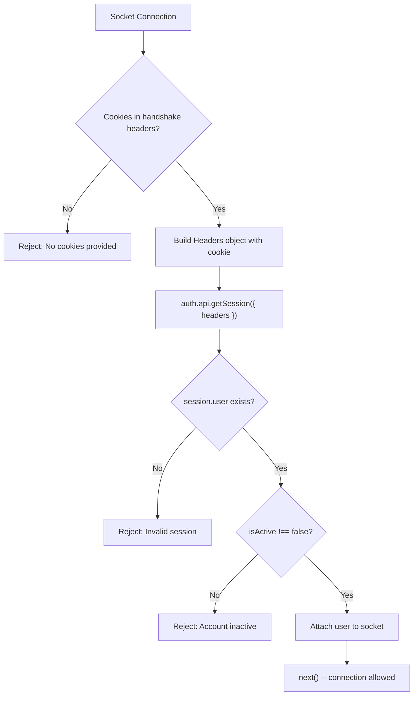

# Authentication System

Platinum Casino uses [Better Auth](https://www.better-auth.com/) for session-based authentication with HTTP-only cookies. The system supports two roles (`user` and `admin`), integrates with Drizzle ORM for MySQL, and provides both REST API and WebSocket authentication pathways.

## Architecture



## Better Auth Configuration

The server-side configuration lives in `server/lib/auth.ts` and uses `betterAuth()` with the following settings:

| Setting | Value | Purpose |
|---------|-------|---------|
| Adapter | `drizzleAdapter` (MySQL provider) | Maps auth tables to Drizzle schema |
| Base path | `/api/auth` | Authentication endpoint prefix |
| Email/Password | Enabled | Registration and login |
| Password hash | bcrypt (12 salt rounds) | Secure password storage via `bcryptjs` |
| Session lifetime | 24 hours (`expiresIn: 86400`) | How long a session remains valid |
| Session refresh | 1 hour (`updateAge: 3600`) | Session is refreshed when accessed and older than 1 hour |
| Cookie cache | 5 minutes (`maxAge: 300`) | Reduces database lookups for rapid sequential requests |
| ID generation | Serial (auto-increment) | Database ID strategy |
| Trusted origins | `CLIENT_URL` env variable | CORS and origin validation |

### Plugins

| Plugin | Configuration | Purpose |
|--------|---------------|---------|
| `username` | min: 3, max: 30 characters | Username-based authentication |
| `admin` | defaultRole: `"user"`, adminRoles: `["admin"]` | Role-based access control |

### Database Hooks: Welcome Bonus

When a new user is created, a `databaseHooks.user.create.after` hook runs automatically:

1. Sets the user's balance to `1000`.
2. Creates a balance history record (type: `deposit`, note: "Welcome bonus - account creation").

This ensures every new account starts with a 1000-credit welcome bonus without any additional API calls.

### User Model Extensions

Better Auth manages core user fields (`id`, `email`, `name`, `createdAt`, `updatedAt`). These additional fields are defined via `additionalFields`:

| Field | Type | Default | Purpose |
|-------|------|---------|---------|
| `balance` | string | `"0"` | Virtual currency balance (decimal stored as string) |
| `avatar` | string | `""` | User avatar URL |
| `isActive` | boolean | `true` | Account active/disabled status |
| `lastLogin` | date | `null` | Last login timestamp |

## REST API Endpoints

### Better Auth Managed Endpoints

Better Auth automatically handles these routes. They are **not** custom route handlers -- the `app.all("/api/auth/*", toNodeHandler(auth))` catch-all in `server.ts` delegates them to Better Auth's internal router.

| Method | Path | Purpose |
|--------|------|---------|
| POST | `/api/auth/sign-up/email` | Register with email + password + username |
| POST | `/api/auth/sign-in/email` | Login with email/username + password |
| POST | `/api/auth/sign-out` | End session, clear cookie |
| GET | `/api/auth/get-session` | Get current session and user data |

#### POST /api/auth/sign-up/email

Creates a new user account.

**Request body:**

```json
{
  "email": "player@example.com",
  "password": "securepassword",
  "name": "Player One",
  "username": "player1"
}
```

**Server processing (handled by Better Auth):**

1. Validate input (username length 3-30 characters).
2. Hash password with bcrypt (12 rounds).
3. Create user record in `users` table.
4. Run `databaseHooks.user.create.after` to set initial balance and create welcome bonus record.
5. Create a session in the `session` table and set the session cookie.
6. Return the user object and session data.

#### POST /api/auth/sign-in/email

Authenticates an existing user.

**Request body:**

```json
{
  "email": "player@example.com",
  "password": "securepassword"
}
```

**Server processing (handled by Better Auth):**

1. Look up user by email.
2. Verify password with `bcrypt.compare`.
3. Create a new session (24-hour lifetime).
4. Set the session cookie.
5. Return the user object and session data.

#### GET /api/auth/get-session

Returns the current session and user data. Used by the client SDK to check authentication status.

**Server processing (handled by Better Auth):**

1. Read session cookie from the request.
2. Validate session (check expiry, refresh if older than 1 hour).
3. Return session and user data, or `null` if invalid.

#### POST /api/auth/sign-out

Ends the current session.

**Server processing (handled by Better Auth):**

1. Read session cookie from the request.
2. Delete the session from the database.
3. Clear the session cookie.

### Custom Auth Endpoint

#### GET /api/auth/refresh-session

Validates the current session and returns fresh user data from the database. This is a custom route defined in `server/routes/auth.ts`.

**Requires:** `authenticate` middleware (valid Better Auth session).

**Server processing:**

1. The `authenticate` middleware validates the session via `auth.api.getSession()`.
2. Load the user from the database by `userId`.
3. Return current user data (id, username, role, balance, isActive).

**Response (200):**

```json
{
  "id": 1,
  "username": "player1",
  "role": "user",
  "balance": "1500.00",
  "isActive": true
}
```

## Route Registration Order (Critical)

The ordering in `server.ts` is critical for correct routing:

```typescript
// 1. Custom auth routes registered FIRST (takes priority for /refresh-session)
app.use('/api/auth', authRoutes);

// 2. Better Auth catch-all registered SECOND (handles sign-up, sign-in, etc.)
app.all("/api/auth/*", toNodeHandler(auth));

// 3. express.json() and other middleware registered AFTER Better Auth
//    (Better Auth handles its own request body parsing)
app.use(express.json());
```

This ordering ensures:
- Custom routes like `/api/auth/refresh-session` are matched first by Express.
- All other `/api/auth/*` requests fall through to Better Auth's handler.
- Better Auth receives raw request bodies (it handles its own JSON parsing internally).

## Session Management

Better Auth uses server-side sessions stored in the `session` database table, not stateless JWT tokens.

| Property | Value |
|----------|-------|
| Storage | `session` table in MySQL (managed by Better Auth) |
| Lifetime | 24 hours |
| Refresh behavior | Session is refreshed when accessed and older than 1 hour |
| Cookie cache | 5 minutes (reduces database lookups for rapid sequential requests) |
| Cookie type | HTTP-only, managed by Better Auth |
| Revocation | Session deleted from database on sign-out |



## Server Middleware

### authenticate

**File:** `server/middleware/auth.ts`

Express middleware that protects REST API routes. Calls `auth.api.getSession()` with the request headers (converted via `fromNodeHeaders` from `better-auth/node`), validates that a session exists and the user is active, then attaches `req.user` with `{ userId, username, role }`.

```typescript
const session = await auth.api.getSession({
  headers: fromNodeHeaders(req.headers),
});

(req as AuthenticatedRequest).user = {
  userId: Number(session.user.id),
  username: session.user.username || session.user.name,
  role: session.user.role || 'user',
};
```

Returns:
- `401` -- "No valid session, authorization denied" if no valid session exists.
- `401` -- "Account is disabled" if `isActive === false`.
- `401` -- "Session is not valid" if an error occurs during validation.

### adminOnly

**File:** `server/middleware/auth.ts`

Express middleware that checks `req.user.role === 'admin'`. Returns `403` with "Access denied. Admin only." if the user is not an admin.

### userOrAdmin

**File:** `server/middleware/auth.ts`

Express middleware that allows both `user` and `admin` roles. Returns `403` with "Access denied." if the role is neither.

## Socket Authentication

**File:** `server/middleware/socket/socketAuth.ts`

The `socketAuth` middleware runs on every Socket.IO namespace connection before any game handler executes. It uses Better Auth's session API to validate the session cookie from the WebSocket handshake.



**How it works:**

1. Extract cookies from `socket.handshake.headers.cookie`.
2. Build a `Headers` object and set the `cookie` header.
3. Call `auth.api.getSession({ headers })` to validate the session.
4. Check that `session.user` exists and `isActive` is not `false`.
5. Attach user data to the socket object.

**Attached user object:**

```typescript
socket.user = {
  userId: number,    // Numeric user ID
  username: string,  // Display name
  role: string,      // "user" or "admin"
  balance: number,   // Current balance (parsed from string)
  isActive: boolean  // Account active status
}
```

After the middleware, each game namespace's `connection` handler calls `getAuthenticatedUser(socket)` to retrieve the attached user. Unauthenticated sockets that bypass the middleware are disconnected immediately.

**Applied to all game namespaces:**

```typescript
crashNamespace.use(socketAuth);
rouletteNamespace.use(socketAuth);
blackjackNamespace.use(socketAuth);
landminesNamespace.use(socketAuth);
plinkoNamespace.use(socketAuth);
wheelNamespace.use(socketAuth);
```

## Client-Side Authentication

### Better Auth Client SDK

**File:** `client/src/lib/auth-client.js`

The client uses Better Auth's React SDK (`createAuthClient`) with the `usernameClient` and `adminClient` plugins:

```javascript
import { createAuthClient } from "better-auth/react";
import { usernameClient } from "better-auth/client/plugins";
import { adminClient } from "better-auth/client/plugins";

export const authClient = createAuthClient({
  baseURL,  // Derived from VITE_API_URL (stripped of /api suffix)
  plugins: [usernameClient(), adminClient()],
});
```

The SDK provides React hooks and methods for sign-up, sign-in, sign-out, and session management. It automatically handles cookie-based session credentials.

### Route Guards

#### AuthGuard

**File:** `client/src/components/guards/AuthGuard.jsx`

Wraps routes that require any authenticated user. Reads from `AuthContext` and redirects to `/login` (preserving the original path in `location.state`) if `isAuthenticated` is `false`. Shows a loading spinner with "Verifying authentication..." while auth state is being resolved.

#### AdminGuard

**File:** `client/src/components/guards/AdminGuard.jsx`

Wraps admin-only routes. Requires both authentication and `user.role === 'admin'`. Redirects unauthenticated users to `/login` and non-admin users to `/`. Shows a loading spinner with "Verifying admin access..." while checking credentials.

## Roles

| Role | Access |
|------|--------|
| `user` | All game pages, profile, rewards, balance operations, leaderboard |
| `admin` | Everything above plus `/admin/*` routes, player management, game statistics, transaction management |

Role assignment is handled by Better Auth's `admin` plugin. New users receive the `user` role by default. Admin accounts can be created via the `server/scripts/createAdmin.ts` script.

## Rate Limiting

### Global API Rate Limit

All `/api` routes (including auth routes) are subject to the global API rate limiter:

| Parameter | Value |
|-----------|-------|
| Window | 1 minute |
| Max requests | 120 per IP per window |
| Headers | Standard `RateLimit-*` headers |

### Socket Rate Limiting

Game socket events can be rate-limited using the `socketRateLimit` utility (default: 10 events per 60 seconds per user per event). See [Security Overview](../07-security/security-overview.md) for details.

## Input Validation

Better Auth handles validation for its managed endpoints (sign-up, sign-in, etc.) internally. The `username` plugin enforces username length constraints (3-30 characters). Password and email format validation are handled by Better Auth's core.

## Key Files

| File | Purpose |
|------|---------|
| `server/lib/auth.ts` | Better Auth configuration (adapter, plugins, hooks, session settings) |
| `server/routes/auth.ts` | Custom auth route (`/refresh-session`) |
| `server/server.ts` | Route registration order and Better Auth catch-all handler |
| `server/middleware/auth.ts` | `authenticate`, `adminOnly`, `userOrAdmin` Express middleware |
| `server/middleware/socket/socketAuth.ts` | WebSocket session authentication via Better Auth |
| `client/src/lib/auth-client.js` | Better Auth React client SDK configuration |
| `client/src/components/guards/AuthGuard.jsx` | Client-side authenticated route guard |
| `client/src/components/guards/AdminGuard.jsx` | Client-side admin route guard |
| `client/src/contexts/AuthContext.jsx` | React context for auth state |
| `client/src/pages/LoginPage.jsx` | Login form |
| `client/src/pages/RegisterPage.jsx` | Registration form |
| `server/scripts/createAdmin.ts` | Script to create admin accounts |

---

## Related Documents

- [Admin Panel](./admin-panel.md) -- Admin-only routes protected by AdminGuard
- [Balance System](./balance-system.md) -- Balance operations that require authentication
- [Games Overview](./games-overview.md) -- Socket auth for game namespaces
- [Login Rewards](./login-rewards.md) -- Authenticated reward claiming
- [Database Schema](../09-database/) -- Users, session, account, and verification tables
- [Security](../07-security/) -- Security considerations, rate limiting, and best practices
