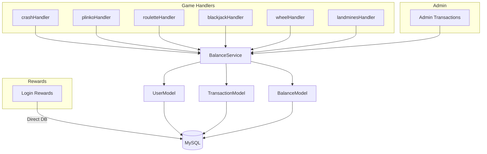
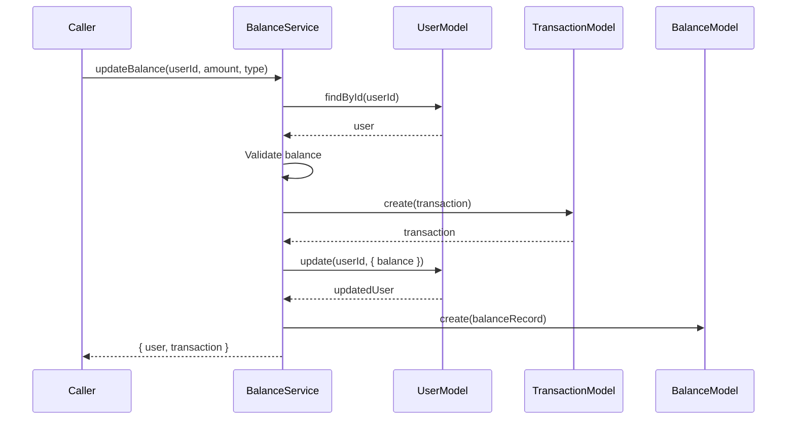
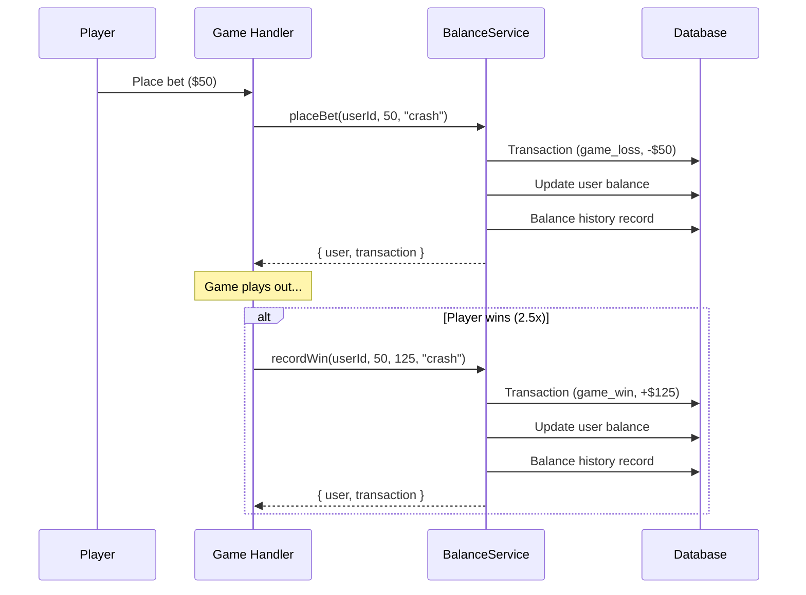

# Balance and Transaction System

The balance system is the financial backbone of Platinum Casino. All monetary operations -- bets, wins, admin adjustments, and rewards -- flow through the centralized `BalanceService` class, which ensures atomic transaction recording, balance history tracking, and consistent decimal precision.

## Architecture



## BalanceService

**File:** `server/src/services/balanceService.ts`

The `BalanceService` is a singleton class exported as `new BalanceService()`. All game handlers and server-side services import this shared instance.

### Methods

#### updateBalance(userId, amount, type, gameType?, metadata?)

The core method. All other balance methods delegate to this.

**Processing:**

1. Load user by ID.
2. Parse current balance as float.
3. Validate that deductions will not produce a negative balance.
4. Calculate new balance.
5. Create a `Transaction` record with `balanceBefore` and `balanceAfter`.
6. Update the user's `balance` field.
7. Create a `Balance` history record with mapped type.
8. Return `{ user, transaction }`.



#### placeBet(userId, betAmount, gameType, metadata?)

Deducts the bet amount from the user's balance.

- Calls `updateBalance` with a negative amount (`-Math.abs(betAmount)`).
- Transaction type: `game_loss`.
- The bet is recorded as a loss initially; if the player wins, a separate `recordWin` call credits the winnings.

#### recordWin(userId, betAmount, winAmount, gameType, metadata?)

Credits winnings to the user's balance.

- Calls `updateBalance` with the `winAmount` (the total payout).
- Transaction type: `game_win`.
- Includes `betAmount` in metadata for auditing.

#### manualAdjustment(userId, amount, reason, adminId)

Admin-initiated balance modification.

- Calls `updateBalance` with type `admin_adjustment`.
- Stores `reason` and `adminId` in metadata.
- Can be positive (credit) or negative (debit).

#### getBalance(userId)

Returns the user's current balance as a float.

#### getTransactionHistory(userId, options?)

Retrieves paginated, filterable transaction history.

**Options:**

| Parameter | Type | Default | Description |
|-----------|------|---------|-------------|
| `limit` | number | 20 | Max records to return |
| `skip` | number | 0 | Offset for pagination |
| `type` | string | -- | Filter by transaction type |
| `gameType` | string | -- | Filter by game type |

**Returns:** `{ transactions: [], total: number }`

#### hasSufficientBalance(userId, amount)

Returns `true` if the user's balance is greater than or equal to `amount`. Returns `false` on error (fail-safe).

#### getBalanceHistory(userId, limit?)

Returns up to `limit` (default 50) balance history records for the user.

#### getCurrentBalanceFromHistory(userId)

Returns the current balance derived from the most recent balance history record.

#### updateGameBalance(userId, amount, type, gameType?, metadata?)

Alias for `updateBalance`. Provided for backward compatibility.

## Transaction Types

The `transaction_type` enum defines all valid transaction categories:

| Type | Description | Source |
|------|-------------|--------|
| `deposit` | Initial account funding or external deposit | Registration, admin |
| `withdrawal` | Balance withdrawal | Admin |
| `game_win` | Payout from a winning game round | Game handlers via `recordWin` |
| `game_loss` | Bet deduction when placing a wager | Game handlers via `placeBet` |
| `admin_adjustment` | Manual balance change by an admin | Admin panel via `manualAdjustment` |
| `bonus` | Promotional bonus credit | System |
| `login_reward` | Daily login reward | Login rewards route |

## Balance History Types

The `balance_type` enum tracks the nature of each balance change:

| Balance Type | Mapped From |
|-------------|-------------|
| `deposit` | `deposit` |
| `withdrawal` | `withdrawal` |
| `win` | `game_win`, `bonus` |
| `loss` | `game_loss` |
| `admin_adjustment` | `admin_adjustment` |
| `login_reward` | `login_reward` |

The mapping is handled by `_mapTransactionTypeToBalanceType()`.

## Database Tables

### users (balance column)

The authoritative balance is stored directly on the `users` table:

```
balance: decimal(15, 2) NOT NULL DEFAULT '0'
```

### transactions

Full transaction ledger with before/after snapshots:

| Column | Type | Description |
|--------|------|-------------|
| id | int (PK) | Auto-increment |
| userId | int (FK -> users) | Owner |
| type | enum | Transaction type |
| gameType | enum | Game type (nullable) |
| amount | decimal(15,2) | Transaction amount |
| balanceBefore | decimal(15,2) | Balance before this transaction |
| balanceAfter | decimal(15,2) | Balance after this transaction |
| status | enum | pending, completed, failed, voided, processing |
| metadata | json | Additional context (bet details, admin notes) |
| createdAt | timestamp | Record creation time |

### balances (history)

Balance change history for auditing and analytics:

| Column | Type | Description |
|--------|------|-------------|
| id | int (PK) | Auto-increment |
| userId | int (FK -> users) | Owner |
| amount | decimal(15,2) | New balance after change |
| previousBalance | decimal(15,2) | Balance before change |
| changeAmount | decimal(15,2) | Delta |
| type | enum | Balance type |
| gameType | enum | Game type (nullable) |
| transactionId | int (FK -> transactions) | Linked transaction |
| adminId | int (FK -> users) | Admin who made the change (nullable) |
| note | text | Description (nullable) |
| createdAt | timestamp | Record creation time |

## Decimal Precision

All monetary values use `decimal(15, 2)`:

- **Precision:** 15 total digits
- **Scale:** 2 decimal places
- **Range:** Up to 9,999,999,999,999.99

Values are stored as strings in the database and parsed to floats for arithmetic. This prevents floating-point rounding errors that would occur with native JavaScript numbers for financial calculations.

## Typical Game Flow



## Key Files

| File | Purpose |
|------|---------|
| `server/src/services/balanceService.ts` | BalanceService class (singleton) |
| `server/drizzle/schema.ts` | Table definitions (users, transactions, balances) |
| `server/drizzle/models/User.ts` | User model (balance field) |
| `server/drizzle/models/Transaction.ts` | Transaction model (CRUD) |
| `server/drizzle/models/Balance.ts` | Balance history model |

---

## Related Documents

- [Games Overview](./games-overview.md) -- Game handlers that consume BalanceService
- [Admin Panel](./admin-panel.md) -- Manual transaction management
- [Login Rewards](./login-rewards.md) -- Reward transactions recorded via this system
- [Authentication](./authentication.md) -- Starting balance on registration
- [Database Schema](../09-database/) -- Full Drizzle ORM schema definition
