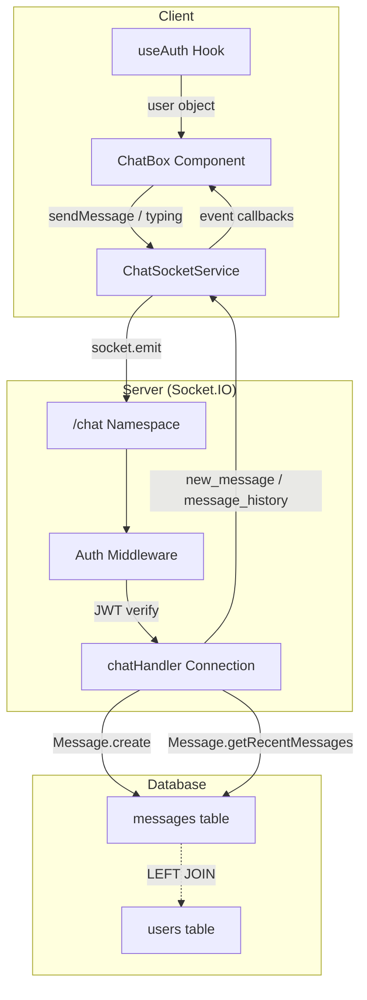
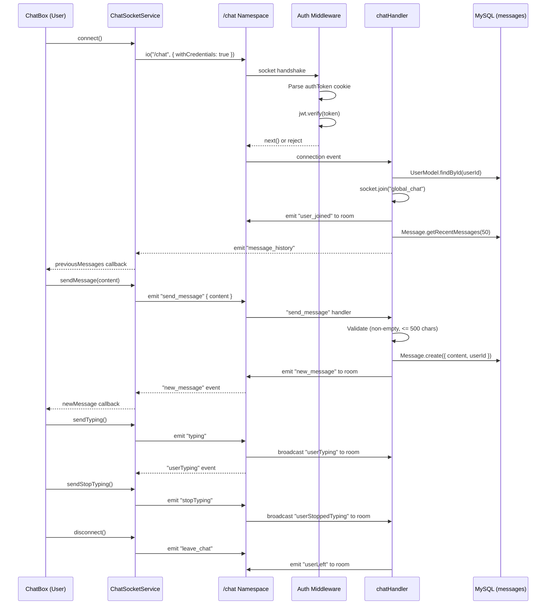

# Chat System

Platinum Casino includes a global real-time chat feature that lets authenticated users communicate while playing. The system is built on Socket.IO with a dedicated `/chat` namespace, persists messages to MySQL via Drizzle ORM, and surfaces them through a collapsible React component.

**Current status:** The chat system is **disabled**. Both the import and the `initChatHandlers(io)` call are commented out in `server/server.ts` (lines 12 and 306). The client component and server handler exist in full but are not wired into the running application.

## Architecture



## Message Flow



## Socket Events

### Client-to-Server (emitted by ChatSocketService)

| Event | Payload | Description |
|-------|---------|-------------|
| `send_message` | `{ content: string }` | Send a chat message. Server validates non-empty and max 500 characters. |
| `typing` | *(none)* | Notify other users that this user is typing. |
| `stopTyping` | *(none)* | Notify other users that this user stopped typing. |
| `leave_chat` | *(none)* | Announce departure from the chat room. |

### Server-to-Client (listened by ChatSocketService)

| Event | Payload | Description |
|-------|---------|-------------|
| `message_history` | `Message[]` | Array of the 50 most recent messages, sent once on connection. |
| `new_message` | `Message` | A single new message broadcast to all users in `global_chat`. |
| `user_joined` | `{ user, timestamp, message }` | Broadcast when a user connects to the chat namespace. |
| `userLeft` | `{ user, timestamp, message }` | Broadcast when a user emits `leave_chat`. |
| `userTyping` | `{ username }` | Broadcast to other users when someone is typing. |
| `userStoppedTyping` | `{ username }` | Broadcast to other users when someone stops typing. |
| `chat_error` | `{ message: string }` | Sent to the originating socket on validation or save failure. |
| `error` | `{ message: string }` | Sent when authentication or user lookup fails during connection. |

### Broadcast Message Shape

Both `message_history` entries and `new_message` payloads share this structure:

```json
{
  "id": 42,
  "_id": 42,
  "content": "Hello everyone!",
  "createdAt": "2026-03-27T12:00:00.000Z",
  "userId": 7,
  "isSystem": false,
  "username": "player1",
  "avatar": ""
}
```

The `_id` field is a duplicate of `id` added for React key compatibility.

## Message Schema (Database)

**Table:** `messages` (defined in `server/drizzle/schema.ts`, lines 145-153)

| Column | Type | Constraints | Description |
|--------|------|-------------|-------------|
| `id` | `int` | PK, auto-increment | Unique message identifier |
| `content` | `text` | NOT NULL | Message body (max 500 chars enforced by handler, not schema) |
| `userId` | `int` | NOT NULL, FK -> `users.id` | Author of the message |
| `createdAt` | `timestamp` | NOT NULL, default `NOW()` | When the message was created |

**Indexes:**

| Index | Column |
|-------|--------|
| `messages_user_id_idx` | `userId` |
| `messages_created_at_idx` | `createdAt` |

**Relation:** Each message belongs to one user (`messages.userId` -> `users.id`).

**TypeScript types** (exported from schema):

```ts
type Message = InferSelectModel<typeof messages>;   // { id, content, userId, createdAt }
type NewMessage = InferInsertModel<typeof messages>; // content and userId required; id and createdAt optional
```

**Note:** The `isSystem` field referenced in `chatHandler.ts` is not a column in the database table. The handler sets it in memory when building the broadcast payload, but it is never persisted.

## MessageModel Methods

**File:** `server/drizzle/models/Message.ts`

| Method | Signature | Description |
|--------|-----------|-------------|
| `create` | `(data) -> Promise<Message>` | Inserts a message and returns the new row (uses `insertId`). |
| `findById` | `(id) -> Promise<Message \| null>` | Finds a message by ID with a LEFT JOIN to `users` for username/avatar. |
| `findByIdWithUser` | `(id) -> Promise<Message \| null>` | Same as `findById` but with an explicit username/avatar projection. |
| `getRecentMessages` | `(limit = 50) -> Promise<Message[]>` | Returns the most recent messages ordered by `createdAt DESC`, joined with user data. Used by the chat handler on connection. |
| `findByUserId` | `(userId, limit = 50, offset = 0) -> Promise<Message[]>` | Returns messages authored by a specific user, ordered by `createdAt DESC`. |
| `findWithPagination` | `(limit = 50, offset = 0) -> Promise<Message[]>` | Paginated message retrieval with user join. |
| `update` | `(id, updateData) -> Promise<Message>` | Updates a message row and returns the updated record. |
| `delete` | `(id) -> Promise<Message>` | Deletes a message by ID. Returns the deleted record. Throws if not found. |
| `deleteByUserId` | `(userId) -> Promise<Message[]>` | Deletes all messages by a user. Returns the deleted records. |
| `getMessageCount` | `() -> Promise<number>` | Returns total message count. |
| `getUserMessageCount` | `(userId) -> Promise<number>` | Returns message count for a specific user. |
| `findAll` | `(limit = null) -> Promise<Message[]>` | Returns all messages (optionally limited), joined with user data. |
| `searchByContent` | `(searchTerm, limit = 50) -> Promise<Message[]>` | Simple text search on message content. |
| `find` | `(conditions = {}) -> Promise<Message[]>` | Dynamic query builder supporting `$gte`/`$lte` range conditions. Returns up to 50 results. |
| `findOne` | `(conditions) -> Promise<Message \| null>` | Returns the first message matching the given conditions. |
| `save` (instance) | `() -> Promise<this>` | Upserts: updates if `this.id` exists, inserts otherwise. |

## Client Component: ChatBox

**File:** `client/src/components/chat/ChatBox.jsx`

### Rendering

- Returns `null` when the user is not authenticated (checked via `useAuth`).
- Renders a fixed-position panel in the bottom-right corner (`fixed bottom-0 right-4 z-50`).
- The panel has two states: **collapsed** (12-unit height showing only the header with a message count badge) and **expanded** (full 96-unit height with messages, typing indicator, and input form).
- Toggled by clicking the header bar.

### State

| State Variable | Type | Purpose |
|----------------|------|---------|
| `messages` | `Array` | All chat messages (user + system) |
| `messageInput` | `string` | Current input field value |
| `isConnected` | `boolean` | Whether the socket connection is active |
| `typingUsers` | `Array<string>` | Usernames of users currently typing |
| `isOpen` | `boolean` | Whether the chat panel is expanded |

### Refs

| Ref | Purpose |
|-----|---------|
| `messagesEndRef` | Scroll anchor -- `scrollIntoView({ behavior: 'smooth' })` fires on every `messages` update |
| `typingTimeoutRef` | Stores the timeout ID for the 2-second typing debounce |

### Connection Lifecycle

1. On mount (when `user` is truthy), calls `chatSocketService.connect()`.
2. If the initial connection fails, retries once after 2 seconds.
3. On unmount, calls `chatSocketService.disconnect()`.

### Event Handling

The component registers six event callbacks through `chatSocketService.on()`:

| Service Event | Handler Behavior |
|---------------|-----------------|
| `newMessage` | Appends the message to state. |
| `previousMessages` | Replaces state with the received array. |
| `userJoined` | Appends a system message (`{ _id: "system-...", content, system: true }`). |
| `userLeft` | Appends a system message and removes the user from `typingUsers`. |
| `userTyping` | Adds the username to `typingUsers` (if not the current user and not already listed). |
| `userStoppedTyping` | Removes the username from `typingUsers`. |

All subscriptions return unsubscribe functions and are cleaned up on unmount.

### Typing Indicator

- Every keystroke calls `chatSocketService.sendTyping()` and sets a 2-second timeout.
- When the timeout fires, `chatSocketService.sendStopTyping()` is called.
- On message submit, the timeout is cleared and `sendStopTyping()` is called immediately.

## ChatSocketService

**File:** `client/src/services/socket/chatSocketService.js`

A singleton class that wraps Socket.IO client connections for the `/chat` namespace.

### Configuration

| Option | Value |
|--------|-------|
| URL | `http://localhost:5000/chat` |
| `withCredentials` | `true` (sends cookies for JWT auth) |
| `transports` | `['polling']` (WebSocket disabled) |
| `reconnection` | `true` |
| `reconnectionAttempts` | 5 |
| `reconnectionDelay` | 1000 ms |
| `reconnectionDelayMax` | 5000 ms |
| `timeout` | 20000 ms |

### Public Methods

| Method | Description |
|--------|-------------|
| `connect()` | Returns a Promise. Disconnects any existing socket, creates a new connection, and sets up all internal event listeners. |
| `disconnect()` | Removes all listeners and disconnects the socket. |
| `sendMessage(content)` | Emits `send_message` with `{ content }`. |
| `sendTyping()` | Emits `typing`. |
| `sendStopTyping()` | Emits `stopTyping`. |
| `on(event, handler)` | Registers a handler for one of the supported events. Returns an unsubscribe function. |
| `off(event, handler)` | Removes a specific handler. |

### Reconnection Behavior

- Socket.IO's built-in reconnection handles transient failures (up to 5 attempts).
- If the server forcefully disconnects (`io server disconnect`), the service manually reconnects after 3 seconds.

## Authentication Requirements

The chat system uses Better Auth session authentication, consistent with the game socket auth in `socketAuth.ts`.

1. The client connects with `withCredentials: true`, which sends the session cookie.
2. The server-side `socketAuth` middleware extracts cookies from `socket.handshake.headers.cookie`.
3. It validates the session via `auth.api.getSession({ headers })`.
4. The authenticated user object is attached to `socket.user` with `{ userId, username, role, balance, isActive }`.
5. On connection, the handler uses the user data from the socket to set up chat.

Unauthenticated connections are rejected at the middleware level with an `Error('Authentication error')`.

## Key Files

| File | Purpose |
|------|---------|
| `server/src/socket/chatHandler.ts` | Server-side handler: auth middleware, message CRUD, room management |
| `client/src/components/chat/ChatBox.jsx` | React component: collapsible chat UI with typing indicators |
| `client/src/services/socket/chatSocketService.js` | Socket.IO client wrapper: connection management and event dispatch |
| `server/drizzle/models/Message.ts` | Drizzle ORM model with query methods for the messages table |
| `server/drizzle/schema.ts` | Messages table definition (lines 145-153) and relations (lines 247-252) |
| `server/server.ts` | Entry point where `initChatHandlers` is imported and invoked (currently disabled) |

---

## Related Documents

- [Authentication](./authentication.md) -- JWT token format and cookie-based auth used by the chat middleware
- [Games Overview](./games-overview.md) -- Other Socket.IO namespaces that run alongside chat
- [Admin Panel](./admin-panel.md) -- Admin tools that may include message moderation in the future
- [Database Schema](../09-database/) -- Full schema including the messages table and user relations
