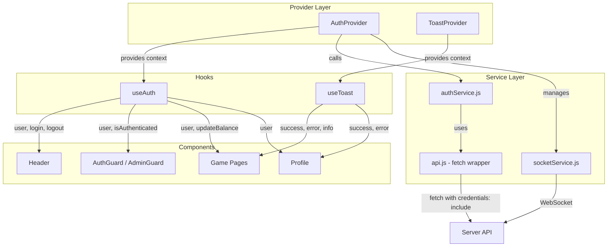

# Client State Management

## Overview

The Platinum Casino client manages application state using React's built-in **Context API** pattern rather than external state management libraries like Redux. State is organized into purpose-specific contexts that are provided at the application root and consumed by components via custom hooks.

This approach keeps the dependency footprint small and aligns with the application's moderate complexity -- there are two primary contexts (auth and toast notifications), a thin API service layer, and a centralized theme/style system.

### Key principles

- **Context API over Redux** -- fewer abstractions, no action/reducer boilerplate.
- **Service layer separation** -- HTTP and auth logic lives in `services/`, not inside components.
- **Custom hooks** -- `useAuth` and `useToast` provide type-safe, guarded access to context values.
- **Cookie-based authentication** -- the server sets HTTP-only cookies; the client sends `credentials: 'include'` with every request.

---

## AuthContext

**File:** `client/src/contexts/AuthContext.jsx`

### State values

| Value             | Type       | Description                                      |
|-------------------|------------|--------------------------------------------------|
| `user`            | `Object \| null` | Current user object (id, username, balance, role) |
| `loading`         | `boolean`  | `true` while an auth operation is in progress     |
| `error`           | `string \| null` | Most recent auth error message                  |
| `isAuthenticated` | `boolean`  | Derived -- `!!user`                               |

### Methods

| Method                        | Signature                                  | Description                                                                                              |
|-------------------------------|--------------------------------------------|----------------------------------------------------------------------------------------------------------|
| `login(credentials)`         | `(credentials: {username, password}) => Promise<User>` | Calls `authService.login`, stores token in `localStorage`, reinitializes the socket connection.         |
| `register(userData)`         | `(userData: {username, email, password}) => Promise<User>` | Calls `authService.register`, sets user state from response.                                           |
| `logout()`                   | `() => Promise<void>`                      | Calls `authService.logout`, removes `authToken` from `localStorage`, disconnects socket, clears user.   |
| `updateBalance(newBalance)`  | `(newBalance: number) => void`             | Updates `user.balance` in-place for real-time game wins/losses without a full profile refetch.           |

### Provider setup

`AuthProvider` wraps the application root. On mount it calls `authService.getCurrentUser()` to restore an existing session from the HTTP-only cookie. If no valid session exists, `user` is set to `null` without raising an error.

```jsx
// In App.jsx or main entry
import { AuthProvider } from './contexts/AuthContext';

<AuthProvider>
  <App />
</AuthProvider>
```

---

## ToastContext

**File:** `client/src/context/ToastContext.jsx`

### Toast types

| Type      | Color scheme                         |
|-----------|--------------------------------------|
| `success` | Green background, green border       |
| `error`   | Red background, red border           |
| `warning` | Yellow background, yellow border     |
| `info`    | Blue background, blue border         |

### Provider API

| Method / Value      | Signature                                       | Description                                       |
|----------------------|-------------------------------------------------|---------------------------------------------------|
| `addToast`          | `(message: string, type?: string, duration?: number) => string` | Creates a toast and returns its ID. Default type is `'info'`, default duration is `5000ms`. |
| `removeToast`       | `(id: string) => void`                          | Removes a toast by ID.                            |
| `success`           | `(message: string, duration?: number) => string`| Shorthand for `addToast(message, 'success', duration)`. |
| `error`             | `(message: string, duration?: number) => string`| Shorthand for `addToast(message, 'error', duration)`.   |
| `warning`           | `(message: string, duration?: number) => string`| Shorthand for `addToast(message, 'warning', duration)`. |
| `info`              | `(message: string, duration?: number) => string`| Shorthand for `addToast(message, 'info', duration)`.    |

### Auto-dismiss

Each toast auto-dismisses after its `duration` (default 5 seconds). The `Toast` component handles its own timeout internally and calls `onClose` when the timer expires. Users can also dismiss manually via the close button.

### Rendering

`ToastProvider` renders a fixed container at `top-0 right-0 z-50` that stacks toasts vertically. Each toast is a `<Toast>` component rendered via `createPortal`-free inline rendering within the provider.

```jsx
import { useToast } from './context/ToastContext';

function MyComponent() {
  const { success, error } = useToast();

  const handleSave = async () => {
    try {
      await save();
      success('Settings saved!');
    } catch {
      error('Failed to save settings.');
    }
  };
}
```

---

## useAuth Hook

**File:** `client/src/hooks/useAuth.js`

A thin wrapper around `useContext(AuthContext)` that:

1. Reads the `AuthContext` value.
2. Throws `'useAuth must be used within an AuthProvider'` if called outside the provider tree.
3. Returns the full context object (`user`, `loading`, `error`, `isAuthenticated`, `login`, `logout`, `register`, `updateBalance`).

```jsx
import { useAuth } from '../hooks/useAuth';

function Profile() {
  const { user, logout, isAuthenticated } = useAuth();
  // ...
}
```

---

## API Service

**File:** `client/src/services/api.js`

### Axios-free fetch wrapper

The project uses the native `fetch` API rather than Axios. The `api` service provides a small wrapper with consistent defaults.

### Base URL

```
VITE_API_URL  (env variable)  ||  'http://localhost:5000/api'
```

### Request defaults

| Setting              | Value                  | Purpose                                |
|----------------------|------------------------|----------------------------------------|
| `Content-Type`       | `application/json`     | All requests send JSON by default.     |
| `credentials`        | `'include'`            | Sends HTTP-only cookies with every request. |

### Error handling

- Non-204 responses are parsed as JSON.
- Non-OK responses throw an `Error` with the server's `message` field or a generic HTTP status string.
- All errors are logged to `console.error` before re-throwing.

### Convenience methods

```js
import { api } from './services/api';

api.get('/users/me');
api.post('/auth/login', { username, password });
api.put('/users/123', { balance: 500 });
api.delete('/users/123');
```

---

## Auth Service

**File:** `client/src/services/authService.js`

### Endpoints

| Constant      | Path              |
|---------------|-------------------|
| `REGISTER`    | `/auth/register`  |
| `LOGIN`       | `/auth/login`     |
| `LOGOUT`      | `/auth/logout`    |
| `PROFILE`     | `/users/me`       |

### Methods

| Method             | HTTP    | Description                                                |
|--------------------|---------|------------------------------------------------------------|
| `register(userData)` | POST  | Registers a new user. Returns `{ user, token }`.          |
| `login(credentials)` | POST  | Authenticates user. Server sets HTTP-only cookie.          |
| `logout()`          | POST   | Ends the session. Errors are caught silently -- local state is always cleared. |
| `getCurrentUser()`  | GET    | Fetches the profile of the currently authenticated user via cookie. |
| `isLoggedIn()`      | GET    | Returns `true` if `getCurrentUser()` succeeds, `false` otherwise.  |

---

## Theme and Style System

### theme.js

**File:** `client/src/styles/theme.js`

Exports design tokens used alongside Tailwind CSS classes:

| Export        | Contents                                                             |
|---------------|----------------------------------------------------------------------|
| `colors`      | Primary (`#1E40AF`), accent/gold (`#F59E0B`), background, text, game-specific, and status colors. |
| `shadows`     | `sm` through `2xl` plus a `glow` shadow with golden amber tint.     |
| `gradients`   | `primary`, `accent`, `card`, `hero` linear gradients.               |
| `typography`  | Font families: `Inter` (sans) and `Poppins` (heading).              |
| `spacing`     | Container padding (`1.5rem`) and max width (`1280px`).              |

### styleGuide.js

**File:** `client/src/styles/styleGuide.js`

A comprehensive design token object that defines the Platinum Casino visual identity:

| Section          | Key values                                                                    |
|------------------|-------------------------------------------------------------------------------|
| `colors.primary` | Gold `#ffc107` with light/dark variants and gradient.                         |
| `colors.background` | Four navy-blue levels: darkest `#0f1923`, dark `#192c3d`, medium `#213749`, light `#2a4359`. |
| `colors.status`  | Success green, error red, warning amber, info blue.                           |
| `colors.games`   | Per-game color + gradient (crash=red, roulette=green, blackjack=blue, plinko=purple, wheel=amber). |
| `typography`     | Font sizes from `xs` (12px) to `5xl` (48px), weights from regular (400) to bold (700). |
| `spacing`        | Token scale from `0` to `24` (0 to 96px).                                     |
| `borderRadius`   | `none` through `full` (9999px).                                               |
| `transitions`    | `DEFAULT` (150ms), `fast` (100ms), `slow` (300ms) with cubic-bezier easing.   |
| `components`     | Pre-defined styles for `button` (primary/secondary/tertiary/danger), `card`, `input`, and `nav`. |

---

## State Flow Diagram



### Data flow walkthrough

1. **App mount** -- `AuthProvider` calls `authService.getCurrentUser()` via the API service to restore session from cookie.
2. **Login** -- Component calls `login(credentials)` from `useAuth` -> `AuthProvider` -> `authService.login()` -> API service -> server. On success, socket is reinitialized with auth token.
3. **Game action** -- Game component calls `updateBalance(newBalance)` from `useAuth` to reflect wins/losses immediately. Toast notifications confirm outcomes via `useToast`.
4. **Logout** -- `AuthProvider` calls `authService.logout()`, clears `localStorage` token, disconnects socket, resets `user` to `null`.

---

## When to Add New Context vs. Use Existing

### Use existing context when:

- You need the current user, auth state, or balance -- use `useAuth`.
- You need to show a notification -- use `useToast`.
- You need to make an API call -- import `api` from services directly; no context needed.

### Create a new context when:

- State must be shared across multiple unrelated component subtrees (e.g., a global chat state, a game lobby state).
- The state has its own lifecycle independent of auth or UI notifications.
- Multiple components need to both read and write the same data, and prop drilling would span more than two levels.

### Guidelines for new contexts:

1. Create the context file in `client/src/contexts/` (or `client/src/context/` -- both patterns exist in the codebase).
2. Export a `Provider` component and a `use<Name>` hook.
3. Include a guard in the hook: throw if used outside the provider.
4. Add the provider to the app root, wrapping it inside `AuthProvider` if it depends on auth state.
5. Use `useCallback` for methods exposed in the context value to prevent unnecessary re-renders (as demonstrated by `ToastContext`).

---

## Related Documents

- [Authentication](./authentication.md) -- server-side auth flow, JWT/cookie details
- [Balance System](./balance-system.md) -- how virtual currency works end-to-end
- [Component Library](./component-library.md) -- UI components that consume these contexts
- [Admin Panel](./admin-panel.md) -- admin-specific state and guard usage
