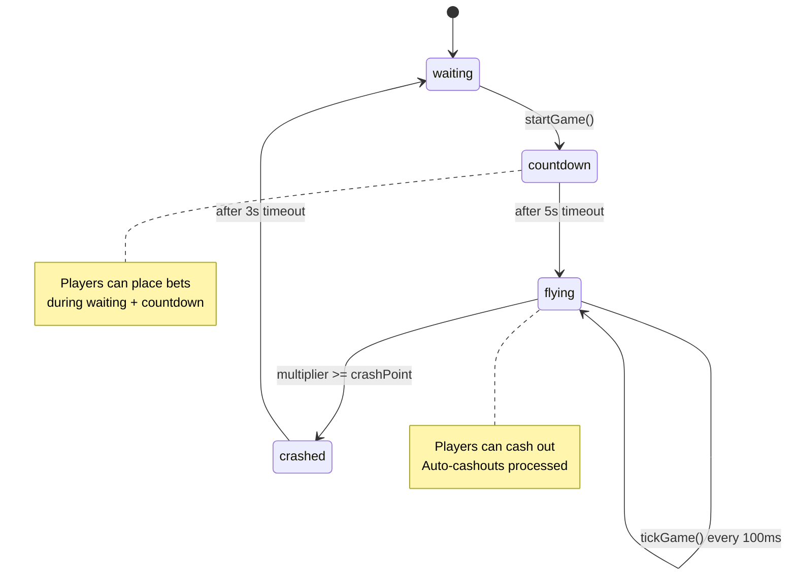
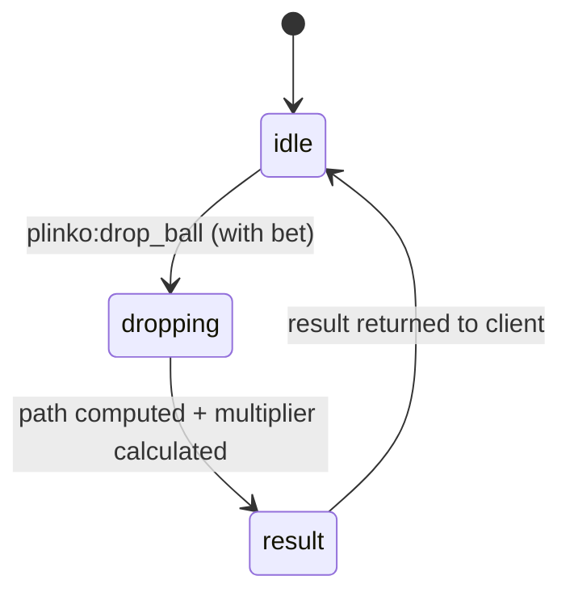
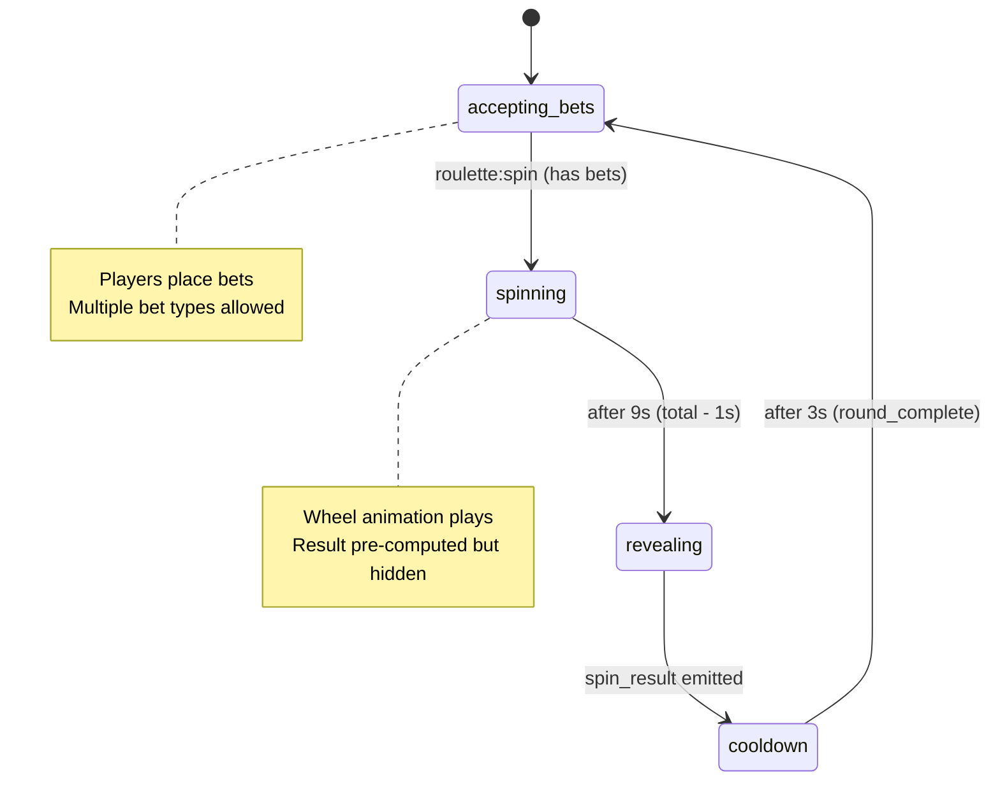
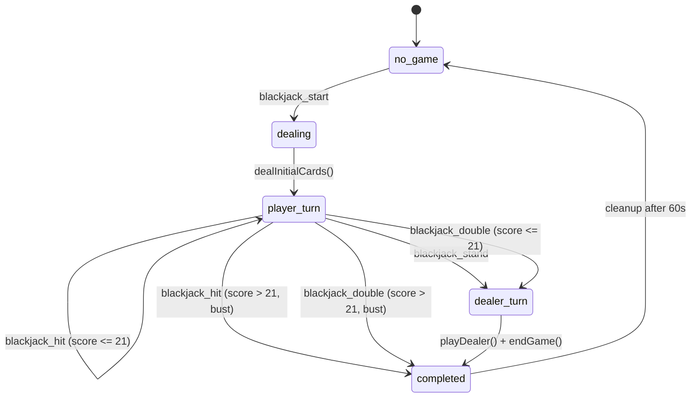
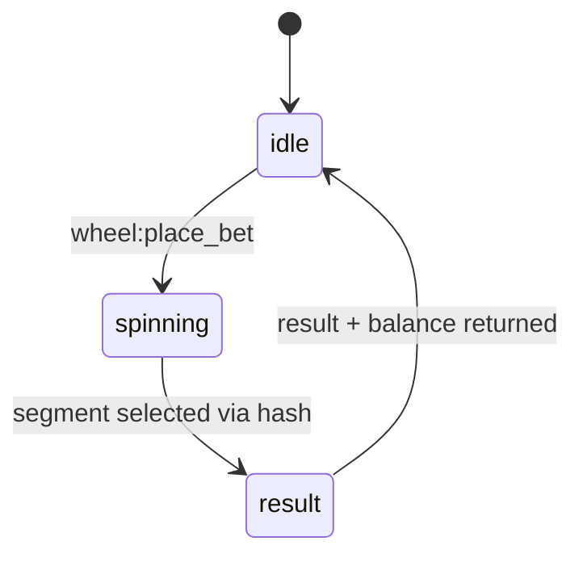
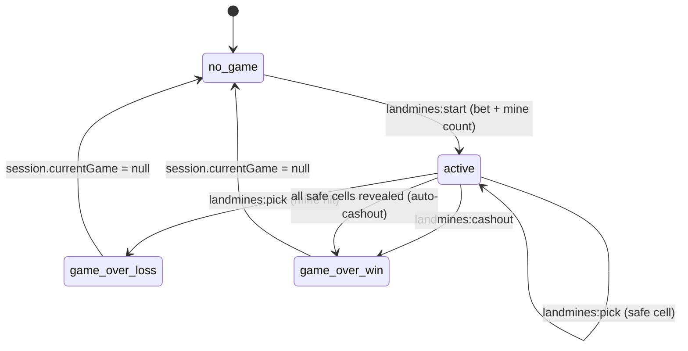

# Game Algorithms Reference

Technical reference for the mathematical algorithms, formulas, house edge calculations, payout structures, RNG mechanisms, and state machines used by each Platinum Casino game. All values are extracted directly from the source code.

**Source files:**

| Game | Server handler | Server utils | Client utils |
|------|---------------|--------------|--------------|
| Crash | `server/src/socket/crashHandler.ts` | `server/src/utils/gameUtils.ts` | `client/src/games/crash/crashUtils.js` |
| Plinko | `server/src/socket/plinkoHandler.ts` | `server/src/utils/plinkoUtils.ts` | `client/src/games/plinko/plinkoUtils.js` |
| Roulette | `server/src/socket/rouletteHandler.ts` | -- | `client/src/games/roulette/rouletteUtils.js` |
| Blackjack | `server/src/socket/blackjackHandler.ts` | `server/src/utils/gameUtils.ts` | `client/src/games/blackjack/blackjackUtils.js` |
| Wheel | `server/src/socket/wheelHandler.ts` | -- | `client/src/games/wheel/wheelUtils.js` |
| Landmines | `server/src/socket/landminesHandler.ts` | -- | `client/src/games/landmines/landminesUtils.js` |

---

## House Edge Summary

Defined in `server/src/utils/gameUtils.ts` via `calculateHouseEdge()`:

| Game | House Edge | Notes |
|------|-----------|-------|
| Blackjack | 0.5% (`0.005`) | With perfect basic strategy |
| Crash | 1.0% (`0.01`) | Applied to crash point generation |
| Plinko | 2.0% (`0.02`) | Built into multiplier curves |
| Roulette | 2.7% (`0.027`) | European single-zero wheel (1/37) |
| Wheel | 4.0% (`0.04`) | Varies by difficulty via segment weighting |
| Default | 2.0% (`0.02`) | Fallback for unrecognized game types |

---

## 1. Crash

### 1.1 Multiplier Growth Formula

The multiplier increases every 100 ms tick using an exponential growth function:

```
multiplier(t) = e^(0.06 * t)
```

Where `t` is elapsed time in **seconds** since the round started.

The client-side equivalent (`crashUtils.js`) uses milliseconds:

```
multiplier(ms) = e^(0.00006 * ms)
```

Both are mathematically equivalent since `0.06 * (ms / 1000) = 0.00006 * ms`.

| Elapsed time | Multiplier |
|-------------|------------|
| 0 s | 1.00x |
| 5 s | 1.35x |
| 10 s | 1.82x |
| 15 s | 2.46x |
| 20 s | 3.32x |
| 30 s | 6.05x |
| 45 s | 14.88x |
| 60 s | 36.60x |

### 1.2 Crash Point Generation

Defined in `generateCrashPoint(houseEdge)` inside `crashHandler.ts`:

```javascript
function generateCrashPoint(houseEdge) {
  const r = Math.random();

  if (r < houseEdge) {
    // Force early crash between 1.00x and 5.00x
    return 1 + (Math.random() * 4);
  } else {
    // Normal distribution: 1x + (rand * rand * 20)
    const variance = Math.random() * Math.random() * 20;
    return 1 + variance;
  }
}
```

**Two-branch algorithm:**

1. **House edge branch** (probability = `houseEdge`, default 1%): Forces an early crash. The crash point is uniformly distributed in the range `[1.00, 5.00)`.
2. **Normal branch** (probability = `1 - houseEdge`, default 99%): The crash point equals `1 + U1 * U2 * 20` where `U1` and `U2` are independent uniform random variables on `[0, 1)`. This produces a distribution heavily skewed toward lower values (most results cluster between 1.0x and 5.0x) while allowing rare spikes up to 21.0x.

The **client-side** `crashUtils.js` contains an alternative formula using an inverse-CDF approach:

```
crashPoint = 100 / (1 - r * (1 - houseEdge / 100))
```

This is used for client-side verification/display purposes. The server formula is authoritative.

### 1.3 Payout Calculation

```
winAmount = betAmount * cashoutMultiplier
profit    = winAmount - betAmount
```

Players can cash out manually or set an `autoCashoutAt` target multiplier.

### 1.4 RNG / Fairness

- Server-side: `Math.random()` (not cryptographic).
- The crash point is generated before the round starts and is not disclosed until the game crashes.
- No provably fair hash chain is currently implemented (noted as a TODO in the source).

### 1.5 Game State Machine



### 1.6 Constants

| Constant | Value | Description |
|----------|-------|-------------|
| Tick interval | 100 ms | Multiplier update frequency |
| Countdown duration | 5,000 ms | Betting window before flight |
| Post-crash delay | 3,000 ms | Pause before next round |
| Growth rate | 0.06 | Exponent coefficient (per second) |
| Game history depth | 50 | Max rounds kept in memory |
| Broadcast history | 10 | Rounds sent to newly connected clients |

---

## 2. Plinko

### 2.1 Path Generation Algorithm

Defined in `server/src/utils/plinkoUtils.ts`:

```typescript
function generatePath(rows: number, seed: string): number[] {
  const rand = mulberry32(hashStringToInt(seed));
  let position = Math.floor((rows + 1) / 2); // start centered
  for (let r = 0; r < rows; r++) {
    const dir = rand() < 0.5 ? -1 : 1;
    position = clamp(position + dir, 0, rows);
    path.push(position);
  }
  return path;
}
```

**PRNG:** Mulberry32 seeded with a FNV-1a hash of the server seed string.

- **FNV-1a hash**: `h` starts at `2166136261`, then for each byte: `h ^= byte; h = h * 16777619` (all unsigned 32-bit).
- **Mulberry32**: A fast 32-bit PRNG. At each step: `t += 0x6D2B79F5`, then a series of XOR-shift-multiply operations, returning `t / 2^32`.

Each row, the ball moves left (`-1`) or right (`+1`) with equal probability (`0.5`). The position is clamped to `[0, rows]`, producing `rows + 1` possible landing slots.

Default row count: **16** (server), **8** (client default). The `rows` parameter is configurable per bet (sent from client).

### 2.2 Multiplier Calculation

Defined in `server/src/utils/plinkoUtils.ts`:

```typescript
function calculateMultiplier(slotIndex, rows, risk): number {
  const center = rows / 2;
  const distance = Math.abs(slotIndex - center);
  const norm = Math.min(distance / center, 1);
  const mult = base + (edge - base) * Math.pow(norm, 1.25);
  return Math.max(0.1, Math.round(mult * 100) / 100);
}
```

**Risk level parameters:**

| Risk | `base` (center) | `edge` (extreme) |
|------|-----------------|-------------------|
| `low` | 0.6x | 2.0x |
| `medium` | 0.5x | 3.5x |
| `high` | 0.4x | 6.0x |

The multiplier is a **power-curve interpolation** between `base` (at center, distance = 0) and `edge` (at extreme slots, distance = 1):

```
multiplier = base + (edge - base) * (distance / center)^1.25
```

The exponent `1.25` makes the curve slightly steeper than linear, concentrating more outcomes near the base multiplier.

Minimum multiplier floor: **0.1x**.

### 2.3 Client-Side Payout Tables

The client (`plinkoUtils.js`) defines fixed multiplier arrays for an 8-row board with 11 buckets (indices 0--10):

| Bucket | Low Risk | Medium Risk | High Risk |
|--------|----------|-------------|-----------|
| 0 (far left) | 1.3x | 5.6x | 10.0x |
| 1 | 1.1x | 2.1x | 3.0x |
| 2 | 1.0x | 1.1x | 1.6x |
| 3 | 0.9x | 1.0x | 0.7x |
| 4 | 0.8x | 0.5x | 0.4x |
| 5 (center) | 0.7x | 0.3x | 0.2x |
| 6 | 0.8x | 0.5x | 0.4x |
| 7 | 0.9x | 1.0x | 0.7x |
| 8 | 1.0x | 1.1x | 1.6x |
| 9 | 1.1x | 2.1x | 3.0x |
| 10 (far right) | 1.3x | 5.6x | 10.0x |

The payout tables are **symmetric** around the center bucket.

### 2.4 RNG / Fairness

- **Server-side seed**: Generated as `Math.random().toString(36).substring(2, 15)`.
- **PRNG**: Mulberry32 (deterministic, reproducible given the seed).
- Path is fully determined by the server seed before the ball drops.

### 2.5 Game State Machine



Plinko is a single-player, single-round game. Each `drop_ball` event is an independent bet.

---

## 3. Roulette

### 3.1 Wheel Configuration

European roulette with **37 pockets** (0--36, single zero). The wheel order follows the standard European sequence:

```
0, 32, 15, 19, 4, 21, 2, 25, 17, 34, 6, 27, 13, 36, 11, 30,
8, 23, 10, 5, 24, 16, 33, 1, 20, 14, 31, 9, 22, 18, 29, 7,
28, 12, 35, 3, 26
```

**Color distribution:** 18 red, 18 black, 1 green (zero).

### 3.2 Bet Types and Payouts

| Bet Type | Payout | Numbers Covered | Win Probability | Total Return |
|----------|--------|----------------|-----------------|--------------|
| Straight Up | 35:1 | 1 | 1/37 (2.70%) | bet * 36 |
| Split | 17:1 | 2 | 2/37 (5.41%) | bet * 18 |
| Street | 11:1 | 3 | 3/37 (8.11%) | bet * 12 |
| Corner | 8:1 | 4 | 4/37 (10.81%) | bet * 9 |
| Five | 6:1 | 5 | 5/37 (13.51%) | bet * 7 |
| Line | 5:1 | 6 | 6/37 (16.22%) | bet * 6 |
| Column | 2:1 | 12 | 12/37 (32.43%) | bet * 3 |
| Dozen | 2:1 | 12 | 12/37 (32.43%) | bet * 3 |
| Red/Black | 1:1 | 18 | 18/37 (48.65%) | bet * 2 |
| Odd/Even | 1:1 | 18 | 18/37 (48.65%) | bet * 2 |
| Low/High | 1:1 | 18 | 18/37 (48.65%) | bet * 2 |

**Winnings formula:**

```
winAmount = betAmount * (payout + 1)   // if winner
winAmount = 0                          // if loser
```

The `+1` returns the original stake on top of the payout ratio.

**House edge derivation:** For any bet on a European single-zero wheel:

```
House Edge = 1/37 = 2.70%
```

### 3.3 Spin Result Generation

Defined in `generateSpinResult()`:

```javascript
const seedString = `${serverSeed}-${Date.now()}`;
let hash = 0;
for (let i = 0; i < seedString.length; i++) {
  const char = seedString.charCodeAt(i);
  hash = ((hash << 5) - hash) + char;  // DJB2 hash variant
  hash = hash & hash;                   // Force 32-bit int
}
const index = Math.abs(hash) % 37;      // Select pocket
```

The hash function is a DJB2 variant applied to `"{serverSeed}-{timestamp}"`. The result modulo 37 selects a pocket index from the `ROULETTE_NUMBERS` array.

### 3.4 Wheel Animation Phases

| Phase | Rotations | Duration |
|-------|-----------|----------|
| Phase 1 (fast) | 10 full rotations (3,600 deg) | 3,000 ms |
| Phase 2 (medium) | 6 full rotations (2,160 deg) | 4,000 ms |
| Phase 3 (slow) | 2 full rotations (720 deg) | 3,000 ms |
| **Total** | **18 rotations** | **10,000 ms** |

The final angle includes a random offset within `+/-30%` of the pocket width to create a natural landing appearance:

```
pocketAngle = 360 / 37 = ~9.73 degrees
randomOffset = rand * (pocketAngle * 0.6) - (pocketAngle * 0.3)
```

The spin result is revealed to clients 1 second before the animation ends (`total - 1000 = 9,000 ms`), followed by a 3-second post-result cooldown.

### 3.5 RNG / Fairness

- Server seed: `Math.random().toString(36).substring(2, 15)`.
- Hash: DJB2-variant, combined with `Date.now()` for uniqueness.
- Result is computed server-side before the spin animation begins.

### 3.6 Game State Machine



---

## 4. Blackjack

### 4.1 Deck and Card Values

Standard 52-card deck (single deck per game). No multi-deck shoe.

| Rank | Value |
|------|-------|
| 2--10 | Face value |
| J, Q, K | 10 |
| A | 11 (reduced to 1 if hand > 21) |

### 4.2 Hand Scoring Algorithm

```typescript
function calculateScore(hand: Card[]): number {
  let score = 0;
  let aces = 0;

  for (const card of hand) {
    if (card.rank === 'A') { aces++; score += 11; }
    else { score += card.value; }
  }

  // Reduce aces from 11 to 1 as needed
  while (score > 21 && aces > 0) {
    score -= 10;
    aces--;
  }
  return score;
}
```

Aces are initially valued at 11. If the total exceeds 21, each Ace is reduced to 1 (by subtracting 10) until the score is 21 or under, or all Aces have been reduced.

### 4.3 Dealer Rules

The dealer follows a simple hard-17 rule:

```
Dealer hits while calculateScore(dealerHand) < 17
Dealer stands on 17 or above (including soft 17)
```

### 4.4 Game Outcome and Payouts

Determined in `endGame()`:

| Outcome | Condition | `winAmount` |
|---------|-----------|-------------|
| Player bust | Player score > 21 | `0` (lose bet) |
| Dealer bust | Dealer score > 21, player not bust | `betAmount * 2` |
| Player wins | Player score > dealer score | `betAmount * 2` |
| Dealer wins | Dealer score > player score | `0` (lose bet) |
| Push | Player score = dealer score | `betAmount` (returned) |
| Blackjack | Player 21 with 2 cards, dealer does not have 21 | `floor(betAmount * 2.5)` |

**Blackjack payout:** 3:2 (implemented as `floor(betAmount * 2.5)` which includes the original stake). The `floor()` rounds down to the nearest integer.

The `gameUtils.ts` utility function `calculatePayout()` returns the **profit** (not total return):

| Result | Profit |
|--------|--------|
| Blackjack | `bet * 1.5` |
| Player win | `bet * 1.0` |
| Push | `0` |
| Dealer win | `-bet` |

### 4.5 Available Player Actions

| Action | Condition | Effect |
|--------|-----------|--------|
| **Hit** | Game active | Deal one card; bust check |
| **Stand** | Game active | Dealer plays; determine winner |
| **Double Down** | Exactly 2 cards in hand; sufficient balance | Bet doubled, one card dealt, then dealer plays |
| **Split** | 2 cards of equal value | Detected via `canSplit()` but not yet fully implemented |

### 4.6 Deck Shuffling and RNG

The server uses **cryptographically secure shuffling** via Node.js `crypto.randomBytes()`:

```typescript
secureShuffle(deck: Card[]) {
  const result = [...deck];
  // Fisher-Yates shuffle with crypto.randomBytes
  for (let i = result.length - 1; i > 0; i--) {
    const randomBytes = crypto.randomBytes(4);
    const randomValue = randomBytes.readUInt32BE(0);
    const j = randomValue % (i + 1);
    [result[i], result[j]] = [result[j], result[i]];
  }
  // Second pass for additional randomness
  for (let i = result.length - 1; i > 0; i--) {
    const randomBytes = crypto.randomBytes(4);
    const randomValue = randomBytes.readUInt32BE(0);
    const j = randomValue % (i + 1);
    [result[i], result[j]] = [result[j], result[i]];
  }
  return result;
}
```

This is the only game that uses `crypto.randomBytes()` for RNG. The shuffle is applied **twice** (two full Fisher-Yates passes).

### 4.7 Game ID Generation

```typescript
generateGameId(): string {
  const randomBytes = crypto.randomBytes(8);
  const randomHex = randomBytes.toString('hex');
  return `bj_${Date.now()}_${randomHex}`;
}
```

Format: `bj_{timestamp}_{16-hex-chars}` (e.g., `bj_1711500000000_a1b2c3d4e5f6a7b8`).

### 4.8 Game State Machine



### 4.9 Constants

| Constant | Value |
|----------|-------|
| Deck size | 52 cards (single deck) |
| Dealer stand threshold | 17 |
| Blackjack payout | 3:2 (2.5x total return) |
| Normal win payout | 1:1 (2.0x total return) |
| Game cleanup delay | 60,000 ms |
| House edge | ~0.5% (with perfect strategy) |

---

## 5. Wheel of Fortune

### 5.1 Segment Configuration

Segments are defined per difficulty level. Each segment has a `multiplier`, `color`, and `weight` (number of occurrences on the wheel).

#### Easy Difficulty (14 total segments)

| Multiplier | Color | Weight | Probability | EV Contribution |
|-----------|-------|--------|-------------|-----------------|
| 1.5x | Blue | 3 | 3/14 (21.4%) | 0.321 |
| 2.0x | Green | 2 | 2/14 (14.3%) | 0.286 |
| 0.5x | Red | 2 | 2/14 (14.3%) | 0.071 |
| 1.0x | Yellow | 4 | 4/14 (28.6%) | 0.286 |
| 0.2x | Orange | 2 | 2/14 (14.3%) | 0.029 |
| 3.0x | Purple | 1 | 1/14 (7.1%) | 0.214 |

**Expected value (Easy):** 0.321 + 0.286 + 0.071 + 0.286 + 0.029 + 0.214 = **1.207** (player-favorable in theory)

#### Medium Difficulty (12 total segments)

| Multiplier | Color | Weight | Probability | EV Contribution |
|-----------|-------|--------|-------------|-----------------|
| 2.0x | Blue | 2 | 2/12 (16.7%) | 0.333 |
| 3.0x | Green | 1 | 1/12 (8.3%) | 0.250 |
| 0.2x | Red | 3 | 3/12 (25.0%) | 0.050 |
| 1.0x | Yellow | 3 | 3/12 (25.0%) | 0.250 |
| 0.5x | Orange | 2 | 2/12 (16.7%) | 0.083 |
| 5.0x | Purple | 1 | 1/12 (8.3%) | 0.417 |

**Expected value (Medium):** 0.333 + 0.250 + 0.050 + 0.250 + 0.083 + 0.417 = **1.383** (player-favorable in theory)

#### Hard Difficulty (11 total segments)

| Multiplier | Color | Weight | Probability | EV Contribution |
|-----------|-------|--------|-------------|-----------------|
| 3.0x | Blue | 1 | 1/11 (9.1%) | 0.273 |
| 5.0x | Green | 1 | 1/11 (9.1%) | 0.455 |
| 0.1x | Red | 4 | 4/11 (36.4%) | 0.036 |
| 0.5x | Yellow | 2 | 2/11 (18.2%) | 0.091 |
| 0.2x | Orange | 2 | 2/11 (18.2%) | 0.036 |
| 10.0x | Purple | 1 | 1/11 (9.1%) | 0.909 |

**Expected value (Hard):** 0.273 + 0.455 + 0.036 + 0.091 + 0.036 + 0.909 = **1.800** (highest variance, player-favorable in theory)

> **Note:** The computed EVs above are theoretical based on uniform segment selection. The actual house edge of ~4% (from `calculateHouseEdge`) is configured separately and may be applied through additional mechanisms not visible in the current segment weights.

### 5.2 Result Generation

Uses the same DJB2-variant hash function as roulette:

```javascript
const seedString = `${serverSeed}-${Date.now()}`;
// ... DJB2 hash ...
const index = Math.abs(hash) % segments.length;
```

The hash modulo the number of expanded segments selects the winning segment.

### 5.3 Animation Angle Calculation

```javascript
const segmentAngle = 360 / segments.length;
const baseRotation = 270;  // Arrow at top (9 o'clock)
const targetAngle = baseRotation - (segmentIndex * segmentAngle);
const randomOffset = rand * (segmentAngle * 0.6) - (segmentAngle * 0.3);
const fullRotations = 4 * 360;  // 4 full spins
const finalAngle = targetAngle + randomOffset + fullRotations;
```

### 5.4 RNG / Fairness

- Server seed: `Math.random().toString(36).substring(2, 15)`.
- Hash: DJB2-variant combined with `Date.now()`.
- Same mechanism as roulette.

### 5.5 Game State Machine



Wheel is a single-player, single-round game. Each bet triggers an immediate spin.

---

## 6. Landmines

### 6.1 Grid Configuration

| Constant | Value |
|----------|-------|
| `GRID_SIZE` | 5 (5x5 grid, 25 cells total) |
| `MIN_MINES` | 1 |
| `MAX_MINES` | 24 |
| Safe cells | `25 - mines` |

### 6.2 Multiplier Formula

Defined identically in both server (`landminesHandler.ts`) and client (`landminesUtils.js`):

```javascript
function calculateMultiplier(mines, revealed) {
  const baseMultiplier = 1 + (mines / 12);
  const growthFactor  = 1 + (mines / 25);
  return round(baseMultiplier * Math.pow(growthFactor, revealed), 2);
}
```

**Components:**

- `baseMultiplier = 1 + (mines / 12)` -- Higher mine count gives a higher starting multiplier.
- `growthFactor = 1 + (mines / 25)` -- Exponential growth rate per reveal, faster with more mines.
- Final: `baseMultiplier * growthFactor^revealed`, rounded to 2 decimal places.

#### Sample Multiplier Table

| Mines | 1 reveal | 2 reveals | 3 reveals | 5 reveals | 10 reveals |
|-------|----------|-----------|-----------|-----------|------------|
| 1 | 1.08x | 1.13x | 1.17x | 1.28x | 1.55x |
| 3 | 1.39x | 1.56x | 1.75x | 2.20x | 3.87x |
| 5 | 1.58x | 1.90x | 2.28x | 3.28x | 6.82x |
| 10 | 2.25x | 3.15x | 4.41x | 8.64x | 33.15x |
| 15 | 3.48x | 5.57x | 8.91x | 22.83x | 149.74x |
| 20 | 5.49x | 10.42x | 19.80x | 71.41x | 928.34x |
| 24 | 8.37x | 18.59x | 41.28x | 203.63x | 4957.14x |

### 6.3 Difficulty Classification (Client-Side)

From `landminesUtils.js`:

| Mines | Difficulty |
|-------|-----------|
| 1--3 | Easy |
| 4--8 | Medium |
| 9--16 | Hard |
| 17--24 | Extreme |

### 6.4 Mine Probability Per Pick

The probability of hitting a mine on any given pick depends on mines remaining and cells remaining:

```
P(mine on pick k) = mines_remaining / cells_remaining
                   = mines / (25 - k)
```

Where `k` is the number of cells already revealed (0-indexed). Since mines are placed before the game and do not move, each pick is conditionally independent given the remaining state.

#### Survival Probability (cumulative chance of surviving k picks)

```
P(survive k picks) = Product_{i=0}^{k-1} [(25 - mines - i) / (25 - i)]
```

Example for 5 mines:

| Pick # | Survival Probability |
|--------|---------------------|
| 1 | 80.0% |
| 2 | 63.3% |
| 3 | 49.6% |
| 5 | 28.7% |
| 10 | 4.6% |
| 15 | 0.2% |
| 20 (all safe) | 0.0004% |

### 6.5 Grid Generation

Uses the `seedrandom` library for seeded PRNG:

```javascript
const seedrandom = require('seedrandom');
const rng = seedrandom(serverSeed);

let cells = Array(25).fill(false);
let minesToPlace = mines;
while (minesToPlace > 0) {
  const index = Math.floor(rng() * cells.length);
  if (!cells[index]) {
    cells[index] = true;
    minesToPlace--;
  }
}
```

Mines are placed randomly using rejection sampling (re-roll if a cell already has a mine). The flat array is then reshaped into a 5x5 2D grid.

### 6.6 RNG / Fairness

- **Server seed**: `Math.random().toString(36).substring(2, 15)`.
- **PRNG**: `seedrandom` library (deterministic given the seed).
- The grid is generated server-side at game start and never revealed until the player hits a mine or cashes out.

### 6.7 Game State Machine



### 6.8 Payout Calculation

```
winAmount = betAmount * calculateMultiplier(mines, revealedCount)
profit    = winAmount - betAmount
```

On mine hit: `winAmount = 0`, `profit = -betAmount`.

---

## RNG Summary Across Games

| Game | Server RNG Method | Deterministic Seed? | Cryptographic? |
|------|------------------|--------------------|----|
| Crash | `Math.random()` | No | No |
| Plinko | Mulberry32 (seeded) | Yes (FNV-1a of seed string) | No |
| Roulette | DJB2 hash of seed+timestamp | Semi (timestamp adds entropy) | No |
| Blackjack | `crypto.randomBytes()` | No (true CSPRNG) | **Yes** |
| Wheel | DJB2 hash of seed+timestamp | Semi (timestamp adds entropy) | No |
| Landmines | `seedrandom` library | Yes (seeded PRNG) | No |

---

## Common Hash Function (Roulette, Wheel)

Both roulette and wheel use the same DJB2-variant hash:

```javascript
function djb2Hash(input: string): number {
  let hash = 0;
  for (let i = 0; i < input.length; i++) {
    const char = input.charCodeAt(i);
    hash = ((hash << 5) - hash) + char;
    hash = hash & hash;  // Convert to 32-bit integer
  }
  return Math.abs(hash);
}
```

The input is always `"{serverSeed}-{Date.now()}"`. The output modulo the number of outcomes selects the result.

---

## Related Documents

- [Games Overview](games-overview.md) -- High-level description of each game, socket events, and architecture
- [Balance System](balance-system.md) -- How `BalanceService` processes bets and payouts
- [Authentication](authentication.md) -- Socket authentication for game sessions
- [API Reference](../04-api/) -- REST endpoints that complement socket-based game interactions
- [Security](../07-security/) -- Security considerations for RNG and fairness
- [Testing](../08-testing/) -- Test coverage for game logic utilities
