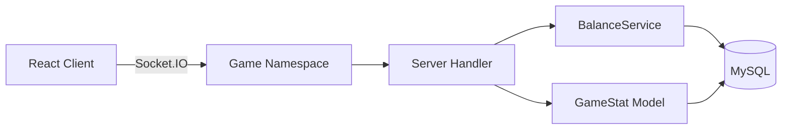
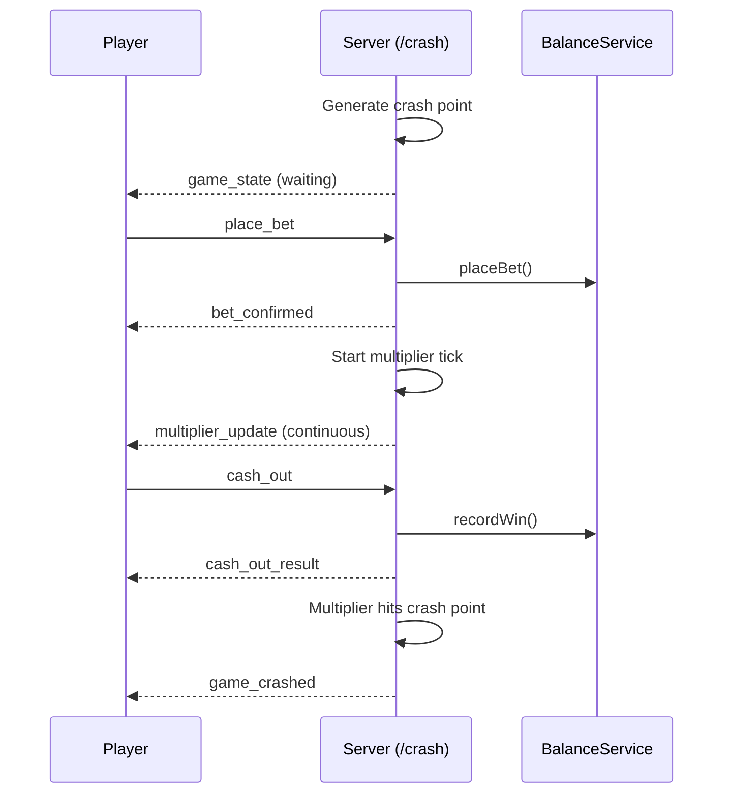
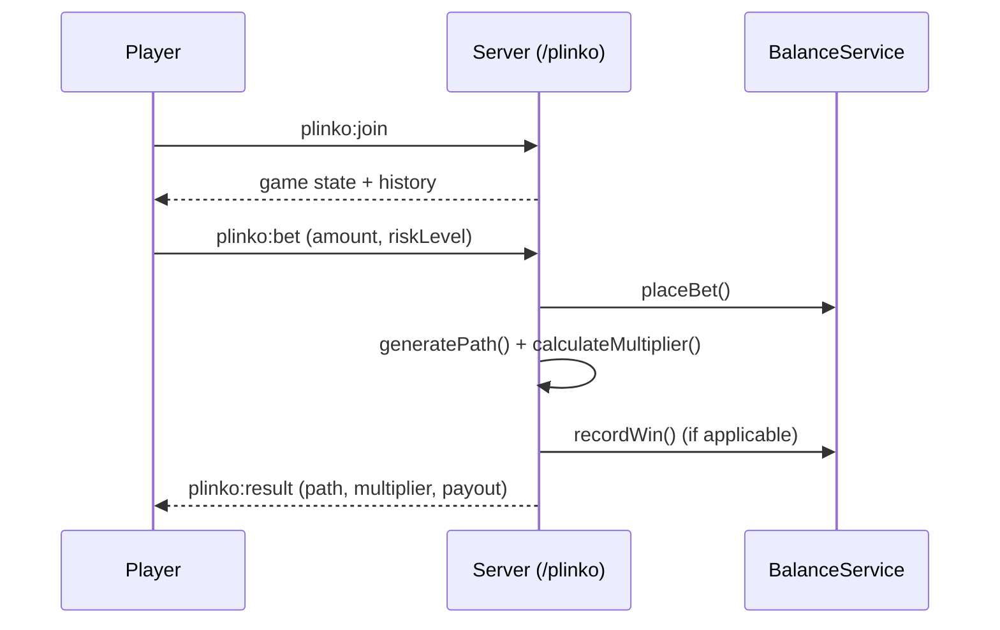
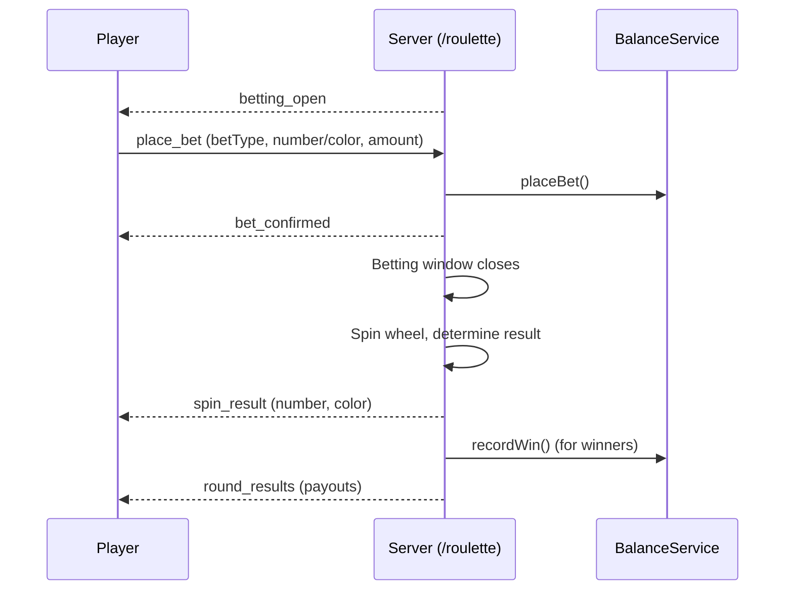
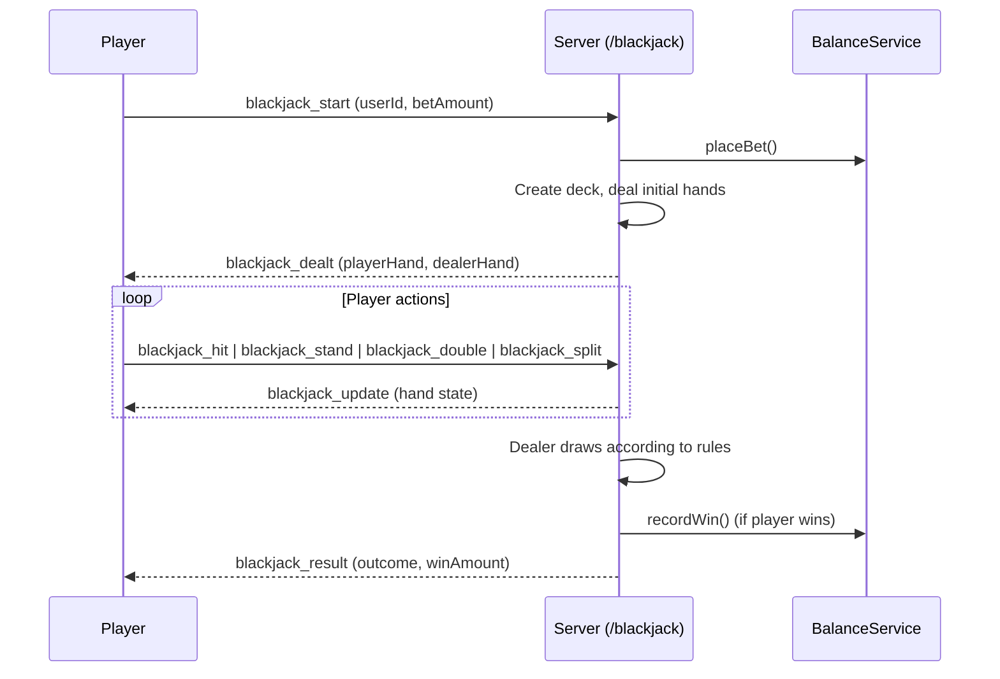
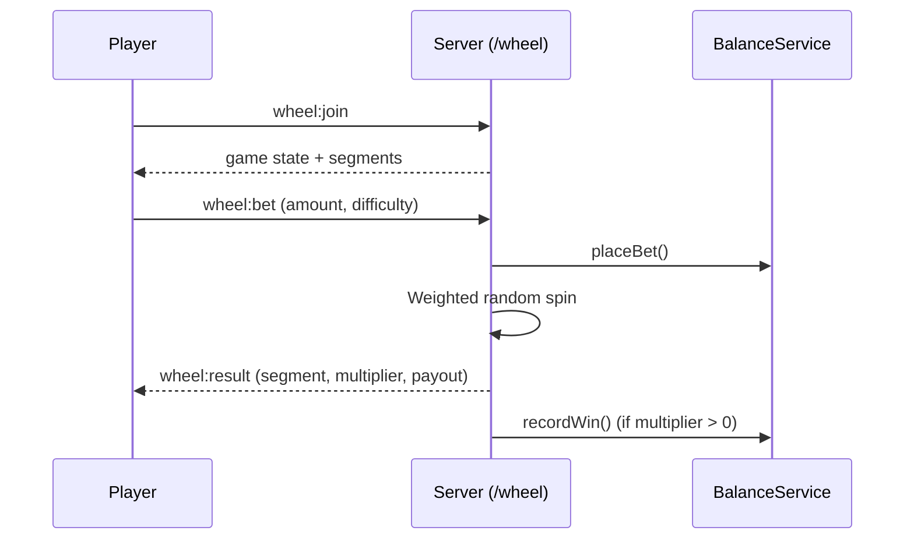
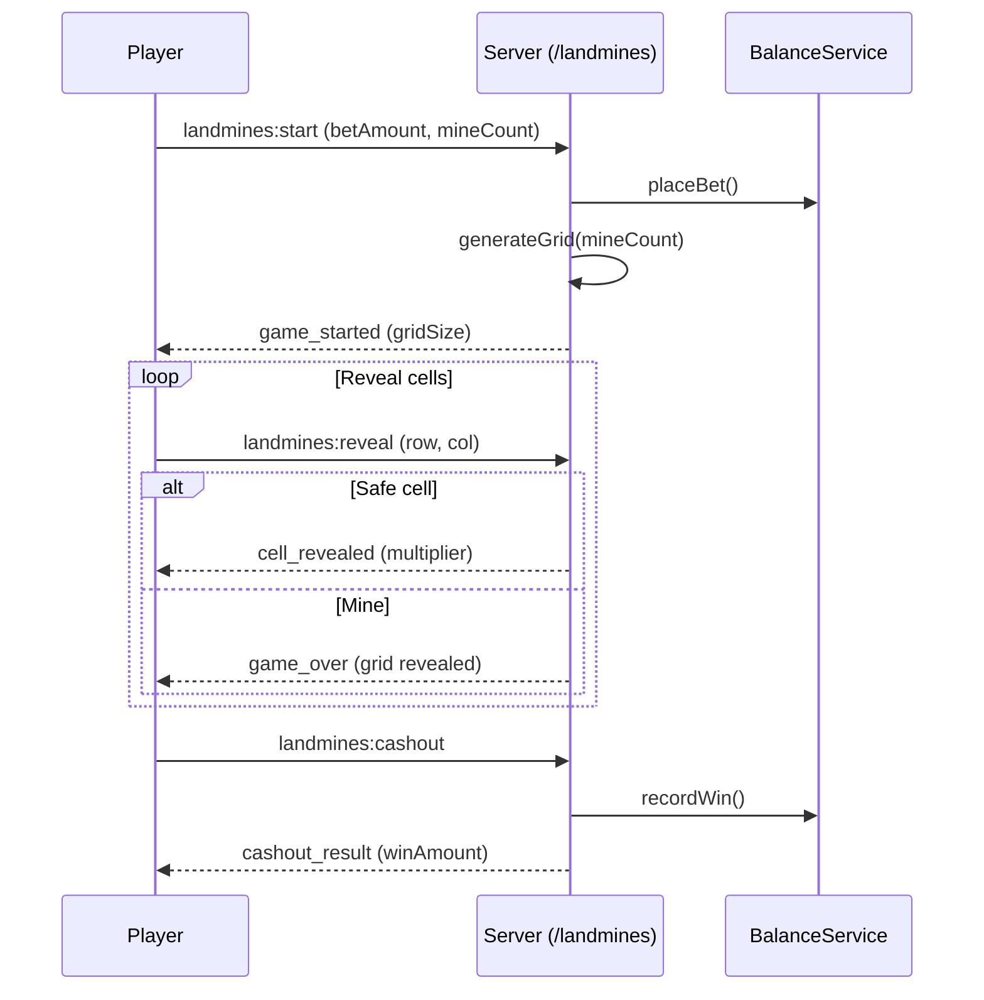

# Casino Games Overview

Platinum Casino offers six real-time multiplayer casino games. Each game communicates over a dedicated Socket.IO namespace and integrates with the centralized `BalanceService` for all wager and payout operations.

## Architecture at a Glance



Every game follows the same structural pattern:

| Layer | Location |
|-------|----------|
| Client page | `client/src/pages/games/{Game}Page.jsx` |
| Client components | `client/src/games/{game}/` |
| Client socket service | `client/src/games/{game}/{game}SocketService.js` |
| Client utilities | `client/src/games/{game}/{game}Utils.js` |
| Server handler | `server/src/socket/{game}Handler.ts` |

---

## 1. Crash

**Namespace:** `/crash`

### Description

A multiplier-based betting game where a shared multiplier rises from 1.00x until it "crashes" at a randomly determined point. Players place bets before the round starts and must cash out before the crash to lock in their winnings. The game is fully multiplayer -- all connected players share the same round, and bets/cashouts are broadcast in real time.

### Game Flow



### Key Components

| File | Purpose |
|------|---------|
| `client/src/games/crash/CrashGame.jsx` | Main game container with multiplier curve canvas |
| `client/src/games/crash/CrashBettingPanel.jsx` | Bet amount input, auto cash-out setting |
| `client/src/games/crash/CrashActiveBets.jsx` | Live list of all player bets in the current round |
| `client/src/games/crash/CrashHistory.jsx` | Previous round crash points |
| `client/src/games/crash/CrashPlayersList.jsx` | Connected players and their status |
| `client/src/games/crash/crashSocketService.js` | Socket.IO client for `/crash` namespace |
| `client/src/games/crash/crashUtils.js` | Multiplier formatting, curve calculations |
| `server/src/socket/crashHandler.ts` | Server-side game loop, crash point generation, bet/cashout processing |

### Game States

`waiting` &rarr; `countdown` &rarr; `flying` &rarr; `crashed` &rarr; `waiting`

### Status

Implemented. Multiplayer with shared game state, real-time multiplier broadcasting, and active player tracking.

---

## 2. Plinko

**Namespace:** `/plinko`

### Description

A physics-based ball-drop game inspired by the classic Plinko board. The player selects a risk level and bet amount, then drops a ball from the top of a pegged board. The ball bounces through rows of pegs and lands in a payout slot at the bottom. Different risk levels change the payout structure.

### Game Flow



### Key Components

| File | Purpose |
|------|---------|
| `client/src/games/plinko/PlinkoGame.jsx` | Main game container |
| `client/src/games/plinko/PlinkoBoard.jsx` | Animated peg board with ball physics |
| `client/src/games/plinko/PlinkoBettingPanel.jsx` | Bet amount, risk level selector |
| `client/src/games/plinko/plinkoSocketService.js` | Socket.IO client events |
| `client/src/games/plinko/plinkoUtils.js` | Path and multiplier helpers |
| `server/src/socket/plinkoHandler.ts` | Path generation, multiplier calculation, session management |
| `server/src/utils/plinkoUtils.ts` | `generatePath()`, `calculateMultiplier()` |

### Risk Levels

The game supports multiple risk levels (e.g., low, medium, high) that alter the payout distribution across slots.

### Status

Implemented. Single-player sessions with server-side path and outcome generation.

---

## 3. Roulette

**Namespace:** `/roulette`

### Description

A standard European roulette game (single zero) with full inside and outside bet support. The game runs in timed rounds shared across all connected players. Players place bets during the betting window, and the server spins the wheel to determine the winning number.

### Game Flow



### Key Components

| File | Purpose |
|------|---------|
| `client/src/games/roulette/RouletteGame.jsx` | Main game container |
| `client/src/games/roulette/RouletteWheel.jsx` | Animated wheel with spin animation |
| `client/src/games/roulette/RouletteBettingPanel.jsx` | Bet placement grid (inside/outside bets) |
| `client/src/games/roulette/RouletteActiveBets.jsx` | All active bets in the current round |
| `client/src/games/roulette/RoulettePlayersList.jsx` | Connected players |
| `client/src/games/roulette/rouletteSocketService.js` | Socket.IO client for `/roulette` |
| `client/src/games/roulette/rouletteUtils.js` | Number/color lookups, payout calculations |
| `server/src/socket/rouletteHandler.ts` | Round management, spin logic, payout resolution |

### Bet Types

- **Inside bets:** Straight (single number), split, street, corner, line
- **Outside bets:** Red/black, odd/even, high/low, dozens, columns

### Status

Implemented. Multiplayer with shared round state, real-time bet broadcasting, and European wheel layout.

---

## 4. Blackjack

**Namespace:** `/blackjack`

### Description

A standard card game where the player competes against the dealer. The objective is to get a hand value closer to 21 than the dealer without going over. Supports hit, stand, split, and double-down actions.

### Game Flow



### Key Components

| File | Purpose |
|------|---------|
| `client/src/games/blackjack/BlackjackGame.jsx` | Main game container and action controls |
| `client/src/games/blackjack/BlackjackTable.jsx` | Card table layout |
| `client/src/games/blackjack/BlackjackHand.jsx` | Individual hand display with card rendering |
| `client/src/games/blackjack/BlackjackBettingPanel.jsx` | Bet amount input |
| `client/src/games/blackjack/blackjackUtils.js` | Hand value calculation, deck utilities |
| `server/src/socket/blackjackHandler.ts` | `BlackjackHandler` class -- deck management, game logic, dealer AI |

### Game Rules

- Dealer stands on 17
- Blackjack pays 3:2
- Double down available on initial hand
- Split available on matching cards

### Status

Implemented. Single-player sessions against a server-controlled dealer.

---

## 5. Wheel (Wheel of Fortune)

**Namespace:** `/wheel`

### Description

A spinning wheel game where players bet on the outcome of a weighted wheel spin. The wheel contains color-coded segments, each with a different multiplier. Three difficulty modes (easy, medium, hard) alter the segment weights and multiplier values.

### Game Flow



### Key Components

| File | Purpose |
|------|---------|
| `client/src/games/wheel/WheelGame.jsx` | Main game container |
| `client/src/games/wheel/WheelBoard.jsx` | Animated spinning wheel |
| `client/src/games/wheel/WheelBettingPanel.jsx` | Bet amount, difficulty selector |
| `client/src/games/wheel/WheelActiveBets.jsx` | Active bets display |
| `client/src/games/wheel/WheelPlayersList.jsx` | Connected players |
| `client/src/games/wheel/wheelSocketService.js` | Socket.IO client events |
| `client/src/games/wheel/wheelUtils.js` | Segment configuration, payout helpers |
| `server/src/socket/wheelHandler.ts` | Segment weighting, spin resolution, multiplayer state |

### Difficulty Modes

| Difficulty | Example Multipliers | Risk |
|------------|---------------------|------|
| Easy | 0.2x -- 3x | Low variance |
| Medium | 0.2x -- 5x | Medium variance |
| Hard | 0.1x -- 10x | High variance |

### Status

Implemented. Multiplayer with shared spin state and configurable difficulty.

---

## 6. Landmines

**Namespace:** `/landmines`

### Description

A grid-based reveal game played on a 5x5 board. The player chooses how many mines to hide (1--24), places a bet, then reveals cells one at a time. Each safe reveal increases a progressive multiplier. The player can cash out at any time, but hitting a mine loses the entire bet. More mines means higher risk and higher multiplier growth.

### Game Flow



### Key Components

| File | Purpose |
|------|---------|
| `client/src/games/landmines/LandminesGame.jsx` | Main game container and cashout controls |
| `client/src/games/landmines/LandminesBoard.jsx` | Interactive 5x5 grid |
| `client/src/games/landmines/LandminesBettingPanel.jsx` | Bet amount, mine count selector |
| `client/src/games/landmines/landminesUtils.js` | Multiplier tables, grid helpers |
| `server/src/socket/landminesHandler.ts` | Grid generation, mine placement, progressive multiplier calculation |

### Multiplier Formula

The multiplier grows exponentially with each safe reveal:

```
multiplier = baseMultiplier * growthFactor ^ revealed
baseMultiplier = 1 + (mines / 12)
growthFactor = 1 + (mines / 25)
```

### Grid Constants

- Grid size: 5x5 (25 cells)
- Minimum mines: 1
- Maximum mines: 24

### Status

Implemented. Single-player sessions with server-side grid generation and progressive multiplier.

---

## Shared Infrastructure

All games share the following server-side services:

| Service | File | Purpose |
|---------|------|---------|
| BalanceService | `server/src/services/balanceService.ts` | Centralized bet placement and win recording |
| LoggingService | `server/src/services/loggingService.ts` | Structured game event logging |
| GameStat Model | `server/drizzle/models/GameStat.ts` | Aggregate game statistics tracking |
| Game Utilities | `server/src/utils/gameUtils.ts` | House edge calculation, shared helpers |
| Socket Auth | `server/middleware/socket/socketAuth.ts` | Session-based WebSocket authentication |

---

## Related Documents

- [Authentication](./authentication.md) -- JWT auth and socket authentication middleware
- [Balance System](./balance-system.md) -- BalanceService API and transaction types
- [Admin Panel](./admin-panel.md) -- Game statistics dashboard for administrators
- [Architecture Overview](../02-architecture/) -- System architecture and technology stack
- [Database Schema](../09-database/) -- Drizzle ORM schema and table definitions
