# Leaderboard

The leaderboard ranks players by their total winnings from casino games. It supports three time periods (daily, weekly, all-time) and is publicly accessible without authentication.

---

## Overview

```mermaid
flowchart LR
    U[User visits /leaderboard] --> SELECT[Select period tab]
    SELECT --> API[GET /api/leaderboard?period=X&limit=20]
    API --> DB[(MySQL)]
    DB --> AGG[Aggregate game_win transactions per user]
    AGG --> FILTER[Filter: isActive = true AND totalWinnings > 0]
    FILTER --> SORT[Sort by totalWinnings DESC]
    SORT --> RESP[Return leaderboard JSON]
    RESP --> UI[Render ranked table]
```



---

## Ranking Logic

Players are ranked by the **sum of their `game_win` transaction amounts** within the selected time period. Only active users (`is_active = 1`) with at least some winnings (`totalWinnings > 0`) appear on the leaderboard.

### Query Structure

The leaderboard is computed via a single SQL query that joins `users` and `transactions`:

```sql
SELECT
  u.id,
  u.username,
  COALESCE(SUM(CASE WHEN t.transaction_type = 'game_win'
    THEN CAST(t.amount AS DECIMAL(15,2)) ELSE 0 END), 0) as totalWinnings,
  COUNT(CASE WHEN t.transaction_type IN ('game_win', 'game_loss')
    THEN 1 END) as totalGames
FROM users u
LEFT JOIN transactions t ON u.id = t.user_id
WHERE u.is_active = 1
GROUP BY u.id, u.username
HAVING totalWinnings > 0
ORDER BY totalWinnings DESC
LIMIT ?
```

For `daily` and `weekly` periods, an additional `AND t.created_at >= ?` clause is added to the JOIN condition.

### Returned Fields

| Field | Type | Description |
|-------|------|-------------|
| `id` | `number` | User ID |
| `username` | `string` | Display name |
| `totalWinnings` | `string` (decimal) | Sum of `game_win` amounts in the period |
| `totalGames` | `number` | Count of `game_win` + `game_loss` transactions in the period |

---

## Time Periods

| Period | Value | Date Filter |
|--------|-------|------------|
| Daily | `"daily"` | From midnight today (server local time) |
| Weekly | `"weekly"` | From 7 days ago (`now - 7 * 24 * 60 * 60 * 1000`) |
| All Time | `"allTime"` | No date filter (all transactions ever) |

**Daily period calculation:**

```ts
dateFilter = new Date(now.getFullYear(), now.getMonth(), now.getDate());
```

This uses the server's local timezone midnight as the cutoff.

**Weekly period calculation:**

```ts
dateFilter = new Date(now.getTime() - 7 * 24 * 60 * 60 * 1000);
```

This is a rolling 7-day window, not a calendar week.

---

## API Endpoint

| Method | Endpoint | Auth | Description |
|--------|----------|------|-------------|
| GET | `/api/leaderboard` | None | Get ranked leaderboard |

**Query parameters:**

| Parameter | Type | Default | Range | Description |
|-----------|------|---------|-------|-------------|
| `period` | `string` | `"allTime"` | `daily`, `weekly`, `allTime` | Time period filter |
| `limit` | `number` | `10` | 1--50 | Max entries returned |

**Example requests:**

```
GET /api/leaderboard
GET /api/leaderboard?period=daily&limit=20
GET /api/leaderboard?period=weekly&limit=5
```

**Success response (200):**

```json
{
  "period": "weekly",
  "leaderboard": [
    {
      "id": 3,
      "username": "highroller",
      "totalWinnings": "5230.50",
      "totalGames": 142
    },
    {
      "id": 7,
      "username": "luckyseven",
      "totalWinnings": "3100.00",
      "totalGames": 89
    }
  ]
}
```

**Error responses:**

| Status | Message | Condition |
|--------|---------|-----------|
| 400 | `"Invalid period. Must be daily, weekly, or allTime."` | Invalid period value |
| 500 | `"Error fetching leaderboard"` | Server error |

For full endpoint documentation, see [REST API Reference](../04-api/rest-api.md#leaderboard-endpoints-apileaderboard).

---

## Client Page

**File:** `client/src/pages/LeaderboardPage.jsx`
**Route:** `/leaderboard`

### Page Layout

The page consists of:

1. **Header** -- Title ("Leaderboard") and description text.
2. **Period Tabs** -- Three toggle buttons (Daily, Weekly, All Time) in a pill-shaped container. The active tab is highlighted with the gold accent color.
3. **Leaderboard Table** -- Ranked list of players with rank badges, usernames, winnings, and game counts.
4. **Footer Text** -- "Leaderboard updates in real time. Only active players are shown."

### Period Tabs

```js
const PERIODS = [
  { key: 'daily', label: 'Daily' },
  { key: 'weekly', label: 'Weekly' },
  { key: 'allTime', label: 'All Time' },
];
```

Clicking a tab updates the `period` state, which triggers a `useEffect` to re-fetch the leaderboard data.

### Table Display

The table uses a 12-column CSS grid layout:

| Column | Span | Content |
|--------|------|---------|
| Rank | 1 | Rank badge (gold/silver/bronze for top 3, gray for others) |
| Player | 5 | Avatar initial + username |
| Winnings | 3 | Formatted dollar amount (right-aligned) |
| Games | 3 | Total games count (right-aligned) |

**Top 3 styling:**
- Rank 1: Gold circle badge, gold-tinted row background, left gold border
- Rank 2: Silver circle badge, subtle gray-tinted row background, left gray border
- Rank 3: Bronze circle badge, amber-tinted row background, left amber border

**Winnings formatting:**

```js
parseFloat(entry.totalWinnings || 0).toLocaleString(undefined, {
  minimumFractionDigits: 2,
  maximumFractionDigits: 2
})
```

### Component State

| State Variable | Type | Initial Value | Purpose |
|---------------|------|---------------|---------|
| `period` | `string` | `"allTime"` | Selected time period |
| `leaderboard` | `array` | `[]` | Array of leaderboard entries |
| `isLoading` | `boolean` | `true` | Loading spinner control |
| `error` | `string \| null` | `null` | Error message display |

### Empty States

The page handles three empty states:

| State | Display |
|-------|---------|
| Loading | Centered spinning gold indicator |
| Error | Error message with "Try Again" button |
| No data | Period-specific message (e.g., "No winners today yet. Be the first!") |

### Data Fetching

```js
const fetchLeaderboard = async (selectedPeriod) => {
  const data = await api.get('/leaderboard', {
    params: { period: selectedPeriod, limit: 20 },
  });
  setLeaderboard(data.leaderboard || []);
};
```

The client always requests a limit of 20 entries, regardless of the API default of 10.

---

## Server Implementation

**File:** `server/routes/leaderboard.ts`

The route file uses the `@ts-nocheck` directive. The single `GET /` handler:

1. Extracts `period` and `limit` from query parameters with defaults.
2. Validates `period` against `['daily', 'weekly', 'allTime']`.
3. Clamps `limit` to the range 1--50.
4. Computes the date filter based on the period.
5. Executes the SQL query via `db.execute(sql\`...\`)`.
6. Handles the mysql2 `[rows, fields]` tuple format.
7. Returns `{ period, leaderboard: rows }`.

### Error handling

Errors are logged via `LoggingService.logSystemEvent('leaderboard_fetch_error', ...)` and a 500 response is returned with `"Error fetching leaderboard"`.

---

## Database Dependencies

| Table | Usage |
|-------|-------|
| `users` | `id`, `username`, `is_active` for player identification and filtering |
| `transactions` | `user_id`, `transaction_type`, `amount`, `created_at` for winnings aggregation |

### Performance Considerations

- The query performs a `LEFT JOIN` and aggregate on potentially large tables. For production use with many users and transactions, consider adding an index on `transactions(user_id, transaction_type, created_at)`.
- The `HAVING totalWinnings > 0` clause eliminates users with no wins, reducing the result set before sorting.
- The `LIMIT` clause caps the maximum results at 50.

---

## Key Files

| File | Purpose |
|------|---------|
| `server/routes/leaderboard.ts` | Express route handler for the leaderboard endpoint |
| `client/src/pages/LeaderboardPage.jsx` | React page with period tabs and ranked table |
| `client/src/services/api.js` | API service used for HTTP requests |

---

## Related Documents

- [REST API Reference](../04-api/rest-api.md) -- Full endpoint documentation for `/api/leaderboard`
- [Balance System](./balance-system.md) -- Transaction types (`game_win`, `game_loss`) used in ranking
- [Games Overview](./games-overview.md) -- How games generate win/loss transactions
- [Admin Panel](./admin-panel.md) -- Admin dashboard with game and player statistics
