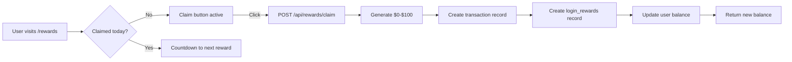
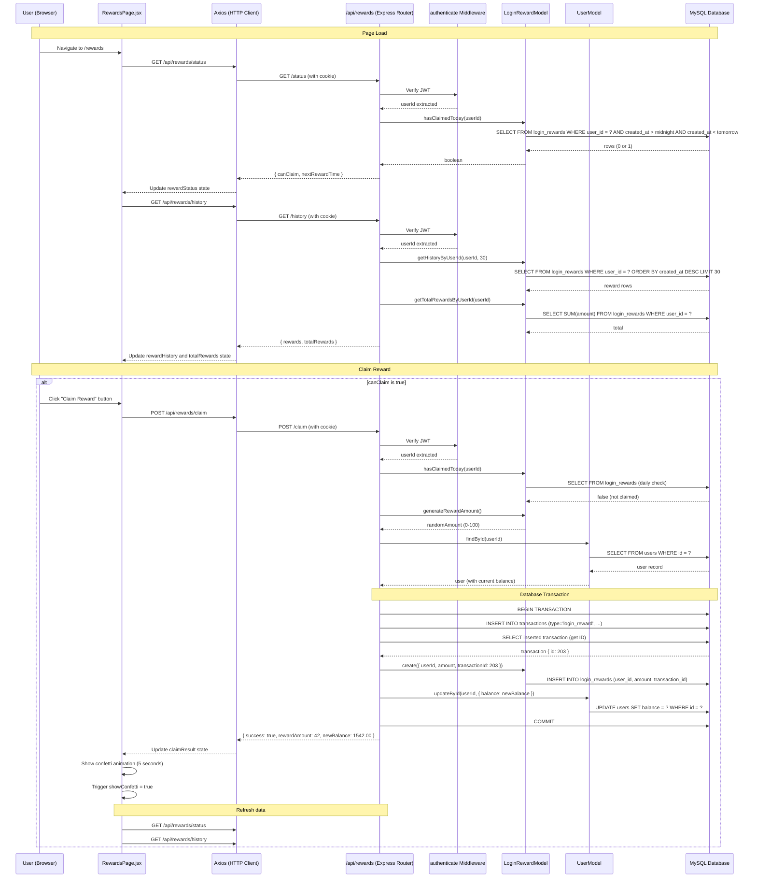

# Login Rewards System

The login rewards system gives authenticated users the opportunity to claim a random cash bonus once every 24 hours. The feature encourages daily engagement and is accessible from the `/rewards` page.

---

## Overview



---

## Reward Rules

| Rule | Value |
|------|-------|
| Frequency | Once per calendar day (midnight reset, server time) |
| Reward range | $0 -- $100 (integer, inclusive) |
| Distribution | Uniform random (`Math.floor(Math.random() * 101)`) |
| Expected value | $50 per day |
| Requires authentication | Yes (JWT via `authenticate` middleware) |
| Available to | All authenticated users regardless of role |
| Balance impact | Added directly to `users.balance` |
| Transaction type | `login_reward` |
| Atomicity | Entire claim operation runs inside a database transaction |

---

## Reward Calculation Logic

The reward amount is generated by `LoginRewardModel.generateRewardAmount()`:

```ts
static generateRewardAmount(): number {
  return Math.floor(Math.random() * 101); // 0-100 inclusive
}
```

This produces a uniform distribution of integers from 0 to 100. Key properties:

- **Minimum reward:** $0
- **Maximum reward:** $100
- **Expected value:** $50.00 per claim
- **Probability of any specific amount:** 1/101 (~0.99%)
- **No streak bonuses or multipliers** -- each claim is independent
- **No weighting by user level, balance, or activity**

The generation happens server-side in the `/claim` route handler, after the eligibility check passes but before any database writes.

---

## Eligibility Rules (Once Per Day)

A user can claim a reward only if they have not already claimed one today. The eligibility check uses a midnight-to-midnight window based on the server's local timezone.

### How the check works

`LoginRewardModel.hasClaimedToday(userId)` computes:

```ts
const today = new Date();
today.setHours(0, 0, 0, 0);         // Midnight today (start of day)
const tomorrow = new Date(today);
tomorrow.setDate(tomorrow.getDate() + 1); // Midnight tomorrow (start of next day)
```

Then queries:

```sql
SELECT * FROM login_rewards
WHERE user_id = ?
  AND created_at > today_midnight
  AND created_at < tomorrow_midnight
LIMIT 1
```

Returns `true` if any record is found (i.e., the user has already claimed today).

### When the next reward becomes available

The `getNextRewardTime()` helper function calculates:

```ts
function getNextRewardTime(): Date {
  const now = new Date();
  const tomorrow = new Date(now);
  tomorrow.setDate(tomorrow.getDate() + 1);
  tomorrow.setHours(0, 0, 0, 0);
  return tomorrow;
}
```

This returns midnight of the following day. The client displays a countdown to this time.

### Edge cases

| Scenario | Behavior |
|----------|----------|
| User claims at 11:59 PM | Can claim again at 12:00 AM (1 minute later) |
| User claims at 12:01 AM | Cannot claim again until the next midnight |
| Server timezone differs from user timezone | Eligibility is based on **server time**, not client time. Users in different timezones may see the reset at different local times. |
| Reward amount is $0 | The claim is still recorded. A transaction and login_rewards record are created with amount = 0. Balance does not change. |
| Concurrent claim requests | The database transaction provides atomicity, but there is no explicit row-level lock on the eligibility check. A race condition is theoretically possible if two requests pass `hasClaimedToday()` simultaneously before either writes. |
| User account deleted | No cascade delete defined for login_rewards. Orphaned records may persist. |

---

## API Endpoints

All endpoints are prefixed with `/api/rewards` and require the `authenticate` middleware (JWT-based). The route handler is defined in `server/routes/login-rewards.ts`.

### GET /api/rewards/status

Check whether the current user can claim a reward today.

**Headers:**

| Header | Value |
|--------|-------|
| `Cookie` | Session cookie with JWT (sent automatically via `withCredentials: true`) |

**Response -- can claim (200):**

```json
{
  "canClaim": true,
  "nextRewardTime": null
}
```

**Response -- already claimed (200):**

```json
{
  "canClaim": false,
  "nextRewardTime": "2026-03-28T00:00:00.000Z"
}
```

**Response -- not authenticated (401):**

```json
{
  "error": "Authentication required"
}
```

**Response -- server error (500):**

```json
{
  "error": "Internal server error"
}
```

---

### POST /api/rewards/claim

Claim the daily reward. Fails if the user has already claimed today.

**Headers:**

| Header | Value |
|--------|-------|
| `Cookie` | Session cookie with JWT |

**Request body:** Empty (`{}`)

**Processing steps (within a database transaction):**

1. Extract `userId` from the authenticated request.
2. Call `LoginRewardModel.hasClaimedToday(userId)` -- if `true`, return 400 error.
3. Call `LoginRewardModel.generateRewardAmount()` to get a random integer 0--100.
4. Fetch the user record via `UserModel.findById(userId)` to get current balance.
5. Begin a Drizzle `db.transaction()` block:
   a. Insert a `transactions` record with:
      - `userId`: the claiming user
      - `type`: `'login_reward'`
      - `amount`: the generated reward (as string)
      - `balanceBefore`: current balance (as string)
      - `balanceAfter`: current balance + reward (as string)
      - `description`: `"Daily login reward: $XX.XX"`
      - `status`: `'completed'`
   b. Query back the inserted transaction to get its ID.
   c. Call `LoginRewardModel.create({ userId, amount: rewardAmount, transactionId: transaction.id })`.
   d. Call `UserModel.updateById(userId, { balance: balanceAfter.toString() })`.
6. Return success response.

If any step within the transaction fails, the entire operation is rolled back.

**Response -- success (200):**

```json
{
  "success": true,
  "rewardAmount": 42,
  "newBalance": 1542.00
}
```

**Response -- already claimed (400):**

```json
{
  "error": "Daily reward already claimed",
  "nextClaimTime": "2026-03-28T00:00:00.000Z"
}
```

**Response -- user not found (404):**

```json
{
  "error": "User not found"
}
```

**Response -- not authenticated (401):**

```json
{
  "error": "Authentication required"
}
```

**Response -- server error (500):**

```json
{
  "error": "Internal server error"
}
```

---

### GET /api/rewards/history

Retrieve the authenticated user's reward claim history.

**Headers:**

| Header | Value |
|--------|-------|
| `Cookie` | Session cookie with JWT |

**Query parameters:**

| Parameter | Type | Default | Description |
|-----------|------|---------|-------------|
| `limit` | number | 30 | Maximum number of reward records to return |

**Response -- success (200):**

```json
{
  "rewards": [
    {
      "id": 15,
      "userId": 1,
      "amount": "42.00",
      "transactionId": 203,
      "createdAt": "2026-03-27T14:23:00.000Z"
    },
    {
      "id": 14,
      "userId": 1,
      "amount": "78.00",
      "transactionId": 198,
      "createdAt": "2026-03-26T09:15:00.000Z"
    }
  ],
  "totalRewards": 1250.00
}
```

The `rewards` array is ordered by `createdAt` descending (most recent first). The `totalRewards` value is the lifetime sum of all rewards claimed by this user, computed via SQL `SUM()`.

**Response -- not authenticated (401):**

```json
{
  "error": "Authentication required"
}
```

---

## Database Flow

### Tables involved

| Table | Role in reward claim |
|-------|---------------------|
| `login_rewards` | Primary record of the claim (userId, amount, transactionId, createdAt) |
| `transactions` | Financial ledger entry of type `login_reward` with balance snapshots |
| `users` | Balance field is updated with the new total |

### Write order within the transaction

```
BEGIN TRANSACTION
  1. INSERT INTO transactions (userId, type, amount, balanceBefore, balanceAfter, description, status)
  2. SELECT the inserted transaction (to get its auto-increment ID)
  3. INSERT INTO login_rewards (userId, amount, transactionId)
  4. UPDATE users SET balance = ? WHERE id = ?
COMMIT
```

### login_rewards table schema

| Column | Type | Description |
|--------|------|-------------|
| `id` | int (PK, auto-increment) | Unique reward record ID |
| `userId` | int (FK -> users.id) | The user who claimed the reward |
| `amount` | decimal(10, 2) | Reward amount ($0--$100) |
| `transactionId` | int (FK -> transactions.id) | Associated transaction record |
| `createdAt` | timestamp (default: `NOW()`) | Claim timestamp (used for daily eligibility check) |

**Indexes:**

- `login_rewards_user_id_idx` on `userId` -- speeds up per-user queries and daily check
- `login_rewards_created_at_idx` on `createdAt` -- speeds up date-range queries

---

## Integration with Balance Service

The login rewards system interacts with the balance system in two ways:

### 1. Transaction record creation

A `transactions` row is created with:

- `type`: `'login_reward'` (a distinct type from game wins, deposits, etc.)
- `balanceBefore` and `balanceAfter`: snapshots for auditability
- `status`: always `'completed'` (no pending/processing states for rewards)

This transaction appears in the user's transaction history alongside game results and deposits.

### 2. Direct balance update

The user's `balance` field in the `users` table is updated directly via `UserModel.updateById()`. This is the authoritative balance used for gameplay.

Note: Unlike game wins/losses, the rewards system does **not** create a `balances` ledger entry (the `balances` table used by `BalanceModel`). The balance change is tracked only through the `transactions` record and the `login_rewards` record. This is a minor inconsistency with the game handler flow, which typically writes to both `transactions` and `balances`.

---

## Client Page Structure

**File:** `client/src/pages/RewardsPage.jsx`
**Route:** `/rewards`

### Component state

| State Variable | Type | Initial Value | Purpose |
|---------------|------|---------------|---------|
| `rewardStatus` | `{ canClaim: boolean, nextRewardTime: string \| null }` | `{ canClaim: false, nextRewardTime: null }` | Current eligibility from `GET /status` |
| `isLoading` | `boolean` | `true` | Loading spinner control |
| `error` | `string \| null` | `null` | Error message display |
| `claimResult` | `{ success: boolean, rewardAmount?: number, newBalance?: number, error?: string } \| null` | `null` | Result of the most recent claim attempt |
| `rewardHistory` | `array` | `[]` | Array of past reward records from `GET /history` |
| `totalRewards` | `number` | `0` | Lifetime reward sum |
| `showConfetti` | `boolean` | `false` | Controls confetti animation (5-second auto-dismiss) |

### Page layout

The page renders differently depending on authentication state:

#### Unauthenticated view

A centered card prompting the user to log in or register:

- Title: "Daily Rewards"
- Description: "Log in to claim your daily reward and earn up to $100 every day!"
- Two buttons: "Login" (links to `/login`) and "Register" (links to `/register`)

#### Authenticated view

A two-column grid layout (3-column grid on large screens):

**Left column (spans 2 columns on large screens) -- Daily Reward Card:**

- Title: "Daily Login Reward"
- If reward is available (`canClaim: true`):
  - Message: "You have a daily reward waiting!"
  - Sub-message: "Win between $0 and $100"
  - "Claim Reward" button (disabled while loading)
- If reward already claimed (`canClaim: false`):
  - Message: "You've already claimed your daily reward"
  - Countdown: "Next reward available in: X hours, Y minutes"
- After successful claim:
  - Green result card with "Congratulations!" message
  - Reward amount displayed prominently
  - New balance shown
  - Confetti animation overlay (5-second duration, placeholder implementation)
- After failed claim:
  - Red result card with error message

**Right column -- Reward History Card:**

- Title: "Reward History"
- Total rewards earned display (prominently styled)
- Table with columns: Date, Amount
- Empty state message: "No rewards claimed yet"
- Footer note: "Rewards can be claimed once every 24 hours"

### API calls

| Trigger | Endpoint | Method |
|---------|----------|--------|
| Page load (if authenticated) | `/api/rewards/status` | GET |
| Page load (if authenticated) | `/api/rewards/history` | GET |
| "Claim Reward" button click | `/api/rewards/claim` | POST |
| After successful claim | `/api/rewards/status` (refresh) | GET |
| After successful claim | `/api/rewards/history` (refresh) | GET |

All API calls use `axios` with `withCredentials: true` for cookie-based authentication. The base URL is configured via `VITE_API_URL` environment variable (defaults to `http://localhost:5000`).

### Countdown timer

The `getTimeUntilNextReward()` function calculates the remaining time:

```js
const getTimeUntilNextReward = () => {
  if (!rewardStatus.nextRewardTime) return null;
  const nextReward = new Date(rewardStatus.nextRewardTime);
  const now = new Date();
  const diffMs = nextReward - now;
  if (diffMs <= 0) return "Available now";
  const diffHrs = Math.floor(diffMs / (1000 * 60 * 60));
  const diffMins = Math.floor((diffMs % (1000 * 60 * 60)) / (1000 * 60));
  return `${diffHrs} hours, ${diffMins} minutes`;
};
```

Note: This is computed once on render and does not auto-update (no `setInterval`). The countdown only refreshes when the page re-renders.

---

## Sequence Diagram



---

## LoginRewardModel Reference

**File:** `server/drizzle/models/LoginReward.ts`

This model is the only one in the codebase with full TypeScript type annotations.

| Method | Signature | Description |
|--------|-----------|-------------|
| `create` | `(data: { userId: number, amount: number \| string, transactionId?: number }) -> Promise<LoginReward>` | Insert a new reward record. Validates that `userId` and `amount` are provided. Converts numeric amount to string. |
| `hasClaimedToday` | `(userId: number) -> Promise<boolean>` | Check if user has a reward record with `createdAt` between today's midnight and tomorrow's midnight. |
| `getHistoryByUserId` | `(userId: number, limit?: number) -> Promise<LoginReward[]>` | Get reward history ordered by `createdAt` descending (default limit: 30). |
| `getTotalRewardsByUserId` | `(userId: number) -> Promise<number>` | Sum of all rewards claimed by the user via SQL `SUM()`. Returns 0 if none. |
| `getTotalRewardsToday` | `() -> Promise<number>` | Sum of all rewards claimed today across all users. Useful for admin dashboards. |
| `generateRewardAmount` | `() -> number` | Static utility: returns `Math.floor(Math.random() * 101)` (integer 0--100, inclusive). |

---

## Key Files

| File | Purpose |
|------|---------|
| `server/routes/login-rewards.ts` | Express route handlers for the three reward endpoints |
| `server/drizzle/models/LoginReward.ts` | LoginReward data model with eligibility check and reward generation |
| `server/drizzle/models/User.ts` | UserModel used to read/update user balance |
| `server/drizzle/schema.ts` | `loginRewards` table and relation definitions |
| `server/middleware/auth.ts` | `authenticate` middleware for JWT verification |
| `client/src/pages/RewardsPage.jsx` | React component for the rewards UI |
| `client/src/contexts/AuthContext.jsx` | Provides `isAuthenticated` and `user` to RewardsPage |
| `client/src/services/api.js` | API service (imported but not used directly; axios is used instead) |

---

## Related Documents

- [Authentication](./authentication.md) -- Auth middleware and JWT flow required for all reward endpoints
- [Balance System](./balance-system.md) -- How transaction types and balance updates work across the platform
- [Admin Panel](./admin-panel.md) -- Admin visibility into reward transactions and daily totals
- [Data Models](../09-database/data-models.md) -- Complete reference for all model methods including LoginRewardModel
- [Database Schema](../09-database/schema.md) -- Table definitions, column types, indexes, and foreign keys for `login_rewards` and `transactions`
