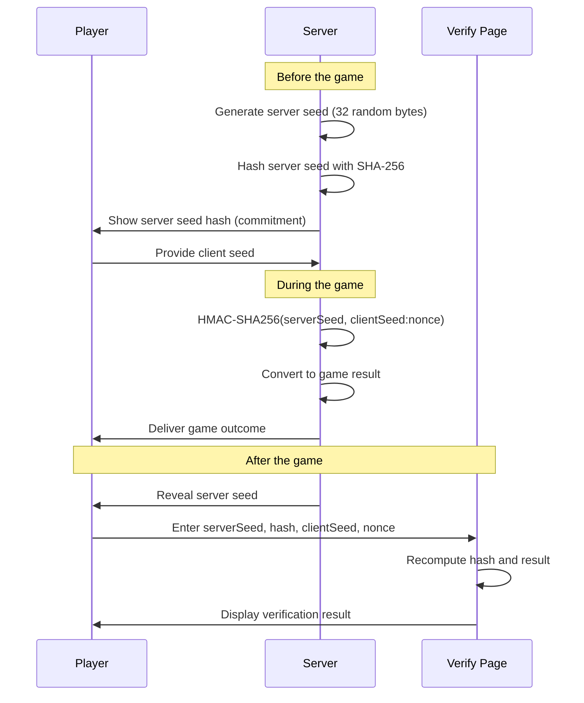
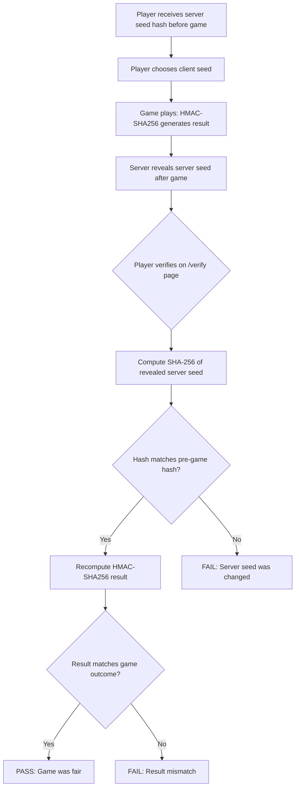
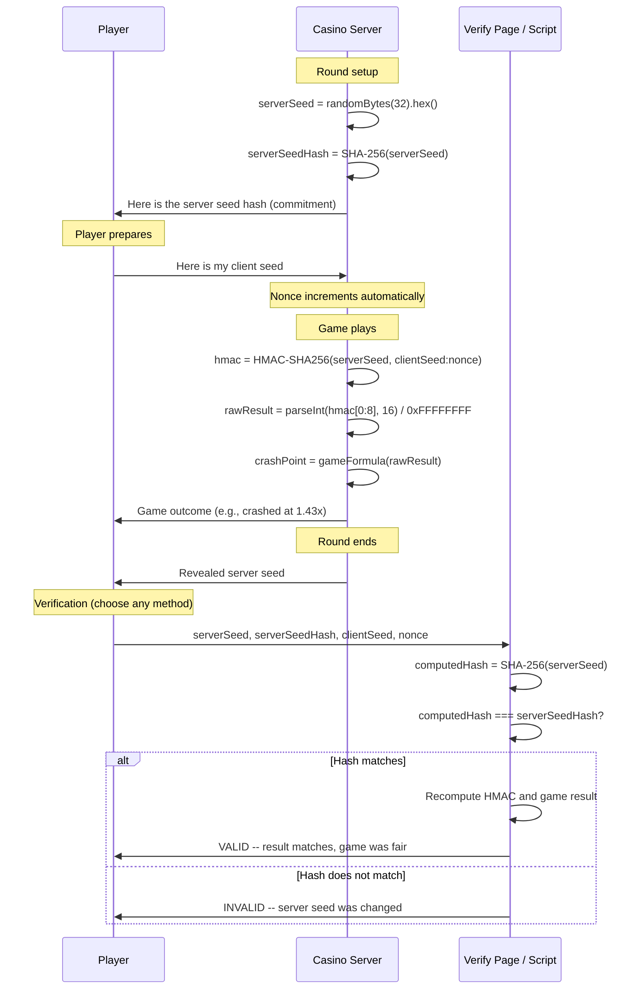

# Provably Fair System

The provably fair system provides cryptographic verification that game outcomes in Platinum Casino are determined fairly and have not been tampered with. It uses HMAC-SHA256 to combine a server-generated seed with a player-chosen client seed, producing a verifiable result that neither party can manipulate after commitment.

---

## Overview



The key guarantee is that the server commits to its seed (by showing the hash) **before** the player provides their client seed. Once committed, the server cannot change its seed without the hash mismatching. The player's client seed ensures the server alone cannot predetermine the outcome.

---

## How It Works

### 1. Seed Generation (Pre-Game)

The server generates a cryptographically random seed using Node.js `crypto.randomBytes(32)`, producing a 64-character hexadecimal string. The SHA-256 hash of this seed is shown to the player before the game begins. This hash acts as a commitment -- proof that the server seed was chosen before the player's input.

### 2. Client Seed (Player Input)

The player provides their own seed (any string). Players can use the `/api/verify/generate-client-seed` endpoint to generate a random 16-character hex seed, or they can type any string they choose.

### 3. Result Generation (During Game)

The game result is computed using HMAC-SHA256:

1. The **server seed** is the HMAC key.
2. The **message** is `clientSeed:nonce` (where nonce is the round number, incrementing each game).
3. The first 8 hexadecimal characters (32 bits) of the HMAC digest are taken.
4. This 32-bit value is divided by `0xFFFFFFFF` to produce a float between 0 and 1.

This float is then mapped to a game-specific outcome.

### 4. Post-Game Verification

After the game, the server reveals the original server seed. The player can then independently:

1. Hash the revealed server seed with SHA-256 and confirm it matches the hash shown before the game.
2. Recompute the HMAC-SHA256 result using the same seeds and nonce.
3. Verify that the computed result matches the game outcome they experienced.

---

## ProvablyFairService

**File:** `server/src/services/provablyFairService.ts`

The service is implemented as a class with static methods. No instantiation is required.

### Methods

#### `generateServerSeed(): string`

Generates a new server seed using 32 cryptographically random bytes.

```ts
static generateServerSeed(): string {
  return crypto.randomBytes(32).toString('hex');
}
```

- **Output:** 64-character hexadecimal string
- **Entropy:** 256 bits (cryptographically secure)

---

#### `hashServerSeed(serverSeed: string): string`

Produces the SHA-256 hash of a server seed. This hash is shown to the player **before** the game as a commitment.

```ts
static hashServerSeed(serverSeed: string): string {
  return crypto.createHash('sha256').update(serverSeed).digest('hex');
}
```

- **Output:** 64-character hexadecimal SHA-256 hash

---

#### `generateResult(serverSeed: string, clientSeed: string, nonce: number): number`

Computes a fair result between 0 and 1 from the combined seeds and nonce.

```ts
static generateResult(serverSeed: string, clientSeed: string, nonce: number): number {
  const hmac = crypto.createHmac('sha256', serverSeed);
  hmac.update(`${clientSeed}:${nonce}`);
  const hex = hmac.digest('hex');
  const intValue = parseInt(hex.substring(0, 8), 16);
  return intValue / 0xFFFFFFFF;
}
```

**Steps:**
1. Create HMAC-SHA256 with `serverSeed` as the key.
2. Feed `clientSeed:nonce` as the message.
3. Take the first 8 hex characters (32 bits) of the digest.
4. Parse as an unsigned integer and divide by `0xFFFFFFFF` (4,294,967,295).

- **Output:** Float in the range [0, 1]
- **Precision:** ~32 bits of randomness

---

#### `generateCrashPoint(serverSeed: string, clientSeed: string, nonce: number): number`

Converts a fair result into a Crash game multiplier with a 1% house edge.

```ts
static generateCrashPoint(serverSeed: string, clientSeed: string, nonce: number): number {
  const result = this.generateResult(serverSeed, clientSeed, nonce);
  const houseEdge = 0.01;
  if (result < houseEdge) return 1.00;
  const crashPoint = Math.floor((1 / (1 - result)) * 100) / 100;
  return Math.max(1.00, crashPoint);
}
```

**Formula:**
- If `result < 0.01` (1% of the time): crash point is `1.00x` (instant crash, house wins).
- Otherwise: `crashPoint = floor((1 / (1 - result)) * 100) / 100`

**Properties:**
- Minimum crash point: `1.00x`
- House edge: 1% (the probability of an instant crash at 1.00x)
- Distribution: Higher multipliers are exponentially less likely
- The floor operation ensures the crash point is always rounded down to 2 decimal places

**Example mappings:**

| Raw Result | Crash Point |
|-----------|-------------|
| 0.005 | 1.00x (instant crash) |
| 0.50 | 2.00x |
| 0.75 | 4.00x |
| 0.90 | 10.00x |
| 0.99 | 100.00x |
| 0.999 | 1000.00x |

---

#### `generateRouletteNumber(serverSeed: string, clientSeed: string, nonce: number): number`

Converts a fair result into a European roulette number (0--36).

```ts
static generateRouletteNumber(serverSeed: string, clientSeed: string, nonce: number): number {
  const result = this.generateResult(serverSeed, clientSeed, nonce);
  return Math.floor(result * 37);
}
```

- **Output:** Integer in the range [0, 36]
- **Distribution:** Approximately uniform across all 37 numbers
- **House edge:** Inherent to roulette rules (2.7% for European roulette)

---

#### `verifyResult(serverSeed, serverSeedHash, clientSeed, nonce): VerifyResult`

Recomputes the hash and result for verification purposes.

```ts
static verifyResult(
  serverSeed: string,
  serverSeedHash: string,
  clientSeed: string,
  nonce: number
): { valid: boolean; result: number; serverSeedHashMatch: boolean } {
  const computedHash = this.hashServerSeed(serverSeed);
  const serverSeedHashMatch = computedHash === serverSeedHash;
  const result = this.generateResult(serverSeed, clientSeed, nonce);
  return { valid: serverSeedHashMatch, result, serverSeedHashMatch };
}
```

**Steps:**
1. Recompute the SHA-256 hash of the provided `serverSeed`.
2. Compare the computed hash against the `serverSeedHash` that was shown before the game.
3. Recompute the HMAC-SHA256 result.
4. Return whether the hashes match (`valid`) and the raw result.

---

## Verification Flow Diagram



---

## API Endpoints

The verification system exposes two public endpoints (no authentication required):

| Method | Endpoint | Description |
|--------|----------|-------------|
| POST | `/api/verify` | Verify a game result given seeds and nonce |
| GET | `/api/verify/generate-client-seed` | Generate a random 16-char hex client seed |

For full endpoint documentation, see [REST API Reference](../04-api/rest-api.md#verification-endpoints-apiverify).

---

## Client Page

**File:** `client/src/pages/VerifyPage.jsx`
**Route:** `/verify`

The verification page provides a user-facing form where players can paste their game seeds and verify results.

### Page Layout

The page uses a two-panel layout:

**Left panel (2/3 width on large screens) -- Verification Form:**
- Server Seed input (monospace font)
- Server Seed Hash input (monospace font)
- Client Seed input with "Generate" button (calls `/api/verify/generate-client-seed`)
- Nonce input (number)
- Game Type dropdown (Crash, Roulette, Generic)
- "Verify Result" submit button

**Right panel (1/3 width) -- How It Works:**
- Four numbered steps explaining the provably fair flow
- Info box explaining that the system ensures neither house nor player can manipulate outcomes

**Results section (below form, shown after verification):**
- Hash match status with green checkmark (match) or red X (mismatch)
- Raw result (10 decimal places)
- Crash point (if game type is Crash)
- Roulette number (if game type is Roulette)
- Overall validity badge (VALID / INVALID)

### Component State

| State Variable | Type | Purpose |
|---------------|------|---------|
| `serverSeed` | `string` | Server seed input value |
| `serverSeedHash` | `string` | Server seed hash input value |
| `clientSeed` | `string` | Client seed input value |
| `nonce` | `string` | Nonce input value |
| `gameType` | `string` | Selected game type (`"crash"`, `"roulette"`, `"generic"`) |
| `result` | `object \| null` | Verification result from API |
| `isLoading` | `boolean` | Loading state during verification |
| `error` | `string \| null` | Error message display |

---

## Security Properties

| Property | Guarantee |
|----------|-----------|
| **Commitment** | Server seed hash is shown before the game, preventing post-hoc manipulation |
| **Player influence** | Client seed ensures the server cannot predetermine outcomes alone |
| **Verifiability** | Any party can independently verify results using standard HMAC-SHA256 |
| **Non-repudiation** | The hash commitment prevents the server from claiming a different seed was used |
| **Determinism** | Same inputs always produce the same output (no additional hidden entropy) |

---

## Limitations

- The nonce must increment sequentially for each game round with the same seed pair. If the nonce is reused, the same result will be produced.
- The client seed is chosen by the player, but the server must ensure it is submitted before the game result is computed. The current Socket.IO event flow handles this.
- The `Math.floor` rounding in crash point calculation means the actual payout may be slightly less than the theoretical value.
- The system does not currently rotate server seeds automatically -- seed rotation depends on the game handler implementation.

---

## Key Files

| File | Purpose |
|------|---------|
| `server/src/services/provablyFairService.ts` | Core cryptographic service with all seed/result methods |
| `server/routes/verify.ts` | Express routes for verification and client seed generation |
| `client/src/pages/VerifyPage.jsx` | React verification form and result display |

---

## User Verification Guide

This section is written for players who want to verify that a game result was fair. No programming knowledge is required for the first two methods; the third method is for users who want to verify independently using their own code.

---

### Glossary: What Each Field Means

Before you begin, make sure you understand what each piece of data represents:

| Field | What It Is | Who Creates It | When You See It |
|-------|-----------|----------------|-----------------|
| **Server Seed** | A secret random string (64 hex characters) generated by the casino's server. This is the server's contribution to the game outcome. | Server | Revealed **after** the game ends. You cannot see it during the game. |
| **Server Seed Hash** | The SHA-256 fingerprint of the server seed. Because SHA-256 is a one-way function, seeing the hash tells you nothing about the seed itself, but after the seed is revealed you can confirm the hash matches. | Server | Shown to you **before** the game begins (this is the commitment). |
| **Client Seed** | A string you choose (or have generated for you). This is your contribution to the game outcome. The server cannot know it in advance if you pick it yourself. | You (the player) | You set it before each game or seed rotation. |
| **Nonce** | A counter that increments by 1 for every round played with the same server seed and client seed pair. It prevents the same result from repeating. | Automatic | Starts at 0 (or 1) and goes up each round. Displayed in your game history. |
| **Raw Result** | A decimal number between 0 and 1 produced by the HMAC-SHA256 calculation. This is the "dice roll" that determines the game outcome. | Computed | Shown on the verification page after you verify. |
| **Result Hash (HMAC digest)** | The full 64-character hex output of `HMAC-SHA256(serverSeed, clientSeed:nonce)`. The first 8 characters are converted to the raw result. | Computed | You can compute this yourself to cross-check. |

---

### Method 1: Verify Using the Verification Page (Easiest)

This is the simplest way to check a game result. No tools or code required.

**Step 1 -- Collect your game data.** After a game round ends, the server reveals the server seed. You need four pieces of information from your game history:

- Server Seed (revealed after the game)
- Server Seed Hash (shown before the game started)
- Client Seed (the seed you were using)
- Nonce (the round number)

**Step 2 -- Open the verification page.** Navigate to `/verify` in Platinum Casino, or click the "Provably Fair" link in the site footer.

**Step 3 -- Fill in the form.**

- Paste the **Server Seed** into the first field.
- Paste the **Server Seed Hash** into the second field.
- Paste your **Client Seed** into the third field. (Do not click "Generate" -- that creates a new random seed. Use the seed you actually played with.)
- Enter the **Nonce** (round number).
- Select the **Game Type** from the dropdown:
  - **Crash** -- shows the crash multiplier
  - **Roulette** -- shows the roulette number (0--36)
  - **Generic** -- shows only the raw result (0--1)

**Step 4 -- Click "Verify Result."**

**Step 5 -- Read the results.** The page displays:

- A green checkmark and "Hash Verified - Game is Fair" if the server seed hashes to the value you were shown before the game. This confirms the server did not change its seed after seeing your input.
- A red X and "Hash Mismatch - Verification Failed" if the hash does not match. This would indicate the server seed was different from the one committed -- contact support if this ever happens.
- The **Raw Result** (the 0--1 decimal value derived from the HMAC).
- The **Crash Point** (if you selected Crash) or **Roulette Number** (if you selected Roulette).
- An overall **VALID** or **INVALID** badge.

Compare the crash point or roulette number shown on the verification page against the outcome you experienced in the game. They should match exactly.

---

### Method 2: Verify Using the API Directly

If you prefer not to use the web UI, you can call the verification API endpoint directly with any HTTP client (curl, Postman, etc.). No authentication is required.

**Endpoint:** `POST /api/verify`

**Request body (JSON):**

```json
{
  "serverSeed": "your_server_seed_here",
  "serverSeedHash": "the_hash_shown_before_the_game",
  "clientSeed": "your_client_seed",
  "nonce": 42,
  "gameType": "crash"
}
```

- `gameType` accepts `"crash"`, `"roulette"`, or omit it for just the raw result.

**Example with curl:**

```bash
curl -X POST https://your-casino-domain.com/api/verify \
  -H "Content-Type: application/json" \
  -d '{
    "serverSeed": "a1b2c3d4e5f6a1b2c3d4e5f6a1b2c3d4e5f6a1b2c3d4e5f6a1b2c3d4e5f6a1b2",
    "serverSeedHash": "e3b0c44298fc1c149afbf4c8996fb92427ae41e4649b934ca495991b7852b855",
    "clientSeed": "my_custom_seed",
    "nonce": 1,
    "gameType": "crash"
  }'
```

**Response (JSON):**

```json
{
  "valid": true,
  "serverSeedHashMatch": true,
  "rawResult": 0.7364829951,
  "crashPoint": 3.79
}
```

- `valid` / `serverSeedHashMatch` -- `true` if the SHA-256 of the provided server seed matches the provided hash.
- `rawResult` -- the float between 0 and 1.
- `crashPoint` or `number` -- the game-specific outcome (only present when `gameType` is specified).

**Generating a random client seed via the API:**

```bash
curl https://your-casino-domain.com/api/verify/generate-client-seed
```

Returns: `{ "clientSeed": "a3f9c1e8b7d24a06" }` (16 random hex characters).

---

### Method 3: Verify Independently with Your Own Code

This is the strongest form of verification because you do not rely on the casino's server or website at all. You run the exact same algorithm on your own machine.

**JavaScript / Node.js example:**

```javascript
const crypto = require('crypto');

// ------- YOUR GAME DATA (replace with your actual values) -------
const serverSeed = 'a1b2c3d4e5f6a1b2c3d4e5f6a1b2c3d4e5f6a1b2c3d4e5f6a1b2c3d4e5f6a1b2';
const serverSeedHash = 'e3b0c44298fc1c149afbf4c8996fb92427ae41e4649b934ca495991b7852b855'; // the hash you were shown before the game
const clientSeed = 'my_custom_seed';
const nonce = 1;
// -----------------------------------------------------------------

// Step 1: Verify the server seed hash commitment
const computedHash = crypto.createHash('sha256').update(serverSeed).digest('hex');
const hashMatch = computedHash === serverSeedHash;
console.log('Server Seed Hash Match:', hashMatch);
console.log('  Expected hash: ', serverSeedHash);
console.log('  Computed hash: ', computedHash);

if (!hashMatch) {
  console.log('WARNING: The server seed does not match the committed hash!');
}

// Step 2: Compute the raw result using HMAC-SHA256
const hmac = crypto.createHmac('sha256', serverSeed);
hmac.update(`${clientSeed}:${nonce}`);
const hex = hmac.digest('hex');
const intValue = parseInt(hex.substring(0, 8), 16);
const rawResult = intValue / 0xFFFFFFFF;
console.log('\nHMAC hex digest:', hex);
console.log('First 8 hex chars:', hex.substring(0, 8));
console.log('Integer value:', intValue);
console.log('Raw result (0-1):', rawResult);

// Step 3: Convert to a crash point (1% house edge)
function toCrashPoint(result) {
  const houseEdge = 0.01;
  if (result < houseEdge) return 1.00;
  const crashPoint = Math.floor((1 / (1 - result)) * 100) / 100;
  return Math.max(1.00, crashPoint);
}

console.log('\nCrash Point:', toCrashPoint(rawResult).toFixed(2) + 'x');

// Step 4: Convert to a roulette number (0-36)
const rouletteNumber = Math.floor(rawResult * 37);
console.log('Roulette Number:', rouletteNumber);
```

**How to run this:**

1. Save the code above as `verify.js`.
2. Replace the four values at the top with your actual game data.
3. Run it: `node verify.js`
4. Compare the output against what the game showed you.

**Python equivalent (using the standard library):**

```python
import hmac
import hashlib

server_seed = 'a1b2c3d4e5f6a1b2c3d4e5f6a1b2c3d4e5f6a1b2c3d4e5f6a1b2c3d4e5f6a1b2'
server_seed_hash = 'e3b0c44298fc1c149afbf4c8996fb92427ae41e4649b934ca495991b7852b855'
client_seed = 'my_custom_seed'
nonce = 1

# Verify hash commitment
computed_hash = hashlib.sha256(server_seed.encode()).hexdigest()
print(f'Hash match: {computed_hash == server_seed_hash}')

# Compute raw result
message = f'{client_seed}:{nonce}'
digest = hmac.new(server_seed.encode(), message.encode(), hashlib.sha256).hexdigest()
int_value = int(digest[:8], 16)
raw_result = int_value / 0xFFFFFFFF
print(f'Raw result: {raw_result}')

# Crash point
import math
if raw_result < 0.01:
    crash_point = 1.00
else:
    crash_point = math.floor((1 / (1 - raw_result)) * 100) / 100
    crash_point = max(1.00, crash_point)
print(f'Crash point: {crash_point:.2f}x')
```

---

### Worked Example: Crash Game Verification

This is a complete worked example using concrete values so you can follow along and reproduce every step.

**Given inputs:**

| Field | Value |
|-------|-------|
| Server Seed | `7f4e2a9c1b3d5e8f0a2c4d6e8f1a3b5c7d9e0f2a4b6c8d0e2f4a6b8c0d2e4f` |
| Server Seed Hash | `0d17e7ced802836fe459e769c7c18361e95392a4ccdbd7e774027156989a70af` |
| Client Seed | `player_seed_abc` |
| Nonce | `5` |

**Step 1 -- Compute the server seed hash (SHA-256).**

```
SHA-256("7f4e2a9c1b3d5e8f0a2c4d6e8f1a3b5c7d9e0f2a4b6c8d0e2f4a6b8c0d2e4f")
= 0d17e7ced802836fe459e769c7c18361e95392a4ccdbd7e774027156989a70af
```

Before the game, you would have been shown this hash: `0d17e7ced802836fe459e769c7c18361e95392a4ccdbd7e774027156989a70af`. After the game, the server reveals the actual seed `7f4e2a9c...`. You hash it yourself and confirm the two match. If they match, the server did not change its seed.

**Step 2 -- Compute the HMAC-SHA256.**

```
HMAC-SHA256(
  key:     "7f4e2a9c1b3d5e8f0a2c4d6e8f1a3b5c7d9e0f2a4b6c8d0e2f4a6b8c0d2e4f",
  message: "player_seed_abc:5"
)
= 4d3584df9ac4e2486f792c0e510215e4da1c1a890fb3e558a9cde7107e5e9ecd
```

**Step 3 -- Extract the raw result.**

Take the first 8 hex characters of the digest (`4d3584df`). Parse them as a hexadecimal integer. Divide by `0xFFFFFFFF` (4,294,967,295).

```
First 8 hex chars: 4d3584df
Integer value = 0x4d3584df = 1,295,353,055
Raw result    = 1,295,353,055 / 4,294,967,295 = 0.30159788...
```

**Step 4 -- Convert to crash point.**

```
raw_result = 0.30159788 (which is >= 0.01, so no instant crash)
crashPoint = floor((1 / (1 - 0.30159788)) * 100) / 100
           = floor((1 / 0.69840212) * 100) / 100
           = floor(143.18...) / 100
           = 143 / 100
           = 1.43x
```

The crash game would have crashed at **1.43x**. You can verify this yourself by running the JavaScript or Python code from Method 3 above with these exact inputs:

```
serverSeed  = "7f4e2a9c1b3d5e8f0a2c4d6e8f1a3b5c7d9e0f2a4b6c8d0e2f4a6b8c0d2e4f"
clientSeed  = "player_seed_abc"
nonce       = 5
```

The output will be:
```
Server Seed Hash Match: true (0d17e7ce...)
HMAC hex digest:        4d3584df9ac4e2486f792c0e510215e4da1c1a890fb3e558a9cde7107e5e9ecd
Raw result:             0.30159788...
Crash Point:            1.43x
```

> **Tip:** You can reproduce these exact calculations on any machine with Node.js or Python installed. If you get the same crash point, the game was fair -- no trust in the casino required.

---

### Verification Flow (Sequence Diagram)

This diagram shows the full lifecycle from seed commitment through independent verification:



---

### Frequently Asked Questions

**Q: Can the casino cheat by changing the server seed after I place my bet?**

No. Before the game begins, the server shows you the SHA-256 hash of its seed. SHA-256 is a one-way function: it is computationally infeasible to find a different seed that produces the same hash. After the game, the server reveals the actual seed. If you hash the revealed seed and it matches the hash you were shown before the game, the server used the same seed throughout. The server cannot change the seed without the hash mismatching.

**Q: Can the casino predict my client seed and choose a server seed that produces a bad result?**

The server seed is committed (hashed and shown to you) before you provide your client seed. At the time the server chooses its seed, it does not know what client seed you will use. You can pick any string you want, type random characters, or use the "Generate" button. Because the server seed is locked in before your input, the casino cannot reverse-engineer a favorable outcome.

**Q: What if I do not trust the casino's verification page?**

You do not have to. The algorithm is fully documented on this page, and you can run it yourself using the JavaScript or Python code provided in the "Verify Independently with Your Own Code" section above. You only need standard cryptographic libraries that are built into every major programming language. The casino's verification page is a convenience -- the math works the same everywhere.

**Q: What if I do not trust my browser or computer?**

You can verify on a completely separate device. Copy your game data (server seed, hash, client seed, nonce) to another machine and run the verification script there. You can even use an online HMAC-SHA256 calculator (search for "HMAC SHA256 online") to compute the digest manually, then convert the first 8 hex characters to a decimal yourself.

**Q: Could the casino use a different algorithm server-side than what is documented here?**

The algorithm is published in the open-source codebase (`server/src/services/provablyFairService.ts`). If the casino used a different algorithm, the verification would fail: the result you compute from the revealed seeds would not match the outcome you experienced. That mismatch is the detection mechanism.

**Q: What does "instant crash" at 1.00x mean?**

In the Crash game, if the raw result falls below 0.01 (the 1% house edge), the crash point is set to 1.00x. This means the round crashes immediately and all bets lose. This happens approximately 1% of the time and is the mathematical house edge for the Crash game.

**Q: Why does the nonce matter? Can I reuse the same nonce?**

The nonce ensures that each round with the same server seed and client seed produces a different result. If the nonce were the same, the outcome would be identical. The nonce increments by 1 for every round, so round 1, 2, 3, etc. each produce a unique outcome even with the same seeds.

**Q: How do I find my game data (seeds and nonce) for a past game?**

After a game round ends, the server seed is revealed in your game history. The client seed is the one you set in your account settings or when you started the session. The nonce corresponds to the round number within that seed pair. Check your game history or bet history for the specific values.

**Q: What happens if verification fails?**

If the server seed hash does not match, it means the server seed shown to you after the game is different from the one that was committed before the game. This should never happen under normal operation. If it does, save all the data (server seed, hash, client seed, nonce, game outcome) and contact Platinum Casino support immediately.

---

## Related Documents

- [REST API Reference](../04-api/rest-api.md) -- Full endpoint documentation for `/api/verify`
- [Game Algorithms](./game-algorithms.md) -- How provably fair results feed into specific game mechanics
- [Games Overview](./games-overview.md) -- Architecture of each game and how seeds are managed per round
- [Security Overview](../07-security/security-overview.md) -- Broader security posture including cryptographic guarantees
