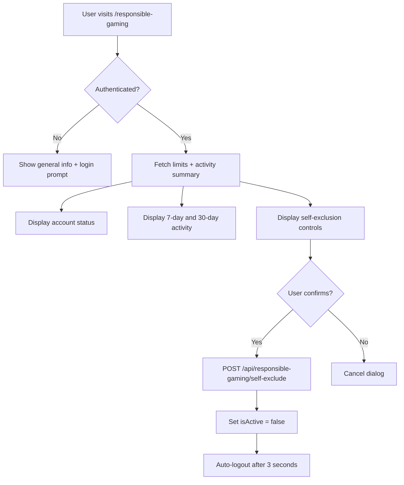
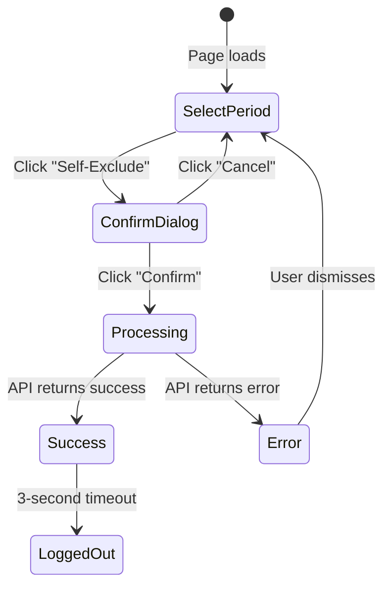

# Responsible Gaming

The responsible gaming system provides players with tools to monitor and control their gambling activity. It includes self-exclusion, activity summaries, and placeholder infrastructure for future deposit/loss limits.

---

## Overview



---

## Features

### Self-Exclusion

Self-exclusion allows a player to voluntarily disable their account for a specified period (1 to 365 days). During the exclusion period, the user cannot log in or place bets.

| Setting | Value |
|---------|-------|
| Minimum period | 1 day |
| Maximum period | 365 days |
| Default period | 1 day |
| Available options (UI) | 1 day, 3 days, 1 week, 2 weeks, 1 month, 3 months, 6 months, 1 year |
| Mechanism | Sets `users.isActive = false` |
| Login prevention | The `authenticate` middleware checks `isActive` and blocks disabled accounts |
| Reactivation | Contact support after the exclusion period (currently manual process) |

**How it works:**

1. User selects an exclusion period from the dropdown.
2. User clicks "Self-Exclude" and sees a confirmation dialog.
3. Upon confirmation, the client calls `POST /api/responsible-gaming/self-exclude`.
4. The server sets `isActive = false` and `updatedAt = now()` on the user record.
5. The server calculates a `reactivateAt` date (current time + days * 24 hours).
6. The server logs a `self_exclusion` system event.
7. The client displays a success message and automatically logs the user out after 3 seconds.

**Important:** The `reactivateAt` date is returned in the response for display purposes, but the current implementation does not automatically reactivate accounts. An admin must manually set `isActive = true` after the exclusion period ends.

---

### Activity Summaries

The activity summary provides an at-a-glance view of the player's recent gambling performance over two rolling time periods.

| Period | Data Source |
|--------|------------|
| Last 7 days | Transactions with `type IN ('game_win', 'game_loss')` and `created_at >= NOW() - 7 days` |
| Last 30 days | Transactions with `type IN ('game_win', 'game_loss')` and `created_at >= NOW() - 30 days` |

**Metrics per period:**

| Metric | Description | Calculation |
|--------|-------------|-------------|
| `totalGames` | Number of game transactions | `COUNT(*)` of matching transactions |
| `totalWins` | Total winnings | `SUM(amount)` where `type = 'game_win'` |
| `totalLosses` | Total losses | `SUM(amount)` where `type = 'game_loss'` |
| `netResult` | Net profit or loss | `totalWins - totalLosses` |

The summary is computed via raw SQL queries against the `transactions` table using `DATE_SUB(NOW(), INTERVAL N DAY)` for date filtering. Results are returned as numbers (parsed from MySQL decimal strings).

---

### Gaming Limits (Placeholder)

The response contract includes fields for future limit features that are not yet implemented:

| Field | Current Value | Planned Purpose |
|-------|---------------|-----------------|
| `dailyDepositLimit` | `null` | Maximum daily deposit amount |
| `dailyLossLimit` | `null` | Maximum daily loss before lockout |
| `sessionTimeLimit` | `null` | Maximum session duration in minutes |
| `cooldownUntil` | `null` | Cooldown period end timestamp |

These fields are returned by `GET /api/responsible-gaming/limits` so the frontend can bind to them now. When the database schema is extended with dedicated columns, the response will populate automatically without changing the API contract.

---

## API Endpoints

All responsible gaming endpoints are prefixed with `/api/responsible-gaming` and are defined in `server/routes/responsible-gaming.ts`.

| Method | Endpoint | Auth | Description |
|--------|----------|------|-------------|
| GET | `/api/responsible-gaming/limits` | Required | Get account status and limits |
| POST | `/api/responsible-gaming/self-exclude` | Required | Self-exclude for N days |
| GET | `/api/responsible-gaming/activity-summary` | Required | Get 7-day and 30-day activity |

For full request/response details, see [REST API Reference](../04-api/rest-api.md#responsible-gaming-endpoints-apiresponsible-gaming).

---

## Client Page

**File:** `client/src/pages/ResponsibleGamingPage.jsx`
**Route:** `/responsible-gaming`

### Page Behavior

The page renders differently based on authentication state:

#### Unauthenticated View

A single card explaining the responsible gaming tools with links to log in or register. The support resources section is always visible regardless of authentication.

#### Authenticated View

The page fetches data from two endpoints on mount:

```js
const [limitsData, activityData] = await Promise.all([
  api.get('/responsible-gaming/limits'),
  api.get('/responsible-gaming/activity-summary'),
]);
```

Both calls use `.catch(() => null)` to gracefully handle failures -- if either endpoint fails, the page still renders with whatever data is available.

### Page Sections

**1. Activity Summary** -- Two side-by-side cards showing last 7 days and last 30 days:
- Games Played
- Total Wins (green)
- Total Losses (red)
- Net Result (green if positive, red if negative)

**2. Self-Exclusion** -- Self-exclusion controls:
- Dropdown with period options (1 day through 1 year)
- "Self-Exclude" button that opens a confirmation dialog
- Confirmation dialog with warning text and Confirm/Cancel buttons
- Success/error result display

**3. Tips for Responsible Gaming** -- Seven bullet-point tips about responsible gambling habits.

**4. Support Resources** -- Links to external support organizations:
- National Council on Problem Gambling (1-800-522-4700)
- Gamblers Anonymous
- GamCare (0808 8020 133)
- BeGambleAware (0808 8020 133)

### Component State

| State Variable | Type | Initial Value | Purpose |
|---------------|------|---------------|---------|
| `limits` | `object \| null` | `null` | Response from `/limits` endpoint |
| `activitySummary` | `object \| null` | `null` | Response from `/activity-summary` endpoint |
| `isLoading` | `boolean` | `true` | Loading spinner control |
| `selfExcludeDays` | `number` | `1` | Selected exclusion period |
| `showConfirm` | `boolean` | `false` | Confirmation dialog visibility |
| `isExcluding` | `boolean` | `false` | Loading state during exclusion API call |
| `result` | `object \| null` | `null` | Self-exclusion result (success/error) |

### Self-Exclusion Flow



---

## Server Implementation

**File:** `server/routes/responsible-gaming.ts`

The route file uses the `@ts-nocheck` directive consistent with other route files in the project. All three endpoints use the `authenticate` middleware to extract the user ID from the session.

### Key implementation details

- **Limits endpoint:** Queries only `users.isActive` from the database. All limit fields are hardcoded to `null`. The `selfExcluded` field is derived as `!isActive`.
- **Self-exclusion endpoint:** Parses `days` from the request body with `parseInt`, validates it as 1--365, defaults to 1. Updates the user record directly (no dedicated self-exclusion table).
- **Activity summary endpoint:** Uses raw SQL via `db.execute(sql\`...\`)` because Drizzle ORM does not support the conditional aggregation pattern needed. The mysql2 driver returns `[rows, fields]` tuples, so the code handles both array and object results.

### Logging

All three endpoints log errors via `LoggingService.logSystemEvent()` with event names:
- `responsible_gaming_limits_error`
- `self_exclusion` (info level, on success)
- `self_exclusion_error`
- `activity_summary_error`

---

## Database Dependencies

The responsible gaming system uses existing tables -- no new tables are required:

| Table | Usage |
|-------|-------|
| `users` | Read `isActive` status; write `isActive = false` for self-exclusion |
| `transactions` | Read `game_win` and `game_loss` records for activity summaries |

---

## Key Files

| File | Purpose |
|------|---------|
| `server/routes/responsible-gaming.ts` | Express route handlers for all three endpoints |
| `client/src/pages/ResponsibleGamingPage.jsx` | React page with activity summary and self-exclusion UI |
| `server/middleware/auth.ts` | `authenticate` middleware that blocks `isActive = false` accounts |
| `server/src/services/loggingService.ts` | Winston-based logging used for error and event tracking |

---

## Related Documents

- [REST API Reference](../04-api/rest-api.md) -- Full endpoint documentation for `/api/responsible-gaming`
- [Authentication](./authentication.md) -- How the `authenticate` middleware blocks inactive accounts
- [Balance System](./balance-system.md) -- Transaction types used in activity summary calculations
- [Admin Panel](./admin-panel.md) -- Admin tools for managing user accounts (reactivation after self-exclusion)
