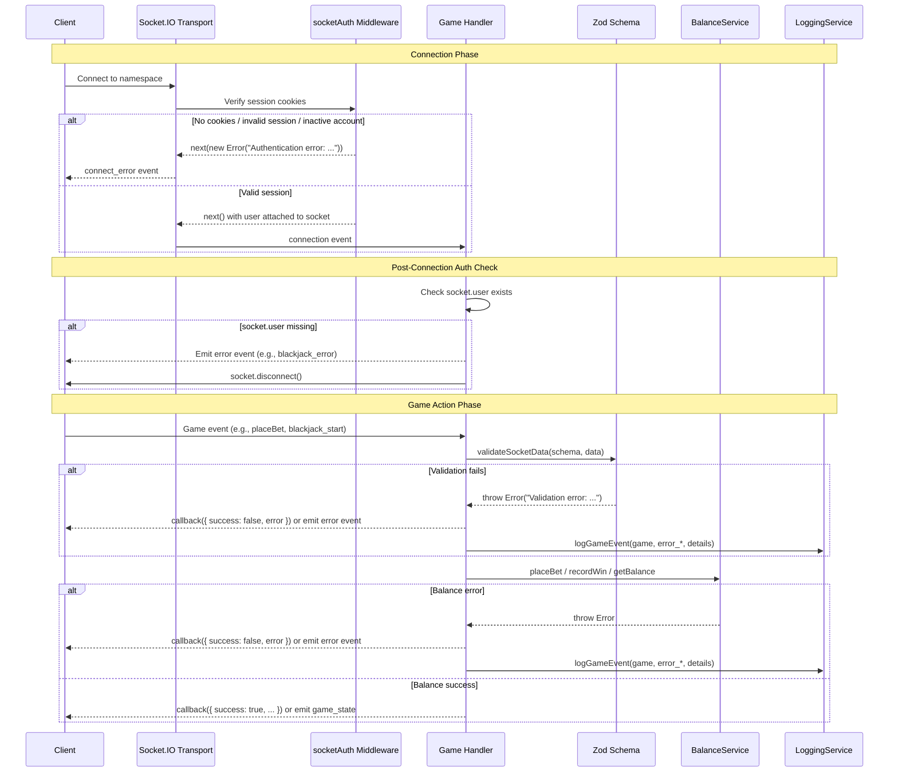

# Socket.IO Events Reference

Server URL: `http://localhost:5000`

The Platinum Casino uses Socket.IO for real-time game communication. Each game runs on its own Socket.IO **namespace**, providing isolated event handling and connection management.

---

## Connection and Authentication

All game namespaces require authentication. The server applies the `socketAuth` middleware to every namespace, which verifies the user's JWT before allowing the connection.

### Authentication Methods

**Method 1 -- Cookie-based (automatic)**

If the client has an `authToken` HTTP-only cookie set (from a prior REST login), Socket.IO will send it automatically via the `Cookie` header during the WebSocket handshake.

**Method 2 -- Handshake auth (manual)**

Pass the JWT token explicitly in the `auth` option:

```js
import { io } from 'socket.io-client';

const socket = io('http://localhost:5000/crash', {
  auth: {
    token: 'your-jwt-token-here'
  },
  withCredentials: true
});
```

Some namespaces also accept user metadata in the `auth` object:

```js
const socket = io('http://localhost:5000/roulette', {
  auth: {
    userId: 'user_1',
    username: 'player1',
    avatar: null
  },
  withCredentials: true
});
```

### Authentication Failure

If authentication fails, the server emits a connection error and disconnects the socket. The client receives an `Error` object with one of the following messages:

- `"Authentication error: No cookies provided"`
- `"Authentication error: No auth token"`
- `"Authentication error: User not found"`
- `"Authentication error: Account inactive"`
- `"Authentication error: Invalid token"`

### Connection Examples

**Crash game (dedicated namespace with cookie auth):**

```js
import { io } from 'socket.io-client';

const crashSocket = io('http://localhost:5000/crash', {
  transports: ['websocket'],
  withCredentials: true,
  reconnection: true,
  reconnectionAttempts: 5,
  reconnectionDelay: 1000,
  auth: {
    userId: user.id,
    username: user.username,
    avatar: user.avatar
  }
});

crashSocket.on('connect', () => {
  console.log('Connected to Crash game');
});

crashSocket.on('connect_error', (err) => {
  console.error('Connection failed:', err.message);
});
```

**Chat namespace (cookie auth with polling transport):**

```js
const chatSocket = io('http://localhost:5000/chat', {
  withCredentials: true,
  transports: ['polling'],
  reconnection: true,
  reconnectionAttempts: 5,
  reconnectionDelay: 1000,
  reconnectionDelayMax: 5000,
  timeout: 20000
});
```

---

## Namespaces

| Namespace | Game | Connection Pattern | Status |
|---|---|---|---|
| `/` | Main (lobby / live games) | Direct connection | Active |
| `/crash` | Crash | Dedicated namespace (namespace-level init) | Active |
| `/roulette` | Roulette | Dedicated namespace (per-connection init) | Active |
| `/blackjack` | Blackjack | Dedicated namespace (class-based per-connection) | Active |
| `/plinko` | Plinko | Dedicated namespace (per-connection init) | Active |
| `/wheel` | Wheel of Fortune | Dedicated namespace (per-connection init) | Active |
| `/landmines` | Landmines | Dedicated namespace (per-connection init) | Active |
| `/chat` | Global Chat | Dedicated namespace | Active |

---

## Main Namespace (`/`)

The default namespace handles lobby-level events such as joining game rooms and querying live game data.

### Client-to-Server Events

#### `joinGame`

Join a game room on the main namespace. Requires prior socket authentication.

| Field | Type | Required | Description |
|---|---|---|---|
| `gameType` | `string` | Yes | Game room to join (e.g., `"crash"`, `"roulette"`) |

**Emitted by client as:** `socket.emit('joinGame', gameType, callback)`

**Callback response (success):**

```json
{ "success": true }
```

**Callback response (failure):**

```json
{ "success": false, "error": "Authentication required to join games" }
```

If unauthenticated, the socket is disconnected after the error callback.

---

#### `get_live_games`

Request a list of currently active game sessions across all game types. No payload required.

**Emitted by client as:** `socket.emit('get_live_games')`

**When emitted:** Client wants to display live game lobby data (active players, recent sessions).

### Server-to-Client Events

#### `live_games`

Sent in response to `get_live_games`. Contains aggregated live session data for all game types.

```json
[
  {
    "id": "crash_placeholder",
    "type": "crash",
    "players": 3,
    "recentPlayers": ["player1", "player2", "player3"]
  },
  {
    "id": "roulette_placeholder",
    "type": "roulette",
    "players": 0,
    "recentPlayers": []
  }
]
```

| Field | Type | Description |
|---|---|---|
| `id` | `string` | Session ID or placeholder ID |
| `type` | `string` | Game type (`"crash"`, `"roulette"`, `"blackjack"`, `"plinko"`, `"wheel"`) |
| `players` | `number` | Number of active players |
| `recentPlayers` | `string[]` | Usernames of up to 3 recent players |

**When emitted:** In response to a `get_live_games` request. Always includes all five game types, even those with zero active sessions.

---

## Crash Namespace (`/crash`)

A multiplayer game where a shared multiplier increases over time until it "crashes." Players place bets and attempt to cash out before the crash. The game runs on a continuous cycle: waiting -> countdown (5s) -> flying -> crashed -> waiting (3s delay).

### Server-to-Client Events (sent automatically on connect)

#### `gameState`

Sent immediately upon connection. Current state of the game.

```json
{
  "isGameRunning": false,
  "isGameStarting": true,
  "currentMultiplier": 1.0,
  "timeUntilStart": 4.2
}
```

| Field | Type | Description |
|---|---|---|
| `isGameRunning` | `boolean` | Whether the multiplier is actively running |
| `isGameStarting` | `boolean` | Whether the countdown phase is active |
| `currentMultiplier` | `number` | Current multiplier value |
| `timeUntilStart` | `number\|null` | Seconds until the game starts (null if not in countdown) |

**When emitted:** Immediately when a client connects to the `/crash` namespace.

---

#### `gameHistory`

Last 10 game results, sent on connection.

```json
[
  {
    "gameId": "game_1711526400000",
    "crashPoint": 2.34,
    "timestamp": 1711526400000
  }
]
```

| Field | Type | Description |
|---|---|---|
| `gameId` | `string` | Unique game identifier |
| `crashPoint` | `number` | The multiplier at which the game crashed |
| `timestamp` | `number` | Unix timestamp in milliseconds |

**When emitted:** Immediately when a client connects to the `/crash` namespace.

---

#### `currentBets`

All active bets from all players in the current round, sent on connection.

```json
[
  {
    "userId": 1,
    "username": "player1",
    "avatar": null,
    "amount": 100,
    "autoCashoutAt": 2.5,
    "cashedOut": false,
    "cashedOutAt": null,
    "profit": 0
  }
]
```

| Field | Type | Description |
|---|---|---|
| `userId` | `number` | Player's user ID |
| `username` | `string` | Player's display name |
| `avatar` | `string\|null` | Player's avatar URL |
| `amount` | `number` | Bet amount |
| `autoCashoutAt` | `number\|null` | Auto-cashout multiplier target |
| `cashedOut` | `boolean` | Whether the player has cashed out |
| `cashedOutAt` | `number\|null` | Multiplier at which the player cashed out |
| `profit` | `number` | Profit earned (0 if not cashed out yet) |

**When emitted:** Immediately when a client connects to the `/crash` namespace.

---

#### `activePlayers`

List of all players currently connected to the crash game room.

```json
[
  {
    "id": 1,
    "username": "player1",
    "avatar": null,
    "joinedAt": 1711526400000
  }
]
```

| Field | Type | Description |
|---|---|---|
| `id` | `number` | Player's user ID |
| `username` | `string` | Player's display name |
| `avatar` | `string\|null` | Player's avatar URL |
| `joinedAt` | `number` | Unix timestamp when the player connected |

**When emitted:** Immediately when a client connects to the `/crash` namespace.

---

### Server-to-Client Events (game lifecycle)

#### `gameStarting`

A new round is about to begin. Players can place bets during the countdown.

```json
{
  "gameId": "game_1711526400000",
  "startingIn": 5
}
```

| Field | Type | Description |
|---|---|---|
| `gameId` | `string` | Unique identifier for this game round |
| `startingIn` | `number` | Seconds until the game starts |

**When emitted:** At the start of each new game cycle, broadcast to all connected clients.

---

#### `gameStarted`

The multiplier is now running. No more bets accepted.

```json
{
  "gameId": "game_1711526400000"
}
```

| Field | Type | Description |
|---|---|---|
| `gameId` | `string` | Unique identifier for this game round |

**When emitted:** After the countdown completes, broadcast to all connected clients.

---

#### `multiplierUpdate`

Sent every 100ms while the game is running. The multiplier grows exponentially using `e^(0.06 * elapsed_seconds)`.

```json
{
  "multiplier": 1.45
}
```

| Field | Type | Description |
|---|---|---|
| `multiplier` | `number` | Current multiplier value |

**When emitted:** Every 100ms tick during the `flying` phase, broadcast to all connected clients.

---

#### `gameCrashed`

The game has ended. The multiplier reached the crash point.

```json
{
  "crashPoint": 2.34,
  "nextGameIn": 3
}
```

| Field | Type | Description |
|---|---|---|
| `crashPoint` | `number` | The final crash multiplier |
| `nextGameIn` | `number` | Seconds until the next game starts |

**When emitted:** When the multiplier reaches or exceeds the crash point, broadcast to all connected clients.

---

#### `playerJoined`

Broadcast to all other clients when a new player connects.

```json
{
  "id": 1,
  "username": "player1",
  "avatar": null
}
```

| Field | Type | Description |
|---|---|---|
| `id` | `number` | Player's user ID |
| `username` | `string` | Player's display name |
| `avatar` | `string\|null` | Player's avatar URL |

**When emitted:** When a new player connects (broadcast to all except the joining player).

---

#### `playerLeft`

Broadcast when a player disconnects.

```json
{
  "id": 1,
  "username": "player1"
}
```

| Field | Type | Description |
|---|---|---|
| `id` | `number` | Player's user ID |
| `username` | `string` | Player's display name |

**When emitted:** When a player disconnects, broadcast to all remaining clients.

---

#### `playerBet`

Broadcast when any player places a bet.

```json
{
  "userId": 1,
  "username": "player1",
  "avatar": null,
  "amount": 100,
  "autoCashoutAt": 2.5
}
```

| Field | Type | Description |
|---|---|---|
| `userId` | `number` | Player's user ID |
| `username` | `string` | Player's display name |
| `avatar` | `string\|null` | Player's avatar URL |
| `amount` | `number` | Bet amount |
| `autoCashoutAt` | `number\|null` | Auto-cashout multiplier target |

**When emitted:** When a bet is successfully placed, broadcast to all connected clients (including the bettor).

---

#### `playerCashout`

Broadcast when any player cashes out (manual or automatic).

```json
{
  "userId": 1,
  "username": "player1",
  "avatar": null,
  "multiplier": 2.1,
  "profit": 110,
  "amount": 100,
  "automatic": true
}
```

| Field | Type | Description |
|---|---|---|
| `userId` | `number` | Player's user ID |
| `username` | `string` | Player's display name |
| `avatar` | `string\|null` | Player's avatar URL |
| `multiplier` | `number` | Multiplier at the time of cashout |
| `profit` | `number` | Profit earned |
| `amount` | `number` | Original bet amount |
| `automatic` | `boolean` | Present and `true` only for auto-cashouts |

**When emitted:** When a player cashes out (manually or via auto-cashout), broadcast to all connected clients.

---

#### `autoCashoutSuccess`

Sent only to the specific player who was auto-cashed-out.

```json
{
  "multiplier": 2.5,
  "winAmount": 250,
  "profit": 150
}
```

| Field | Type | Description |
|---|---|---|
| `multiplier` | `number` | Multiplier at the time of auto-cashout |
| `winAmount` | `number` | Total win amount (bet * multiplier) |
| `profit` | `number` | Profit earned (winAmount - bet) |

**When emitted:** Sent directly to the player whose auto-cashout threshold was reached.

---

#### `betLost`

Sent only to the specific player who lost their bet (did not cash out before crash).

```json
{
  "amount": 100,
  "gameId": "game_1711526400000"
}
```

| Field | Type | Description |
|---|---|---|
| `amount` | `number` | Amount lost |
| `gameId` | `string` | Game round identifier |

**When emitted:** After the game crashes, sent individually to each player who did not cash out.

---

### Client-to-Server Events

#### `placeBet`

Place a bet for the upcoming round. Only accepted while the game is in the `waiting` or `countdown` state.

**Payload:**

```json
{
  "amount": 100,
  "autoCashoutAt": 2.5
}
```

| Field | Type | Required | Description |
|---|---|---|---|
| `amount` | `number` | Yes | Bet amount (must be positive) |
| `autoCashoutAt` | `number` | No | Auto-cashout multiplier |

**Callback response (success):**

```json
{
  "success": true,
  "message": "Bet placed successfully"
}
```

**Callback response (error):**

```json
{
  "success": false,
  "error": "Insufficient balance"
}
```

Possible errors: `"Invalid bet amount"`, `"Cannot bet while game is running"`, `"You already have an active bet"`, `"Insufficient balance"`, `"Could not verify balance"`, `"Failed to place bet"`, `"Authentication required"`.

---

#### `cashOut`

Cash out during an active game. Only accepted while the game is in the `flying` state and the player has an active, uncashed-out bet.

**Payload:** None required (empty object is fine).

**Callback response (success):**

```json
{
  "success": true,
  "multiplier": 2.1,
  "winAmount": 210,
  "profit": 110
}
```

| Field | Type | Description |
|---|---|---|
| `multiplier` | `number` | Multiplier at the moment of cashout |
| `winAmount` | `number` | Total win (bet * multiplier) |
| `profit` | `number` | Net profit (winAmount - bet) |

**Callback response (error):**

```json
{
  "success": false,
  "error": "Game is not running"
}
```

Possible errors: `"Game is not running"`, `"No active bet found"`, `"Already cashed out"`, `"Failed to process cashout"`, `"Authentication required"`.

---

## Roulette Namespace (`/roulette`)

European-style single-zero roulette with multiplayer support. Players place bets on numbers, colors, or groups, then the wheel spins. The spin animation has three phases with progressive deceleration over 10 seconds total.

### Server-to-Client Events (sent automatically on connect)

#### `roulette:activePlayers`

List of all players currently in the roulette room.

```json
[
  {
    "id": "user_1",
    "username": "player1",
    "avatar": null,
    "joinedAt": 1711526400000
  }
]
```

| Field | Type | Description |
|---|---|---|
| `id` | `string` | Player's user ID |
| `username` | `string` | Player's display name |
| `avatar` | `string\|null` | Player's avatar URL |
| `joinedAt` | `number` | Unix timestamp when the player joined |

**When emitted:** Immediately when a client connects to the `/roulette` namespace.

---

### Server-to-Client Events (game lifecycle)

#### `roulette:playerJoined`

Broadcast when a new player joins the roulette room.

```json
{
  "id": "user_1",
  "username": "player1",
  "avatar": null,
  "joinedAt": 1711526400000
}
```

| Field | Type | Description |
|---|---|---|
| `id` | `string` | Player's user ID |
| `username` | `string` | Player's display name |
| `avatar` | `string\|null` | Player's avatar URL |
| `joinedAt` | `number` | Unix timestamp |

**When emitted:** When a new player connects (broadcast to all except the joining player).

---

#### `roulette:playerLeft`

Broadcast when a player disconnects from the roulette room.

```json
{
  "id": "user_1",
  "username": "player1"
}
```

| Field | Type | Description |
|---|---|---|
| `id` | `string` | Player's user ID |
| `username` | `string` | Player's display name |

**When emitted:** When a player disconnects (broadcast to all except the disconnecting player).

---

#### `roulette:playerBet`

Broadcast to all players in the roulette room when any player places a bet.

```json
{
  "id": "1711526400000",
  "userId": "user_1",
  "username": "player1",
  "avatar": null,
  "type": "RED",
  "value": "",
  "amount": 50,
  "timestamp": "2025-03-27T08:00:00.000Z"
}
```

| Field | Type | Description |
|---|---|---|
| `id` | `string` | Unique bet ID |
| `userId` | `string` | Player's user ID |
| `username` | `string` | Player's display name |
| `avatar` | `string\|null` | Player's avatar URL |
| `type` | `string` | Bet type (see bet types table below) |
| `value` | `string` | Bet value (number for STRAIGHT, column/dozen index, etc.) |
| `amount` | `number` | Bet amount |
| `timestamp` | `string` | ISO 8601 timestamp |

**When emitted:** When a bet is successfully placed, broadcast to all clients in the `roulette` room.

---

#### `roulette:spin_started`

Broadcast to all players when the wheel starts spinning.

```json
{
  "userId": "user_1",
  "gameId": "1711526400000",
  "timestamp": "2025-03-27T08:00:00.000Z",
  "spinData": {
    "phase1Angle": 3600,
    "phase2Angle": 2160,
    "phase3Angle": 720,
    "durations": {
      "phase1": 3000,
      "phase2": 4000,
      "phase3": 3000,
      "total": 10000
    }
  }
}
```

| Field | Type | Description |
|---|---|---|
| `userId` | `string` | Player who initiated the spin |
| `gameId` | `string` | Unique game round identifier |
| `timestamp` | `string` | ISO 8601 timestamp |
| `spinData.phase1Angle` | `number` | Degrees for fast spin phase (10 rotations) |
| `spinData.phase2Angle` | `number` | Degrees for medium spin phase (6 rotations) |
| `spinData.phase3Angle` | `number` | Degrees for slow spin phase (2 rotations) |
| `spinData.durations.phase1` | `number` | Duration of fast phase in ms |
| `spinData.durations.phase2` | `number` | Duration of medium phase in ms |
| `spinData.durations.phase3` | `number` | Duration of slow phase in ms |
| `spinData.durations.total` | `number` | Total spin duration in ms |

**When emitted:** When a player initiates a spin, broadcast to all clients in the `roulette` room.

---

#### `roulette:spin_result`

The final spin result, broadcast after the spin animation completes (1 second before total duration ends).

```json
{
  "phase": "result",
  "gameId": "1711526400000",
  "winningNumber": 17,
  "winningColor": "black",
  "bets": [
    {
      "id": "1711526400000",
      "userId": "user_1",
      "username": "player1",
      "type": "RED",
      "value": "",
      "amount": 50,
      "isWinner": false,
      "winAmount": 0,
      "profit": -50
    }
  ],
  "totalWinnings": 0,
  "totalProfit": -50,
  "timestamp": "2025-03-27T08:00:10.000Z"
}
```

| Field | Type | Description |
|---|---|---|
| `phase` | `string` | Always `"result"` |
| `gameId` | `string` | Matches the `gameId` from `spin_started` |
| `winningNumber` | `number` | The winning roulette number (0-36) |
| `winningColor` | `string` | Color of the winning number (`"red"`, `"black"`, or `"green"`) |
| `bets` | `array` | All processed bets with results |
| `bets[].isWinner` | `boolean` | Whether this bet won |
| `bets[].winAmount` | `number` | Amount won (0 if lost) |
| `bets[].profit` | `number` | Net profit (negative if lost) |
| `totalWinnings` | `number` | Sum of all winnings |
| `totalProfit` | `number` | Net profit across all bets |
| `timestamp` | `string` | ISO 8601 timestamp |

**When emitted:** After the spin animation timeout (total duration minus 1 second), broadcast to all clients in the `roulette` room.

---

#### `roulette:round_complete`

Signals that the round is fully complete and new bets can be placed.

```json
{
  "message": "Ready for new bets",
  "timestamp": "2025-03-27T08:00:13.000Z"
}
```

| Field | Type | Description |
|---|---|---|
| `message` | `string` | Status message |
| `timestamp` | `string` | ISO 8601 timestamp |

**When emitted:** 3 seconds after the spin result is shown, broadcast to all clients in the `roulette` room.

---

### Client-to-Server Events

#### `roulette:join`

Join the roulette game and receive initial state.

**Payload:** None (empty object)

**Callback response:**

```json
{
  "success": true,
  "balance": 1500.50,
  "history": []
}
```

| Field | Type | Description |
|---|---|---|
| `balance` | `number` | Player's current balance |
| `history` | `array` | Last 10 game results |

**When emitted:** Client wants to join the roulette game room.

---

#### `roulette:place_bet`

Place a bet on the roulette table.

**Payload:**

```json
{
  "type": "RED",
  "value": "",
  "amount": 50
}
```

| Field | Type | Required | Description |
|---|---|---|---|
| `type` | `string` | Yes | Bet type (see table below) |
| `value` | `string\|number` | Depends on type | Bet value (number for STRAIGHT, column/dozen number, etc.) |
| `amount` | `number` | Yes | Bet amount (must be positive) |

**Bet types and payouts:**

| Type | Payout | Description |
|---|---|---|
| `STRAIGHT` | 35:1 | Single number |
| `SPLIT` | 17:1 | Two adjacent numbers |
| `STREET` | 11:1 | Three numbers in a row |
| `CORNER` | 8:1 | Four numbers in a square |
| `FIVE` | 6:1 | Five-number bet |
| `LINE` | 5:1 | Six numbers (two rows) |
| `COLUMN` | 2:1 | Column of 12 numbers (value: 1, 2, or 3) |
| `DOZEN` | 2:1 | Dozen (value: 1, 2, or 3) |
| `RED` | 1:1 | All red numbers |
| `BLACK` | 1:1 | All black numbers |
| `ODD` | 1:1 | All odd numbers |
| `EVEN` | 1:1 | All even numbers |
| `LOW` | 1:1 | Numbers 1-18 |
| `HIGH` | 1:1 | Numbers 19-36 |

**Callback response (success):**

```json
{
  "success": true,
  "betId": "1711526400000",
  "balance": 1450.50,
  "currentBets": [
    {
      "id": "1711526400000",
      "userId": "user_1",
      "username": "player1",
      "type": "RED",
      "value": "",
      "amount": 50,
      "timestamp": "2025-03-27T08:00:00.000Z"
    }
  ]
}
```

**Callback response (error):**

```json
{
  "success": false,
  "error": "Insufficient balance"
}
```

Possible errors: `"Invalid bet type"`, `"Invalid bet amount"`, `"Insufficient balance"`.

---

#### `roulette:spin`

Spin the wheel. Requires at least one bet to be placed.

**Payload:** None (or `{ bets: [...] }` from the client service)

**Callback response (initial -- spin starts):**

```json
{
  "success": true,
  "phase": "start",
  "gameId": "1711526400000",
  "spinData": {
    "phase1Angle": 3600,
    "phase2Angle": 2160,
    "phase3Angle": 720,
    "durations": {
      "phase1": 3000,
      "phase2": 4000,
      "phase3": 3000,
      "total": 10000
    }
  },
  "message": "Wheel is spinning..."
}
```

The full result arrives later via the `roulette:spin_result` broadcast event.

**Callback response (error):**

```json
{
  "success": false,
  "error": "No bets placed"
}
```

Possible errors: `"No bets placed"`, `"Wheel is already spinning"`.

---

#### `roulette:get_history`

Get game history.

**Payload:**

```json
{
  "limit": 10
}
```

| Field | Type | Required | Default | Description |
|---|---|---|---|---|
| `limit` | `number` | No | `10` | Maximum number of history entries to return |

**Callback response:**

```json
{
  "success": true,
  "userHistory": [],
  "globalHistory": []
}
```

| Field | Type | Description |
|---|---|---|
| `userHistory` | `array` | Game results for the requesting player |
| `globalHistory` | `array` | Game results for all players |

---

#### `roulette:leave`

Leave the roulette room. No payload or callback.

**When emitted:** Client navigates away from the roulette game.

---

## Blackjack Namespace (`/blackjack`)

Single-player blackjack against the dealer. Uses a fresh 52-card deck per game with cryptographically secure shuffling (Fisher-Yates with `crypto.randomBytes`). The handler is class-based (`BlackjackHandler`) and manages games via a `Map<gameId, Game>`.

### Server-to-Client Events

#### `blackjack_game_state`

Sent after every game action (start, hit, stand, double). Contains the full current game state.

```json
{
  "gameId": "bj_1711526400000_a1b2c3d4e5f6g7h8",
  "playerHand": [
    { "suit": "hearts", "rank": "K", "value": 10 },
    { "suit": "spades", "rank": "7", "value": 7 }
  ],
  "dealerHand": [
    { "suit": "diamonds", "rank": "A", "value": 11 }
  ],
  "playerScore": 17,
  "dealerScore": null,
  "betAmount": 100,
  "status": "active",
  "result": null,
  "winAmount": null,
  "canDouble": true,
  "canSplit": false
}
```

| Field | Type | Description |
|---|---|---|
| `gameId` | `string` | Unique game ID (format: `bj_{timestamp}_{hex}`) |
| `playerHand` | `Card[]` | Player's cards |
| `playerHand[].suit` | `string` | Card suit (`"hearts"`, `"diamonds"`, `"clubs"`, `"spades"`) |
| `playerHand[].rank` | `string` | Card rank (`"A"`, `"2"`-`"10"`, `"J"`, `"Q"`, `"K"`) |
| `playerHand[].value` | `number` | Card point value (Ace=11, Face=10, others=face value) |
| `dealerHand` | `Card[]` | Dealer's cards (only first card during active game; full hand on completion) |
| `playerScore` | `number` | Player's current score (Aces adjusted automatically) |
| `dealerScore` | `number\|null` | Dealer's score (`null` during active play, revealed on completion) |
| `betAmount` | `number` | Current bet amount (doubled if player doubled down) |
| `status` | `string` | `"active"` or `"completed"` |
| `result` | `string\|null` | Game result (see results table below) |
| `winAmount` | `number\|null` | Amount won |
| `canDouble` | `boolean` | Whether double down is available (only on initial deal) |
| `canSplit` | `boolean` | Whether split is available (only on initial deal, same value cards) |

**When emitted:** After `blackjack_start`, `blackjack_hit`, `blackjack_stand`, and `blackjack_double` events are processed. Emitted to the game room `blackjack_{gameId}`.

---

#### `blackjack_error`

Sent when a game action fails.

```json
{
  "message": "Insufficient balance"
}
```

| Field | Type | Description |
|---|---|---|
| `message` | `string` | Error description |

**When emitted:** When any client-to-server event fails validation or processing. Sent only to the requesting socket.

Possible messages: `"Invalid game parameters"`, `"User not found"`, `"Insufficient balance"`, `"You already have an active game"`, `"Invalid user ID"`, `"No game found"`, `"No active game found"`, `"Cannot double down"`, `"Insufficient balance to double"`, `"Failed to start game"`, `"Failed to process hit"`, `"Failed to process stand"`, `"Failed to process double down"`.

---

### Client-to-Server Events

#### `blackjack_start`

Start a new blackjack game. Creates a new deck, shuffles it, and deals 2 cards to the player and 2 to the dealer.

**Payload:**

```json
{
  "userId": 1,
  "betAmount": 100
}
```

| Field | Type | Required | Description |
|---|---|---|---|
| `userId` | `number` | Yes | Player's user ID |
| `betAmount` | `number` | Yes | Bet amount (must be positive) |

**Server response:** Emits `blackjack_game_state` with the initial deal, or `blackjack_error` on failure.

---

#### `blackjack_hit`

Draw another card. If the player's score exceeds 21, the game ends automatically with a bust.

**Payload:**

```json
{
  "userId": 1
}
```

| Field | Type | Required | Description |
|---|---|---|---|
| `userId` | `number` | Yes | Player's user ID |

**Server response:** Emits `blackjack_game_state` with the updated hand, or `blackjack_error` on failure.

---

#### `blackjack_stand`

Stand with the current hand. The dealer then plays (draws until score >= 17) and the winner is determined.

**Payload:**

```json
{
  "userId": 1
}
```

| Field | Type | Required | Description |
|---|---|---|---|
| `userId` | `number` | Yes | Player's user ID |

**Server response:** Emits `blackjack_game_state` with the final result (full dealer hand revealed), or `blackjack_error` on failure.

---

#### `blackjack_double`

Double down -- doubles the bet, draws exactly one card, then the dealer plays. Only available on the initial two-card hand.

**Payload:**

```json
{
  "userId": 1
}
```

| Field | Type | Required | Description |
|---|---|---|---|
| `userId` | `number` | Yes | Player's user ID |

**Server response:** Emits `blackjack_game_state` with the final result, or `blackjack_error` on failure.

---

### Game Results

The `result` field in `blackjack_game_state` can be:

| Result | Description | Payout |
|---|---|---|
| `"player_win"` | Player score beats dealer or dealer busts | 2x bet |
| `"dealer_win"` | Dealer score beats player or player busts | 0 (bet lost) |
| `"push"` | Tie score | 1x bet (returned) |
| `"blackjack"` | Player has 21 with first two cards (dealer does not) | 2.5x bet |

---

## Plinko Namespace (`/plinko`)

Drop a ball through a field of pins. The landing position determines the payout multiplier. The ball path is generated server-side and returned immediately.

### Server-to-Client Events

#### `plinko:game_result`

Broadcast to other players in the room when any player completes a game.

```json
{
  "userId": "user_1",
  "betAmount": 50,
  "multiplier": 3.2,
  "profit": 110
}
```

| Field | Type | Description |
|---|---|---|
| `userId` | `string` | Player's user ID |
| `betAmount` | `number` | Bet amount |
| `multiplier` | `number` | Landing position multiplier |
| `profit` | `number` | Net profit (can be negative) |

**When emitted:** After a `plinko:drop_ball` is processed, broadcast to all other clients in the `plinko` room (not to the player who dropped the ball).

---

### Client-to-Server Events

#### `plinko:join`

Join the plinko game room and receive initial state.

**Payload:** None (empty object)

**Callback response:**

```json
{
  "success": true,
  "balance": 1500.50,
  "history": [
    {
      "id": "1711526400000",
      "userId": "user_1",
      "timestamp": "2025-03-27T08:00:00.000Z",
      "betAmount": 50,
      "risk": "medium",
      "multiplier": 3.2,
      "winAmount": 160,
      "profit": 110
    }
  ]
}
```

| Field | Type | Description |
|---|---|---|
| `balance` | `number` | Player's current balance |
| `history` | `array` | Last 10 game results |

**When emitted:** Client wants to join the plinko game.

---

#### `plinko:drop_ball`

Drop a ball (place a bet and play). The server generates the ball path, calculates the multiplier, and returns the result immediately.

**Payload:**

```json
{
  "betAmount": 50,
  "risk": "medium",
  "rows": 16
}
```

| Field | Type | Required | Default | Description |
|---|---|---|---|---|
| `betAmount` | `number` | Yes | -- | Bet amount (positive number) |
| `risk` | `string` | No | `"medium"` | Risk level (`"low"`, `"medium"`, `"high"`) |
| `rows` | `number` | No | `16` | Number of pin rows |

**Callback response (success):**

```json
{
  "success": true,
  "gameId": "1711526400000",
  "path": [0, 1, 0, 1, 1, 0, 1, 0, 1, 0, 0, 1, 1, 0, 1, 0],
  "multiplier": 3.2,
  "winAmount": 160,
  "profit": 110,
  "balance": 1610.50
}
```

| Field | Type | Description |
|---|---|---|
| `gameId` | `string` | Unique game ID |
| `path` | `number[]` | Ball path through the pins (0=left, 1=right) |
| `multiplier` | `number` | Landing position multiplier |
| `winAmount` | `number` | Total win amount |
| `profit` | `number` | Net profit (winAmount - betAmount) |
| `balance` | `number` | Updated player balance |

**Callback response (error):**

```json
{
  "success": false,
  "error": "Insufficient balance"
}
```

Possible errors: `"Invalid bet amount"`, `"Insufficient balance"`.

---

#### `plinko:get_history`

Get game history.

**Payload:**

```json
{
  "limit": 10
}
```

| Field | Type | Required | Default | Description |
|---|---|---|---|---|
| `limit` | `number` | No | `10` | Maximum number of history entries |

**Callback response:**

```json
{
  "success": true,
  "userHistory": [],
  "globalHistory": []
}
```

| Field | Type | Description |
|---|---|---|
| `userHistory` | `array` | Game results for the requesting player |
| `globalHistory` | `array` | Game results for all players |

---

#### `plinko:leave`

Leave the plinko room. No payload or callback.

**When emitted:** Client navigates away from the plinko game.

---

## Wheel Namespace (`/wheel`)

Spin a wheel with colored segments for varying multipliers. Supports three difficulty levels with different risk/reward profiles. Includes multiplayer presence tracking.

### Server-to-Client Events (sent automatically on connect)

#### `wheel:activePlayers`

List of all players currently in the wheel room.

```json
[
  {
    "id": "user_1",
    "username": "player1",
    "avatar": null,
    "joinedAt": "2025-03-27T08:00:00.000Z"
  }
]
```

| Field | Type | Description |
|---|---|---|
| `id` | `string` | Player's user ID |
| `username` | `string` | Player's display name |
| `avatar` | `string\|null` | Player's avatar URL |
| `joinedAt` | `string` | ISO 8601 timestamp |

**When emitted:** Immediately when a client connects to the `/wheel` namespace.

---

#### `wheel:currentBets`

All current active bets from all players, sent on connection.

```json
[
  {
    "id": "bet_1711526400000_user_1",
    "userId": "user_1",
    "username": "player1",
    "avatar": null,
    "betAmount": 50,
    "difficulty": "medium",
    "timestamp": "2025-03-27T08:00:00.000Z"
  }
]
```

| Field | Type | Description |
|---|---|---|
| `id` | `string` | Unique bet ID |
| `userId` | `string` | Player's user ID |
| `username` | `string` | Player's display name |
| `avatar` | `string\|null` | Player's avatar URL |
| `betAmount` | `number` | Bet amount |
| `difficulty` | `string` | Difficulty level |
| `timestamp` | `string` | ISO 8601 timestamp |

**When emitted:** Immediately when a client connects to the `/wheel` namespace.

---

### Server-to-Client Events (game lifecycle)

#### `wheel:playerJoined`

Broadcast when a new player joins.

```json
{
  "id": "user_1",
  "username": "player1",
  "avatar": null,
  "joinedAt": "2025-03-27T08:00:00.000Z"
}
```

| Field | Type | Description |
|---|---|---|
| `id` | `string` | Player's user ID |
| `username` | `string` | Player's display name |
| `avatar` | `string\|null` | Player's avatar URL |
| `joinedAt` | `string` | ISO 8601 timestamp |

**When emitted:** When a new player connects (broadcast to all except the joining player).

---

#### `wheel:playerLeft`

Broadcast when a player disconnects.

```json
{
  "id": "user_1",
  "username": "player1"
}
```

| Field | Type | Description |
|---|---|---|
| `id` | `string` | Player's user ID |
| `username` | `string` | Player's display name |

**When emitted:** When a player disconnects (broadcast to all except the disconnecting player).

---

#### `wheel:playerBet`

Broadcast to other players when a bet is placed.

```json
{
  "id": "bet_1711526400000_user_1",
  "userId": "user_1",
  "username": "player1",
  "avatar": null,
  "betAmount": 50,
  "difficulty": "medium",
  "timestamp": "2025-03-27T08:00:00.000Z"
}
```

| Field | Type | Description |
|---|---|---|
| `id` | `string` | Unique bet ID (format: `bet_{timestamp}_{userId}`) |
| `userId` | `string` | Player's user ID |
| `username` | `string` | Player's display name |
| `avatar` | `string\|null` | Player's avatar URL |
| `betAmount` | `number` | Bet amount |
| `difficulty` | `string` | Difficulty level |
| `timestamp` | `string` | ISO 8601 timestamp |

**When emitted:** When a bet is placed (broadcast to all except the bettor).

---

#### `wheel:game_result`

Broadcast to other players when a game completes.

```json
{
  "userId": "user_1",
  "betAmount": 50,
  "multiplier": 3.0,
  "profit": 100
}
```

| Field | Type | Description |
|---|---|---|
| `userId` | `string` | Player's user ID |
| `betAmount` | `number` | Bet amount |
| `multiplier` | `number` | Winning segment multiplier |
| `profit` | `number` | Net profit (can be negative) |

**When emitted:** After a `wheel:place_bet` is processed, broadcast to all other clients in the `wheel` room.

---

### Client-to-Server Events

#### `wheel:join`

Join the wheel game room and receive initial state.

**Payload:** None (empty object)

**Callback response:**

```json
{
  "success": true,
  "balance": 1500.50,
  "history": []
}
```

| Field | Type | Description |
|---|---|---|
| `balance` | `number` | Player's current balance |
| `history` | `array` | Last 10 game results |

**When emitted:** Client wants to join the wheel game.

---

#### `wheel:place_bet`

Place a bet and spin the wheel. The result is computed server-side and returned immediately via the callback. The spin animation target angle is included so the client can animate the wheel to the correct position.

**Payload:**

```json
{
  "betAmount": 50,
  "difficulty": "medium"
}
```

| Field | Type | Required | Default | Description |
|---|---|---|---|---|
| `betAmount` | `number` | Yes | -- | Bet amount (positive number) |
| `difficulty` | `string` | No | `"medium"` | `"easy"`, `"medium"`, or `"hard"` |

**Difficulty multiplier ranges:**

| Difficulty | Possible Multipliers | Risk Profile |
|---|---|---|
| Easy | 0.2x, 0.5x, 1x, 1.5x, 2x, 3x | Low variance |
| Medium | 0.2x, 0.5x, 1x, 2x, 3x, 5x | Medium variance |
| Hard | 0.1x, 0.2x, 0.5x, 3x, 5x, 10x | High variance |

**Callback response (success):**

```json
{
  "success": true,
  "gameId": "1711526400000",
  "targetAngle": 1890.5,
  "segmentIndex": 3,
  "multiplier": 2.0,
  "winAmount": 100,
  "profit": 50,
  "balance": 1550.50
}
```

| Field | Type | Description |
|---|---|---|
| `gameId` | `string` | Unique game ID |
| `targetAngle` | `number` | Target rotation angle for wheel animation (includes 4 full rotations) |
| `segmentIndex` | `number` | Index of the winning segment |
| `multiplier` | `number` | Winning multiplier |
| `winAmount` | `number` | Total win amount |
| `profit` | `number` | Net profit |
| `balance` | `number` | Updated player balance |

**Callback response (error):**

```json
{
  "success": false,
  "error": "Insufficient balance"
}
```

Possible errors: `"Invalid bet amount"`, `"Insufficient balance"`.

---

#### `wheel:get_history`

Get game history.

**Payload:**

```json
{
  "limit": 10
}
```

| Field | Type | Required | Default | Description |
|---|---|---|---|---|
| `limit` | `number` | No | `10` | Maximum number of history entries |

**Callback response:**

```json
{
  "success": true,
  "userHistory": [],
  "globalHistory": []
}
```

| Field | Type | Description |
|---|---|---|
| `userHistory` | `array` | Game results for the requesting player |
| `globalHistory` | `array` | Game results for all players |

---

#### `wheel:leave`

Leave the wheel room. No payload or callback.

**When emitted:** Client navigates away from the wheel game.

---

## Landmines Namespace (`/landmines`)

A minesweeper-style game on a 5x5 grid. Players reveal cells to find diamonds and avoid mines. Higher mine counts yield higher multipliers. Players can cash out at any time during an active game.

### Server-to-Client Events

#### `landmines:player_cashout`

Broadcast to other players when someone cashes out successfully.

```json
{
  "userId": "user_1",
  "betAmount": 50,
  "mines": 5,
  "multiplier": 2.5,
  "winAmount": 125,
  "profit": 75
}
```

| Field | Type | Description |
|---|---|---|
| `userId` | `string` | Player's user ID |
| `betAmount` | `number` | Original bet amount |
| `mines` | `number` | Number of mines in the game |
| `multiplier` | `number` | Final cashout multiplier |
| `winAmount` | `number` | Total win amount |
| `profit` | `number` | Net profit |

**When emitted:** When a player cashes out, broadcast to all other clients in the `landmines` room (not to the cashing-out player).

---

### Client-to-Server Events

#### `landmines:join`

Join the landmines game and receive initial state.

**Payload:** None (empty object)

**Callback response:**

```json
{
  "success": true,
  "balance": 1500.50,
  "history": [
    {
      "id": "1711526400000",
      "userId": "user_1",
      "betAmount": 50,
      "mines": 5,
      "hitMine": false,
      "multiplier": 2.5,
      "winAmount": 125,
      "profit": 75
    }
  ]
}
```

| Field | Type | Description |
|---|---|---|
| `balance` | `number` | Player's current balance |
| `history` | `array` | Last 10 game results |

**When emitted:** Client wants to join the landmines game.

---

#### `landmines:start`

Start a new landmines game. Generates a 5x5 grid with the specified number of mines using a seeded PRNG for provably fair results.

**Payload:**

```json
{
  "betAmount": 50,
  "mines": 5
}
```

| Field | Type | Required | Constraints | Description |
|---|---|---|---|---|
| `betAmount` | `number` | Yes | Must be positive | Bet amount |
| `mines` | `number` | Yes | 1-24 | Number of mines on the 5x5 grid |

**Callback response (success):**

```json
{
  "success": true,
  "gameId": "1711526400000",
  "mines": 5,
  "gridSize": 5,
  "balance": 1450.50
}
```

| Field | Type | Description |
|---|---|---|
| `gameId` | `string` | Unique game ID |
| `mines` | `number` | Number of mines placed |
| `gridSize` | `number` | Grid dimension (always 5) |
| `balance` | `number` | Updated player balance |

**Callback response (error):**

```json
{
  "success": false,
  "error": "You already have an active game. Cash out or continue playing."
}
```

Possible errors: `"Invalid bet amount"`, `"Number of mines must be between 1 and 24"`, `"You already have an active game. Cash out or continue playing."`, `"Insufficient balance"`.

---

#### `landmines:pick`

Reveal a cell on the grid. Returns whether a mine was hit or a diamond was found.

**Payload:**

```json
{
  "row": 2,
  "col": 3
}
```

| Field | Type | Required | Constraints | Description |
|---|---|---|---|---|
| `row` | `number` | Yes | 0-4 | Row index |
| `col` | `number` | Yes | 0-4 | Column index |

**Callback response (diamond found):**

```json
{
  "success": true,
  "hit": false,
  "position": "2,3",
  "multiplier": 1.42,
  "potentialWin": 71,
  "remainingSafeCells": 18,
  "balance": 1450.50,
  "gameOver": false
}
```

| Field | Type | Description |
|---|---|---|
| `hit` | `boolean` | `false` when a diamond is found |
| `position` | `string` | Cell coordinates as `"row,col"` |
| `multiplier` | `number` | Current cashout multiplier |
| `potentialWin` | `number` | Amount player would receive if cashing out now |
| `remainingSafeCells` | `number` | Number of unrevealed safe cells remaining |
| `balance` | `number` | Player's current balance |
| `gameOver` | `boolean` | `true` if all safe cells have been revealed |

**Callback response (mine hit -- game over):**

```json
{
  "success": true,
  "hit": true,
  "position": "2,3",
  "winAmount": 0,
  "balance": 1450.50,
  "gameOver": true,
  "fullGrid": [
    [false, true, false, false, false],
    [false, false, false, true, false],
    [false, false, false, true, false],
    [true, false, false, false, false],
    [false, false, true, false, false]
  ]
}
```

| Field | Type | Description |
|---|---|---|
| `hit` | `boolean` | `true` when a mine is hit |
| `position` | `string` | Cell coordinates as `"row,col"` |
| `winAmount` | `number` | Always `0` on mine hit |
| `balance` | `number` | Player's current balance |
| `gameOver` | `boolean` | Always `true` on mine hit |
| `fullGrid` | `boolean[][]` | 5x5 grid revealing all mine positions (`true` = mine, `false` = diamond) |

Possible errors: `"Invalid cell selection"`, `"No active game found"`, `"This cell has already been revealed"`.

---

#### `landmines:cashout`

Cash out the current game with the accumulated multiplier.

**Payload:** None (empty object)

**Callback response:**

```json
{
  "success": true,
  "multiplier": 2.5,
  "winAmount": 125,
  "profit": 75,
  "balance": 1575.50,
  "gameOver": true,
  "fullGrid": [
    [false, true, false, false, false],
    [false, false, false, true, false],
    [false, false, false, false, false],
    [true, false, false, false, false],
    [false, false, true, false, false]
  ],
  "cashedOut": true
}
```

| Field | Type | Description |
|---|---|---|
| `multiplier` | `number` | Final cashout multiplier |
| `winAmount` | `number` | Total win amount |
| `profit` | `number` | Net profit |
| `balance` | `number` | Updated player balance |
| `gameOver` | `boolean` | Always `true` |
| `fullGrid` | `boolean[][]` | Full grid revealed |
| `cashedOut` | `boolean` | Always `true` |

Possible errors: `"No active game found"`.

---

#### `landmines:get_history`

Get game history.

**Payload:**

```json
{
  "limit": 10
}
```

| Field | Type | Required | Default | Description |
|---|---|---|---|---|
| `limit` | `number` | No | `10` | Maximum number of history entries |

**Callback response:**

```json
{
  "success": true,
  "userHistory": [],
  "globalHistory": []
}
```

| Field | Type | Description |
|---|---|---|
| `userHistory` | `array` | Game results for the requesting player |
| `globalHistory` | `array` | Game results for all players |

---

#### `landmines:leave`

Leave the landmines room. No payload or callback.

**When emitted:** Client navigates away from the landmines game.

---

## Chat Namespace (`/chat`)

Global real-time chat with message history, typing indicators, and user presence. The chat namespace uses its own cookie-based authentication middleware (parses the `authToken` cookie directly from the handshake headers and verifies the JWT).

> **Note:** The chat namespace is active and wired in `server.ts`.

### Server-to-Client Events (sent automatically on connect)

#### `user_joined`

Broadcast to all clients in the `global_chat` room when a user connects.

```json
{
  "user": {
    "id": 1,
    "username": "player1",
    "avatar": null
  },
  "timestamp": "2025-03-27T08:00:00.000Z",
  "message": "player1 has joined the chat"
}
```

| Field | Type | Description |
|---|---|---|
| `user` | `object` | User information |
| `user.id` | `number` | User's database ID |
| `user.username` | `string` | Display name |
| `user.avatar` | `string\|null` | Avatar URL |
| `timestamp` | `string` | ISO 8601 timestamp |
| `message` | `string` | Human-readable join message |

**When emitted:** When an authenticated user connects to the `/chat` namespace, broadcast to all clients in `global_chat`.

---

#### `message_history`

Previous messages loaded from the database, sent to the connecting client only.

```json
[
  {
    "id": 1,
    "_id": 1,
    "content": "Hello everyone!",
    "createdAt": "2025-03-27T07:55:00.000Z",
    "userId": 1,
    "isSystem": false,
    "username": "player1",
    "avatar": null
  }
]
```

| Field | Type | Description |
|---|---|---|
| `id` | `number` | Message database ID |
| `_id` | `number` | Same as `id` (included for React compatibility) |
| `content` | `string` | Message text |
| `createdAt` | `string` | ISO 8601 timestamp |
| `userId` | `number` | Sender's user ID |
| `isSystem` | `boolean` | Whether this is a system message |
| `username` | `string` | Sender's display name |
| `avatar` | `string\|null` | Sender's avatar URL |

**When emitted:** Immediately after a user connects and is authenticated. Contains the 50 most recent messages. Sent only to the connecting client.

---

### Server-to-Client Events (during chat)

#### `new_message`

Broadcast to all clients when a new message is sent.

```json
{
  "id": 42,
  "_id": 42,
  "content": "Good luck at the tables!",
  "createdAt": "2025-03-27T08:05:00.000Z",
  "userId": 1,
  "isSystem": false,
  "username": "player1",
  "avatar": null
}
```

| Field | Type | Description |
|---|---|---|
| `id` | `number` | Message database ID |
| `_id` | `number` | Same as `id` (React compatibility) |
| `content` | `string` | Message text |
| `createdAt` | `string` | ISO 8601 timestamp |
| `userId` | `number` | Sender's user ID |
| `isSystem` | `boolean` | Whether this is a system message |
| `username` | `string` | Sender's display name |
| `avatar` | `string\|null` | Sender's avatar URL |

**When emitted:** When a `send_message` event is successfully processed, broadcast to all clients in `global_chat`.

---

#### `chat_error`

Sent when a chat action fails.

```json
{
  "message": "Message cannot be empty"
}
```

| Field | Type | Description |
|---|---|---|
| `message` | `string` | Error description |

Possible messages: `"Message cannot be empty"`, `"Message too long (max 500 characters)"`, `"Failed to send message"`.

**When emitted:** When a `send_message` event fails validation. Sent only to the sender.

---

#### `error`

General error event (e.g., authentication failure after connection).

```json
{
  "message": "Authentication required"
}
```

**When emitted:** When an unauthenticated socket attempts to use the chat.

---

#### `userTyping`

Broadcast to other clients in `global_chat` when a user starts typing.

```json
{
  "username": "player1"
}
```

| Field | Type | Description |
|---|---|---|
| `username` | `string` | Name of the user who is typing |

**When emitted:** When a `typing` event is received from a client, broadcast to all other clients in `global_chat`.

---

#### `userStoppedTyping`

Broadcast to other clients in `global_chat` when a user stops typing.

```json
{
  "username": "player1"
}
```

| Field | Type | Description |
|---|---|---|
| `username` | `string` | Name of the user who stopped typing |

**When emitted:** When a `stopTyping` event is received from a client, broadcast to all other clients in `global_chat`.

---

#### `userLeft`

Broadcast when a user leaves the chat.

```json
{
  "user": {
    "id": 1,
    "username": "player1",
    "avatar": null
  },
  "timestamp": "2025-03-27T08:30:00.000Z",
  "message": "player1 has left the chat"
}
```

| Field | Type | Description |
|---|---|---|
| `user` | `object` | User information |
| `user.id` | `number` | User's database ID |
| `user.username` | `string` | Display name |
| `user.avatar` | `string\|null` | Avatar URL |
| `timestamp` | `string` | ISO 8601 timestamp |
| `message` | `string` | Human-readable leave message |

**When emitted:** When a client emits `leave_chat`, broadcast to all clients in `global_chat`.

---

### Client-to-Server Events

#### `send_message`

Send a chat message. The message is saved to the database and broadcast to all connected clients.

**Payload:**

```json
{
  "content": "Hello everyone!"
}
```

| Field | Type | Required | Constraints | Description |
|---|---|---|---|---|
| `content` | `string` | Yes | 1-500 characters, non-empty | Message text |

**Server response:** Broadcasts `new_message` to all clients in `global_chat`, or emits `chat_error` to the sender on failure.

---

#### `typing`

Notify that the user is currently typing. No payload.

**Server response:** Broadcasts `userTyping` to all other clients in `global_chat`.

---

#### `stopTyping`

Notify that the user stopped typing. No payload.

**Server response:** Broadcasts `userStoppedTyping` to all other clients in `global_chat`.

---

#### `leave_chat`

Leave the chat room. No payload.

**Server response:** Broadcasts `userLeft` to all clients in `global_chat`.

---

## Event Summary Table

A quick reference of all socket events across all namespaces.

### Main Namespace (`/`)

| Event | Direction | Description |
|---|---|---|
| `joinGame` | Client -> Server | Join a game room |
| `get_live_games` | Client -> Server | Request live games data |
| `live_games` | Server -> Client | Live games data response |

### Crash (`/crash`)

| Event | Direction | Description |
|---|---|---|
| `gameState` | Server -> Client | Current game state (on connect) |
| `gameHistory` | Server -> Client | Recent game results (on connect) |
| `currentBets` | Server -> Client | Active bets from all players (on connect) |
| `activePlayers` | Server -> Client | Connected players list (on connect) |
| `gameStarting` | Server -> Client | New round countdown |
| `gameStarted` | Server -> Client | Multiplier running |
| `multiplierUpdate` | Server -> Client | Multiplier tick (every 100ms) |
| `gameCrashed` | Server -> Client | Game ended |
| `playerJoined` | Server -> Client | New player connected |
| `playerLeft` | Server -> Client | Player disconnected |
| `playerBet` | Server -> Client | Bet placed by any player |
| `playerCashout` | Server -> Client | Player cashed out |
| `autoCashoutSuccess` | Server -> Client | Auto-cashout notification (to specific player) |
| `betLost` | Server -> Client | Bet lost notification (to specific player) |
| `placeBet` | Client -> Server | Place a bet |
| `cashOut` | Client -> Server | Manual cashout |

### Roulette (`/roulette`)

| Event | Direction | Description |
|---|---|---|
| `roulette:activePlayers` | Server -> Client | Connected players list (on connect) |
| `roulette:playerJoined` | Server -> Client | New player connected |
| `roulette:playerLeft` | Server -> Client | Player disconnected |
| `roulette:playerBet` | Server -> Client | Bet placed by any player |
| `roulette:spin_started` | Server -> Client | Wheel spin initiated |
| `roulette:spin_result` | Server -> Client | Spin result with winning number |
| `roulette:round_complete` | Server -> Client | Round finished, ready for new bets |
| `roulette:join` | Client -> Server | Join game room |
| `roulette:place_bet` | Client -> Server | Place a bet |
| `roulette:spin` | Client -> Server | Spin the wheel |
| `roulette:get_history` | Client -> Server | Request game history |
| `roulette:leave` | Client -> Server | Leave game room |

### Blackjack (`/blackjack`)

| Event | Direction | Description |
|---|---|---|
| `blackjack_game_state` | Server -> Client | Full game state update |
| `blackjack_error` | Server -> Client | Error message |
| `blackjack_start` | Client -> Server | Start a new game |
| `blackjack_hit` | Client -> Server | Draw a card |
| `blackjack_stand` | Client -> Server | Stand with current hand |
| `blackjack_double` | Client -> Server | Double down |

### Plinko (`/plinko`)

| Event | Direction | Description |
|---|---|---|
| `plinko:game_result` | Server -> Client | Game result broadcast to other players |
| `plinko:join` | Client -> Server | Join game room |
| `plinko:drop_ball` | Client -> Server | Drop a ball (place bet + play) |
| `plinko:get_history` | Client -> Server | Request game history |
| `plinko:leave` | Client -> Server | Leave game room |

### Wheel (`/wheel`)

| Event | Direction | Description |
|---|---|---|
| `wheel:activePlayers` | Server -> Client | Connected players list (on connect) |
| `wheel:currentBets` | Server -> Client | Current bets from all players (on connect) |
| `wheel:playerJoined` | Server -> Client | New player connected |
| `wheel:playerLeft` | Server -> Client | Player disconnected |
| `wheel:playerBet` | Server -> Client | Bet placed by another player |
| `wheel:game_result` | Server -> Client | Game result broadcast to other players |
| `wheel:join` | Client -> Server | Join game room |
| `wheel:place_bet` | Client -> Server | Place a bet and spin |
| `wheel:get_history` | Client -> Server | Request game history |
| `wheel:leave` | Client -> Server | Leave game room |

### Landmines (`/landmines`)

| Event | Direction | Description |
|---|---|---|
| `landmines:player_cashout` | Server -> Client | Player cashout broadcast to other players |
| `landmines:join` | Client -> Server | Join game room |
| `landmines:start` | Client -> Server | Start a new game |
| `landmines:pick` | Client -> Server | Reveal a cell |
| `landmines:cashout` | Client -> Server | Cash out |
| `landmines:get_history` | Client -> Server | Request game history |
| `landmines:leave` | Client -> Server | Leave game room |

### Chat (`/chat`)

| Event | Direction | Description |
|---|---|---|
| `user_joined` | Server -> Client | User joined the chat |
| `message_history` | Server -> Client | Previous messages (on connect) |
| `new_message` | Server -> Client | New chat message |
| `chat_error` | Server -> Client | Chat error message |
| `error` | Server -> Client | General error |
| `userTyping` | Server -> Client | User typing indicator |
| `userStoppedTyping` | Server -> Client | User stopped typing indicator |
| `userLeft` | Server -> Client | User left the chat |
| `send_message` | Client -> Server | Send a chat message |
| `typing` | Client -> Server | Start typing indicator |
| `stopTyping` | Client -> Server | Stop typing indicator |
| `leave_chat` | Client -> Server | Leave the chat room |

---

## Error Handling Patterns

This section documents how WebSocket errors are surfaced, categorised, and handled across all game namespaces and the chat namespace. Understanding these patterns is essential for building resilient client code and debugging production issues.

### Overview

There are two distinct error delivery mechanisms used across the codebase, plus a connection-level mechanism handled by Socket.IO itself:

| Mechanism | Used By | Description |
|---|---|---|
| **Acknowledgement callback** | Crash, Roulette, Plinko, Wheel, Landmines | Error returned via the callback argument: `{ success: false, error: "..." }` |
| **Dedicated error event** | Blackjack, Roulette, Plinko, Wheel, Landmines, Chat | Error emitted as a server-to-client event (e.g., `blackjack_error`, `roulette:error`, `chat_error`) |
| **Connection error** | All namespaces | Socket.IO `connect_error` with an `Error` object from `socketAuth` middleware |

Some handlers use both mechanisms depending on context. For example, Blackjack always emits `blackjack_error` (no callbacks), while Crash exclusively uses acknowledgement callbacks. Roulette, Plinko, Wheel, and Landmines emit an error event for authentication failures at connection time and use callbacks for in-game errors.

### Error Flow



### Error Categories

#### 1. Authentication Errors

Authentication is enforced at two levels:

**Middleware level** (`socketAuth.ts`): Runs before the connection event fires. Failures produce a Socket.IO `connect_error` on the client.

| Error Message | Cause |
|---|---|
| `Authentication error: No cookies provided` | Handshake has no `cookie` header |
| `Authentication error: Invalid session` | Better Auth could not resolve a valid session |
| `Authentication error: Account inactive` | User account is deactivated (`isActive === false`) |
| `Authentication error` | Catch-all for unexpected errors during session verification |

**Handler level**: Each game handler performs a secondary check on `socket.user` after connection. If missing, the handler emits a game-specific error event and disconnects the socket.

| Namespace | Error Event | Payload |
|---|---|---|
| `/crash` | *(disconnect only, no error event)* | N/A -- socket is disconnected immediately |
| `/roulette` | `roulette:error` | `{ message: "Authentication required" }` |
| `/blackjack` | `blackjack_error` | `{ message: "Authentication required" }` |
| `/plinko` | `plinko:error` | `{ message: "Authentication required" }` |
| `/wheel` | `wheel:error` | `{ message: "Authentication required" }` |
| `/landmines` | `landmines:error` | `{ message: "Authentication required" }` |
| `/chat` | `error` | `{ message: "Authentication required" }` |

The Crash handler is unique: it logs a warning via `LoggingService.logSystemEvent('unauthenticated_user', ...)` and disconnects without emitting an error event.

The Chat namespace uses its own internal auth middleware (separate from `socketAuth`) that calls `next(new Error(...))` for auth failures, producing a `connect_error` on the client with messages such as `"Authentication token required"`, `"Invalid authentication session"`, or `"Authentication failed"`.

#### 2. Validation Errors

All game handlers validate incoming data using Zod schemas via the shared `validateSocketData()` helper in `server/src/validation/schemas.ts`. When validation fails, the helper throws an `Error` with a formatted message:

```
Validation error: amount: Bet amount must be positive, autoCashoutAt: Number must be greater than or equal to 1.01
```

The format is: `"Validation error: {field}: {message}, {field}: {message}, ..."`.

Validation schemas enforce:

| Schema | Constraints |
|---|---|
| `betAmountSchema` | Positive number, max 10,000, rounded to 2 decimal places |
| `crashPlaceBetSchema` | `amount` (bet), optional `autoCashoutAt` (1.01--1,000,000) |
| `roulettePlaceBetSchema` | `type` (non-empty string), optional `value`, `amount` (bet) |
| `blackjackStartSchema` | `betAmount` (bet) |
| `plinkoDropBallSchema` | `betAmount` (bet), `risk` (low/medium/high), `rows` (8--16) |
| `wheelPlaceBetSchema` | `betAmount` (bet), `difficulty` (easy/medium/hard) |
| `landminesStartSchema` | `betAmount` (bet), `mines` (1--24 integer) |
| `landminesPickSchema` | `row` (0--4 integer), `col` (0--4 integer) |

**How validation errors are delivered per handler:**

| Handler | Delivery | Example |
|---|---|---|
| Crash | Callback `{ success: false, error: "Server error" }` | Validation error is caught by outer try/catch and returned as generic "Server error" |
| Blackjack | Emit `blackjack_error` `{ message: "Validation error: ..." }` | Separate inner try/catch emits the exact Zod message |
| Roulette | Callback `{ success: false, error: "Validation error: ..." }` | Caught by outer try/catch, `error.message` passed through |
| Plinko | Callback `{ success: false, error: "Validation error: ..." }` | Caught by outer try/catch, `error.message` passed through |
| Wheel | Callback `{ success: false, error: "Validation error: ..." }` | Caught by outer try/catch, `error.message` passed through |
| Landmines | Callback `{ success: false, error: "Validation error: ..." }` | Caught by outer try/catch, `error.message` passed through |

Note that the Crash handler has a pattern difference: its outer catch returns `"Server error"` rather than passing through the error message, meaning validation details are not exposed to the client for Crash bets.

#### 3. Balance Errors

Balance errors occur when `BalanceService` operations fail. These are handled in two ways:

**Pre-action balance checks** (before placing a bet):

| Handler | Check Method | Error Message |
|---|---|---|
| Crash | `BalanceService.getBalance()` then compare | `"Insufficient balance"` or `"Could not verify balance"` |
| Blackjack | `BalanceService.hasSufficientBalance()` | `"Insufficient balance"` or `"Insufficient balance to double"` |
| Roulette | Session balance comparison | `"Insufficient balance"` (thrown as Error, caught by try/catch) |
| Plinko | Session balance comparison | `"Insufficient balance"` (thrown as Error, caught by try/catch) |
| Wheel | Session balance comparison | `"Insufficient balance"` (thrown as Error, caught by try/catch) |
| Landmines | Session balance comparison | `"Insufficient balance"` (thrown as Error, caught by try/catch) |

**Post-action balance failures** (recording bet/win transaction fails):

| Handler | Behavior |
|---|---|
| Crash | Returns `{ success: false, error: "Failed to place bet" }` or `"Failed to process cashout"` via callback |
| Blackjack | Logs error via `LoggingService`; game state may be inconsistent |
| Roulette | `BalanceService.recordWin()` failures are caught with `.catch()` and logged; no client notification |
| Plinko | Error propagates to outer try/catch; returned via callback |
| Wheel | Error propagates to outer try/catch; returned via callback |
| Landmines | Error propagates; could leave game in inconsistent state |

#### 4. Game Logic Errors

These are business rule violations that are not validation or balance errors:

| Namespace | Error Message | Cause |
|---|---|---|
| `/crash` | `"Cannot bet while game is running"` | Bet attempted during flying phase |
| `/crash` | `"You already have an active bet"` | Duplicate bet in same round |
| `/crash` | `"Game is not running"` | Cashout attempted when game is not in flying phase |
| `/crash` | `"No active bet found"` | Cashout with no bet placed |
| `/crash` | `"Already cashed out"` | Double cashout attempt |
| `/roulette` | `"Invalid bet type"` | Bet type not in BET_TYPES |
| `/roulette` | `"No bets placed"` | Spin attempted with no bets |
| `/roulette` | `"Wheel is already spinning"` | Spin attempted during active spin |
| `/blackjack` | `"User not found"` | User ID not in database |
| `/blackjack` | `"You already have an active game"` | Start game when one is already active |
| `/blackjack` | `"No game found"` | Action on non-existent game |
| `/blackjack` | `"No active game found"` | Action on completed game |
| `/blackjack` | `"Cannot double down"` | Double attempted after initial deal |
| `/landmines` | `"You already have an active game. Cash out or continue playing."` | Start game when one is active |
| `/landmines` | `"No active game found"` | Pick or cashout with no active game |
| `/landmines` | `"This cell has already been revealed"` | Pick on already-revealed cell |
| `/landmines` | `"Game already ended"` | Double-cashout guard in handleCashout |
| `/chat` | `"Message cannot be empty"` | Empty or whitespace-only message |
| `/chat` | `"Message too long (max 500 characters)"` | Message exceeds length limit |

#### 5. System / Internal Errors

When unexpected exceptions occur, handlers use a generic fallback message to avoid leaking implementation details:

| Namespace | Fallback Error | Delivery |
|---|---|---|
| `/crash` | `"Server error"` | Callback `{ success: false, error: "Server error" }` |
| `/blackjack` | `"Failed to start game"`, `"Failed to process hit"`, `"Failed to process stand"`, `"Failed to process double down"` | Emit `blackjack_error` `{ message: "..." }` |
| `/roulette` | Passes through `error.message` | Callback `{ success: false, error: error.message }` |
| `/plinko` | Passes through `error.message` | Callback `{ success: false, error: error.message }` |
| `/wheel` | Passes through `error.message` | Callback `{ success: false, error: error.message }` |
| `/landmines` | Passes through `error.message` | Callback `{ success: false, error: error.message }` |
| `/chat` | `"Failed to send message"` | Emit `chat_error` `{ message: "..." }` |

All system errors are logged via `LoggingService.logGameEvent()` with the error string and relevant context (userId, gameId, handler action).

### Error Payload Formats

There are two payload shapes used across the codebase:

**Callback error format** (Crash, Roulette, Plinko, Wheel, Landmines):

```json
{
  "success": false,
  "error": "Human-readable error message"
}
```

The `success` field is always `false`. The `error` field contains the message string. Some Crash callback errors use `message` instead of `error` for authentication errors (inconsistency):

```json
{
  "success": false,
  "message": "Authentication required"
}
```

**Event error format** (Blackjack, Chat):

```json
{
  "message": "Human-readable error message"
}
```

The payload is a single-field object with `message`. There is no `success` field or error code.

### Logging Patterns

All handlers log errors through `LoggingService` using one of two methods:

| Method | Usage |
|---|---|
| `LoggingService.logGameEvent(game, eventType, details, userId?)` | Game-specific errors (e.g., `logGameEvent('crash', 'error_place_bet', { error, userId })`) |
| `LoggingService.logSystemEvent(event, details, level)` | System-level errors (e.g., `logSystemEvent('socket_auth_error', { error }, 'error')`) |

Error event type naming convention: `error_{action}` (e.g., `error_start`, `error_place_bet`, `error_hit`, `error_cashout`, `error_recording_win`, `error_checking_balance`).

### Disconnection Behavior

| Namespace | On Disconnect |
|---|---|
| `/crash` | Removes user from `connectedUsers` and `activePlayers` maps; broadcasts `playerLeft`; active bets remain (processed at game end) |
| `/roulette` | Resets `isSpinning` to false on session; removes from `activePlayers` and `connectedUsers`; broadcasts `roulette:playerLeft` |
| `/blackjack` | No cleanup (comment notes games could be paused instead of ended) |
| `/plinko` | Sets `isPlaying` to false on session; session retained for reconnection |
| `/wheel` | Sets `isPlaying` to false; removes from `activePlayers` and `connectedUsers`; broadcasts `wheel:playerLeft` |
| `/landmines` | Sets `isPlaying` to false on session; active game state is preserved for reconnection |
| `/chat` | Broadcasts `userLeft` to `global_chat` (only on explicit `leave_chat`, not on disconnect) |

No handler emits an error event on disconnection. Disconnect is treated as a normal lifecycle event and logged via `LoggingService.logGameEvent()`.

### Per-Namespace Error Events Reference

| Namespace | Error Event Name | Payload Shape | Trigger |
|---|---|---|---|
| `/crash` | *(none -- uses callbacks only)* | `{ success: false, error\|message: "..." }` | All game actions via callback |
| `/roulette` | `roulette:error` | `{ message: "..." }` | Authentication failure on connect |
| `/blackjack` | `blackjack_error` | `{ message: "..." }` | All game action errors |
| `/plinko` | `plinko:error` | `{ message: "..." }` | Authentication failure on connect |
| `/wheel` | `wheel:error` | `{ message: "..." }` | Authentication failure on connect |
| `/landmines` | `landmines:error` | `{ message: "..." }` | Authentication failure on connect |
| `/chat` | `chat_error` | `{ message: "..." }` | Message validation and send failures |
| `/chat` | `error` | `{ message: "..." }` | Post-connection authentication failure |

### Complete Error Messages Table

| Namespace | Error Message | Category | Delivery |
|---|---|---|---|
| *all* | `Authentication error: No cookies provided` | Auth | `connect_error` |
| *all* | `Authentication error: Invalid session` | Auth | `connect_error` |
| *all* | `Authentication error: Account inactive` | Auth | `connect_error` |
| *all* | `Authentication error` | Auth | `connect_error` |
| `/crash` | `Authentication required` | Auth | Callback (`message` field) |
| `/crash` | `Cannot bet while game is running` | Game logic | Callback |
| `/crash` | `You already have an active bet` | Game logic | Callback |
| `/crash` | `Insufficient balance` | Balance | Callback |
| `/crash` | `Could not verify balance` | Balance | Callback |
| `/crash` | `Failed to place bet` | Balance | Callback |
| `/crash` | `Game is not running` | Game logic | Callback |
| `/crash` | `No active bet found` | Game logic | Callback |
| `/crash` | `Already cashed out` | Game logic | Callback |
| `/crash` | `Failed to process cashout` | Balance | Callback |
| `/crash` | `Server error` | System | Callback |
| `/roulette` | `Authentication required` | Auth | `roulette:error` emit |
| `/roulette` | `Invalid bet type` | Game logic | Callback |
| `/roulette` | `Insufficient balance` | Balance | Callback |
| `/roulette` | `No bets placed` | Game logic | Callback |
| `/roulette` | `Wheel is already spinning` | Game logic | Callback |
| `/roulette` | `Validation error: ...` | Validation | Callback |
| `/blackjack` | `Authentication required` | Auth | `blackjack_error` emit |
| `/blackjack` | `Validation error: ...` | Validation | `blackjack_error` emit |
| `/blackjack` | `User not found` | Game logic | `blackjack_error` emit |
| `/blackjack` | `Insufficient balance` | Balance | `blackjack_error` emit |
| `/blackjack` | `Insufficient balance to double` | Balance | `blackjack_error` emit |
| `/blackjack` | `You already have an active game` | Game logic | `blackjack_error` emit |
| `/blackjack` | `No game found` | Game logic | `blackjack_error` emit |
| `/blackjack` | `No active game found` | Game logic | `blackjack_error` emit |
| `/blackjack` | `Cannot double down` | Game logic | `blackjack_error` emit |
| `/blackjack` | `Failed to start game` | System | `blackjack_error` emit |
| `/blackjack` | `Failed to process hit` | System | `blackjack_error` emit |
| `/blackjack` | `Failed to process stand` | System | `blackjack_error` emit |
| `/blackjack` | `Failed to process double down` | System | `blackjack_error` emit |
| `/plinko` | `Authentication required` | Auth | `plinko:error` emit |
| `/plinko` | `Insufficient balance` | Balance | Callback |
| `/plinko` | `Validation error: ...` | Validation | Callback |
| `/wheel` | `Authentication required` | Auth | `wheel:error` emit |
| `/wheel` | `Insufficient balance` | Balance | Callback |
| `/wheel` | `Validation error: ...` | Validation | Callback |
| `/landmines` | `Authentication required` | Auth | `landmines:error` emit |
| `/landmines` | `Insufficient balance` | Balance | Callback |
| `/landmines` | `You already have an active game. Cash out or continue playing.` | Game logic | Callback |
| `/landmines` | `No active game found` | Game logic | Callback |
| `/landmines` | `This cell has already been revealed` | Game logic | Callback |
| `/landmines` | `Game already ended` | Game logic | Callback |
| `/landmines` | `Validation error: ...` | Validation | Callback |
| `/chat` | `Authentication token required` | Auth | `connect_error` |
| `/chat` | `Invalid authentication session` | Auth | `connect_error` |
| `/chat` | `Authentication failed` | Auth | `connect_error` |
| `/chat` | `Authentication required` | Auth | `error` emit |
| `/chat` | `User not found` | Auth | `error` emit |
| `/chat` | `Message cannot be empty` | Validation | `chat_error` emit |
| `/chat` | `Message too long (max 500 characters)` | Validation | `chat_error` emit |
| `/chat` | `Failed to send message` | System | `chat_error` emit |

### Client-Side Error Handling Best Practices

#### 1. Always handle `connect_error`

Authentication failures surface here. Redirect to login or show a connection error UI:

```js
socket.on('connect_error', (err) => {
  if (err.message.includes('Authentication')) {
    // Session expired or invalid -- redirect to login
    window.location.href = '/login';
  } else {
    // Network or server issue -- show retry UI
    showConnectionError(err.message);
  }
});
```

#### 2. Use callbacks for game actions (where supported)

For Crash, Roulette, Plinko, Wheel, and Landmines, always provide a callback and check `success`:

```js
socket.emit('placeBet', { amount: 100 }, (response) => {
  if (!response.success) {
    // Check both `error` and `message` fields (Crash uses both)
    const errorMsg = response.error || response.message;
    showToast(errorMsg, 'error');
    return;
  }
  // Handle success
});
```

#### 3. Listen for dedicated error events (Blackjack, Chat)

Blackjack and Chat use event-based error delivery. Register listeners before emitting actions:

```js
// Blackjack
socket.on('blackjack_error', ({ message }) => {
  showToast(message, 'error');
});

// Chat
socket.on('chat_error', ({ message }) => {
  showToast(message, 'error');
});
```

#### 4. Handle both error delivery mechanisms for namespaces that use both

Roulette, Plinko, Wheel, and Landmines emit error events for auth failures at connection time but use callbacks for in-game errors. Register listeners for both:

```js
// Auth error event (emitted on connection if socket.user is missing)
socket.on('roulette:error', ({ message }) => {
  showToast(message, 'error');
});

// In-game error via callback
socket.emit('roulette:place_bet', betData, (response) => {
  if (!response.success) {
    showToast(response.error, 'error');
  }
});
```

#### 5. Differentiate error categories for appropriate UI responses

```js
function handleSocketError(errorMsg) {
  if (errorMsg.includes('Authentication') || errorMsg === 'User not found') {
    // Auth error -- redirect to login
    redirectToLogin();
  } else if (errorMsg.includes('Insufficient balance')) {
    // Balance error -- prompt deposit
    showDepositPrompt();
  } else if (errorMsg.includes('Validation error')) {
    // Validation -- show field-level errors
    parseAndShowValidationErrors(errorMsg);
  } else if (errorMsg.includes('already have an active')) {
    // Duplicate game/bet -- inform user
    showToast('You already have an active session', 'warning');
  } else {
    // System error -- generic message
    showToast('Something went wrong. Please try again.', 'error');
  }
}
```

#### 6. Implement reconnection with exponential backoff

The client socket services already configure reconnection. Ensure the UI reflects connection state:

```js
const socket = io('/crash', {
  reconnection: true,
  reconnectionAttempts: 5,
  reconnectionDelay: 1000,
  reconnectionDelayMax: 5000,
  withCredentials: true,
});

socket.on('reconnect_attempt', (attempt) => {
  showConnectionStatus(`Reconnecting... (attempt ${attempt})`);
});

socket.on('reconnect_failed', () => {
  showConnectionStatus('Connection lost. Please refresh the page.');
});
```

### Known Inconsistencies

The following inconsistencies exist in the current error handling implementation and should be considered during future refactoring:

1. **Callback field naming**: Crash uses `message` for auth errors but `error` for other errors in the same callback shape. All other handlers consistently use `error`.

2. **Error detail exposure**: Crash returns `"Server error"` for all unexpected exceptions (safe), while Roulette, Plinko, Wheel, and Landmines pass through `error.message` directly (could leak internal details).

3. **Blackjack has no callbacks**: Unlike all other game handlers, Blackjack uses fire-and-forget events with `socket.emit()` and delivers errors via `blackjack_error`. This means the client cannot directly correlate an error response with the action that caused it.

4. **Auth error event names vary**: Crash emits no error event (just disconnects), Blackjack uses `blackjack_error`, Chat uses `error`, and the remaining games use `{game}:error`. A unified error event convention would improve consistency.

5. **Balance failure handling**: Roulette silently catches `BalanceService.recordWin()` failures with `.catch()` and only logs them. The player's in-memory session balance is updated but the database transaction may not be recorded.

6. **Disconnect cleanup**: Blackjack performs no cleanup on disconnect. Active games remain in memory indefinitely (cleaned up after 1 minute only if `endGame` is called).

---

## Related Documents

- [REST API Reference](./rest-api.md) -- HTTP endpoints for auth, users, and admin
- [Error Codes Reference](./error-codes.md) -- Complete error response catalog
- [Socket Architecture](../02-architecture/socket-architecture.md) -- Socket.IO architecture and namespace design
- [System Architecture](../02-architecture/system-architecture.md) -- Overall system design
- [Data Flow](../02-architecture/data-flow.md) -- Data flow through the system
- [Games Overview](../03-features/games-overview.md) -- Game rules and mechanics
- [Security Overview](../07-security/security-overview.md) -- Authentication and authorization details
- [Balance System](../03-features/balance-system.md) -- Balance management across games
