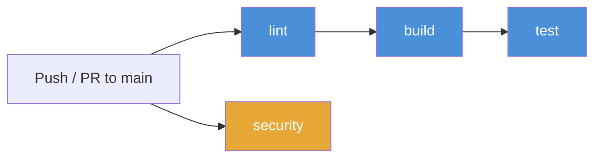

# CI/CD Pipeline

## Overview

Platinum Casino uses **GitHub Actions** for continuous integration. The workflow is defined in `.github/workflows/ci.yml` and runs automatically on pushes and pull requests targeting the main branch. The pipeline consists of four jobs: **lint**, **build**, **test**, and **security**.

## Pipeline Architecture



The **security** job runs independently in parallel with the main pipeline. The **lint** -> **build** -> **test** chain enforces a strict dependency order: code must pass linting before it is compiled, and it must compile before tests are executed.

## Triggers

The CI pipeline runs on:

- **Push** to `main` or `master` branches
- **Pull requests** targeting `main` or `master` branches

```yaml
on:
  push:
    branches: [main, master]
  pull_request:
    branches: [main, master]
```

---

## Job 1: `lint`

Runs on `ubuntu-latest` with Node 20. Validates code quality via ESLint on the client codebase.

| Step | Working Directory | Command | Purpose |
|------|-------------------|---------|---------|
| Checkout | root | `actions/checkout@v4` | Clone the repository |
| Setup Node | root | `actions/setup-node@v4` (Node 20) | Install Node.js runtime with npm caching |
| Install client deps | `client/` | `npm ci` | Deterministic install from lock file |
| Lint client | `client/` | `npm run lint` | Run ESLint on all JS/JSX files |

**Dependencies:** None (first job in the chain).

---

## Job 2: `build`

Runs on `ubuntu-latest` with Node 20. Compiles the TypeScript server and builds the Vite/React client bundle. This job validates type safety and build integrity.

**Dependencies:** Requires `lint` to pass.

| Step | Working Directory | Command | Purpose |
|------|-------------------|---------|---------|
| Checkout | root | `actions/checkout@v4` | Clone the repository |
| Setup Node | root | `actions/setup-node@v4` (Node 20) | Install Node.js runtime with npm caching |
| Install server deps | `server/` | `npm ci && npm install zod seedrandom` | Install server dependencies (zod and seedrandom are not in the lock file and are installed separately) |
| Typecheck server | `server/` | `npx tsc --noEmit` | Run TypeScript type checking without emitting output |
| Build server | `server/` | `npm run build` | Compile TypeScript to `dist/` |
| Install client deps | `client/` | `npm ci` | Deterministic install from lock file |
| Build client | `client/` | `npm run build` | Build the Vite/React production bundle |

---

## Job 3: `test`

Runs on `ubuntu-latest` with Node 20. Executes test suites with coverage collection for both server and client. Coverage reports are uploaded as build artifacts.

**Dependencies:** Requires `build` to pass.

| Step | Working Directory | Command | Purpose |
|------|-------------------|---------|---------|
| Checkout | root | `actions/checkout@v4` | Clone the repository |
| Setup Node | root | `actions/setup-node@v4` (Node 20) | Install Node.js runtime with npm caching |
| Install server deps | `server/` | `npm ci && npm install zod seedrandom` | Install server dependencies |
| Run server tests | `server/` | `npm run test:coverage` | Execute server test suite with coverage |
| Install client deps | `client/` | `npm ci` | Deterministic install from lock file |
| Run client tests | `client/` | `npm run test:coverage` | Execute client test suite with coverage |
| Upload server coverage | -- | `actions/upload-artifact@v4` | Upload `server/coverage/` (14-day retention) |
| Upload client coverage | -- | `actions/upload-artifact@v4` | Upload `client/coverage/` (14-day retention) |

Both coverage upload steps use `if: always()` to ensure artifacts are captured even when tests fail. This allows developers to inspect coverage reports for failing builds.

### Coverage Artifacts

| Artifact Name | Path | Retention |
|---------------|------|-----------|
| `server-coverage` | `server/coverage/` | 14 days |
| `client-coverage` | `client/coverage/` | 14 days |

---

## Job 4: `security`

Runs on `ubuntu-latest` with Node 20. Audits npm dependencies for known vulnerabilities at the `high` severity level. This job runs **independently** of all other jobs and does not block the pipeline.

**Dependencies:** None (runs in parallel with lint/build/test).

| Step | Working Directory | Command | Purpose |
|------|-------------------|---------|---------|
| Checkout | root | `actions/checkout@v4` | Clone the repository |
| Setup Node | root | `actions/setup-node@v4` (Node 20) | Install Node.js runtime with npm caching |
| Audit server deps | `server/` | `npm audit --audit-level=high \|\| true` | Check for high-severity vulnerabilities (non-blocking) |
| Audit client deps | `client/` | `npm audit --audit-level=high \|\| true` | Check for high-severity vulnerabilities (non-blocking) |

The `|| true` suffix ensures the job always succeeds. Security audit failures are informational and do not prevent merges. Teams should review audit output and address high-severity findings promptly.

---

## npm Caching Strategy

Every job uses the built-in npm cache provided by `actions/setup-node@v4`. The cache key is derived from **both** lock files so the cache is invalidated whenever either one changes:

```yaml
cache: 'npm'
cache-dependency-path: |
  server/package-lock.json
  client/package-lock.json
```

This means:

1. **Cache hit**: When neither lock file has changed since the last run, `npm ci` reuses cached packages, significantly reducing install times.
2. **Cache miss**: When either lock file changes (e.g., a dependency is added or upgraded), the cache is rebuilt from scratch.
3. **Shared across jobs**: All four jobs configure the same cache key, so a cache populated by the `lint` job is reused by `build`, `test`, and `security`.

---

## What the Pipeline Validates

| Check | Job | What It Catches |
|-------|-----|-----------------|
| Linting | `lint` | Code style violations, unused variables, import errors |
| Dependency integrity | `build` | Lock file out of sync with `package.json` |
| Type safety | `build` | TypeScript type errors across the server codebase |
| Build success | `build` | Compilation and bundling errors in both server and client |
| Test coverage | `test` | Regressions, broken logic, untested code paths |
| Dependency security | `security` | Known vulnerabilities in npm packages |

---

## Deployment (Planned)

Automated deployment can be added as a separate job that depends on the `test` job:

- **Staging**: Deploy on successful builds of `main`
- **Production**: Deploy on tagged releases or manual approval
- **Environment secrets**: Store `BETTER_AUTH_SECRET`, `DATABASE_URL`, and other production values as GitHub Actions secrets

---

## Troubleshooting

### Common CI Failures

| Symptom | Cause | Fix |
|---------|-------|-----|
| `npm ci` fails | Lock file out of sync | Run `npm install` locally and commit the updated lock file |
| ESLint errors in `lint` job | Code style violations | Run `npm run lint` locally in `client/` and fix reported issues |
| TypeScript errors in `build` job | Type mismatches in server code | Run `npx tsc --noEmit` in `server/` to reproduce |
| Missing `zod` or `seedrandom` | Dependencies not in lock file | These are installed separately via `npm install` in CI; ensure the CI step is present |
| Client build fails | Vite/React build errors | Run `npm run build` locally in `client/` to reproduce |
| Test failures in `test` job | Failing test assertions or missing mocks | Run `npm run test:coverage` locally in the relevant directory |
| Security audit warnings | Known vulnerabilities in dependencies | Run `npm audit` locally and follow remediation steps |

---

## Full Workflow File

```yaml
name: CI Pipeline

on:
  push:
    branches: [main, master]
  pull_request:
    branches: [main, master]

jobs:
  lint:
    runs-on: ubuntu-latest
    strategy:
      matrix:
        node-version: [20]
    steps:
      - uses: actions/checkout@v4
      - uses: actions/setup-node@v4
        with:
          node-version: ${{ matrix.node-version }}
          cache: 'npm'
          cache-dependency-path: |
            server/package-lock.json
            client/package-lock.json

      - name: Install client dependencies
        run: cd client && npm ci

      - name: Lint client
        run: cd client && npm run lint

  build:
    runs-on: ubuntu-latest
    needs: lint
    strategy:
      matrix:
        node-version: [20]
    steps:
      - uses: actions/checkout@v4
      - uses: actions/setup-node@v4
        with:
          node-version: ${{ matrix.node-version }}
          cache: 'npm'
          cache-dependency-path: |
            server/package-lock.json
            client/package-lock.json

      - name: Install server dependencies
        run: cd server && npm ci && npm install zod seedrandom

      - name: TypeScript type check (server)
        run: cd server && npx tsc --noEmit

      - name: Build server
        run: cd server && npm run build

      - name: Install client dependencies
        run: cd client && npm ci

      - name: Build client
        run: cd client && npm run build

  test:
    runs-on: ubuntu-latest
    needs: build
    strategy:
      matrix:
        node-version: [20]
    steps:
      - uses: actions/checkout@v4
      - uses: actions/setup-node@v4
        with:
          node-version: ${{ matrix.node-version }}
          cache: 'npm'
          cache-dependency-path: |
            server/package-lock.json
            client/package-lock.json

      - name: Install server dependencies
        run: cd server && npm ci && npm install zod seedrandom

      - name: Run server tests with coverage
        run: cd server && npm run test:coverage

      - name: Install client dependencies
        run: cd client && npm ci

      - name: Run client tests with coverage
        run: cd client && npm run test:coverage

      - name: Upload server coverage
        if: always()
        uses: actions/upload-artifact@v4
        with:
          name: server-coverage
          path: server/coverage/
          retention-days: 14

      - name: Upload client coverage
        if: always()
        uses: actions/upload-artifact@v4
        with:
          name: client-coverage
          path: client/coverage/
          retention-days: 14

  security:
    runs-on: ubuntu-latest
    steps:
      - uses: actions/checkout@v4
      - uses: actions/setup-node@v4
        with:
          node-version: 20
          cache: 'npm'
          cache-dependency-path: |
            server/package-lock.json
            client/package-lock.json

      - name: Audit server dependencies
        run: cd server && npm audit --audit-level=high || true

      - name: Audit client dependencies
        run: cd client && npm audit --audit-level=high || true
```

---

## Related Documents

- [Deployment Guide](./deployment.md) -- Production deployment procedures
- [Security Overview](../07-security/security-overview.md) -- Security middleware and configuration
- [Environment Variables](../07-security/environment-variables.md) -- Required environment configuration
