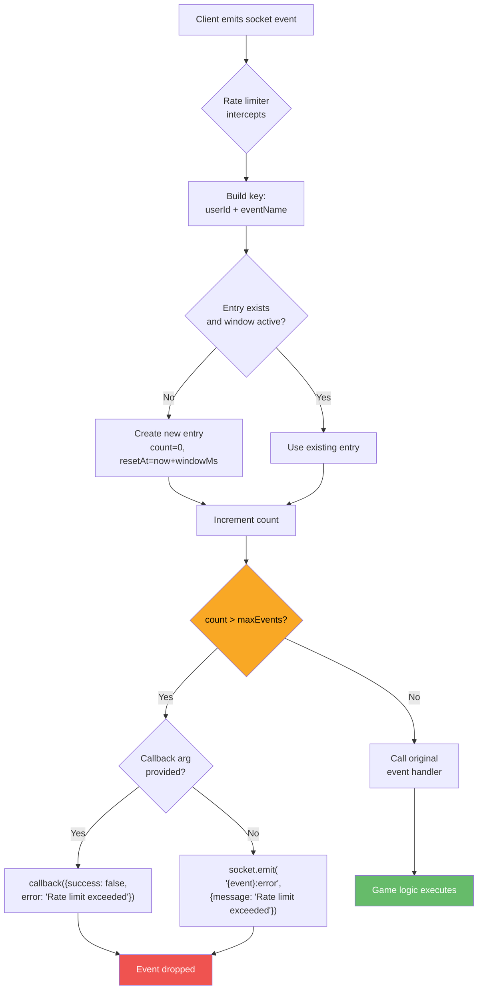

# Security Overview

## Overview

This document describes the security architecture of Platinum Casino, including authentication, authorization, middleware configuration, rate limiting, request tracing, and input validation.

> **Important**: This is an educational project. Before any production deployment, review the [Production Security Checklist](#production-security-checklist) and the compliance requirements at the end of this document.

## Authentication

### Better Auth (Session-Based)

The server uses [Better Auth](https://www.better-auth.com/) for session-based authentication. Sessions are stored server-side in the `session` database table -- this is **not** stateless JWT authentication.

- **Library**: `better-auth` with `username` and `admin` plugins
- **Session lifetime**: 24 hours (`expiresIn: 86400`)
- **Session refresh**: Every 1 hour (`updateAge: 3600`)
- **Cookie cache**: 5 minutes (reduces database lookups for rapid sequential requests)
- **Secret**: Read from `BETTER_AUTH_SECRET` environment variable (32+ characters)
- **Base path**: `/api/auth`

```typescript
// server/lib/auth.ts
export const auth = betterAuth({
  database: drizzleAdapter(db, { provider: "mysql", schema: { ...schema, user: schema.users } }),
  basePath: "/api/auth",
  emailAndPassword: {
    enabled: true,
    password: {
      hash: async (password) => bcrypt.hash(password, 12),
      verify: async ({ password, hash }) => bcrypt.compare(password, hash),
    },
  },
  session: {
    expiresIn: 60 * 60 * 24,   // 24 hours
    updateAge: 60 * 60,         // Refresh every 1 hour
    cookieCache: { enabled: true, maxAge: 60 * 5 },  // 5-minute cache
  },
  plugins: [
    username({ minUsernameLength: 3, maxUsernameLength: 30 }),
    admin({ defaultRole: "user", adminRoles: ["admin"] }),
  ],
  trustedOrigins: [process.env.CLIENT_URL || "http://localhost:5173"],
});
```

### Session Cookies

Better Auth manages session cookies automatically. Sessions are stored in the `session` database table and referenced by a session token in the cookie. This provides server-side session revocation capability.

- **HTTP-only**: Cookie is inaccessible to `document.cookie`, mitigating XSS-based token theft
- **Secure** (production): Cookie is only sent over HTTPS
- **SameSite**: Provides CSRF protection for top-level navigations

### Password Hashing

Passwords are hashed using `bcryptjs` with custom hash/verify functions passed to Better Auth:

- **Library**: `bcryptjs`
- **Salt rounds**: 12

```typescript
password: {
  hash: async (password: string) => bcrypt.hash(password, 12),
  verify: async ({ password, hash }) => bcrypt.compare(password, hash),
},
```

## Authorization

### Role-Based Access Control

The application uses Better Auth's `admin` plugin for role-based access control with two roles:

| Role | Description | Access |
|------|-------------|--------|
| `user` | Standard player (default) | Game play, profile management, balance operations |
| `admin` | Administrator | All user access + user management, system configuration |

### Route Guards

The `authenticate` middleware (`server/middleware/auth.ts`) validates the Better Auth session via `auth.api.getSession()` (using `fromNodeHeaders` to convert Express headers) and attaches the authenticated user to `req.user`:

```
Protected routes:
  /api/users/*              -- Requires authenticated user
  /api/games/*              -- Requires authenticated user
  /api/admin/*              -- Requires authenticated admin (authenticate + adminOnly)
  /api/rewards/*            -- Requires authenticated user
  /api/leaderboard/*        -- Requires authenticated user
  /api/responsible-gaming/* -- Requires authenticated user
  /api/verify/*             -- Requires authenticated user
```

### Socket Authentication Middleware

**File:** `server/middleware/socket/socketAuth.ts`

All game namespaces (crash, roulette, blackjack, landmines, plinko, wheel) apply a `socketAuth` middleware that:

1. Extracts cookies from the Socket.IO handshake headers (`socket.handshake.headers.cookie`).
2. Builds a `Headers` object and sets the `cookie` header.
3. Calls `auth.api.getSession({ headers })` to validate the session.
4. Verifies the user exists and is active (`isActive !== false`).
5. Attaches the authenticated user to the socket object (`userId`, `username`, `role`, `balance`, `isActive`).
6. Rejects unauthenticated or inactive connections with descriptive error messages.

```typescript
// Applied to every game namespace
crashNamespace.use(socketAuth);
rouletteNamespace.use(socketAuth);
blackjackNamespace.use(socketAuth);
landminesNamespace.use(socketAuth);
plinkoNamespace.use(socketAuth);
wheelNamespace.use(socketAuth);
```

Unauthenticated sockets that reach the connection handler are disconnected immediately via a secondary check using `getAuthenticatedUser(socket)`.

## Security Middleware

The following middleware is applied globally in `server/server.ts`. The registration order matters -- see notes below.

### Helmet

```typescript
app.use(helmet());
```

Helmet sets various HTTP security headers:

- `Content-Security-Policy`
- `X-Content-Type-Options: nosniff`
- `X-Frame-Options: SAMEORIGIN`
- `X-XSS-Protection`
- `Strict-Transport-Security` (when served over HTTPS)
- `X-DNS-Prefetch-Control`
- `X-Permitted-Cross-Domain-Policies`
- `Referrer-Policy`
- And others

### CORS

```typescript
app.use(cors({
  origin: process.env.CLIENT_URL || 'http://localhost:5173',
  credentials: true
}));
```

- Origin is restricted to the configured `CLIENT_URL` environment variable.
- `credentials: true` allows HTTP-only cookies to be sent cross-origin (required for session-based auth).
- Socket.IO CORS is configured separately with the same origin and `['GET', 'POST']` methods.
- Better Auth also validates trusted origins via its `trustedOrigins` configuration, providing a second layer of origin checking.

### Cookie Parser

```typescript
app.use(cookieParser());
```

Required for reading cookies from incoming requests in custom routes that are processed after the Better Auth handler.

### Request ID Middleware

**File:** `server/middleware/requestId.ts`

Assigns a unique identifier to every incoming request for log correlation and distributed tracing.

```typescript
import crypto from 'crypto';

export function requestIdMiddleware(req: Request, res: Response, next: NextFunction) {
  const requestId = (req.headers['x-request-id'] as string) || crypto.randomUUID();
  (req as any).requestId = requestId;
  res.setHeader('x-request-id', requestId);
  next();
}
```

**Behavior:**

| Aspect | Detail |
|--------|--------|
| ID generation | UUID v4 via `crypto.randomUUID()` |
| Client-provided ID | If `x-request-id` header is present, that value is reused |
| Response header | `x-request-id` is echoed back in every response |
| Request attachment | Available as `req.requestId` for downstream handlers |

**Use cases:**

- **Log correlation**: All log entries for a single request can be grouped by request ID.
- **End-to-end tracing**: Clients or API gateways can pass their own request ID to trace a request across multiple services.
- **Debugging**: When a user reports an issue, the request ID from the response header can be used to find the exact server-side logs.

**Middleware order:** Registered early in the chain (before `express.json()`, `cookieParser()`, and `helmet()`) so that all downstream middleware and route handlers can reference the request ID.

## Rate Limiting

Rate limiting is implemented at multiple levels to prevent abuse of both HTTP and WebSocket interfaces.

### Global API Rate Limit

Applied to all `/api` routes using `express-rate-limit`:

```typescript
const apiLimiter = rateLimit({
  windowMs: 60 * 1000,     // 1 minute window
  max: 120,                // 120 requests per minute per IP
  standardHeaders: true,   // Return rate limit info in RateLimit-* headers
  legacyHeaders: false     // Disable X-RateLimit-* headers
});
app.use('/api', apiLimiter);
```

**Response headers** (when `standardHeaders: true`):

| Header | Description |
|--------|-------------|
| `RateLimit-Limit` | Maximum requests allowed in the window |
| `RateLimit-Remaining` | Remaining requests in the current window |
| `RateLimit-Reset` | Seconds until the window resets |

When the limit is exceeded, the client receives a `429 Too Many Requests` response.

### Socket Rate Limiting

**File:** `server/middleware/socket/socketRateLimit.ts`

A per-user, per-event rate limiter for Socket.IO events. This prevents individual users from flooding the server with rapid socket events (e.g., placing bets faster than intended).

**Configuration:**

| Parameter | Default | Description |
|-----------|---------|-------------|
| `maxEvents` | 10 | Maximum events allowed per window |
| `windowMs` | 60000 (60 seconds) | Time window in milliseconds |

**How it works:**

1. Creates a rate limit key from `userId` (falls back to `socket.id` for unauthenticated sockets) combined with the event name, forming a key like `42:placeBet`.
2. Tracks event count and window reset time per key in an in-memory `Map<string, RateLimitEntry>`.
3. On each event, increments the counter. If the count exceeds `maxEvents` within the window, the event is blocked.
4. **Error reporting** when rate-limited:
   - If the last argument to the event handler is a callback function, calls it with `{ success: false, error: 'Rate limit exceeded. Please slow down.' }`.
   - Otherwise, emits `{eventName}:error` on the socket with `{ message: 'Rate limit exceeded' }`.
5. A cleanup interval runs every 60 seconds to delete stale entries from the map (entries whose window has expired), preventing memory leaks.

**Usage pattern:**

```typescript
import { socketRateLimit } from '../../middleware/socket/socketRateLimit.js';

const limiter = socketRateLimit(10, 60000); // 10 events per 60 seconds

// Wrap each event handler with the limiter
limiter(socket, 'placeBet', (data, callback) => {
  // Only called if within rate limit
});

limiter(socket, 'cashOut', (data, callback) => {
  // Each event type has its own independent counter
});
```

**Limitations:**

- Rate limit state is stored in-memory, not shared across server instances. For horizontal scaling with multiple server processes, consider a Redis-backed rate limiter.
- The cleanup interval runs globally (not per-namespace), so all rate limit entries across all game types share the same cleanup cycle.

### Rate Limit Summary

| Scope | Target | Window | Max Allowed | Response | Implementation |
|-------|--------|--------|-------------|----------|----------------|
| Global API | All `/api/*` routes | 1 minute | 120 requests per IP | HTTP 429 Too Many Requests | `express-rate-limit` |
| Socket events | Per user, per event type | 60 seconds (default) | 10 events (default) | Callback error or `{event}:error` emit | In-memory `Map` per user:event key |

## Socket.IO Rate Limiting

This section provides an in-depth look at the Socket.IO rate limiting system, covering its algorithm, data structures, configuration, and differences from HTTP rate limiting.

### Algorithm: Fixed Window Counter

The socket rate limiter uses a **fixed window counter** algorithm. Each unique combination of user identity and event name gets its own counter that resets after the configured window expires. This is the same conceptual approach as the HTTP rate limiter, but applied at the per-user, per-event granularity instead of per-IP.

**Fixed window** means events are counted within discrete, non-overlapping time windows. When the first event for a given key arrives (or the previous window has expired), a new window begins with `count = 0` and `resetAt = now + windowMs`. Every subsequent event within that window increments the counter. Once the counter exceeds `maxEvents`, all further events are blocked until `resetAt` passes.

> **Note on burst behavior:** Fixed window counters allow up to `maxEvents` at the very end of one window and `maxEvents` at the very start of the next, resulting in a theoretical burst of `2 * maxEvents` in a short span around the boundary. For the default configuration (10 events / 60 seconds), this means up to 20 events could pass within a few milliseconds at a window boundary. This is an acceptable tradeoff for the simplicity and low overhead of the algorithm.

### Data Structures

The rate limiter stores all state in a single module-level `Map`:

```typescript
interface RateLimitEntry {
  count: number;    // Number of events emitted in the current window
  resetAt: number;  // Timestamp (ms) when the window expires
}

const rateLimits = new Map<string, RateLimitEntry>();
```

**Map key format:** `{userId}:{eventName}` (e.g., `usr_abc123:placeBet`)

Each key uniquely identifies one user's activity for one event type. This means:
- User A's `placeBet` counter is completely independent of User B's `placeBet` counter.
- User A's `placeBet` counter is completely independent of User A's `cashOut` counter.
- Different namespaces (games) that use the same event name share the counter for the same user. For example, if both `/crash` and `/roulette` have a `placeBet` event, user `42`'s rate limit for `placeBet` is shared across both games under the key `42:placeBet`.

### Per-User, Per-Event Tracking

User identity is resolved in this order:

1. **`socket.user.userId`** -- Used when the socket has been authenticated via `socketAuth` middleware (the normal case for game namespaces).
2. **`socket.id`** -- Fallback for unauthenticated sockets or sockets where `user.userId` is not set. Since `socket.id` changes on reconnection, this is a weaker form of identity tracking.

This design ensures that:
- A user who reconnects with a new socket still has their rate limit tracked (because `userId` persists across connections).
- A user cannot bypass rate limits by opening multiple socket connections (all connections sharing the same `userId` share the same counters).
- Anonymous sockets still get basic rate limiting via `socket.id`, though this can be circumvented by reconnecting.

### Memory Management

A global cleanup interval runs every 60 seconds to evict expired entries from the map:

```typescript
setInterval(() => {
  const now = Date.now();
  for (const [key, entry] of rateLimits) {
    if (entry.resetAt <= now) {
      rateLimits.delete(key);
    }
  }
}, 60000);
```

This prevents the map from growing indefinitely as users connect and disconnect. The cleanup is independent of the rate limit window size -- it always runs on a fixed 60-second interval. Entries whose window has already expired are removed regardless of which namespace or event they belong to.

### Configuration Options

The `socketRateLimit` function accepts two optional parameters:

```typescript
export function socketRateLimit(maxEvents: number = 10, windowMs: number = 60000)
```

| Parameter | Type | Default | Description |
|-----------|------|---------|-------------|
| `maxEvents` | `number` | `10` | Maximum number of times a user can emit a specific event within one window. The event is blocked on the `(maxEvents + 1)`th call. |
| `windowMs` | `number` | `60000` | Duration of the rate limit window in milliseconds. After this period, the counter resets and the user can emit events again. |

**Recommended limits by event type:**

| Event Type | Suggested `maxEvents` | Suggested `windowMs` | Rationale |
|------------|----------------------|---------------------|-----------|
| `placeBet` | 10 | 60000 | Bets are infrequent; 10/min is generous |
| `cashOut` | 5 | 60000 | Cash out happens at most once per round |
| `game_action` (blackjack hit/stand) | 20 | 60000 | Multiple actions per hand, but bounded |
| `sendMessage` (chat) | 5 | 10000 | Prevent chat spam; 5 messages per 10 seconds |
| `joinGame` | 3 | 60000 | Reconnection abuse prevention |

These are suggested starting points. Actual limits should be tuned based on observed traffic patterns.

### What Happens When a User Exceeds the Limit

When a user's event count exceeds `maxEvents` for a given event, the rate limiter does **not** call the original handler. Instead, it reports the error back to the client through one of two mechanisms:

**1. Acknowledgment callback (preferred)**

If the client passed a callback function as the last argument to the event (Socket.IO's built-in acknowledgment pattern), the callback is invoked with an error payload:

```typescript
// Client-side
socket.emit('placeBet', { amount: 100 }, (response) => {
  if (!response.success) {
    // response.error === 'Rate limit exceeded. Please slow down.'
    showToast(response.error);
  }
});
```

**2. Error event emission (fallback)**

If no callback was provided, the rate limiter emits a namespaced error event on the socket:

```typescript
// Emitted by the rate limiter
socket.emit('placeBet:error', { message: 'Rate limit exceeded' });

// Client-side listener
socket.on('placeBet:error', (error) => {
  showToast(error.message);
});
```

In both cases, the original event handler is never invoked, so no game logic or balance changes occur.

### How It Differs from HTTP Rate Limiting

| Aspect | HTTP Rate Limiting | Socket.IO Rate Limiting |
|--------|-------------------|------------------------|
| **Library** | `express-rate-limit` (npm package) | Custom middleware (`socketRateLimit.ts`) |
| **Tracking key** | Client IP address | User ID + event name |
| **Scope** | All `/api/*` routes collectively | Each socket event type independently |
| **Storage** | In-memory (via `express-rate-limit` default store) | In-memory `Map<string, RateLimitEntry>` |
| **Error response** | HTTP 429 status code with `Retry-After` header | Callback error object or `{event}:error` emission |
| **Headers** | `RateLimit-Limit`, `RateLimit-Remaining`, `RateLimit-Reset` | None (WebSocket has no headers per message) |
| **Granularity** | Per IP across all API routes | Per user, per event type |
| **Multi-instance** | Requires shared store (Redis) for consistency | Requires shared store (Redis) for consistency |
| **Connection model** | Stateless; each request is independent | Stateful; persistent connection with many events |

**Key difference:** HTTP rate limiting protects against volume of requests from a single IP, while socket rate limiting protects against a single authenticated user flooding specific event types. A user behind a shared IP (e.g., corporate NAT) is not penalized for other users' HTTP traffic, and conversely, a single user opening multiple sockets is tracked as one identity.

### Request Flow Diagram



### Implementation Reference

The full implementation in `server/middleware/socket/socketRateLimit.ts`:

```typescript
interface RateLimitEntry {
  count: number;
  resetAt: number;
}

const rateLimits = new Map<string, RateLimitEntry>();

// Clean up stale entries every 60 seconds
setInterval(() => {
  const now = Date.now();
  for (const [key, entry] of rateLimits) {
    if (entry.resetAt <= now) {
      rateLimits.delete(key);
    }
  }
}, 60000);

export function socketRateLimit(maxEvents: number = 10, windowMs: number = 60000) {
  return (socket: any, eventName: string, handler: (...args: any[]) => void) => {
    socket.on(eventName, (...args: any[]) => {
      const userId = socket.user?.userId || socket.id;
      const key = `${userId}:${eventName}`;
      const now = Date.now();

      let entry = rateLimits.get(key);
      if (!entry || entry.resetAt <= now) {
        entry = { count: 0, resetAt: now + windowMs };
        rateLimits.set(key, entry);
      }

      entry.count++;

      if (entry.count > maxEvents) {
        const callback = args.find(arg => typeof arg === 'function');
        if (callback) {
          callback({ success: false, error: 'Rate limit exceeded. Please slow down.' });
        } else {
          socket.emit(`${eventName}:error`, { message: 'Rate limit exceeded' });
        }
        return;
      }

      handler(...args);
    });
  };
}
```

### Integration Example

To apply rate limiting to a game handler, wrap each `socket.on()` call with the limiter. Here is a complete example showing how it would be integrated into a per-connection handler:

```typescript
// server/src/socket/exampleHandler.ts
import { socketRateLimit } from '../../middleware/socket/socketRateLimit.js';

export function initExampleHandlers(io: any, socket: any, user: any) {
  // Create limiters with different thresholds per event type
  const betLimiter = socketRateLimit(10, 60000);    // 10 bets per minute
  const actionLimiter = socketRateLimit(20, 60000);  // 20 actions per minute
  const chatLimiter = socketRateLimit(5, 10000);     // 5 messages per 10 seconds

  // Instead of: socket.on('placeBet', handler)
  // Use:        betLimiter(socket, 'placeBet', handler)

  betLimiter(socket, 'placeBet', (data: any, callback: Function) => {
    // This handler is only called if the user has not exceeded 10 bets/minute
    // ... game logic ...
  });

  actionLimiter(socket, 'hit', (data: any, callback: Function) => {
    // ... handle blackjack hit ...
  });

  actionLimiter(socket, 'stand', (data: any, callback: Function) => {
    // ... handle blackjack stand ...
  });

  chatLimiter(socket, 'sendMessage', (data: any, callback: Function) => {
    // ... handle chat message ...
  });
}
```

### Current Integration Status

The `socketRateLimit` middleware is fully implemented and has comprehensive test coverage (see `server/src/__tests__/socketRateLimit.test.ts` and `server/src/__tests__/edgeCases.test.ts`). However, it is **not yet imported or applied** in any game handler or in `server/server.ts`. The middleware is available for integration and should be wired into each handler's event registration to activate rate limiting on socket events.

### Test Coverage

The rate limiter has thorough test coverage across the following scenarios:

- **Basic functionality:** Events within the limit are allowed; events exceeding the limit are blocked.
- **Error handling:** Callback-based error response and fallback `{event}:error` emission.
- **Window expiry:** Counters reset after the configured window, allowing new events.
- **User identification:** `userId` takes priority over `socket.id`; missing `userId` falls back to `socket.id`.
- **Event isolation:** Different event types have independent counters for the same user.
- **Multi-user isolation:** One user's rate limit does not affect another user's counters.
- **Edge cases:** Exact boundary behavior at `maxEvents`, single-event windows, and anonymous socket isolation.

## Input Validation

### Better Auth Validation

Better Auth handles validation for its managed endpoints (sign-up, sign-in, etc.) internally:

- Username length: 3-30 characters (enforced by the `username` plugin)
- Password validation: Handled by Better Auth's core
- Email format: Validated by Better Auth

### Route-Level Validation

Individual route handlers implement their own validation for non-auth endpoints. Invalid requests receive structured error responses before any database interaction occurs.

## Environment Security

- **dotenv**: Environment variables are loaded from `.env` files using `dotenv.config()`.
- **`.gitignore`**: `.env` files are excluded from version control.
- **`.env.example`**: Template files are provided with placeholder values for both `server/` and `client/`.
- Secrets (`BETTER_AUTH_SECRET`, `DATABASE_URL`) are never hardcoded in source files.
- **Startup validation**: The server validates required environment variables (`DATABASE_URL`) at startup and exits with a clear error message if any are missing.

See [Environment Variables](./environment-variables.md) for the full reference.

## Logging

The application uses a Winston-based `LoggingService` (`server/src/services/loggingService.ts`) for structured logging of:

- Authentication events (session validation failures, middleware errors)
- Game events (connections, bets, results)
- System events (server start, errors, graceful shutdown via SIGINT/SIGTERM)
- Security events (unauthenticated access attempts, socket auth failures, rate limit hits)

Logs include contextual data (user ID, socket ID, game type) for audit trails. The request ID middleware enables correlating all log entries for a single HTTP request.

## Production Security Checklist

> **Important**: This is an educational project. The following must be completed before production deployment.

### Completed

- [x] `.gitignore` includes `.env` files
- [x] No credentials in code or git history
- [x] Secure database connection parsing
- [x] Session-based auth with server-side session storage (Better Auth)
- [x] Helmet security headers enabled
- [x] CORS restricted to specific origin (both Express and Socket.IO)
- [x] Global API rate limiting active (120 req/min/IP)
- [x] Socket rate limiting available (per-user, per-event)
- [x] Request ID middleware for log correlation and tracing
- [x] Trusted origins validated by Better Auth
- [x] Startup validation of required environment variables

### Required Before Production

- [ ] Change all default credentials
- [ ] Generate a strong `BETTER_AUTH_SECRET` (32+ characters via `openssl rand -base64 32`)
- [ ] Configure production environment (`NODE_ENV=production`)
- [ ] Set up HTTPS (TLS/SSL certificates)
- [ ] Configure CORS with specific production origin (not wildcard)
- [ ] Verify rate limiting is active on all endpoints
- [ ] Confirm Helmet security headers are set correctly
- [ ] Use a reverse proxy (nginx or Apache)
- [ ] Set up proper firewall rules
- [ ] Database connection over SSL/TLS
- [ ] Implement Redis-backed socket rate limiting for horizontal scaling
- [ ] Set up monitoring and alerting
- [ ] Regular security updates for dependencies
- [ ] Schedule regular security audits

## Known Security Considerations

### Educational Project Limitations

This project is built for educational purposes. The following areas need additional hardening for production:

1. **Authentication**: Add password complexity requirements, account lockout after failed attempts, and consider 2FA for admin accounts.
2. **Session Management**: Consider implementing session revocation for all devices, session listing for user transparency, and IP-based session validation.
3. **Rate Limiting**: Socket rate limit state is in-memory and not shared across server instances. For horizontal scaling, consider Redis-backed rate limiting.
4. **Database**: Use SSL/TLS connections and implement proper connection pooling limits.
5. **Game Logic**: Provably fair algorithms should be cryptographically verified with proper house edge calculations and transaction auditing.

### Gambling Compliance

Online gambling is heavily regulated. A production deployment must comply with:

- Local and international gambling laws
- Data protection regulations (GDPR, CCPA, etc.)
- Financial transaction regulations (AML/KYC)
- Age verification requirements
- Responsible gambling measures (self-exclusion, deposit limits, session time warnings)

## Reporting Security Issues

- **Do NOT** open a public GitHub issue for security vulnerabilities.
- Include detailed steps to reproduce the issue.
- The team will respond within 48 hours.

---

## Related Documents

- [Authentication System](../03-features/authentication.md) -- Full authentication system documentation with Better Auth configuration
- [Socket.IO Architecture](../02-architecture/socket-architecture.md) -- Namespace design, handler patterns, and connection lifecycle
- [Environment Variables](./environment-variables.md) -- Full environment variable reference and security notes
- [Deployment Guide](../06-devops/deployment.md) -- Production deployment procedures and security checklist
- [CI/CD Pipeline](../06-devops/ci-cd.md) -- Continuous integration workflow
