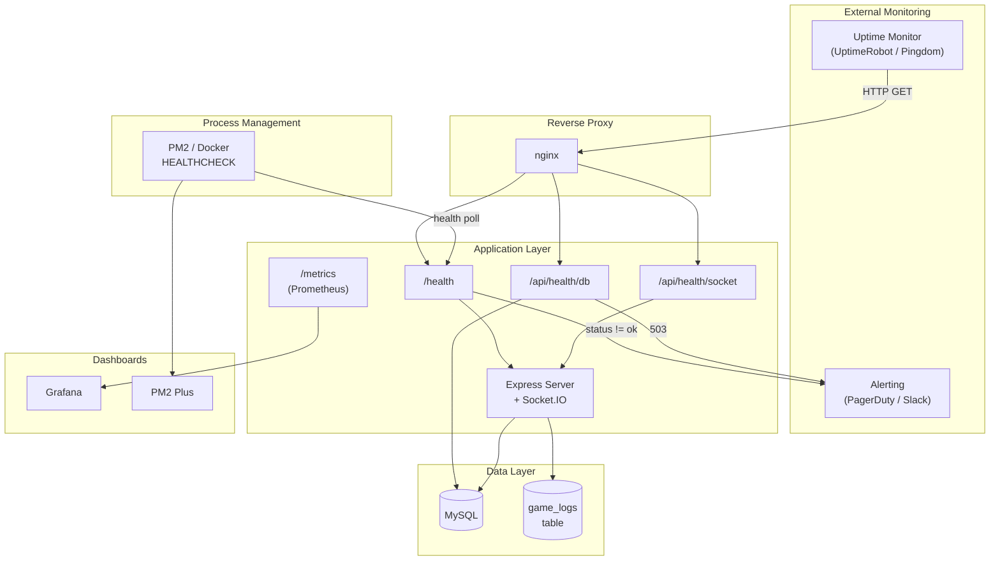

# Monitoring

## Overview

This document covers the monitoring architecture for Platinum Casino, including health check endpoint design, Docker and PM2 health integration, uptime monitoring, alerting thresholds, and dashboard recommendations.

## Monitoring Architecture



---

## Health Check Endpoints

### GET /health -- Application Liveness

A lightweight endpoint that confirms the server process is running and accepting HTTP requests. It does **not** verify downstream dependencies, making it suitable for load balancer liveness probes and Docker `HEALTHCHECK` directives.

**Response (200 OK):**

```json
{
  "status": "ok",
  "uptime": 3600.123,
  "timestamp": "2026-03-27T12:00:00.000Z",
  "version": "1.0.0"
}
```

**Implementation:**

```typescript
// server/routes/health.ts
import express from 'express';
import { db } from '../drizzle/db.js';
import { sql } from 'drizzle-orm';

const router = express.Router();

// Liveness probe -- is the process alive?
router.get('/health', (req, res) => {
  res.json({
    status: 'ok',
    uptime: process.uptime(),
    timestamp: new Date().toISOString(),
    version: process.env.npm_package_version || '1.0.0',
  });
});
```

### GET /api/health/db -- Database Readiness

Verifies that the MySQL connection pool is functional by executing a `SELECT 1` ping query. Returns HTTP 503 if the database is unreachable.

**Response (200 OK):**

```json
{
  "status": "ok",
  "database": "connected",
  "latencyMs": 2
}
```

**Response (503 Service Unavailable):**

```json
{
  "status": "error",
  "database": "disconnected",
  "error": "Connection refused"
}
```

**Implementation:**

```typescript
// Database readiness probe
router.get('/api/health/db', async (req, res) => {
  const start = Date.now();
  try {
    await db.execute(sql`SELECT 1`);
    const latencyMs = Date.now() - start;

    res.json({
      status: 'ok',
      database: 'connected',
      latencyMs,
    });
  } catch (error) {
    const message = error instanceof Error ? error.message : String(error);
    res.status(503).json({
      status: 'error',
      database: 'disconnected',
      error: message,
    });
  }
});
```

### GET /api/health/socket -- Socket.IO Readiness

Verifies that the Socket.IO server is initialized and reports the number of connected clients per namespace.

**Response (200 OK):**

```json
{
  "status": "ok",
  "engine": "running",
  "namespaces": {
    "/": { "connected": 12 },
    "/crash": { "connected": 8 },
    "/roulette": { "connected": 5 },
    "/blackjack": { "connected": 3 },
    "/plinko": { "connected": 2 },
    "/wheel": { "connected": 1 },
    "/landmines": { "connected": 0 }
  },
  "totalConnections": 31
}
```

**Implementation:**

```typescript
// Socket.IO readiness probe
// Requires access to the `io` instance from server.ts
router.get('/api/health/socket', (req, res) => {
  const io = req.app.get('io'); // io must be set via app.set('io', io) in server.ts

  if (!io) {
    return res.status(503).json({
      status: 'error',
      engine: 'not initialized',
    });
  }

  const namespaceNames = ['/', '/crash', '/roulette', '/blackjack', '/plinko', '/wheel', '/landmines'];
  const namespaces: Record<string, { connected: number }> = {};
  let totalConnections = 0;

  for (const ns of namespaceNames) {
    const namespace = io.of(ns);
    const count = namespace.sockets.size;
    namespaces[ns] = { connected: count };
    totalConnections += count;
  }

  res.json({
    status: 'ok',
    engine: 'running',
    namespaces,
    totalConnections,
  });
});

export default router;
```

### Registering Health Routes

```typescript
// In server.ts
import healthRoutes from './routes/health.js';

app.use(healthRoutes);
app.set('io', io); // Make io accessible to health routes
```

---

## Docker HEALTHCHECK Integration

The Docker `HEALTHCHECK` directive in each service's Dockerfile or in `docker-compose.yml` polls the `/health` endpoint to determine container health.

### Server Container

```yaml
# docker-compose.yml (server service)
healthcheck:
  test: ["CMD", "wget", "--no-verbose", "--tries=1", "--spider", "http://localhost:5000/health"]
  interval: 30s
  timeout: 10s
  retries: 3
  start_period: 15s
```

| Parameter | Value | Rationale |
|---|---|---|
| `interval` | 30s | Check every 30 seconds |
| `timeout` | 10s | Fail if the endpoint does not respond in 10 seconds |
| `retries` | 3 | Mark unhealthy after 3 consecutive failures |
| `start_period` | 15s | Grace period for the server to start and connect to MySQL |

### Database Container

```yaml
# docker-compose.yml (db service)
healthcheck:
  test: ["CMD", "mysqladmin", "ping", "-h", "localhost", "-u", "root", "-p${MYSQL_ROOT_PASSWORD}"]
  interval: 10s
  timeout: 5s
  retries: 10
  start_period: 30s
```

### Viewing Health Status

```bash
# Show health status of all containers
docker compose ps

# Inspect a specific container's health log
docker inspect --format='{{json .State.Health}}' casino-server | jq
```

---

## PM2 Health Monitoring

### Built-in Monitoring

PM2 provides process-level monitoring out of the box:

```bash
pm2 status                      # Process list with CPU, memory, uptime, restarts
pm2 monit                       # Real-time terminal dashboard
pm2 show platinum-casino        # Detailed info for a single process
```

### Key PM2 Metrics

| Metric | Command | What to Watch |
|---|---|---|
| CPU usage | `pm2 monit` | Sustained > 80% indicates scaling need |
| Memory usage | `pm2 status` | Approaching `max_memory_restart` triggers restart |
| Restart count | `pm2 status` | Frequent restarts indicate crashes |
| Uptime | `pm2 status` | Short uptime with high restart count is a red flag |
| Event loop latency | `pm2 monit` | > 100ms indicates blocking operations |

### PM2 Configuration for Health

```javascript
// ecosystem.config.js (health-related settings)
module.exports = {
  apps: [{
    name: 'platinum-casino',
    script: 'dist/server.js',
    cwd: './server',
    autorestart: true,           // Automatically restart on crash
    max_memory_restart: '500M',  // Restart if memory exceeds 500MB
    max_restarts: 10,            // Max restarts within min_uptime window
    min_uptime: '10s',           // Consider started after 10s
    exp_backoff_restart_delay: 100,  // Exponential backoff on repeated crashes
    kill_timeout: 10000,         // 10s for graceful shutdown
  }]
};
```

### PM2 Plus (Optional)

PM2 Plus provides a web-based dashboard with historical metrics, alerting, and remote management:

```bash
pm2 plus                        # Link to PM2 Plus dashboard
```

---

## Uptime Monitoring Recommendations

### External Monitoring Services

Set up external uptime monitoring to detect outages independently of the server itself.

| Service | Free Tier | Recommended Checks |
|---|---|---|
| **UptimeRobot** | 50 monitors, 5-min interval | `/health`, `/api/health/db` |
| **Better Stack** | 10 monitors, 3-min interval | `/health`, SSL expiry |
| **Pingdom** | 1 monitor | `/health` |

### Recommended Monitors

| Monitor | URL | Interval | Alert On |
|---|---|---|---|
| Application up | `https://yourdomain.com/health` | 1 min | HTTP status != 200 |
| Database healthy | `https://yourdomain.com/api/health/db` | 5 min | HTTP status != 200 |
| WebSocket healthy | `https://yourdomain.com/api/health/socket` | 5 min | HTTP status != 200 |
| SSL certificate | `https://yourdomain.com` | 1 day | Expiry < 14 days |
| Homepage loads | `https://yourdomain.com/` | 5 min | Response time > 5s |

---

## Alerting Thresholds

| Condition | Severity | Threshold | Action |
|---|---|---|---|
| Server process down | **Critical** | `/health` returns non-200 | Page on-call, PM2 auto-restarts |
| Database unreachable | **Critical** | `/api/health/db` returns 503 | Alert immediately, check MySQL |
| High error rate | **High** | > 5% of HTTP responses are 5xx over 5 min | Investigate logs within 15 min |
| High memory usage | **Warning** | > 80% of `max_memory_restart` | Monitor trend, plan restart |
| Slow API responses | **Warning** | p95 response time > 2 seconds | Check slow queries, load |
| High restart count | **Warning** | > 3 restarts in 10 minutes | Investigate crash logs |
| Disk usage high | **Warning** | > 90% disk utilization | Clean logs, expand storage |
| DB query latency | **Warning** | `/api/health/db` latencyMs > 100 | Check MySQL performance |
| Zero WebSocket clients | **Info** | `/api/health/socket` totalConnections == 0 | Expected during low traffic |

---

## Process Signal Handlers

The server registers handlers for clean shutdown in `server/server.ts`:

### Graceful Shutdown

```typescript
process.on('SIGINT', async () => {
  LoggingService.logSystemEvent('sigint_received', {});
  await closeDB();
  process.exit(0);
});

process.on('SIGTERM', async () => {
  LoggingService.logSystemEvent('sigterm_received', {});
  await closeDB();
  process.exit(0);
});
```

Both signals trigger:
1. A system event log entry recording the shutdown signal
2. Closing the MySQL connection pool via `closeDB()`
3. A clean process exit with code 0

### Error Handlers

```typescript
process.on('uncaughtException', (error) => {
  console.error('Uncaught Exception:', error);
  process.exit(1);
});

process.on('unhandledRejection', (reason, promise) => {
  console.error('Unhandled Rejection at:', promise, 'reason:', reason);
  process.exit(1);
});
```

Both handlers log the error to stderr and exit with code 1. These use `console.error` rather than `LoggingService` because the database connection may itself be the source of the error.

---

## Dashboard Recommendations

### Grafana + Prometheus

For production deployments, set up Grafana with Prometheus as the data source.

#### Integration Path

1. Add `prom-client` for Prometheus metrics exposition:
   ```bash
   npm install prom-client
   ```
2. Expose a `/metrics` endpoint for Prometheus scraping.
3. Configure Prometheus to scrape the casino server.
4. Build Grafana dashboards from Prometheus data.

#### Metrics to Track

| Category | Metrics |
|---|---|
| **Server** | CPU usage, memory (RSS, heap), event loop lag, active handles, uptime |
| **HTTP** | Request rate, response time histogram, error rate by status code and endpoint |
| **Socket.IO** | Connected clients per namespace, events emitted/s, connection/disconnection rate |
| **Database** | Query count, query latency histogram, connection pool (active/idle/waiting) |
| **Games** | Active sessions by game type, bets per minute, win/loss ratio, house edge tracking |
| **Auth** | Login rate, registration rate, failed authentication attempts, JWT refresh rate |
| **System** | Disk usage, network I/O, file descriptor count |

#### Example Prometheus Metrics Endpoint

```typescript
import client from 'prom-client';

// Collect default Node.js metrics (CPU, memory, event loop, etc.)
client.collectDefaultMetrics({ prefix: 'casino_' });

// Custom metrics
const httpRequestDuration = new client.Histogram({
  name: 'casino_http_request_duration_seconds',
  help: 'HTTP request duration in seconds',
  labelNames: ['method', 'route', 'status_code'],
  buckets: [0.01, 0.05, 0.1, 0.5, 1, 5],
});

const socketConnections = new client.Gauge({
  name: 'casino_socket_connections',
  help: 'Number of active Socket.IO connections',
  labelNames: ['namespace'],
});

const gameBetsTotal = new client.Counter({
  name: 'casino_game_bets_total',
  help: 'Total number of bets placed',
  labelNames: ['game_type'],
});

// Expose /metrics endpoint
app.get('/metrics', async (req, res) => {
  res.set('Content-Type', client.register.contentType);
  res.send(await client.register.metrics());
});
```

### PM2 Plus Dashboard

PM2 Plus provides a hosted dashboard with:
- Historical CPU and memory charts
- Custom metrics via `@pm2/io`
- Exception tracking
- Transaction tracing
- Deployment tracking

### Minimal Dashboard (No External Services)

For deployments without Grafana, monitor using the health endpoints directly:

```bash
# Quick health check script
#!/bin/bash
echo "=== Application ==="
curl -s http://localhost:5000/health | jq .

echo "=== Database ==="
curl -s http://localhost:5000/api/health/db | jq .

echo "=== Socket.IO ==="
curl -s http://localhost:5000/api/health/socket | jq .

echo "=== PM2 ==="
pm2 jlist | jq '.[] | {name, pm2_env: {status: .pm2_env.status, restart_time: .pm2_env.restart_time, uptime: .pm2_env.pm_uptime}}'
```

---

## Redis Monitoring

Redis is an optional dependency for Platinum Casino. When configured via the `REDIS_URL` environment variable, it provides balance caching, game stats caching, and cross-instance Socket.IO event broadcasting. All Redis operations degrade gracefully -- the application continues to function without Redis, but monitoring ensures you detect issues before they affect performance.

### Checking Redis Connectivity

**Redis CLI:**

```bash
# Basic connectivity check
redis-cli -u $REDIS_URL ping
# Expected: PONG

# If Redis is on localhost with default port
redis-cli ping
```

**Application-level check:**

Look for these log entries during server startup:

| Log Event | Meaning |
|-----------|---------|
| `redis_adapter_enabled` | Redis is connected and the Socket.IO adapter is active |
| `redis_adapter_skipped` | Redis connection failed or `REDIS_URL` is not set; single-instance mode |
| `Redis client error` | ioredis encountered a connection or command error (logged via Winston) |
| `Redis subscriber error` | The Pub/Sub subscriber client encountered an error |

**Docker health check for Redis:**

```yaml
# docker-compose.yml (redis service)
redis:
  image: redis:7-alpine
  healthcheck:
    test: ["CMD", "redis-cli", "ping"]
    interval: 10s
    timeout: 5s
    retries: 5
    start_period: 5s
```

```bash
# Check Redis container health
docker inspect --format='{{json .State.Health}}' casino-redis | jq
```

### Key Metrics to Monitor

| Metric | Redis CLI Command | Healthy Range | Why It Matters |
|--------|-------------------|---------------|----------------|
| Memory usage | `redis-cli info memory` | Below `maxmemory` if set; watch `used_memory_rss` | High memory can cause evictions or OOM kills |
| Connected clients | `redis-cli info clients` | Steady count matching server instances x2 (pub + sub) | Unexpected drops indicate connection failures |
| Cache hit ratio | `redis-cli info stats` (`keyspace_hits` / (`keyspace_hits` + `keyspace_misses`)) | > 80% for balance cache during active play | Low ratio means cache is not reducing DB load |
| Evicted keys | `redis-cli info stats` (`evicted_keys`) | 0 under normal load | Non-zero means memory pressure is discarding cached data |
| Keyspace | `redis-cli info keyspace` | Small key count (balance keys are short-lived) | Unexpected growth indicates keys not expiring |
| Pub/Sub channels | `redis-cli pubsub channels '*'` | Channels present for each Socket.IO namespace | Missing channels mean the adapter is not active |
| Command latency | `redis-cli --latency` | < 1ms on local, < 5ms over network | High latency slows balance reads and game stats |

### Redis CLI Commands for Debugging

```bash
# --- Connectivity and general health ---
redis-cli ping                          # Returns PONG if server is reachable
redis-cli info server                   # Server version, uptime, TCP port, OS
redis-cli info memory                   # used_memory, used_memory_rss, maxmemory, fragmentation
redis-cli info clients                  # connected_clients, blocked_clients
redis-cli info stats                    # keyspace_hits, keyspace_misses, evicted_keys, total_commands
redis-cli info keyspace                 # Per-database key count, expires, avg TTL

# --- Inspect cached keys ---
redis-cli keys 'balance:*'             # List all cached balance keys (use sparingly in production)
redis-cli get 'balance:<userId>'       # Check a specific user's cached balance
redis-cli ttl 'balance:<userId>'       # Check remaining TTL (should be <= 5 seconds)
redis-cli get 'game_stats'             # Check cached game statistics
redis-cli ttl 'game_stats'             # Check remaining TTL (should be <= 60 seconds)

# --- Real-time monitoring ---
redis-cli monitor                       # Stream all commands in real time (high overhead, dev only)
redis-cli --latency                     # Measure round-trip latency
redis-cli --latency-history             # Latency samples over time (15s intervals)
redis-cli slowlog get 10                # Show 10 most recent slow commands

# --- Pub/Sub debugging ---
redis-cli pubsub channels '*'          # List active Pub/Sub channels (Socket.IO adapter)
redis-cli pubsub numsub                # Count subscribers per channel
```

> **Warning:** `redis-cli monitor` and `redis-cli keys` are expensive in production. Use them only during active debugging sessions, not as regular monitoring tools.

### Verifying the Socket.IO Redis Adapter

When the Redis adapter is active, Socket.IO events are broadcast across server instances via Redis Pub/Sub. To verify it is working:

1. **Check the startup log** for the `redis_adapter_enabled` system event. If you see `redis_adapter_skipped` instead, the adapter is not active.

2. **Inspect Pub/Sub channels:**
   ```bash
   redis-cli pubsub channels '*'
   ```
   You should see channels with names following the `socket.io` prefix pattern. If no channels appear, the adapter is not publishing events.

3. **Multi-instance verification:**
   - Start two server instances on different ports, both pointing to the same `REDIS_URL`.
   - Connect a client to each instance.
   - Perform a game action on one instance (e.g., place a bet in crash).
   - Confirm the game state update arrives on the client connected to the other instance.

4. **Monitor Pub/Sub traffic:**
   ```bash
   redis-cli subscribe 'socket.io#/#'
   ```
   You should see messages flowing when clients interact with the application.

### Common Redis Issues and Troubleshooting

#### Connection Refused / Timeout

**Symptoms:** `Redis client error` log entries with `ECONNREFUSED` or `ETIMEDOUT`. The application falls back to no-cache mode.

**Causes and fixes:**

| Cause | Fix |
|-------|-----|
| Redis server is not running | `systemctl start redis` or `docker compose up redis` |
| Wrong `REDIS_URL` | Verify host, port, and credentials in `server/.env` |
| Firewall blocking port 6379 | Open the port or use a Redis URL with the correct port |
| DNS resolution failure | Use an IP address or verify DNS is working |
| Redis `maxclients` reached | Increase `maxclients` in `redis.conf` or reduce connections |
| TLS required but not configured | Use `rediss://` scheme in `REDIS_URL` for TLS connections |

**Diagnosis:**

```bash
# Test raw TCP connectivity
nc -zv <redis-host> 6379

# Test with redis-cli
redis-cli -u $REDIS_URL ping

# Check Redis server logs
docker logs casino-redis --tail 50
```

The `RedisService` retry strategy attempts reconnection 3 times with exponential backoff (200ms, 400ms, 600ms). After the third failure, the client is set to `null` and all cache operations become no-ops until the server process is restarted.

#### Memory Exhaustion

**Symptoms:** `evicted_keys` counter increasing, `OOM command not allowed` errors in logs, or the Redis process being killed by the OS.

**Causes and fixes:**

| Cause | Fix |
|-------|-----|
| No `maxmemory` set | Set `maxmemory` in `redis.conf` (e.g., `maxmemory 256mb`) |
| No eviction policy | Set `maxmemory-policy allkeys-lru` to evict least-recently-used keys |
| Keys not expiring | Verify TTLs with `redis-cli ttl <key>` -- balance keys should have 5s TTL, game_stats should have 60s TTL |
| Memory fragmentation | Check `mem_fragmentation_ratio` in `redis-cli info memory`; ratio > 1.5 may require a restart |

**Diagnosis:**

```bash
redis-cli info memory | grep -E 'used_memory_human|maxmemory_human|mem_fragmentation_ratio|evicted_keys'
```

Platinum Casino uses very few keys with short TTLs, so Redis memory usage should remain minimal (under 10MB) under normal operation.

#### Key Expiration Issues

**Symptoms:** Stale balance data returned to clients, cached game stats not updating.

**Causes and fixes:**

| Symptom | Cause | Fix |
|---------|-------|-----|
| Balance reads return stale values | TTL not set on `balance:{userId}` keys | Check `RedisService.cacheBalance()` is called with TTL 5 |
| Game stats not refreshing | TTL not set on `game_stats` key | Check `RedisService.cacheGameStats()` is called with TTL 60 |
| Balance not updated after bet | Cache not invalidated after write | Verify `RedisService.invalidateBalance()` is called in `BalanceService.updateBalance()` |

**Diagnosis:**

```bash
# Check TTL on a balance key (should be 0-5)
redis-cli ttl 'balance:<userId>'

# Check TTL on game stats key (should be 0-60)
redis-cli ttl 'game_stats'

# If TTL is -1, the key has no expiration (bug)
# If TTL is -2, the key does not exist (expected after expiry)
```

#### Socket.IO Adapter Not Syncing Across Instances

**Symptoms:** Game state updates visible to clients on one server instance but not another. Chat messages not appearing for all users.

**Causes and fixes:**

| Cause | Fix |
|-------|-----|
| Adapter not initialized | Check for `redis_adapter_enabled` log event at startup |
| Different `REDIS_URL` across instances | Ensure all instances point to the same Redis server |
| Subscriber client failed to connect | Check for `Redis subscriber error` log entries |
| Redis Pub/Sub buffer overflow | Increase `client-output-buffer-limit pubsub` in `redis.conf` |
| Network partition between instances | Verify all instances can reach the Redis server |

**Diagnosis:**

```bash
# Verify Pub/Sub channels exist
redis-cli pubsub channels '*'

# Count subscribers per channel
redis-cli pubsub numsub 'socket.io#/#'

# Check Redis client list for both pub and sub connections
redis-cli client list | grep -c 'sub=1'  # Should match number of server instances
```

### Verifying Cache Behavior

#### Balance Caching

The balance cache reduces database load during active gameplay. To verify it is working:

```bash
# 1. Check if a balance key exists for an active user
redis-cli get 'balance:<userId>'

# 2. Watch cache operations in real time (dev only)
redis-cli monitor | grep balance

# 3. Expected flow during a balance read:
#    - GET balance:<userId>           (cache check)
#    - If miss: DB query, then SETEX balance:<userId> 5 <value>
#
# 4. Expected flow during a balance write:
#    - DB transaction completes
#    - DEL balance:<userId>           (cache invalidation)
```

#### Game Stats Caching

```bash
# 1. Check if game stats are cached
redis-cli get 'game_stats'

# 2. Check TTL
redis-cli ttl 'game_stats'

# 3. Expected: JSON blob of aggregated statistics, TTL between 0 and 60
```

#### Measuring Cache Effectiveness

```bash
# Check hit/miss ratio
redis-cli info stats | grep -E 'keyspace_hits|keyspace_misses'

# Calculate hit rate
# hit_rate = keyspace_hits / (keyspace_hits + keyspace_misses) * 100
```

A healthy system with active players should show a hit rate above 80% for balance reads, since multiple reads typically occur within the 5-second TTL window during gameplay.

### Graceful Degradation Behavior

The Redis integration is designed so that **no code path depends on Redis being available**. Here is what happens when Redis goes down:

| Component | Behavior Without Redis | Impact |
|-----------|----------------------|--------|
| Balance reads (`getBalance`) | Every call queries the database directly | Higher database load; no functional difference |
| Balance writes (`updateBalance`) | Cache invalidation is a no-op | No impact; writes always go to the database |
| Balance sufficiency check (`hasSufficientBalance`) | Skips cache fast-path, queries database | Slightly slower; no functional difference |
| Game stats (`getCachedGameStats`) | Returns `null`; admin routes query the database | Higher database load on admin dashboard |
| Socket.IO events | Events only reach clients on the same server instance | Multi-instance deployments lose cross-instance sync |
| Server startup | `redis_adapter_skipped` logged; server starts normally | No startup failure |
| Server shutdown | `RedisService.close()` is a no-op if clients are `null` | Clean shutdown unaffected |

**Key point:** A Redis outage degrades performance (more database queries) and limits horizontal scaling (single-instance Socket.IO), but never causes errors, failed requests, or data loss.

### Reconnection Behavior

The `RedisService` does **not** automatically reconnect after the retry strategy is exhausted. Once all 3 retries fail, the client is set to `null` and remains `null` for the lifetime of the process. To restore Redis functionality after an outage, the server process must be restarted.

For PM2-managed deployments, this means a `pm2 reload platinum-casino` is required after resolving a Redis outage. For Docker deployments, restarting the server container is sufficient.

### Sample Alerting Rules

The following alerting rules cover the most important Redis failure modes. Integrate these with your monitoring stack (Prometheus + Alertmanager, Grafana, Datadog, or similar).

#### Critical Alerts

| Rule | Condition | Action |
|------|-----------|--------|
| Redis down | `redis-cli ping` does not return `PONG` for > 60 seconds | Page on-call; restart Redis; restart server processes after Redis recovers |
| Memory at limit | `used_memory` >= 90% of `maxmemory` | Investigate key growth; increase `maxmemory` or check for missing TTLs |
| OOM errors | `redis-cli info stats` shows `rejected_connections` increasing | Increase `maxmemory`; check eviction policy; restart if necessary |

#### Warning Alerts

| Rule | Condition | Action |
|------|-----------|--------|
| High memory usage | `used_memory` >= 70% of `maxmemory` | Monitor trend; plan capacity increase |
| Evictions occurring | `evicted_keys` > 0 over 5-minute window | Check for missing TTLs; increase memory if keys are legitimate |
| Client connections dropping | `connected_clients` drops below expected count (2 per server instance) | Check network connectivity; verify server processes are running |
| High latency | `redis-cli --latency` shows > 5ms average | Check Redis server load; network latency; consider moving Redis closer |
| Low cache hit rate | Hit rate < 50% over 10-minute window | Expected during low traffic; investigate if traffic is active |
| Pub/Sub buffer overflow | `client-output-buffer-limit` warnings in Redis logs | Increase buffer limits; check if a subscriber is slow |

#### Prometheus Example Rules

If using Prometheus with the [Redis exporter](https://github.com/oliver006/redis_exporter):

```yaml
groups:
  - name: redis_alerts
    rules:
      - alert: RedisDown
        expr: redis_up == 0
        for: 1m
        labels:
          severity: critical
        annotations:
          summary: "Redis is unreachable"
          description: "Redis has been down for more than 1 minute. Balance caching and Socket.IO cross-instance sync are degraded."

      - alert: RedisMemoryHigh
        expr: redis_memory_used_bytes / redis_memory_max_bytes > 0.9
        for: 5m
        labels:
          severity: critical
        annotations:
          summary: "Redis memory usage above 90%"
          description: "Redis memory is at {{ $value | humanizePercentage }} of maxmemory. Evictions may occur."

      - alert: RedisMemoryWarning
        expr: redis_memory_used_bytes / redis_memory_max_bytes > 0.7
        for: 10m
        labels:
          severity: warning
        annotations:
          summary: "Redis memory usage above 70%"
          description: "Redis memory is trending high at {{ $value | humanizePercentage }}."

      - alert: RedisEvictions
        expr: increase(redis_evicted_keys_total[5m]) > 0
        labels:
          severity: warning
        annotations:
          summary: "Redis is evicting keys"
          description: "{{ $value }} keys evicted in the last 5 minutes. Check for missing TTLs or insufficient memory."

      - alert: RedisHighLatency
        expr: redis_commands_duration_seconds_total / redis_commands_processed_total > 0.005
        for: 5m
        labels:
          severity: warning
        annotations:
          summary: "Redis command latency is high"
          description: "Average Redis command latency exceeds 5ms."

      - alert: RedisClientsDrop
        expr: redis_connected_clients < 2
        for: 2m
        labels:
          severity: warning
        annotations:
          summary: "Redis connected clients below expected"
          description: "Only {{ $value }} clients connected. Expected at least 2 (pub + sub per server instance)."
```

---

## Related Documents

- [Logging](./logging.md) -- LoggingService methods and log management
- [Performance](./performance.md) -- Database indexing, caching, and optimization
- [Deployment Guide](../06-devops/deployment.md) -- Docker, PM2, and nginx configuration
- [Common Issues](../12-troubleshooting/common-issues.md) -- Troubleshooting guide
- [System Architecture](../02-architecture/system-architecture.md) -- Overall architecture overview
- [Socket.IO Architecture](../02-architecture/socket-architecture.md) -- WebSocket namespace design
- [Redis Integration](../13-integrations/redis-integration.md) -- Redis service architecture, caching strategy, and graceful degradation
