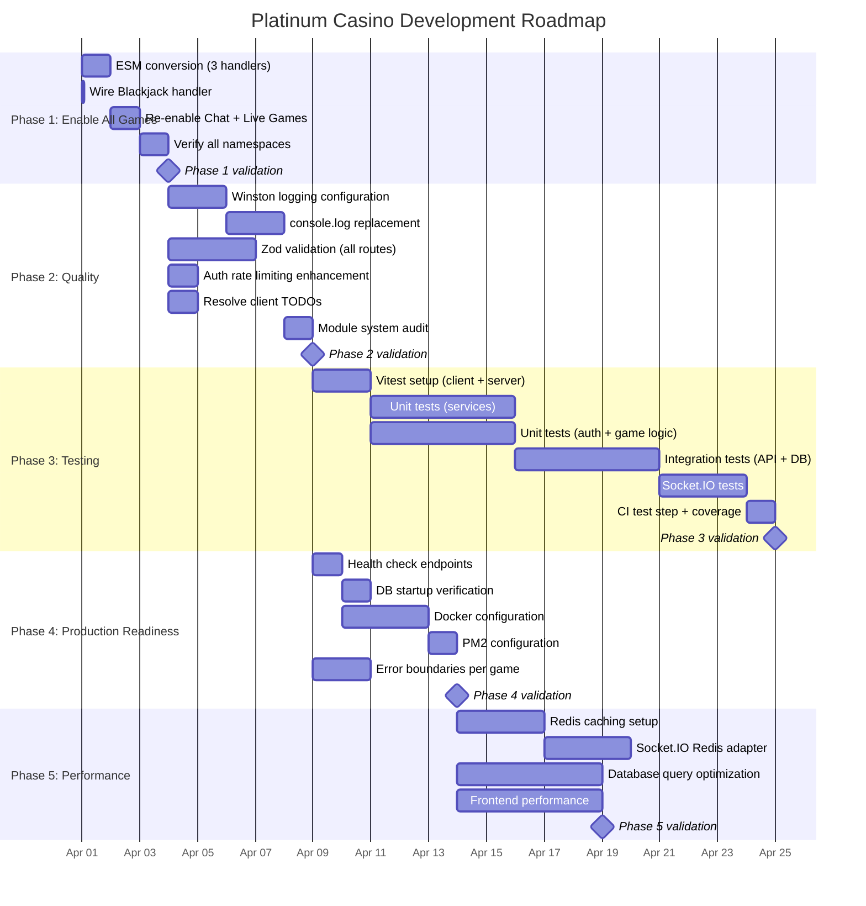
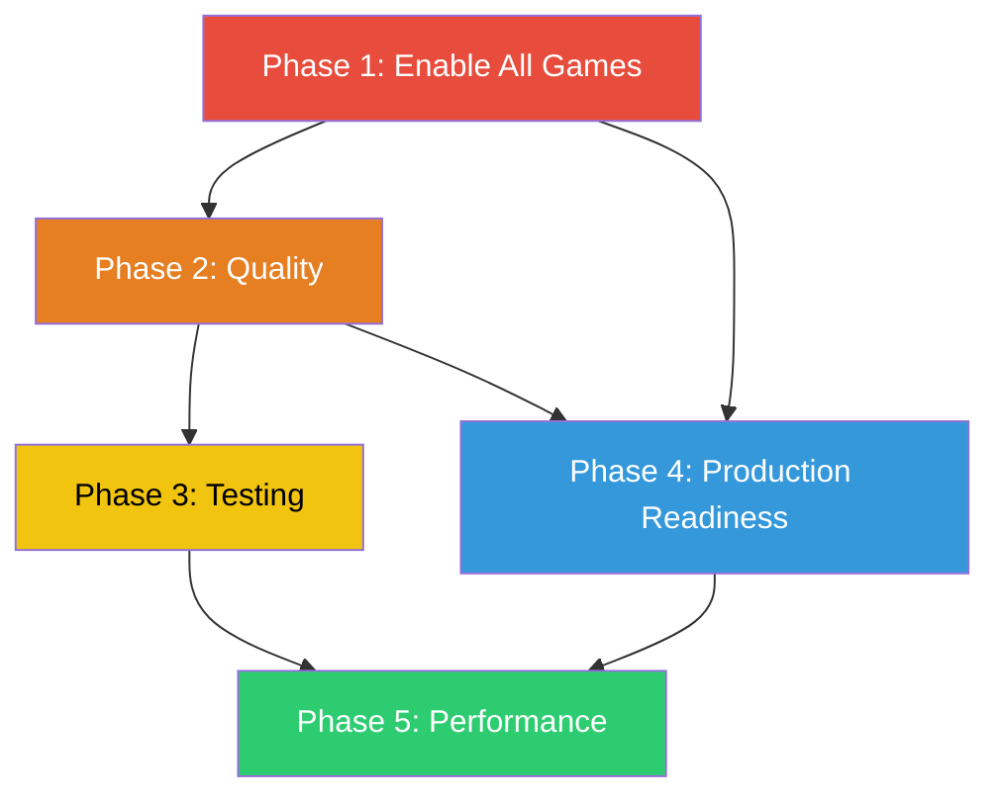

# Development Roadmap

**Last Updated:** March 2026

This roadmap defines the development phases for Platinum Casino, from enabling all games through production readiness. Each phase has explicit dependencies, timeline estimates, success criteria, and risk mitigation strategies.

---

## Gantt Chart

---

## Dependency Chain

**Key dependencies:**
- Phase 2 (Quality) cannot begin until Phase 1 (Enable All Games) is complete, because logging and validation must cover all handlers.
- Phase 3 (Testing) depends on Phase 2, because tests should validate the cleaned-up, validated codebase.
- Phase 4 (Production Readiness) can start in parallel with Phase 3 after Phase 2 is done.
- Phase 5 (Performance) requires both Phase 3 and Phase 4 to establish baselines and infrastructure.

---

## Phase 1: Critical -- Enable All Games

**Priority:** Blocking
**Estimated Effort:** 1-2 days
**Target Start:** Immediate
**Dependencies:** None

The immediate goal is to make all six casino games fully operational.

### Tasks

1. **Convert remaining handlers to ESM**
   - `server/src/socket/landminesHandler.ts` -- Replace all `require()` with `import`, replace `module.exports` with `export default`
   - `server/src/socket/plinkoHandler.ts` -- Same conversion
   - `server/src/socket/wheelHandler.ts` -- Same conversion
   - Remove `seedrandom` require in favor of ESM import
   - Estimated: 4-6 hours for all three handlers

2. **Wire Blackjack handler**
   - Uncomment or add initialization code in the `/blackjack` namespace connection handler
   - Choose initialization pattern (startup init or per-connection init)
   - Test game flow end to end
   - Estimated: 1-2 hours

3. **Uncomment disabled handler imports in `server.ts`**
   - Landmines, Plinko, Wheel handler dynamic imports
   - Rebuild server after changes: `npm run build`
   - Estimated: 30 minutes

4. **Re-enable Chat and Live Games**
   - Uncomment `initChatHandlers(io)` and `initLiveGamesHandlers(io)` in `server.ts`
   - Verify handler files are ESM-compatible
   - Test chat functionality
   - Estimated: 2-4 hours

5. **Verify all namespaces**
   - Confirm each namespace (`/crash`, `/roulette`, `/blackjack`, `/landmines`, `/plinko`, `/wheel`) accepts authenticated connections and processes bets
   - Estimated: 2-3 hours

### Success Criteria

- [ ] All 6 games accept connections and process bets without errors
- [ ] Server starts without ESM import errors
- [ ] Chat and Live Games handlers initialized and functional
- [ ] No commented-out handler imports remain in `server.ts`
- [ ] Each game can complete a full bet-to-payout cycle

### Risks and Mitigation

| Risk | Likelihood | Impact | Mitigation |
|------|-----------|--------|------------|
| ESM conversion breaks handler logic | Medium | High | Test each handler individually after conversion; keep CommonJS backup |
| `seedrandom` ESM import behaves differently | Low | Medium | Pin version and verify deterministic output matches |
| Chat handler has additional dependencies | Medium | Low | Can defer chat to Phase 2 if blocking |

---

## Phase 2: Quality -- Logging, Error Handling, Security

**Priority:** High
**Estimated Effort:** 1 week
**Target Start:** After Phase 1 complete
**Dependencies:** Phase 1

### Tasks

1. **Implement proper logging everywhere**
   - Configure Winston with file and console transports
   - Replace remaining `console.log` calls with `LoggingService` methods across all files
   - Files with known `console.log` usage: `server.ts`, `initGameStats.ts`, `seedDatabase.ts`, `socketAuth.ts`, and 11+ others
   - Add log rotation for file-based logs
   - Estimated: 3 days

2. **Complete TODO items**
   - `client/src/games/crash/CrashGame.jsx` lines 491, 532 -- Add error toast notifications
   - `client/src/games/plinko/PlinkoGame.jsx` line 111 -- Add error notification
   - Use `useToast` from `ToastContext` for all error displays
   - Estimated: 4 hours

3. **Enhance rate limiting**
   - Add auth-specific rate limiter: 5 attempts per 15 minutes on `/api/auth/login` and `/api/auth/register`
   - The global API limiter (120/min) is already in place
   - Estimated: 2 hours

4. **Add input validation**
   - Install Zod for structured request validation (already a peer dependency)
   - Create validation schemas for admin actions, user profile updates, and socket event payloads
   - Apply middleware to all route handlers
   - Estimated: 2 days

5. **Standardize module system**
   - Audit all server files for remaining `require()` / `module.exports` usage
   - Convert to ES module syntax throughout
   - Ensure consistent import paths with `.js` extensions
   - Estimated: 1 day

### Success Criteria

- [ ] Zero `console.log` calls in production code (server and client)
- [ ] Winston configured with file transport and daily rotation
- [ ] All TODO comments in game components resolved
- [ ] Auth endpoints rate-limited independently (already done, verify maintained)
- [ ] Zod validation on all API input routes (auth, admin, user, games, rewards)
- [ ] No `require()` or `module.exports` usage anywhere in server code

### Risks and Mitigation

| Risk | Likelihood | Impact | Mitigation |
|------|-----------|--------|------------|
| Winston file transport causes permission errors in prod | Low | Medium | Test with Docker volume mounts; use configurable log directory |
| Zod schema too strict, breaks existing clients | Medium | Medium | Start with permissive schemas, tighten after testing |
| Log rotation fills disk if misconfigured | Low | High | Set max file count and max file size; add disk space monitoring |

---

## Phase 3: Testing -- Automated Quality Assurance

**Priority:** Medium
**Estimated Effort:** 2 weeks
**Target Start:** After Phase 2 complete
**Dependencies:** Phase 2

### Tasks

1. **Setup Vitest for both client and server**
   - Client: `vitest` + `@testing-library/react` + `@testing-library/jest-dom`
   - Server: `vitest` + `@vitest/coverage-v8`
   - Configure `vitest.config.ts` in both packages
   - Estimated: 1-2 days

2. **Write unit tests**
   - `BalanceService` -- debit, credit, insufficient funds, negative balance prevention, transaction creation
   - `LoggingService` -- event logging, log retrieval, error handling
   - Auth routes -- registration, login, token validation, protected access, rate limiting
   - Game logic -- bet validation, multiplier calculation (crash curve, plinko path, landmines progressive), house edge verification
   - Target: 30+ unit tests
   - Estimated: 5 days

3. **Write integration tests**
   - API endpoint tests with supertest
   - Database operations via test database
   - Socket.IO connection and event tests (socket.io-client in test)
   - Admin CRUD operations end to end
   - Estimated: 5 days

4. **Add CI test step**
   - Update GitHub Actions workflow to run tests after build
   - Add coverage reporting with `@vitest/coverage-v8`
   - Fail pipeline if coverage drops below threshold (50% initial target)
   - Upload coverage report as artifact
   - Estimated: 1 day

### Success Criteria

- [ ] Vitest configured and running in CI for both client and server
- [ ] Unit tests for BalanceService, LoggingService, and all auth routes
- [ ] Integration tests for all REST API endpoint groups
- [ ] Socket.IO connection tests for at least 2 game namespaces
- [ ] Code coverage above 50% on server code
- [ ] CI pipeline fails on test failures and coverage drops

### Risks and Mitigation

| Risk | Likelihood | Impact | Mitigation |
|------|-----------|--------|------------|
| Test database setup is complex | Medium | Medium | Use docker-compose for test MySQL instance; provide setup script |
| Socket.IO tests are flaky due to timing | High | Medium | Use generous timeouts; mock timers for deterministic behavior |
| Coverage target too ambitious for first pass | Medium | Low | Start at 50%, increase to 70% after Phase 4 |
| Tests slow down CI significantly | Low | Medium | Run unit and integration tests in parallel jobs |

---

## Phase 4: Features -- Production Readiness

**Priority:** Medium
**Estimated Effort:** 1-2 weeks
**Target Start:** After Phase 2 complete (can run in parallel with Phase 3)
**Dependencies:** Phase 2 (Phase 1 transitively)

### Tasks

1. **Health check endpoints**
   - `GET /health` -- Application health with uptime, memory usage, and version
   - `GET /api/health/db` -- Database connection verification with latency
   - Return appropriate HTTP status codes (200 ok, 503 unavailable)
   - Estimated: 4 hours

2. **Database startup verification**
   - Prevent the server from accepting connections until `connectDB()` succeeds
   - Add retry logic with exponential backoff for database connection (max 5 retries)
   - Log connection failure details with LoggingService
   - Estimated: 4 hours

3. **Docker configuration**
   - Create `Dockerfile` for the server (Node.js 20 Alpine)
   - Create `Dockerfile` for the client (multi-stage build with nginx)
   - Create `docker-compose.yml` with server, client, and MySQL services
   - Create `.dockerignore` files for both packages
   - Document Docker-based development workflow
   - Estimated: 3 days

4. **PM2 configuration**
   - Create `ecosystem.config.js` with production settings
   - Configure auto-restart, memory limits (512MB), and cluster mode
   - Document PM2 deployment commands
   - Estimated: 4 hours

5. **Error boundaries in games**
   - Wrap each game component in an individual `ErrorBoundary`
   - Prevent a single game crash from taking down the entire application
   - Show user-friendly error message with "Try Again" option
   - Estimated: 1 day

### Success Criteria

- [ ] `GET /health` returns 200 with uptime and version when server is running
- [ ] `GET /api/health/db` returns 200 when database is reachable, 503 when not
- [ ] Server fails gracefully on database unavailability (does not crash)
- [ ] `docker-compose up` starts the full stack (client, server, MySQL)
- [ ] PM2 manages the production server process with auto-restart
- [ ] Each game component has its own error boundary

### Risks and Mitigation

| Risk | Likelihood | Impact | Mitigation |
|------|-----------|--------|------------|
| Docker networking issues between services | Medium | Medium | Use docker-compose service names for internal networking; test on CI |
| PM2 cluster mode breaks Socket.IO | High | High | Use PM2 with `instances: 1` until Redis adapter is configured (Phase 5) |
| Health check exposes sensitive info | Low | Medium | Only return uptime, version, and status; no internal IPs or secrets |

---

## Phase 5: Performance -- Scaling and Optimization

**Priority:** Low
**Estimated Effort:** 2-3 weeks
**Target Start:** After Phase 3 and Phase 4 complete
**Dependencies:** Phase 3, Phase 4

### Tasks

1. **Redis caching**
   - Install Redis and `ioredis` client
   - Cache user sessions to reduce database reads on every socket event
   - Cache game statistics and leaderboard data (TTL: 60 seconds)
   - Cache user balance lookups (TTL: 5 seconds, invalidated on write)
   - Set appropriate TTLs for each cache type
   - Estimated: 3 days

2. **Socket.IO Redis adapter**
   - Install `@socket.io/redis-adapter`
   - Configure pub/sub clients for Socket.IO
   - Enable horizontal scaling across multiple server instances
   - Test multi-instance game state synchronization for Crash (shared game loop)
   - Estimated: 3 days

3. **Database query optimization**
   - Analyze slow queries with MySQL's `EXPLAIN`
   - Add compound indexes for frequent query patterns (userId + createdAt, gameType + status)
   - Implement query result caching for statistics endpoints
   - Identify and resolve N+1 query patterns in admin routes
   - Estimated: 5 days

4. **Frontend performance**
   - Add loading states for all API calls
   - Implement code splitting for game components (React.lazy + Suspense)
   - Optimize bundle size with tree shaking analysis (vite-plugin-visualizer)
   - Add service worker for offline detection and connection status
   - Estimated: 5 days

### Success Criteria

- [ ] Redis caching reduces database read operations by 50%+ for cached endpoints
- [ ] Socket.IO supports 2+ server instances with consistent game state
- [ ] Average API response time under 100ms for cached endpoints
- [ ] Frontend bundle size reduced by 20%+ through code splitting
- [ ] No N+1 query patterns in admin routes
- [ ] All game pages load within 2 seconds on 3G connection

### Risks and Mitigation

| Risk | Likelihood | Impact | Mitigation |
|------|-----------|--------|------------|
| Redis cache invalidation bugs cause stale data | High | High | Conservative TTLs; invalidate on write; add cache bypass header for debugging |
| Socket.IO Redis adapter increases latency | Medium | Medium | Benchmark before/after; only enable for namespaces that need multi-instance support |
| Code splitting increases initial page load complexity | Low | Low | Use prefetching for common game routes |
| Crash game loop doesn't work with multiple instances | High | High | Designate one instance as "game loop leader" or use Redis-based distributed lock |

---

## Future Enhancements

These items are not scheduled but represent potential directions for the project.

| Feature | Description | Estimated Effort | Prerequisites |
|---------|-------------|-----------------|---------------|
| Multi-language support | i18n framework for UI text, initially English and Spanish | 1 week | Phase 2 |
| Achievement system | Player achievements and badges for milestones | 2 weeks | Phase 3 |
| Tournament mode | Scheduled competitions with leaderboards and prize pools | 3 weeks | Phase 5 |
| Mobile applications | React Native clients for iOS and Android | 4-6 weeks | Phase 4 |
| Provably fair verification | Public verification page for game outcome fairness | 1 week | Phase 2 |
| API documentation | OpenAPI/Swagger specification for all endpoints | 3 days | Phase 2 |
| Advanced analytics | Player behavior analytics, revenue tracking, game performance | 2 weeks | Phase 5 |
| Two-factor authentication | TOTP-based 2FA for account security | 1 week | Phase 2 |
| Responsible gaming tools | Deposit limits, self-exclusion, session time reminders | 2 weeks | Phase 3 |

---

## Timeline Summary

| Phase | Duration | Start Condition | Target Completion |
|-------|----------|----------------|-------------------|
| Phase 1: Enable All Games | 1-2 days | Immediate | Week 1 |
| Phase 2: Quality | 1 week | Phase 1 complete | Week 2-3 |
| Phase 3: Testing | 2 weeks | Phase 2 complete | Week 4-5 |
| Phase 4: Production Readiness | 1-2 weeks | Phase 2 complete | Week 4-5 (parallel with Phase 3) |
| Phase 5: Performance | 2-3 weeks | Phase 3 + 4 complete | Week 7-9 |
| **Total estimated:** | **7-9 weeks** | | |

---

## Related Documents

- [Current Status](./current-status.md)
- [Logging](../10-operations/logging.md)
- [Monitoring](../10-operations/monitoring.md)
- [Performance](../10-operations/performance.md)
- [Testing Strategy](../08-testing/testing-strategy.md)
- [Common Issues](../12-troubleshooting/common-issues.md)
- [Project Summary](../01-overview/project-summary.md)
- [CI/CD Pipeline](../06-devops/ci-cd.md)
- [Deployment Guide](../06-devops/deployment.md)
- [Legacy Documents Index](../archive/legacy-docs-index.md)
