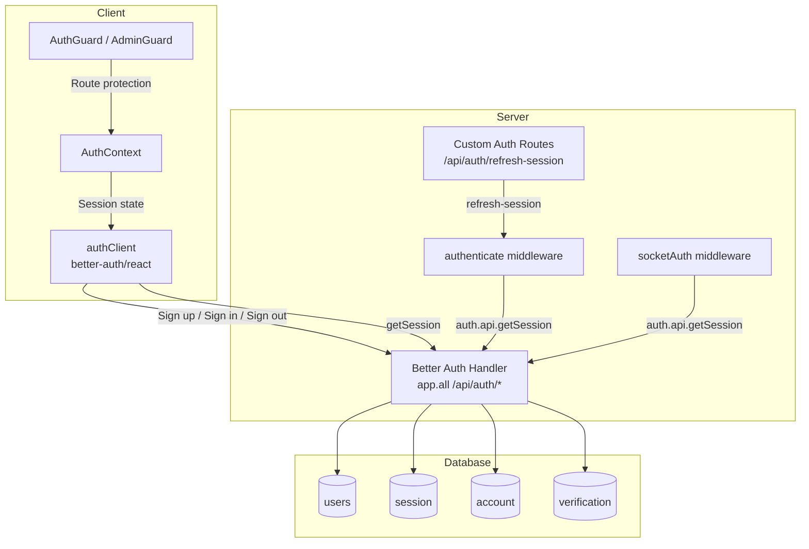
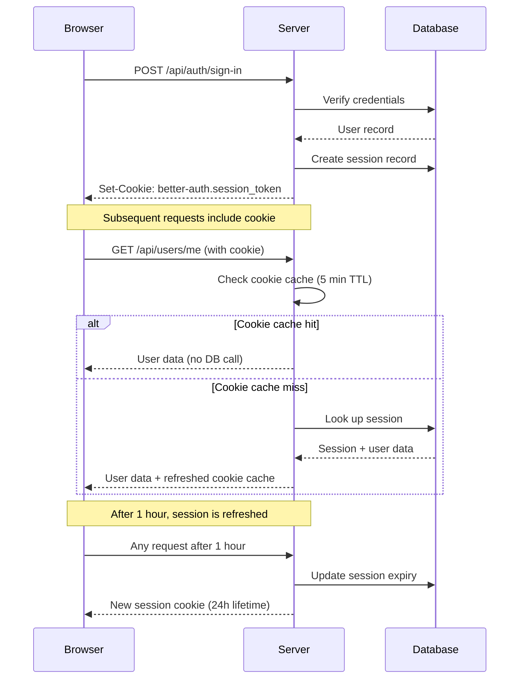
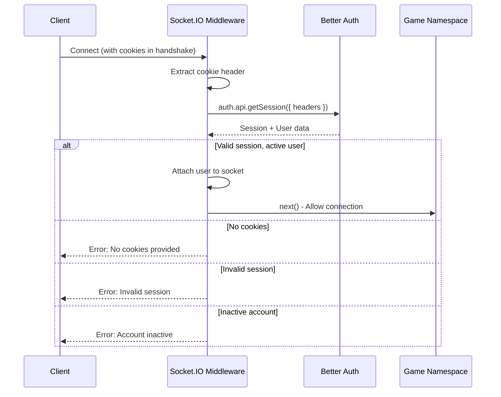

# Better Auth Integration

Platinum Casino uses [Better Auth](https://www.better-auth.com/) for session-based authentication, replacing the previous custom JWT system. Better Auth provides a full-featured auth framework with database-backed sessions, cookie caching, and plugin support.

## Architecture Overview



## Server Configuration

**File:** `server/lib/auth.ts`

The Better Auth instance is configured with the Drizzle ORM adapter, two plugins, custom password hashing, and database hooks:

```typescript
export const auth = betterAuth({
  database: drizzleAdapter(db, {
    provider: "mysql",
    schema: {
      ...schema,
      user: schema.users,
    },
  }),
  basePath: "/api/auth",
  emailAndPassword: {
    enabled: true,
    password: {
      hash: async (password: string) => bcrypt.hash(password, 12),
      verify: async ({ password, hash }: { password: string; hash: string }) =>
        bcrypt.compare(password, hash),
    },
  },
  session: {
    expiresIn: 60 * 60 * 24,    // 24 hours
    updateAge: 60 * 60,          // Refresh every 1 hour
    cookieCache: {
      enabled: true,
      maxAge: 60 * 5,            // Cache cookie for 5 minutes
    },
  },
  plugins: [
    username({ minUsernameLength: 3, maxUsernameLength: 30 }),
    admin({ defaultRole: "user", adminRoles: ["admin"] }),
  ],
  trustedOrigins: [process.env.CLIENT_URL || "http://localhost:5173"],
  databaseHooks: {
    user: {
      create: {
        after: async (user: any) => {
          // Welcome bonus on registration
          const userId = Number(user.id);
          await UserModel.updateById(userId, { balance: "1000" });
          await Balance.create({
            userId,
            amount: "1000",
            previousBalance: "0",
            changeAmount: "1000",
            type: "deposit",
            note: "Welcome bonus - account creation",
            createdAt: new Date(),
          });
        },
      },
    },
  },
});
```

### Configuration Reference

| Setting | Value | Purpose |
|---------|-------|---------|
| `basePath` | `/api/auth` | All Better Auth endpoints are under this path |
| `emailAndPassword.enabled` | `true` | Enable email/password authentication |
| `password.hash` | `bcrypt.hash(password, 12)` | Bcrypt with 12 salt rounds |
| `session.expiresIn` | 86,400 (24 hours) | Maximum session lifetime |
| `session.updateAge` | 3,600 (1 hour) | Session is refreshed after this age |
| `cookieCache.enabled` | `true` | Cache session data in a cookie to reduce DB lookups |
| `cookieCache.maxAge` | 300 (5 minutes) | Cookie cache duration |
| `advanced.database.generateId` | `"serial"` | Use auto-increment IDs instead of UUIDs |
| `trustedOrigins` | `[CLIENT_URL]` | Allowed CORS origins for auth requests |

### Plugins

#### Username Plugin

Adds username-based registration and login alongside email/password:

```typescript
username({
  minUsernameLength: 3,
  maxUsernameLength: 30,
})
```

This plugin adds the `username` field to the user model and provides username-specific sign-up/sign-in endpoints.

#### Admin Plugin

Adds role-based access control:

```typescript
admin({
  defaultRole: "user",
  adminRoles: ["admin"],
})
```

New users receive the `user` role by default. The `admin` role grants access to admin-only endpoints and the admin dashboard.

### Password Hashing

Passwords are hashed using bcrypt with 12 salt rounds:

```typescript
password: {
  hash: async (password: string) => bcrypt.hash(password, 12),
  verify: async ({ password, hash }) => bcrypt.compare(password, hash),
},
```

The `bcryptjs` library is used (pure JavaScript implementation, no native dependencies).

### Database Hooks

A post-creation hook grants every new user a 1000-credit welcome bonus:

1. Update the user's `balance` field to `"1000"`
2. Create a `balances` record with type `deposit` and note `"Welcome bonus - account creation"`

This ensures the balance and balance-history records are consistent from the moment of account creation.

### User Model Extensions

Better Auth manages core user fields, but the `users` table includes additional columns exposed via `additionalFields`:

```typescript
user: {
  modelName: "users",
  additionalFields: {
    passwordHash: { type: "string", required: false, input: false },
    balance:      { type: "string", required: false, defaultValue: "0", input: false },
    avatar:       { type: "string", required: false, defaultValue: "", input: false },
    isActive:     { type: "boolean", required: false, defaultValue: true, input: false },
    lastLogin:    { type: "date", required: false, input: false },
  },
},
```

All additional fields have `input: false`, meaning they cannot be set by the client during registration. They are managed server-side only.

## Session Management



### Session Lifecycle

| Phase | Duration | What Happens |
|-------|----------|------------|
| Creation | On sign-in | Session record created in `session` table; cookie set on response |
| Cookie cache | 5 minutes | Session data cached in cookie, no DB lookup needed |
| Refresh | Every 1 hour | Session expiry extended to a new 24-hour window |
| Expiry | After 24 hours | Session becomes invalid; user must sign in again |

### Cookie Cache

The cookie cache is an optimization that embeds session data directly in the cookie, reducing database lookups for session validation. With a 5-minute cache window, the database is consulted at most once every 5 minutes per user, rather than on every request.

## Environment Variables

| Variable | Required | Default | Purpose |
|----------|----------|---------|---------|
| `BETTER_AUTH_SECRET` | Yes | None | Secret for signing session tokens (32+ characters) |
| `BETTER_AUTH_URL` | No | `http://localhost:5000` | Base URL for auth endpoints |
| `CLIENT_URL` | No | `http://localhost:5173` | Trusted origin for CORS |

Generate a production secret:

```bash
openssl rand -base64 32
```

## Route Registration Order

The ordering of auth-related routes in `server/server.ts` is critical:

```typescript
// 1. Custom auth routes FIRST (takes priority for matching paths)
app.use('/api/auth', authRoutes);

// 2. Better Auth catch-all SECOND
app.all("/api/auth/*", toNodeHandler(auth));

// 3. express.json() and other middleware AFTER Better Auth
app.use(express.json());
```

This order matters because:
1. Custom routes like `/api/auth/refresh-session` must be matched before the Better Auth wildcard handler consumes them
2. Better Auth handles its own body parsing, so `express.json()` must come after to avoid double-parsing

## REST Middleware (authenticate)

**File:** `server/middleware/auth.ts`

The `authenticate` middleware validates Better Auth sessions for protected API routes:

```typescript
export const authenticate = async (req, res, next) => {
  const session = await auth.api.getSession({
    headers: fromNodeHeaders(req.headers),
  });

  if (!session || !session.user) {
    return res.status(401).json({ message: 'No valid session, authorization denied' });
  }

  if ((session.user as any).isActive === false) {
    return res.status(401).json({ message: 'Account is disabled' });
  }

  (req as AuthenticatedRequest).user = {
    userId: Number(session.user.id),
    username: (session.user as any).username || session.user.name,
    role: (session.user.role as 'user' | 'admin') || 'user',
  };

  next();
};
```

The middleware converts the Better Auth session into the `{ userId, username, role }` shape expected by all downstream route handlers, maintaining backward compatibility with the rest of the codebase.

### Role-Based Middleware

| Middleware | File | Check |
|-----------|------|-------|
| `authenticate` | `server/middleware/auth.ts` | Valid session + active account |
| `adminOnly` | `server/middleware/auth.ts` | `req.user.role === 'admin'` |
| `userOrAdmin` | `server/middleware/auth.ts` | `req.user.role` is `'user'` or `'admin'` |

## Socket.IO Authentication

**File:** `server/middleware/socket/socketAuth.ts`

WebSocket connections authenticate using the same Better Auth sessions. The `socketAuth` middleware extracts session cookies from the Socket.IO handshake headers and validates them through `auth.api.getSession()`:



The middleware attaches user data to the socket in the shape all game handlers expect:

```typescript
(socket as any).user = {
  userId: Number(session.user.id),
  username: (session.user as any).username || session.user.name,
  role: (session.user.role as string) || 'user',
  balance: parseFloat((session.user as any).balance || '0'),
  isActive: (session.user as any).isActive,
};
```

The `getAuthenticatedUser()` helper function retrieves this data from a socket:

```typescript
export const getAuthenticatedUser = (socket: Socket) => {
  return (socket as any).user || null;
};
```

## Client-Side Integration

**File:** `client/src/lib/auth-client.js`

The client uses Better Auth's React SDK:

```javascript
import { createAuthClient } from "better-auth/react";
import { usernameClient } from "better-auth/client/plugins";
import { adminClient } from "better-auth/client/plugins";

const baseURL = import.meta.env.VITE_API_URL
  ? import.meta.env.VITE_API_URL.replace(/\/api$/, "")
  : "http://localhost:5000";

export const authClient = createAuthClient({
  baseURL,
  plugins: [usernameClient(), adminClient()],
});
```

The client SDK provides React hooks for authentication operations:

| Hook / Method | Purpose |
|--------------|---------|
| `authClient.signUp.email()` | Register a new user |
| `authClient.signIn.username()` | Sign in with username/password |
| `authClient.signOut()` | End the current session |
| `authClient.useSession()` | React hook for current session state |

### Socket.IO Client Authentication

Socket.IO clients connect with `withCredentials: true` to include session cookies in the WebSocket handshake. The browser automatically sends the Better Auth session cookie, and the `socketAuth` middleware on the server validates it:

```javascript
const socket = io('/crash', {
  withCredentials: true,
  // No explicit token needed - cookies are sent automatically
});
```

## Migration from JWT

Better Auth replaced a custom JWT authentication system. Key differences:

| Aspect | Previous (JWT) | Current (Better Auth) |
|--------|---------------|----------------------|
| Token storage | HTTP-only cookie (`authToken`) | HTTP-only cookie (managed by Better Auth) |
| Session state | Stateless (JWT payload) | Database-backed sessions (`session` table) |
| Token refresh | Not automatic | Automatic after `updateAge` (1 hour) |
| Revocation | Not possible without blocklist | Immediate (delete session record) |
| Password hashing | bcrypt (12 rounds) | bcrypt (12 rounds) -- unchanged |
| User model | Custom fields only | Better Auth core + `additionalFields` |
| Socket auth | JWT verification | `auth.api.getSession()` with cookie headers |

### Database Tables Added by Better Auth

| Table | Purpose |
|-------|---------|
| `session` | Active user sessions with expiry tracking |
| `account` | OAuth/credential account linking |
| `verification` | Email/phone verification tokens |

These tables are managed by Better Auth and defined in `server/drizzle/schema.ts`.

## Database Schema

Better Auth uses the existing `users` table (mapped via `modelName: "users"`) and manages the `session`, `account`, and `verification` tables. The schema for all tables is defined in `server/drizzle/schema.ts`.

## Key Files

| File | Purpose |
|------|---------|
| `server/lib/auth.ts` | Better Auth configuration (plugins, hooks, session settings) |
| `server/middleware/auth.ts` | `authenticate`, `adminOnly`, `userOrAdmin` middleware for REST routes |
| `server/middleware/socket/socketAuth.ts` | Socket.IO session authentication middleware |
| `server/routes/auth.ts` | Custom auth routes (refresh-session) |
| `server/server.ts` | Route registration order and Better Auth handler mount |
| `client/src/lib/auth-client.js` | Client-side Better Auth SDK setup |
| `client/src/contexts/AuthContext.jsx` | React context wrapping auth state |
| `client/src/components/guards/AuthGuard.jsx` | Route guard for authenticated users |
| `client/src/components/guards/AdminGuard.jsx` | Route guard for admin users |

---

## Related Documents

- [Authentication Feature](../03-features/authentication.md) -- Feature-level auth documentation
- [Socket.IO Architecture](./socket-io-architecture.md) -- How socketAuth fits into namespace connections
- [Security Overview](../07-security/security-overview.md) -- Security policies and practices
- [Environment Variables](../07-security/environment-variables.md) -- Auth-related env vars
- [Database Schema](../09-database/schema.md) -- Users, session, account, verification tables
- [Docker Setup](./docker-setup.md) -- BETTER_AUTH_SECRET in container environments
