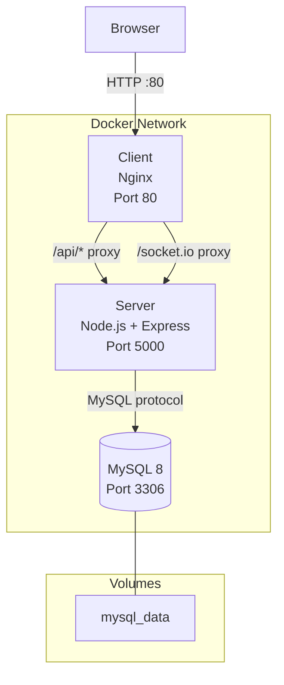
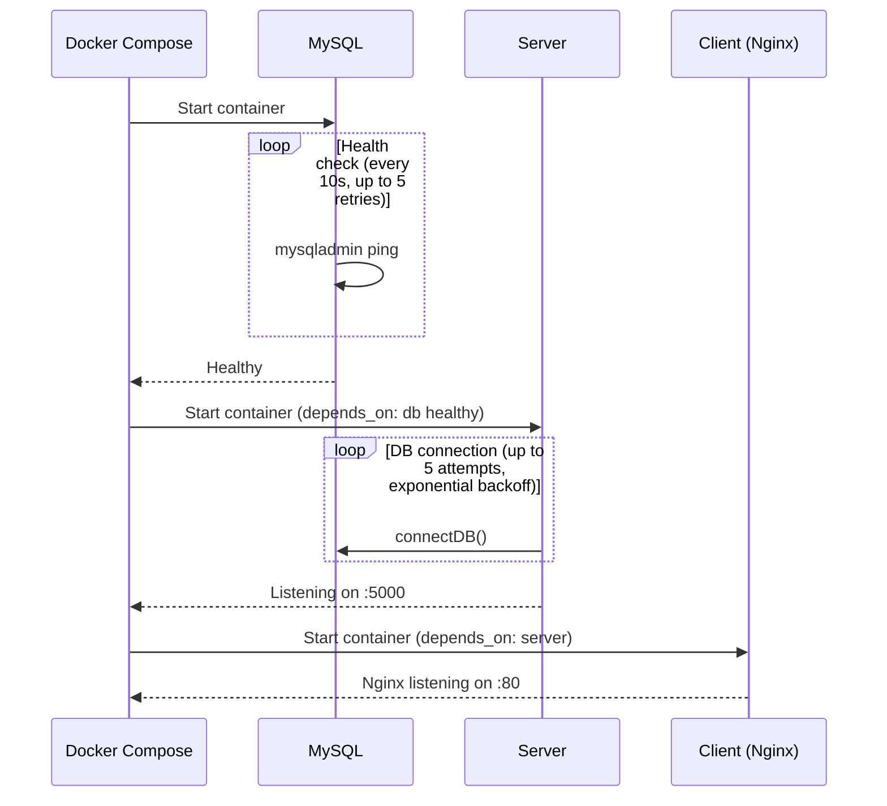

# Docker Setup

Platinum Casino provides Docker Compose configurations for both production and development workflows. The production compose file runs the full stack (MySQL, server, client), while the development compose file provides only the database service for local development.

## Service Architecture



## Compose Files

### Production: `docker-compose.yml`

The production compose file runs all three services:

```yaml
version: '3.8'

services:
  db:
    image: mysql:8
    restart: unless-stopped
    environment:
      MYSQL_ROOT_PASSWORD: ${DB_ROOT_PASSWORD:-casino_root_pass}
      MYSQL_DATABASE: ${DB_NAME:-platinum_casino}
      MYSQL_USER: ${DB_USER:-casino_user}
      MYSQL_PASSWORD: ${DB_PASSWORD:-casino_pass}
    ports:
      - "3306:3306"
    volumes:
      - mysql_data:/var/lib/mysql
    healthcheck:
      test: ["CMD", "mysqladmin", "ping", "-h", "localhost"]
      interval: 10s
      timeout: 5s
      retries: 5

  server:
    build:
      context: ./server
      dockerfile: Dockerfile
    restart: unless-stopped
    ports:
      - "5000:5000"
    environment:
      PORT: 5000
      CLIENT_URL: http://localhost
      DATABASE_URL: mysql://${DB_USER:-casino_user}:${DB_PASSWORD:-casino_pass}@db:3306/${DB_NAME:-platinum_casino}
      BETTER_AUTH_SECRET: ${BETTER_AUTH_SECRET:-change-this-to-a-secure-secret-in-production}
      BETTER_AUTH_URL: http://localhost:5000
      NODE_ENV: ${NODE_ENV:-production}
    depends_on:
      db:
        condition: service_healthy

  client:
    build:
      context: ./client
      dockerfile: Dockerfile
    restart: unless-stopped
    ports:
      - "80:80"
    depends_on:
      - server

volumes:
  mysql_data:
```

### Development: `docker-compose.dev.yml`

The development compose file provides only the MySQL database. You run the server and client locally for hot-reload during development:

```yaml
version: '3.8'

services:
  db:
    image: mysql:8
    restart: unless-stopped
    environment:
      MYSQL_ROOT_PASSWORD: root
      MYSQL_DATABASE: platinum_casino
      MYSQL_USER: casino_user
      MYSQL_PASSWORD: casino_pass
    ports:
      - "3306:3306"
    volumes:
      - mysql_data_dev:/var/lib/mysql
    healthcheck:
      test: ["CMD", "mysqladmin", "ping", "-h", "localhost"]
      interval: 10s
      timeout: 5s
      retries: 5

volumes:
  mysql_data_dev:
```

## Service Details

### MySQL Database (`db`)

| Setting | Production | Development |
|---------|-----------|-------------|
| Image | `mysql:8` | `mysql:8` |
| Port | 3306:3306 | 3306:3306 |
| Root password | `${DB_ROOT_PASSWORD:-casino_root_pass}` | `root` |
| Database name | `${DB_NAME:-platinum_casino}` | `platinum_casino` |
| User | `${DB_USER:-casino_user}` | `casino_user` |
| Password | `${DB_PASSWORD:-casino_pass}` | `casino_pass` |
| Volume | `mysql_data` | `mysql_data_dev` |

The health check runs `mysqladmin ping` every 10 seconds with 5 retries. The server service depends on this health check via `condition: service_healthy`, ensuring the database is ready before the server starts.

### Server (`server`)

**Dockerfile:** `server/Dockerfile`

Multi-stage build:

```dockerfile
# Build stage
FROM node:20-alpine AS builder
WORKDIR /app
COPY package*.json ./
RUN npm install
COPY . .
# tsc emits JS even with type errors (noEmitOnError defaults to false)
# Pre-existing TS errors in models from Better Auth migration - safe to ignore
RUN npm run build || true
RUN test -f dist/server.js

# Production stage
FROM node:20-alpine
WORKDIR /app
ENV NODE_ENV=production
COPY package*.json ./
RUN npm install --omit=dev
COPY --from=builder /app/dist ./dist
COPY --from=builder /app/drizzle ./drizzle
EXPOSE 5000
HEALTHCHECK --interval=30s --timeout=10s --start-period=5s --retries=3 \
  CMD wget --no-verbose --tries=1 --spider http://localhost:5000/health || exit 1
CMD ["node", "dist/server.js"]
```

Key details:
- **Build stage:** Compiles TypeScript to `dist/`. The `|| true` allows the build to continue past non-critical type errors from the Better Auth migration
- **Validation:** `test -f dist/server.js` ensures the compiled entry point exists even if `tsc` reported errors
- **Production stage:** Installs only production dependencies (`--omit=dev`)
- **Drizzle copy:** The `drizzle/` directory is copied for schema access at runtime
- **Health check:** Pings `/health` every 30 seconds with a 5-second startup grace period

### Client (`client`)

**Dockerfile:** `client/Dockerfile`

Multi-stage build with Nginx:

```dockerfile
# Build stage
FROM node:20-alpine AS builder
WORKDIR /app
COPY package*.json ./
RUN npm install
COPY . .
RUN npm run build

# Production stage with nginx
FROM nginx:alpine
COPY --from=builder /app/dist /usr/share/nginx/html
COPY nginx.conf /etc/nginx/conf.d/default.conf
EXPOSE 80
HEALTHCHECK --interval=30s --timeout=10s --start-period=5s --retries=3 \
  CMD wget --no-verbose --tries=1 --spider http://localhost:80 || exit 1
CMD ["nginx", "-g", "daemon off;"]
```

Key details:
- **Build stage:** Runs `npm run build` (Vite production build) to produce static assets in `dist/`
- **Production stage:** Serves static files with Nginx Alpine
- **Health check:** Pings the Nginx server every 30 seconds

## `.dockerignore` Files

Both `client/.dockerignore` and `server/.dockerignore` contain the same entries, keeping the build context small:

```
node_modules
dist
.env
*.log
.git
```

This ensures that local `node_modules`, pre-built `dist` output, environment files with secrets, log files, and git history are excluded from the Docker build context.

## Nginx Configuration

**File:** `client/nginx.conf`

```nginx
server {
    listen 80;
    server_name localhost;
    root /usr/share/nginx/html;
    index index.html;

    # Gzip compression
    gzip on;
    gzip_vary on;
    gzip_min_length 1024;
    gzip_types text/plain text/css application/json application/javascript
               text/xml application/xml text/javascript image/svg+xml;

    # SPA fallback - serve index.html for all routes
    location / {
        try_files $uri $uri/ /index.html;
    }

    # Cache static assets
    location ~* \.(js|css|png|jpg|jpeg|gif|ico|svg|woff|woff2|ttf|eot)$ {
        expires 1y;
        add_header Cache-Control "public, immutable";
    }

    # Proxy API requests to server
    location /api {
        proxy_pass http://server:5000;
        proxy_http_version 1.1;
        proxy_set_header Upgrade $http_upgrade;
        proxy_set_header Connection 'upgrade';
        proxy_set_header Host $host;
        proxy_cache_bypass $http_upgrade;
    }

    # Proxy WebSocket connections
    location /socket.io {
        proxy_pass http://server:5000;
        proxy_http_version 1.1;
        proxy_set_header Upgrade $http_upgrade;
        proxy_set_header Connection "upgrade";
        proxy_set_header Host $host;
    }
}
```

### Nginx Responsibilities

| Feature | Configuration |
|---------|--------------|
| **SPA routing** | `try_files $uri $uri/ /index.html` -- serves `index.html` for all non-file routes |
| **Gzip** | Compresses text, JSON, JavaScript, CSS, SVG above 1024 bytes |
| **Static asset caching** | 1-year cache with `public, immutable` for fingerprinted assets |
| **API proxy** | Forwards `/api/*` requests to `http://server:5000` |
| **WebSocket proxy** | Forwards `/socket.io/*` to the server with HTTP upgrade headers |

### Container Networking

Inside the Docker network, services reference each other by their compose service name:
- The Nginx config uses `http://server:5000` to reach the backend
- The server uses `db:3306` in its `DATABASE_URL` to reach MySQL
- The client container exposes port 80 to the host

## Environment Variables

### `.env.docker`

The `.env.docker` file is intended for Docker Compose variable substitution:

```bash
MYSQL_ROOT_PASSWORD=casino_root_pass
MYSQL_DATABASE=casino
MYSQL_USER=casino_user
MYSQL_PASSWORD=casino_pass
JWT_SECRET=change-me-in-production-use-a-long-random-string
```

> **Warning: Variable name mismatch.** The `.env.docker` file currently has two issues that need to be corrected:
>
> 1. **Stale `JWT_SECRET`:** The project has migrated from custom JWT auth to Better Auth. This variable should be renamed to `BETTER_AUTH_SECRET` to match what `docker-compose.yml` expects.
>
> 2. **Different variable names:** The compose file uses `DB_ROOT_PASSWORD`, `DB_NAME`, `DB_USER`, and `DB_PASSWORD` for substitution, but `.env.docker` uses `MYSQL_ROOT_PASSWORD`, `MYSQL_DATABASE`, `MYSQL_USER`, and `MYSQL_PASSWORD`. These names do not match, so the values in `.env.docker` are **not** picked up by the compose file's `${DB_*}` substitutions. The compose file falls back to its own hardcoded defaults (which happen to match), so the system still works -- but overriding values via `.env.docker` will have no effect unless the variable names are corrected.
>
> A corrected `.env.docker` would look like:
> ```bash
> DB_ROOT_PASSWORD=casino_root_pass
> DB_NAME=platinum_casino
> DB_USER=casino_user
> DB_PASSWORD=casino_pass
> BETTER_AUTH_SECRET=change-me-in-production-use-a-long-random-string
> ```

### Server Environment in Docker

| Variable | Value | Purpose |
|----------|-------|---------|
| `PORT` | `5000` | Express server port |
| `CLIENT_URL` | `http://localhost` | CORS origin (port 80 via Nginx) |
| `DATABASE_URL` | `mysql://casino_user:casino_pass@db:3306/platinum_casino` | MySQL connection via Docker network |
| `BETTER_AUTH_SECRET` | From compose or `.env.docker` | Session signing secret |
| `BETTER_AUTH_URL` | `http://localhost:5000` | Better Auth base URL |
| `NODE_ENV` | `production` | Node environment |

Note that `CLIENT_URL` is set to `http://localhost` (port 80) in Docker because the Nginx container serves the client on port 80 and proxies API requests to the server.

## Usage

### Production

```bash
# Start all services
docker-compose up --build

# Start in detached mode
docker-compose up --build -d

# View logs
docker-compose logs -f server

# Stop all services
docker-compose down

# Stop and remove volumes (deletes database data)
docker-compose down -v
```

### Development (Database Only)

```bash
# Start only the MySQL database
docker-compose -f docker-compose.dev.yml up -d

# Then run server and client locally
cd server && npm run dev
cd client && npm run dev
```

The development compose file uses a separate volume (`mysql_data_dev`) so production and development data do not interfere with each other.

### Custom Environment

```bash
# Use custom env file
docker-compose --env-file .env.docker up --build

# Override specific variables
DB_ROOT_PASSWORD=mypassword BETTER_AUTH_SECRET=my-secret docker-compose up --build
```

### Makefile Targets

The project `Makefile` provides shorthand targets for Docker operations:

| Target | Command | Description |
|--------|---------|-------------|
| `make docker` | `docker-compose up --build` | Build and start all production services |
| `make docker-down` | `docker-compose down` | Stop all services |
| `make docker-dev` | `docker-compose -f docker-compose.dev.yml up -d` | Start development database in detached mode |

## Volume Strategy

| Volume | Compose File | Purpose |
|--------|-------------|---------|
| `mysql_data` | `docker-compose.yml` | Persist production database data across container restarts |
| `mysql_data_dev` | `docker-compose.dev.yml` | Persist development database data separately |

Both volumes are named volumes managed by Docker. Data survives `docker-compose down` but is removed by `docker-compose down -v`.

## Health Checks

| Service | Endpoint | Interval | Timeout | Start Period | Retries |
|---------|----------|----------|---------|-------------|---------|
| MySQL | `mysqladmin ping` | 10s | 5s | -- | 5 |
| Server | `GET /health` | 30s | 10s | 5s | 3 |
| Client (Nginx) | `GET /` | 30s | 10s | 5s | 3 |

The server's `depends_on` uses `condition: service_healthy` to wait for MySQL to be ready before starting. Additionally, the server has its own startup retry logic that attempts to connect to the database up to 5 times with exponential backoff.

## Startup Order



---

## Related Documents

- [Getting Started](../05-development/getting-started.md) -- Local development setup
- [Deployment](../06-devops/deployment.md) -- Production deployment guide
- [CI/CD](../06-devops/ci-cd.md) -- CI pipeline configuration
- [Environment Variables](../07-security/environment-variables.md) -- Full env var reference
- [Redis Integration](./redis-integration.md) -- Adding Redis as a Docker service
- [Better Auth Integration](./better-auth-integration.md) -- Auth configuration in Docker
