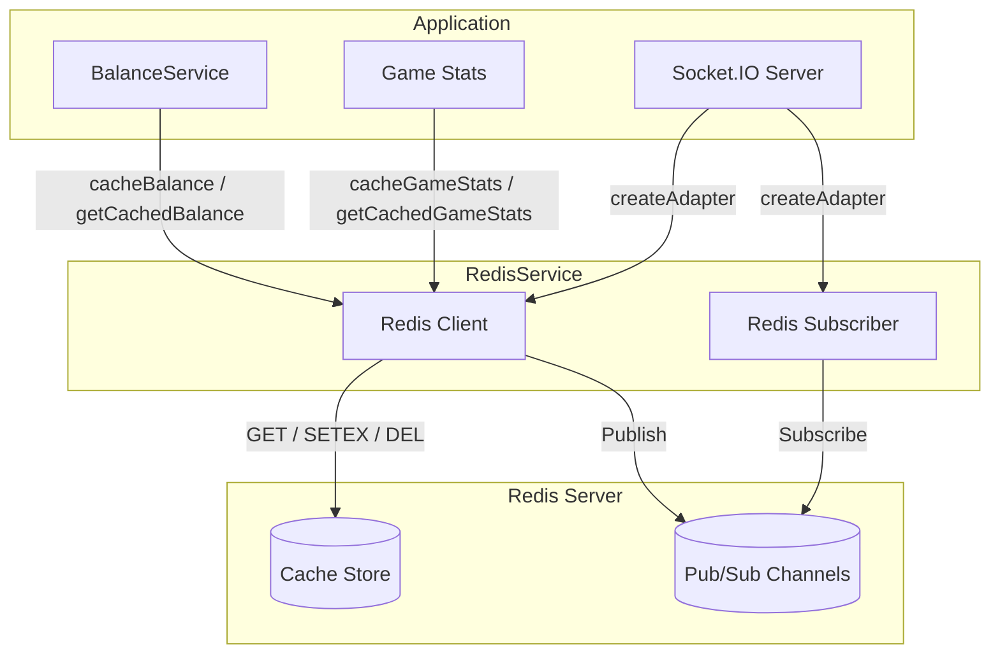
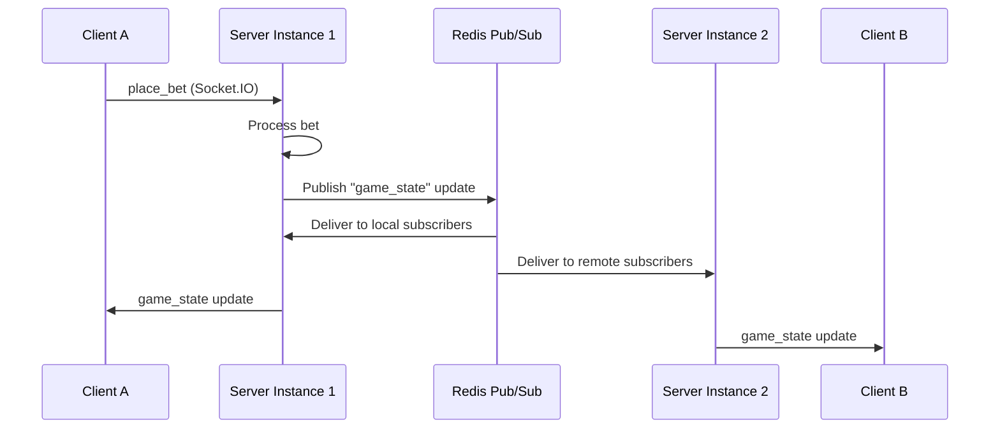

# Redis Integration

Redis provides optional caching and horizontal scaling capabilities for Platinum Casino. The integration is designed for **graceful degradation** -- the application runs fully without Redis and transparently gains caching and multi-instance support when Redis is available.

## Architecture Overview



## Configuration

Redis is configured through a single environment variable in `server/.env`:

```bash
# Optional - omit or leave empty to run without Redis
REDIS_URL=redis://localhost:6379
```

When `REDIS_URL` is not set, `RedisService.getClient()` returns `null` and all caching operations become no-ops. No errors are thrown and no log noise is generated.

## RedisService Architecture

**File:** `server/src/services/redisService.ts`

The service is implemented as a static class with two separate ioredis client instances:

| Client | Purpose | Created by |
|--------|---------|------------|
| `client` | General caching (GET, SET, DEL) | `getClient()` |
| `subscriber` | Socket.IO Redis adapter (Pub/Sub) | `getSubscriber()` |

Two clients are required because ioredis clients in subscriber mode cannot execute regular commands, and the Socket.IO Redis adapter requires a dedicated subscriber connection.

### Client Initialization

Both clients use **lazy connection** -- the Redis connection is not established until the first call to `getClient()` or `getSubscriber()`:

```typescript
this.client = new Redis(redisUrl, {
  maxRetriesPerRequest: 3,
  retryStrategy(times) {
    if (times > 3) return null;  // Stop retrying after 3 attempts
    return Math.min(times * 200, 2000);  // Exponential backoff: 200ms, 400ms, 600ms
  },
  lazyConnect: true,
});
```

Key configuration options:

| Option | Value | Purpose |
|--------|-------|---------|
| `maxRetriesPerRequest` | 3 | Limits retries per individual Redis command |
| `retryStrategy` | Exponential backoff, max 3 attempts | Controls reconnection behavior |
| `lazyConnect` | `true` | Defers TCP connection until `.connect()` is called |

### Connection Retry Strategy

The retry strategy uses exponential backoff with a hard stop:

1. **Attempt 1:** Wait 200ms, then retry
2. **Attempt 2:** Wait 400ms, then retry
3. **Attempt 3:** Wait 600ms (capped at 2000ms), then retry
4. **Attempt 4+:** Return `null` to stop retrying

When the connection fails, the client reference is set to `null` and the service silently falls back to no-op behavior.

## Core Methods

### Generic Cache Operations

```typescript
// Set a value with optional TTL (seconds)
static async set(key: string, value: any, ttlSeconds?: number): Promise<void>

// Get a cached value (returns null if not found or Redis unavailable)
static async get<T = any>(key: string): Promise<T | null>

// Delete a cached value
static async del(key: string): Promise<void>
```

All methods serialize values as JSON. All methods silently catch errors -- cache operations are best-effort and never throw.

### Balance Caching

```typescript
// Cache a user's balance with 5-second TTL
static async cacheBalance(userId: string, balance: number): Promise<void>

// Retrieve cached balance (returns null on miss)
static async getCachedBalance(userId: string): Promise<number | null>

// Explicitly invalidate a user's cached balance
static async invalidateBalance(userId: string): Promise<void>
```

**Key format:** `balance:{userId}`

**TTL:** 5 seconds

Balance caching is used by `BalanceService` in two places:

1. **`getBalance()`** -- checks cache before querying the database, caches the result on miss
2. **`hasSufficientBalance()`** -- uses cached balance for a quick "fast path" check; always falls through to the database for the authoritative answer
3. **`updateBalance()`** -- invalidates the cache after every successful balance mutation

The short 5-second TTL ensures stale reads are bounded while still reducing database load during rapid balance checks (common during active gameplay).

### Game Stats Caching

```typescript
// Cache aggregated game statistics with 60-second TTL
static async cacheGameStats(stats: any): Promise<void>

// Retrieve cached game statistics
static async getCachedGameStats(): Promise<any | null>
```

**Key format:** `game_stats`

**TTL:** 60 seconds

Game statistics change less frequently than balances, so a longer cache window is appropriate. The admin dashboard queries these stats repeatedly, and the 60-second TTL prevents redundant aggregation queries.

### Connection Lifecycle

```typescript
// Close both client and subscriber connections gracefully
static async close(): Promise<void>
```

Called during server shutdown (SIGINT / SIGTERM handlers in `server.ts`) to ensure clean disconnection:

```typescript
process.on('SIGINT', async () => {
  await RedisService.close();
  await closeDB();
  process.exit(0);
});
```

## Socket.IO Redis Adapter

When Redis is available, the server configures the `@socket.io/redis-adapter` for horizontal scaling. This allows multiple server instances to broadcast Socket.IO events across all connected clients, regardless of which instance they are connected to.

**File:** `server/server.ts`

```typescript
(async () => {
  try {
    const pubClient = RedisService.getClient();
    const subClient = RedisService.getSubscriber();
    if (pubClient && subClient) {
      const { createAdapter } = await import('@socket.io/redis-adapter');
      io.adapter(createAdapter(pubClient, subClient));
      LoggingService.logSystemEvent('redis_adapter_enabled', {});
    }
  } catch (err) {
    LoggingService.logSystemEvent('redis_adapter_skipped', { reason: String(err) });
  }
})();
```

### How It Works



Without the Redis adapter, Socket.IO events only reach clients connected to the same server instance. With the adapter, events are published to Redis Pub/Sub channels, and all server instances subscribe to those channels, ensuring all clients see the same game state.

### When the Adapter Is Skipped

The adapter setup is wrapped in a try-catch and only activates when both `getClient()` and `getSubscriber()` return non-null values. If Redis is unavailable, the log entry `redis_adapter_skipped` is recorded and the server operates in single-instance mode.

## Graceful Degradation

The entire Redis integration is designed so that **no code path depends on Redis being available**. The degradation strategy is:

| Scenario | Without Redis | With Redis |
|----------|--------------|------------|
| Balance reads | Direct database query every time | Cached for 5 seconds, reducing DB load |
| Balance writes | Database only | Database + cache invalidation |
| Game stats | Database aggregation query | Cached for 60 seconds |
| Socket.IO events | Single-instance only | Cross-instance via Pub/Sub adapter |
| Sufficient balance check | Database query | Fast-path cache check, DB fallback |

### Error Handling Philosophy

Every Redis operation follows the same pattern:

```typescript
try {
  // Attempt Redis operation
} catch {
  // Silently fail - cache is best-effort
}
```

This means:
- A Redis outage never causes a 500 error
- A Redis timeout never blocks a game action
- Redis connection failures are logged but do not affect application startup

## Cache Key Reference

| Key Pattern | TTL | Used By | Purpose |
|-------------|-----|---------|---------|
| `balance:{userId}` | 5s | `BalanceService` | Cache user balance for rapid reads |
| `game_stats` | 60s | Admin routes | Cache aggregated game statistics |

## Testing

Redis integration is tested with mocked ioredis clients:

**File:** `server/src/__tests__/redisService.test.ts`

The test suite verifies:
- Cache operations with and without TTL
- Balance caching with the correct 5-second TTL
- Game stats caching with the correct 60-second TTL
- Graceful degradation when `REDIS_URL` is not configured
- All methods returning safe defaults (null/undefined) when Redis is unavailable

```bash
cd server
npm run test -- --grep "RedisService"
```

---

## Related Documents

- [System Architecture](../02-architecture/system-architecture.md) -- Overall system design
- [Socket.IO Architecture](./socket-io-architecture.md) -- Namespace design and Redis adapter usage
- [Balance System](../03-features/balance-system.md) -- Balance caching integration
- [Docker Setup](./docker-setup.md) -- Adding Redis to the Docker Compose stack
- [Environment Variables](../07-security/environment-variables.md) -- REDIS_URL configuration
- [Performance](../10-operations/performance.md) -- Caching performance characteristics
