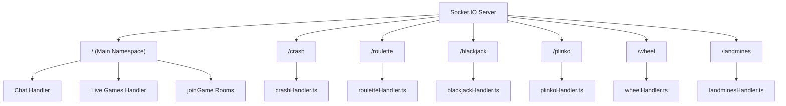
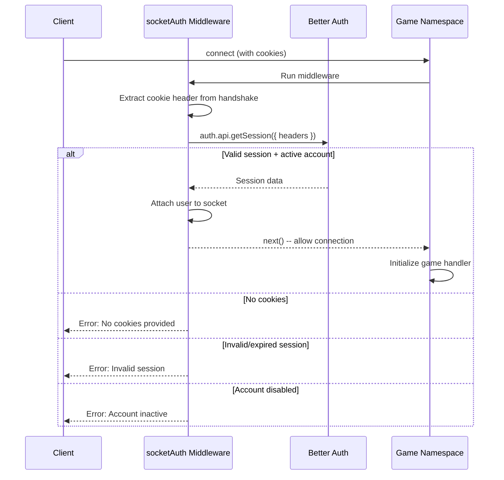
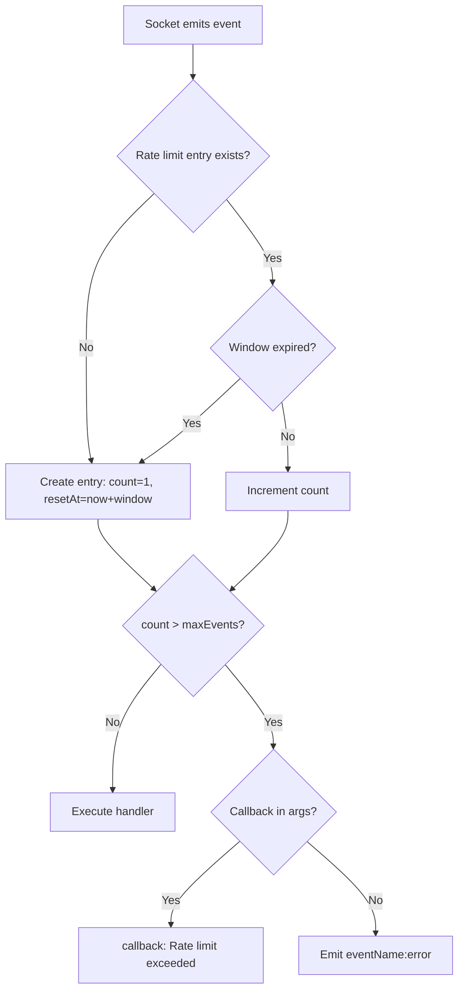
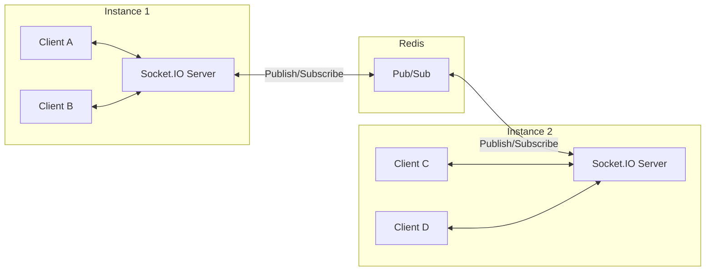
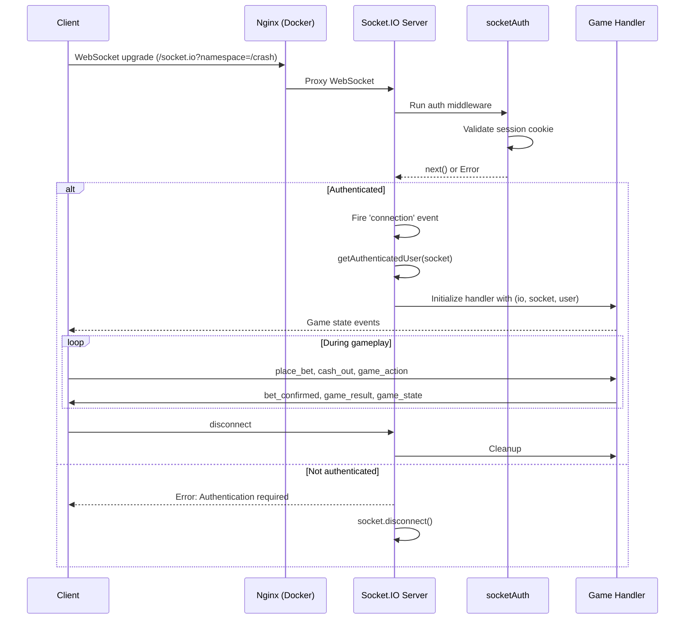

# Socket.IO Architecture

Platinum Casino uses Socket.IO with a **namespace-per-game** pattern to isolate game state, connections, and event handling across six real-time games, a chat system, and a live games feed.

## Namespace Overview



## Namespaces and Handlers

| Namespace | Handler File | Init Pattern | Auth Required |
|-----------|-------------|-------------|---------------|
| `/` (main) | `server.ts` (inline) | -- | No (for connection), Yes (for joinGame) |
| `/crash` | `crashHandler.ts` | Namespace-level (startup) | Yes |
| `/roulette` | `rouletteHandler.ts` | Per-connection | Yes |
| `/blackjack` | `blackjackHandler.ts` | Class-based (per-connection) | Yes |
| `/plinko` | `plinkoHandler.ts` | Per-connection | Yes |
| `/wheel` | `wheelHandler.ts` | Per-connection | Yes |
| `/landmines` | `landminesHandler.ts` | Per-connection | Yes |

Chat and live games handlers are initialized on the main namespace at startup, not per-connection.

## Authentication Middleware

**File:** `server/middleware/socket/socketAuth.ts`

All six game namespaces apply the `socketAuth` middleware, which validates Better Auth session cookies from the WebSocket handshake:



After authentication, the middleware attaches user data to the socket:

```typescript
(socket as any).user = {
  userId: Number(session.user.id),
  username: session.user.username || session.user.name,
  role: session.user.role || 'user',
  balance: parseFloat(session.user.balance || '0'),
  isActive: session.user.isActive,
};
```

Each namespace's `connection` handler then verifies the user is attached via `getAuthenticatedUser(socket)` and disconnects unauthenticated sockets as a defense-in-depth measure.

## Handler Initialization Patterns

The codebase uses three distinct patterns for initializing game handlers. All are defined in `server/server.ts`.

### Pattern 1: Namespace-Level Init (Crash)

The crash handler is loaded once at startup and attaches its own `connection` listener to the namespace. This pattern is used when the game manages shared state (e.g., a single crash multiplier that all players bet against).

```typescript
const crashNamespace = io.of('/crash');
crashNamespace.use(socketAuth);

// Handler is imported and initialized once
import('./src/socket/crashHandler.js')
  .then((mod) => {
    const init = mod?.default || mod;
    if (typeof init === 'function') init(crashNamespace);
  })
  .catch((err) => LoggingService.logSystemEvent(
    'crash_handler_init_failed', { error: String(err) }, 'error'
  ));

// Additional connection logic in server.ts
crashNamespace.on('connection', (socket) => {
  const user = getAuthenticatedUser(socket);
  if (!user) { socket.disconnect(); return; }
  // Crash handler manages its own per-socket listeners
});
```

**When to use:** Games with shared global state (single game round, all players participate in the same event).

### Pattern 2: Per-Connection Init (Roulette, Plinko, Wheel, Landmines)

The handler is dynamically imported and invoked for each new socket connection, receiving `(io, socket, user)` as arguments. This pattern is used when each connection needs its own handler setup.

```typescript
const rouletteNamespace = io.of('/roulette');
rouletteNamespace.use(socketAuth);

rouletteNamespace.on('connection', (socket) => {
  const user = getAuthenticatedUser(socket);
  if (!user) { socket.disconnect(); return; }

  // Handler initialized per connection
  import('./src/socket/rouletteHandler.js')
    .then((mod) => {
      const init = mod?.initRouletteHandlers || mod?.default?.initRouletteHandlers;
      if (typeof init === 'function') init(io, socket, user);
    })
    .catch((err) => LoggingService.logSystemEvent(
      'roulette_handler_init_failed', { error: String(err) }, 'error'
    ));
});
```

The per-connection handlers follow the same pattern with minor variations in export names:

| Game | Exported Function |
|------|------------------|
| Roulette | `initRouletteHandlers` |
| Landmines | `initLandminesHandlers` |
| Plinko | `initPlinkoHandlers` |
| Wheel | `initWheelHandlers` |

**When to use:** Games where each player has independent state or the handler needs the authenticated user object at initialization time.

### Pattern 3: Class-Based (Blackjack)

The blackjack handler is a class that is instantiated per connection. The constructor receives the namespace, and a `handleConnection` method receives the socket.

```typescript
const blackjackNamespace = io.of('/blackjack');
blackjackNamespace.use(socketAuth);

blackjackNamespace.on('connection', (socket) => {
  const user = getAuthenticatedUser(socket);
  if (!user) { socket.disconnect(); return; }

  import('./src/socket/blackjackHandler.js')
    .then((mod) => {
      const HandlerClass = mod?.default || mod?.BlackjackHandler;
      if (HandlerClass && typeof HandlerClass === 'function') {
        const handler = new HandlerClass(blackjackNamespace);
        handler.handleConnection(socket);
      }
    })
    .catch((err) => LoggingService.logSystemEvent(
      'blackjack_handler_init_failed', { error: String(err) }, 'error'
    ));
});
```

**When to use:** Games with complex per-player state that benefits from encapsulation in a class instance (e.g., individual blackjack hands).

### Pattern Comparison

| Aspect | Namespace-Level | Per-Connection | Class-Based |
|--------|----------------|---------------|-------------|
| Import timing | Once at startup | Every connection | Every connection |
| Handler lifetime | Lives for server lifetime | Lives for socket lifetime | Lives for socket lifetime |
| State scope | Shared across all connections | Per-connection | Per-connection (encapsulated) |
| Arguments | `(namespace)` | `(io, socket, user)` | `new Handler(namespace)` then `.handleConnection(socket)` |
| Used by | Crash | Roulette, Plinko, Wheel, Landmines | Blackjack |

## Main Namespace

The main namespace (`/`) handles general-purpose connections:

```typescript
io.on('connection', (socket) => {
  // joinGame event - requires authentication
  socket.on('joinGame', (gameType, callback) => {
    if (!socket.user) {
      callback?.({ success: false, error: 'Authentication required' });
      socket.disconnect();
      return;
    }
    socket.join(gameType);
    callback?.({ success: true });
  });
});
```

Chat and live games handlers are initialized on the main namespace at startup:

```typescript
// Chat handler - operates on main namespace
import('./src/socket/chatHandler.js')
  .then((mod) => {
    const init = mod?.default || mod?.initChatHandlers;
    if (typeof init === 'function') init(io);
  });

// Live games handler - operates on main namespace
import('./src/socket/liveGamesHandler.js')
  .then((mod) => {
    const init = mod?.default || mod?.initLiveGamesHandlers;
    if (typeof init === 'function') init(io);
  });
```

## Rate Limiting

**File:** `server/middleware/socket/socketRateLimit.ts`

Socket events can be rate-limited using the `socketRateLimit` utility. It wraps event handlers and tracks event counts per user per event name:

```typescript
import { socketRateLimit } from '../../middleware/socket/socketRateLimit.js';

const rateLimit = socketRateLimit(10, 60000); // 10 events per 60 seconds

rateLimit(socket, 'place_bet', (data) => {
  // Handler only runs if rate limit not exceeded
});
```

### How It Works



Rate limit state is stored in an in-memory `Map<string, RateLimitEntry>`:

```typescript
interface RateLimitEntry {
  count: number;
  resetAt: number;
}
```

- **Key format:** `{userId}:{eventName}`
- **Cleanup:** A `setInterval` runs every 60 seconds to remove stale entries from the map
- **Default limits:** 10 events per 60-second window (configurable per handler)

### Rate Limit Error Response

When a user exceeds the rate limit, one of two responses is sent:

1. If the event includes a callback function: `callback({ success: false, error: 'Rate limit exceeded. Please slow down.' })`
2. Otherwise: `socket.emit('{eventName}:error', { message: 'Rate limit exceeded' })`

## Redis Adapter for Horizontal Scaling

When Redis is available, the Socket.IO server uses the `@socket.io/redis-adapter` to synchronize events across multiple server instances:

```typescript
const pubClient = RedisService.getClient();
const subClient = RedisService.getSubscriber();
if (pubClient && subClient) {
  const { createAdapter } = await import('@socket.io/redis-adapter');
  io.adapter(createAdapter(pubClient, subClient));
}
```



Without the adapter, events emitted on Instance 1 would not reach clients connected to Instance 2. With the adapter, all `io.emit()`, `namespace.emit()`, and `socket.to(room).emit()` calls are automatically broadcast through Redis Pub/Sub.

See [Redis Integration](./redis-integration.md) for full details on the Redis service configuration and graceful degradation.

## CORS Configuration

The Socket.IO server is configured with CORS to accept connections from the client:

```typescript
const io = new SocketIOServer(server, {
  cors: {
    origin: process.env.CLIENT_URL || 'http://localhost:5173',
    methods: ['GET', 'POST'],
    credentials: true,
  },
});
```

The `credentials: true` setting is required for the browser to send session cookies in the WebSocket handshake, which the `socketAuth` middleware uses for authentication.

## Connection Lifecycle



## Graceful Shutdown

During server shutdown, Socket.IO connections are closed as part of the overall graceful shutdown process:

```typescript
process.on('SIGINT', async () => {
  await RedisService.close();  // Close Redis (adapter connections)
  await closeDB();             // Close database
  process.exit(0);
});
```

The Redis adapter connections are closed first so that no further Pub/Sub messages are processed, then the database connection is closed.

## Key Files

| File | Purpose |
|------|---------|
| `server/server.ts` | Namespace definitions, middleware application, handler wiring |
| `server/middleware/socket/socketAuth.ts` | Better Auth session validation for sockets |
| `server/middleware/socket/socketRateLimit.ts` | Per-user, per-event rate limiting |
| `server/src/services/redisService.ts` | Redis client management for Pub/Sub adapter |
| `server/src/socket/crashHandler.ts` | Crash game handler (namespace-level init) |
| `server/src/socket/blackjackHandler.ts` | Blackjack handler (class-based) |
| `server/src/socket/rouletteHandler.ts` | Roulette handler (per-connection) |
| `server/src/socket/plinkoHandler.ts` | Plinko handler (per-connection) |
| `server/src/socket/wheelHandler.ts` | Wheel handler (per-connection) |
| `server/src/socket/landminesHandler.ts` | Landmines handler (per-connection) |
| `server/src/socket/chatHandler.ts` | Chat handler (main namespace, startup init) |
| `server/src/socket/liveGamesHandler.ts` | Live games feed (main namespace, startup init) |
| `client/src/services/socket/` | Client-side socket service files per game |

---

## Related Documents

- [Socket Architecture (Architecture Section)](../02-architecture/socket-architecture.md) -- High-level namespace design
- [Socket Events API](../04-api/socket-events.md) -- Full event reference for all namespaces
- [Redis Integration](./redis-integration.md) -- Redis adapter and caching details
- [Better Auth Integration](./better-auth-integration.md) -- Session-based auth for socket connections
- [Data Flow](../02-architecture/data-flow.md) -- How data moves through the system
- [Games Overview](../03-features/games-overview.md) -- Game features and mechanics
