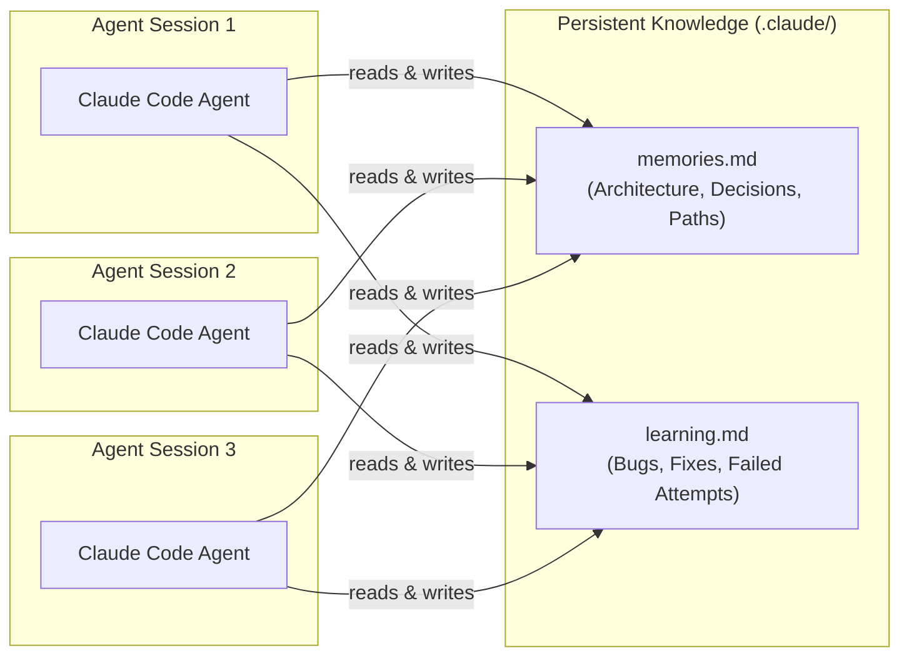
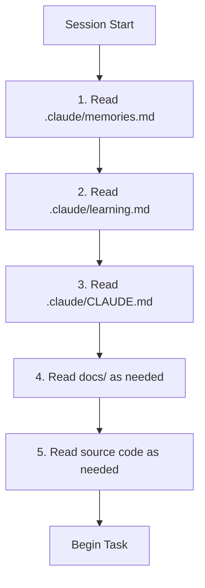
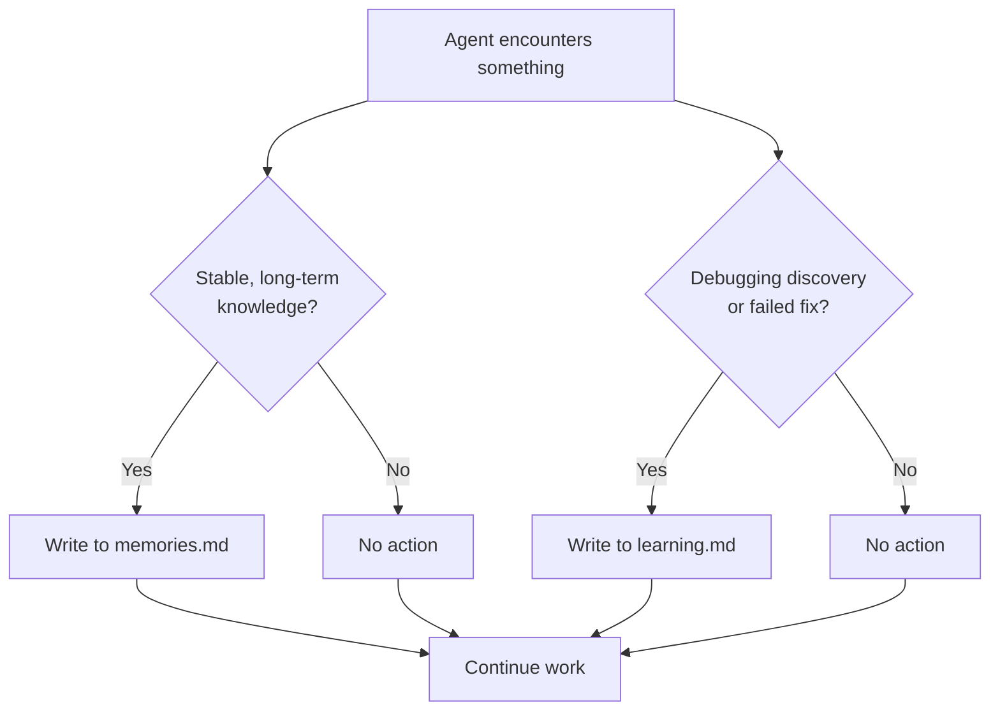
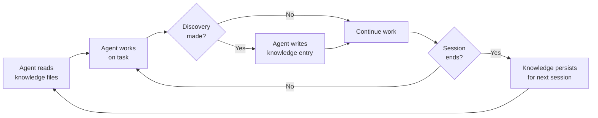

# Agent Knowledge System

How AI agents store, retrieve, and maintain knowledge across sessions using the `.claude/` directory.

## Overview

The Platinum Casino project uses a persistent knowledge system so AI agents do not lose context between sessions. The system consists of two knowledge files -- `memories.md` for stable, long-term knowledge and `learning.md` for debugging discoveries and failed attempts. Together, these files act as shared memory that any agent can read at session start and write to during work.



The key benefit: an agent that debugged a tricky issue in session 1 logs the root cause and fix. When session 2 encounters the same area of code, the agent reads that entry and avoids repeating the same investigation.

## `.claude/` Directory Structure

```
.claude/
  CLAUDE.md          # Agent operating rules and reading order
  memories.md        # Long-term stable knowledge
  learning.md        # Debugging discoveries, failed attempts, performance findings
  settings.json      # Tool permissions and hook configuration
  hooks/
    guard-bash.sh    # Pre-tool hook: blocks dangerous Bash commands
    check-secrets.sh # Stop hook: scans for hardcoded secrets
```

### File purposes

| File | Type | Updated by | Purpose |
|------|------|-----------|---------|
| `CLAUDE.md` | Rules | Developers | Defines reading order, knowledge logging rules, and 10 operating rules |
| `memories.md` | Knowledge | Agents | Stores architecture, workflows, constraints, decisions, important paths |
| `learning.md` | Knowledge | Agents | Stores debugging discoveries, failed attempts, performance and environment findings |
| `settings.json` | Config | Developers | Defines tool allow/deny lists and hooks |
| `hooks/*.sh` | Scripts | Developers | Runtime safety guardrails for agent actions |

## `memories.md` -- Long-Term Knowledge Storage

### Purpose

Stores **stable truths that should rarely change**. This file answers the question: "What does an agent need to know about this project that will still be true next month?"

### What goes in memories.md

Agents must log entries here when they discover:

- Architecture insights (e.g., "the crash handler uses namespace-level init, not per-connection")
- Important workflows (e.g., "database migrations require running db:generate then db:migrate")
- Project conventions (e.g., "ESM imports require .js extensions in server TypeScript")
- Infrastructure details (e.g., "Redis is optional; the server works without it")
- Permanent design decisions (e.g., "React Context chosen over Redux for state management")
- Repository structure (e.g., "no root package.json; commands run from client/ or server/")

### Current structure

The `memories.md` file is organized into these sections:

| Section | Content |
|---------|---------|
| **Purpose** | Explains why this file exists |
| **Project Purpose** | What Platinum Casino is |
| **System Architecture** | Monorepo layout, server/client/DB/auth/real-time |
| **Core Technologies** | Technology table (frontend, backend, database, auth, logging, build, runtime) |
| **Critical Workflows** | Build pipeline, database migrations, development startup |
| **Key Constraints** | ESM rules, TypeScript strictness, balance safety, directory rules |
| **Important Project Decisions** | Migration history, pattern choices, state management |
| **Important Paths** | Table mapping paths to purposes (13 entries) |
| **Agent Operating Rules** | 8-point rule summary |
| **Core Memory Entries** | Timestamped entries with date, agent, topic, context, and reasoning |

### Example entry

```markdown
### Core Memory Entry

- **Date:** 2026-03-27
- **Agent:** Claude Code (Opus 4.6)
- **Topic:** Initial knowledge system setup
- **Context:** Created the persistent AI knowledge system for this repository.
- **Core Knowledge:** The `.claude/memories.md` and `.claude/learning.md` files form
  the persistent memory system for all AI agents working in this repo.
- **Reason:** Prevents knowledge loss between agent sessions and stops repeated
  debugging of the same issues.
```

## `learning.md` -- Debugging Discoveries and Failed Attempts

### Purpose

Stores **discoveries made during development** -- bugs found, fixes applied, approaches that did not work, and environment issues. This file answers: "What has gone wrong before, and how was it resolved?"

### What goes in learning.md

Agents must log entries here whenever they encounter:

- Bugs or unexpected behavior
- Build errors or CI failures
- Hidden dependencies or surprising interactions
- Complex debugging sessions
- Performance problems or bottlenecks
- Environment or tooling issues

### Critical rule: failed attempts

If an attempted fix **fails**, it **must** be recorded in the Failed Attempts section. This is the most valuable part of the knowledge system -- it prevents future agents from trying the same broken approach.

### Current structure

The `learning.md` file is organized into these sections:

| Section | Content |
|---------|---------|
| **Architecture Learnings** | Structural discoveries (e.g., which socket handlers are wired vs disabled) |
| **Debugging Learnings** | Problems and their solutions (e.g., CI TypeScript build failures) |
| **Failed Attempts** | Fixes that were tried but did not work (currently empty) |
| **Performance Learnings** | Bottlenecks and optimizations (currently empty) |
| **Agent Workflow Improvements** | Better ways for agents to operate (e.g., the knowledge system itself) |
| **Environment / Tooling Issues** | Build, dependency, and runtime issues (e.g., ESM `.js` extension requirement) |

### Entry format

Every entry follows this standardized template:

```markdown
### Learning Entry

- **Date:** 2026-03-27
- **Agent:** Claude Code (Opus 4.6)
- **Category:** (Architecture | Debugging | Failed Attempt | Performance | Workflow | Environment)

- **Context:** What was happening when this was discovered.
- **Problem:** What went wrong or what was unexpected.
- **Root Cause:** WHY the problem happened (not just what was done).
- **Solution:** What fixed it (or N/A if documenting state).
- **Prevention:** How to prevent this from happening again.
- **Affected Files:** Which files are involved.
- **Notes:** Additional context.
```

### Example: debugging entry

```markdown
### Learning Entry

- **Date:** 2026-03-27
- **Agent:** Claude Code (Opus 4.6)
- **Category:** Debugging

- **Context:** CI pipeline was failing with TypeScript build errors.
- **Problem:** TypeScript compilation failed in CI.
- **Root Cause:** Type errors introduced during the MongoDB-to-MySQL migration
  were not caught locally.
- **Solution:** Fixed TypeScript build failures (commit 7088b01).
- **Prevention:** Always run `npx tsc --noEmit` in `server/` before committing.
- **Affected Files:** Various server TypeScript files.
- **Notes:** CI runs `npx tsc --noEmit` + `npm run build` for server, then
  `npm run build` for client.
```

### Example: architecture discovery

```markdown
### Learning Entry

- **Date:** 2026-03-27
- **Agent:** Claude Code (Opus 4.6)
- **Category:** Architecture

- **Context:** Initial repository analysis.
- **Problem:** Multiple game socket handlers exist but only Crash and Roulette
  are wired. Landmines, Plinko, and Wheel are disabled (TODO comments in
  server/server.ts). Blackjack handler exists but is not connected.
- **Root Cause:** Incomplete migration -- handlers written but not yet integrated.
- **Solution:** N/A -- documenting current state.
- **Prevention:** Check `server/server.ts` to verify which handlers are wired
  before assuming a game endpoint is live.
- **Affected Files:** `server/server.ts`, `server/src/socket/*.ts`
```

## How Agents Read and Write Knowledge

### Reading order

The `.claude/CLAUDE.md` file defines a mandatory reading order that agents follow at session start:



This order ensures agents have full context before touching any code. Reading `memories.md` first gives the agent architecture and constraints. Reading `learning.md` second gives the agent awareness of past issues and failed approaches.

### Writing triggers

Agents write to knowledge files during work, not just at the end of a session.



| Trigger | Target file | Example |
|---------|------------|---------|
| Discovered architecture insight | `memories.md` | "Redis is optional; server works without it" |
| Found a bug and fixed it | `learning.md` | "CI failed because TypeScript errors were not caught locally" |
| Tried a fix that failed | `learning.md` (Failed Attempts) | "Tried using enum for gameType but LoggingService writes non-enum values" |
| Found a performance issue | `learning.md` | "N+1 query in admin dashboard player listing" |
| Discovered environment quirk | `learning.md` | "ESM requires .js extensions in TypeScript imports" |
| Found important workflow | `memories.md` | "Better Auth routes must register before catch-all" |

## Knowledge Quality Standards

All entries must meet four quality standards defined in `.claude/CLAUDE.md`:

### 1. Clear

Written so any agent can understand without additional context. Bad: "fixed the thing". Good: "Fixed TypeScript compilation failure caused by missing type import in balanceService.ts".

### 2. Concise

No unnecessary padding or filler. Each entry should include only what future agents need to understand and avoid the issue.

### 3. Root-cause focused

Explain **why** the issue happened, not just what was done. Bad: "Added .js extension to import". Good: "Node.js ESM resolution does not automatically resolve .ts to .js; TypeScript compiles .ts to .js but import paths must already reference .js".

### 4. Actionable

Include prevention steps so the issue does not recur. Every learning entry should have a **Prevention** field that tells future agents what to do differently.

## Best Practices for Maintaining Agent Knowledge

### Do

- **Log immediately.** Write entries as soon as you discover something, not at the end of the session. Context is freshest right after the discovery.
- **Be specific about files.** Include the `Affected Files` field with exact paths. Future agents need to know where to look.
- **Record failed attempts.** A failed fix is more valuable than a successful one -- it saves future agents from wasting time on the same dead end.
- **Update outdated entries.** If a prior entry is no longer accurate (e.g., after a migration), update it with the current truth and note the change date.
- **Use the template.** The standardized format makes entries scannable. Deviating from the template makes entries harder for future agents to parse.

### Do not

- **Do not log trivial changes.** Adding a CSS class or fixing a typo does not need a knowledge entry.
- **Do not duplicate CLAUDE.md.** If something is already in the root CLAUDE.md, do not repeat it in memories.md. The knowledge files store discoveries beyond what CLAUDE.md covers.
- **Do not write vague entries.** "Fixed bug" without context is useless. Always include the root cause and prevention steps.
- **Do not delete entries.** Even if an issue is fully resolved, keep the entry. Future agents might encounter a similar problem in a different context.
- **Do not skip the Failed Attempts section.** This is the most important section in the entire knowledge system. Every failed fix must be documented.

### Maintenance cycle



The system is zero-maintenance from a developer perspective. Agents read and write knowledge files automatically as part of their operating rules. The only human intervention needed is reviewing entries during code review (since knowledge files are committed to version control).

---

## Related Documents

- [Claude Code Setup](./claude-code-setup.md) -- CLAUDE.md configuration and agent interaction model
- [Development Workflows](./development-workflows.md) -- AI-assisted development tasks
- [Contributing Guide](../05-development/contributing.md) -- PR workflow and code review process
- [Coding Standards](../05-development/coding-standards.md) -- code conventions and patterns
- [Troubleshooting](../12-troubleshooting/common-issues.md) -- common issues and solutions
