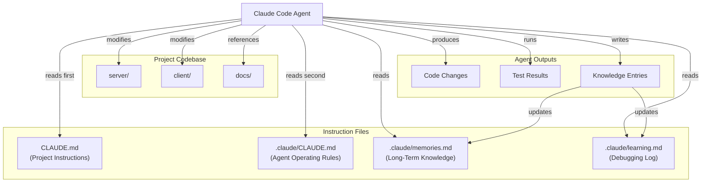
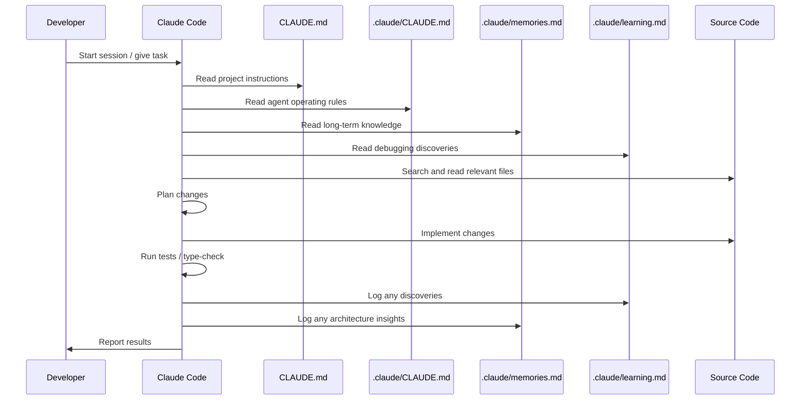

# Claude Code Setup

How Claude Code is configured for the Platinum Casino project, including instruction files, architecture knowledge, and agent interaction patterns.

## Overview

Claude Code (claude.ai/code) is an AI coding assistant that reads project-specific instruction files to understand the codebase before making changes. This project uses two levels of configuration -- a root `CLAUDE.md` for project-wide instructions and a `.claude/` directory for agent-specific operating rules and persistent memory.



## CLAUDE.md File Purpose and Structure

The root `CLAUDE.md` file is the primary instruction file for Claude Code. It is automatically read at the start of every agent session and provides the full context needed to work in this repository.

### File location

```
online-casino/
  CLAUDE.md          <-- Root project instructions (read by all agents)
```

### Sections in CLAUDE.md

The file is organized into these major sections:

| Section | Purpose |
|---------|---------|
| **Project Overview** | What the project is, monorepo structure, no root `package.json` |
| **Common Commands** | Every npm script for server and client, with directory context |
| **Architecture** | Server stack, client stack, database, auth, logging, real-time |
| **API Routes** | REST routes mounted under `/api`, health check endpoints |
| **Socket Handlers** | Three initialization patterns for game namespaces |
| **Client Structure** | Page, game, component, and service directory layout |
| **Database Schema** | Tables, ORM, migration config, and special notes |
| **Key Patterns** | ESM conventions, TypeScript strictness, balance safety, auth ordering |
| **Environment** | All environment variables for server and client |

### Example: Command reference in CLAUDE.md

The commands section tells agents exactly which directory to run from and what each script does:

```markdown
### Server (run from `server/`)
npm install                           # Install dependencies
npm run dev                           # Dev server with bun --watch
npx tsc --noEmit                      # Type-check without emitting
npm run db:generate                   # Generate Drizzle migrations
npm run db:migrate                    # Run Drizzle migrations
npm run test                          # Run vitest tests
```

This prevents a common agent mistake: running server commands from the repository root, which fails because there is no root `package.json`.

## Project-Level vs User-Level Instructions

Claude Code supports two scopes of instruction:

### Project-level (checked into the repository)

| File | Scope | Who reads it |
|------|-------|-------------|
| `CLAUDE.md` (root) | All agents working in this repo | Claude Code automatically |
| `.claude/CLAUDE.md` | All agents working in this repo | Claude Code automatically |
| `.claude/memories.md` | Persistent project knowledge | Agents per reading order rules |
| `.claude/learning.md` | Debugging discoveries | Agents per reading order rules |

All of these files are committed to version control so every developer and agent session inherits the same context.

### User-level (not in repository)

User-level instructions live in `~/.claude/` on the developer's machine and apply across all projects. They are not part of this repository.

In this project, all configuration is project-level so that every agent session -- regardless of which developer starts it -- operates with the same rules.

## How Agents Use These Instructions

When a Claude Code session starts in this repository, the agent follows this reading order (defined in `.claude/CLAUDE.md`):



### Key behaviors enforced by instructions

The instruction files encode these critical rules for all agents:

1. **ESM imports** -- Use `.js` extensions in all server TypeScript imports, even though source files are `.ts`. Forgetting this causes runtime errors.

2. **No strict types** -- The server `tsconfig.json` has `strict: false`. Agents must not introduce strict type annotations.

3. **Balance safety** -- All balance mutations must go through `balanceService`. Direct database writes to the balances table are prohibited.

4. **Directory awareness** -- Server commands run from `server/`, client commands from `client/`. There is no root `package.json`.

5. **Pre-commit verification** -- Agents must run `npx tsc --noEmit` in `server/` before committing to catch type errors that would fail CI.

6. **Knowledge logging** -- Agents must never silently fix complex issues. All debugging discoveries go to `learning.md`, all architecture insights go to `memories.md`.

## Common Commands Reference

These commands are encoded in CLAUDE.md so agents can execute them correctly.

### Server commands (run from `server/`)

| Command | Purpose |
|---------|---------|
| `npm install` | Install server dependencies |
| `npm run dev` | Start dev server with bun --watch |
| `npm run start:ts` | Start with ts-node (Node.js, no Bun) |
| `npm run build` | TypeScript compile to `dist/` |
| `npx tsc --noEmit` | Type-check without emitting files |
| `npm run db:generate` | Generate Drizzle migrations |
| `npm run db:migrate` | Run Drizzle migrations |
| `npm run db:push` | Push schema directly (dev only) |
| `npm run seed` | Seed database with test data |
| `npm run init-stats` | Initialize game stats table |
| `npm run test` | Run vitest tests |
| `npm run test:watch` | Run tests in watch mode |
| `npm run test:coverage` | Run tests with coverage |

### Client commands (run from `client/`)

| Command | Purpose |
|---------|---------|
| `npm install` | Install client dependencies |
| `npm run dev` | Vite dev server on port 5173 |
| `npm run build` | Production build |
| `npm run lint` | ESLint (JS/JSX) |
| `npm run test` | Run vitest tests |
| `npm run test:watch` | Run tests in watch mode |
| `npm run test:coverage` | Run tests with coverage |

### Docker commands (run from root)

| Command | Purpose |
|---------|---------|
| `docker-compose up` | Start all services (MySQL, server, client) |
| `docker-compose -f docker-compose.dev.yml up` | Dev compose variant |

## Architecture Knowledge Encoded in CLAUDE.md

The CLAUDE.md file encodes architecture knowledge that prevents agents from making incorrect assumptions.

### Server architecture

- **Runtime:** Node.js + Express + TypeScript with ESM modules
- **Database:** MySQL via Drizzle ORM with schema at `server/drizzle/schema.ts`
- **Real-time:** Socket.IO with namespace-per-game pattern (`/crash`, `/roulette`, `/wheel`, `/blackjack`, `/plinko`, `/landmines`)
- **Auth:** Better Auth (session-based) with username + admin plugins
- **Logging:** Winston-based `LoggingService`
- **Balance:** Centralized `balanceService` for all balance operations
- **Redis:** Optional, for Socket.IO adapter horizontal scaling

### Socket handler initialization patterns

Three patterns exist and agents must know which to use when modifying game handlers:

| Pattern | Games | Description |
|---------|-------|-------------|
| Namespace-level | Crash | Handler imported once at startup, attaches its own `connection` listener |
| Class-based | Blackjack | `BlackjackHandler` instantiated per-connection |
| Per-connection | Roulette, Landmines, Plinko, Wheel | Handler receives `(io, socket, user)` on each connection |

### Client architecture

- **Framework:** React 18 (JSX, not TypeScript) + Vite + Tailwind CSS v4
- **Routing:** React Router v6 with lazy-loaded game pages
- **State:** React Context (`AuthContext`, `ToastContext`)
- **API layer:** Fetch-based with cookie credentials (no Axios)
- **Path alias:** `@` maps to `client/src/`

### Database schema awareness

The CLAUDE.md documents all 11 tables and notes important details:

- Better Auth manages `session`, `account`, and `verification` tables directly
- The `gameLogs` table uses `varchar` (not enum) for `gameType`/`eventType` because `LoggingService` writes system and admin events beyond game enum values
- Drizzle config points to compiled `.js` output, not `.ts` source

## Settings and Hooks

Beyond instruction files, the `.claude/` directory contains configuration that controls agent behavior at runtime.

### `.claude/settings.json`

Defines tool permissions (allow/deny lists) and hooks:

- **Allowed tools:** File read/write/edit, glob, grep, npm commands, git commands, TypeScript compiler, Drizzle Kit
- **Denied commands:** Destructive operations (`rm -rf /`, `git push --force`, `git reset --hard`, `sudo`, etc.)
- **Hooks:** A `PreToolUse` hook runs `guard-bash.sh` before every Bash command to block dangerous operations

### `.claude/hooks/`

| Hook | Trigger | Purpose |
|------|---------|---------|
| `guard-bash.sh` | Before every Bash command | Blocks destructive commands (rm -rf, force push, sudo, etc.) |
| `check-secrets.sh` | On session stop | Scans for hardcoded secrets in source files |

## SKILL.md

The `SKILL.md` file at the repository root provides extracted coding patterns from the repository's git history. It documents:

- Commit conventions (conventional commits with optional scopes)
- Naming conventions for each layer (client components, server handlers, etc.)
- Complete monorepo directory structure
- Workflows for adding new games, API routes, and full-stack features
- File co-change patterns (which files are tightly coupled)
- Project evolution history (MongoDB to MySQL, JS to TS, JWT to Better Auth)

Agents use SKILL.md to follow established patterns when creating new features or modifying existing ones.

---

## Related Documents

- [Agent Knowledge System](./agent-knowledge-system.md) -- how agents store and retrieve knowledge
- [Development Workflows](./development-workflows.md) -- AI-assisted development tasks
- [Project Structure](../05-development/project-structure.md) -- full directory layout
- [System Architecture](../02-architecture/system-architecture.md) -- high-level architecture overview
- [Coding Standards](../05-development/coding-standards.md) -- code conventions and patterns
- [CI/CD Pipeline](../06-devops/ci-cd.md) -- continuous integration setup
