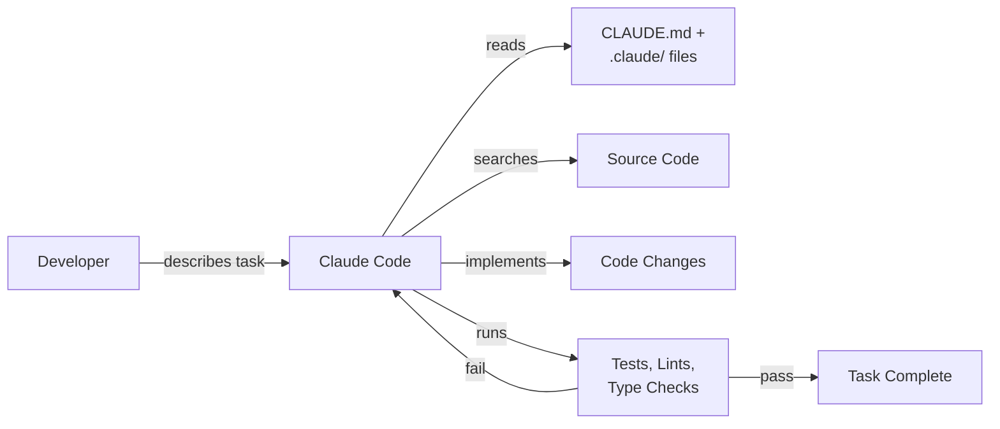
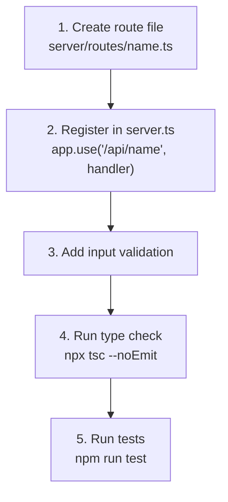
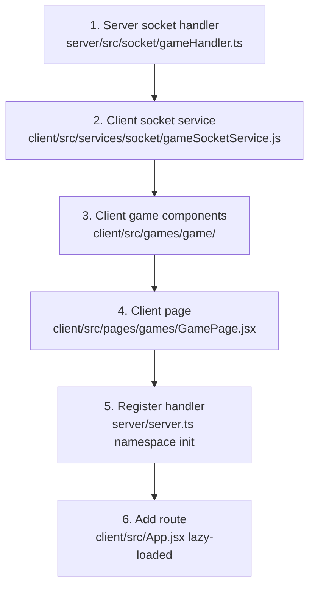
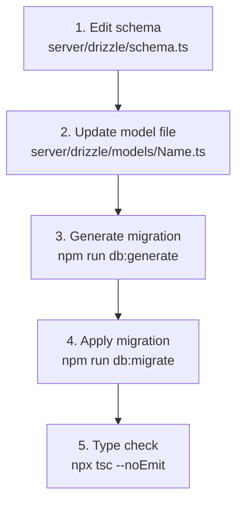
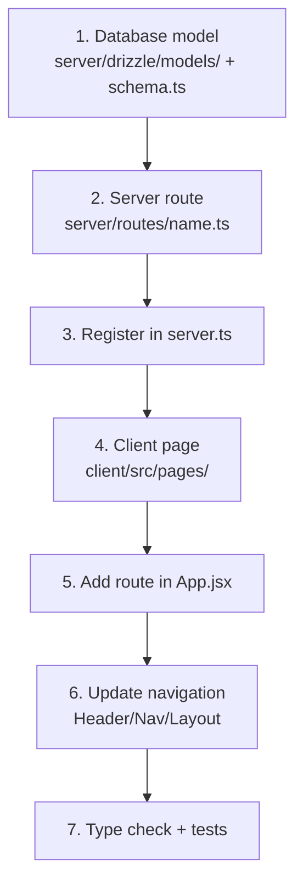
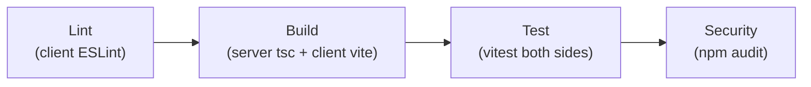

# AI-Assisted Development Workflows

Practical guide for using Claude Code to develop, test, and maintain the Platinum Casino project.

## Overview

This document covers common development tasks and how to execute them effectively with Claude Code. Each workflow includes the commands agents run, the directories they run from, and the verification steps that confirm success.



## How to Use Claude Code for This Project

### Starting a session

When you start a Claude Code session in the `online-casino/` directory, the agent automatically reads:

1. `CLAUDE.md` -- project commands, architecture, patterns, environment
2. `.claude/CLAUDE.md` -- operating rules and reading order
3. `.claude/memories.md` -- long-term project knowledge
4. `.claude/learning.md` -- past debugging discoveries

You can then describe your task in natural language. The agent will search the codebase, plan changes, implement them, and verify with tests and type checks.

### Effective task descriptions

Be specific about what you want. The agent knows the project architecture, so you can reference components by name.

**Good task descriptions:**

- "Add a new REST endpoint at `/api/leaderboard` that returns the top 10 players by balance"
- "Fix the crash game handler so it logs a game event when the multiplier exceeds 10x"
- "Add a vitest test for the `balanceService.adjustBalance` function"
- "Update the `CrashGame.jsx` component to show a countdown timer before the round starts"

**Less effective task descriptions:**

- "Fix the bug" (which bug? where?)
- "Make it faster" (which part? what metric?)
- "Add some tests" (for what? which behavior?)

## Common Development Tasks

### 1. Adding a new REST API endpoint

The agent follows the pattern documented in `SKILL.md`:



**Commands the agent runs:**

```bash
# From server/
npx tsc --noEmit          # Verify no type errors
npm run test              # Run test suite
```

**Key rule:** If adding auth-related routes, they must be registered *before* the Better Auth catch-all `app.all("/api/auth/*")` in `server.ts`.

### 2. Adding a new game

Games follow a 6-step pattern. The agent creates files in this order:



**Component naming convention:**

| Component | File name pattern |
|-----------|------------------|
| Main game | `{GameName}Game.jsx` |
| Board/visual | `{GameName}Board.jsx` |
| Betting panel | `{GameName}BettingPanel.jsx` |
| Active bets (multiplayer) | `{GameName}ActiveBets.jsx` |
| Players list (multiplayer) | `{GameName}PlayersList.jsx` |

**Handler initialization:** The agent must choose one of three patterns based on the game type (see [Claude Code Setup](./claude-code-setup.md) for details on the three Socket.IO handler patterns).

### 3. Modifying database schema



**Commands the agent runs:**

```bash
# From server/
npm run db:generate       # Generate migration SQL from schema diff
npm run db:migrate        # Apply migration to database
npx tsc --noEmit          # Verify types still compile
```

**Alternative for development:** Use `npm run db:push` to push schema changes directly without generating a migration file. This is faster for prototyping but should not be used for production changes.

### 4. Writing and running tests

The project uses Vitest for both server and client.

**Server tests:**

```bash
# From server/
npm run test              # Run all tests once
npm run test:watch        # Watch mode
npm run test:coverage     # Generate coverage report
```

**Client tests:**

```bash
# From client/
npm run test              # Run all tests once
npm run test:watch        # Watch mode
npm run test:coverage     # Generate coverage report
```

**Test file conventions:**

| Layer | Test location | Test framework |
|-------|--------------|----------------|
| Server | `server/src/__tests__/` | Vitest + Supertest |
| Client | `client/src/__tests__/` | Vitest + React Testing Library + jsdom |

**Client test setup:** Tests use the setup file at `client/src/test/setup.js` which configures jsdom and React Testing Library.

### 5. Full-stack feature development

When adding a feature that spans database, server, and client:



This pattern was observed in the login rewards implementation and is documented in `SKILL.md`.

## Running Commands: Directory Rules

The most common agent mistake is running commands from the wrong directory. This project has **no root `package.json`**, so npm commands must always run from `client/` or `server/`.

| Task | Directory | Command |
|------|-----------|---------|
| Install server deps | `server/` | `npm install` |
| Install client deps | `client/` | `npm install` |
| Start server (dev) | `server/` | `npm run dev` |
| Start client (dev) | `client/` | `npm run dev` |
| Type check server | `server/` | `npx tsc --noEmit` |
| Lint client | `client/` | `npm run lint` |
| Run server tests | `server/` | `npm run test` |
| Run client tests | `client/` | `npm run test` |
| Generate migration | `server/` | `npm run db:generate` |
| Apply migration | `server/` | `npm run db:migrate` |
| Seed database | `server/` | `npm run seed` |
| Docker (all services) | root | `docker-compose up` |

## Type Checking Workflow

Type checking is the primary verification step before committing server changes.

### When to run

Run `npx tsc --noEmit` in `server/` after:

- Any change to a `.ts` file in `server/`
- Any change to `server/drizzle/schema.ts` or model files
- Any new import or export
- Before every commit

### What it catches

- Missing imports or exports
- Type mismatches in function arguments
- Missing properties on objects passed to Drizzle queries
- Incorrect Socket.IO event handler signatures

### Important: TypeScript strictness is OFF

The server `tsconfig.json` has `strict: false`. This means:

- Do not add explicit type annotations where TypeScript can infer them
- Do not add `strictNullChecks`-style guards
- Do not use `as const` assertions or strict utility types
- Follow the existing loose typing patterns in the codebase

### CI validation

CI runs the same type check. If `npx tsc --noEmit` passes locally, it will pass in CI. The full CI pipeline is:



## Database Operations Workflow

### Development cycle

```bash
# From server/

# 1. Edit schema
#    Modify server/drizzle/schema.ts and/or server/drizzle/models/*.ts

# 2. Push directly (dev only, no migration file)
npm run db:push

# 3. Or generate + apply migration (production-safe)
npm run db:generate
npm run db:migrate

# 4. Seed with test data
npm run seed

# 5. Initialize game stats
npm run init-stats
```

### Schema source of truth

`server/drizzle/schema.ts` is the single source of truth for all database tables. The Drizzle config at `server/drizzle.config.js` points to the compiled `./drizzle/schema.js`.

### Tables managed by Better Auth

The `session`, `account`, and `verification` tables are managed by Better Auth. Agents should not modify these tables directly through Drizzle migrations -- Better Auth handles their schema.

## Testing Workflow

### Server testing

```bash
# From server/
npm run test                    # Run all tests
npm run test -- --run           # Run once without watch
npm run test:coverage           # With coverage report
```

Server tests use Vitest with Supertest for HTTP endpoint testing. Test files go in `server/src/__tests__/`.

### Client testing

```bash
# From client/
npm run test                    # Run all tests
npm run test -- --run           # Run once without watch
npm run test:coverage           # With coverage report
npm run lint                    # ESLint check (JS/JSX)
```

Client tests use Vitest with React Testing Library and jsdom. Test files go in `client/src/__tests__/`. The setup file at `client/src/test/setup.js` configures the test environment.

### What the agent verifies

Before considering a task complete, the agent runs:

1. `npx tsc --noEmit` (server type check)
2. `npm run test` (server tests, if server files changed)
3. `npm run test` (client tests, if client files changed)
4. `npm run lint` (client lint, if client files changed)

## CI/CD Considerations

### CI pipeline stages

The GitHub Actions CI pipeline runs four stages in sequence:

| Stage | What it does | Fails if |
|-------|-------------|----------|
| **Lint** | Client ESLint | Any lint error |
| **Build** | Server `tsc --noEmit` + `npm run build`, then client `npm run build` | Type error or build failure |
| **Test** | Vitest with coverage for both server and client | Any test failure |
| **Security** | `npm audit` for both packages | Critical vulnerabilities |

### CI-specific dependencies

CI installs `zod` and `seedrandom` as additional server dependencies. These are used by validation and game logic but may not be in the main `package.json` dependencies.

### Pre-commit checklist

Before committing, the agent ensures:

- [ ] `npx tsc --noEmit` passes in `server/`
- [ ] `npm run test` passes in `server/` (if server files changed)
- [ ] `npm run build` succeeds in `client/` (if client files changed)
- [ ] `npm run lint` passes in `client/` (if client files changed)
- [ ] `npm run test` passes in `client/` (if client files changed)
- [ ] No hardcoded secrets in source files
- [ ] Knowledge entries logged for any debugging discoveries

## Tips for Effective AI-Assisted Development

### 1. Give context about the "why"

Instead of "add a field to the users table", say "add a `lastLoginAt` timestamp to the users table so the admin dashboard can show when each player last logged in". The agent makes better decisions when it understands the purpose.

### 2. Reference existing patterns

Say "follow the same pattern as the crash game handler" or "use the same component structure as the roulette game". The agent will look at the referenced code and replicate the pattern.

### 3. Ask for verification

If you are unsure whether a change is safe, ask the agent to "run the type checker and tests before making any changes" or "show me what would change before doing it".

### 4. Use the knowledge system

If the agent encounters something unexpected, ask it to "check learning.md for any prior issues with this". The knowledge system may already have the answer.

### 5. Review knowledge entries

When reviewing PRs, check for new entries in `.claude/memories.md` and `.claude/learning.md`. These entries capture institutional knowledge that benefits the entire team.

### 6. Keep tasks focused

One task per session produces better results than combining multiple unrelated changes. "Add the leaderboard endpoint and write tests for it" is better than "add leaderboard, fix the crash game, and update the admin dashboard".

### 7. Trust but verify

The agent runs tests and type checks, but always review the actual code changes. The agent follows patterns and rules, but domain-specific business logic requires human judgment.

### 8. Handle monorepo navigation

When describing tasks, specify which side of the monorepo you mean. "Add a test for the balance service" is server-side. "Add a test for the login page" is client-side. Being explicit avoids confusion about which directory to work in.

---

## Related Documents

- [Claude Code Setup](./claude-code-setup.md) -- CLAUDE.md configuration and instruction file structure
- [Agent Knowledge System](./agent-knowledge-system.md) -- how agents store and retrieve knowledge
- [Getting Started](../05-development/getting-started.md) -- local development setup
- [NPM Scripts Reference](../05-development/npm-scripts.md) -- all available npm scripts
- [CI/CD Pipeline](../06-devops/ci-cd.md) -- GitHub Actions configuration
- [Testing Strategy](../08-testing/testing-strategy.md) -- Vitest setup and test patterns
- [Project Structure](../05-development/project-structure.md) -- full directory layout
- [Socket Architecture](../02-architecture/socket-architecture.md) -- Socket.IO namespace design
