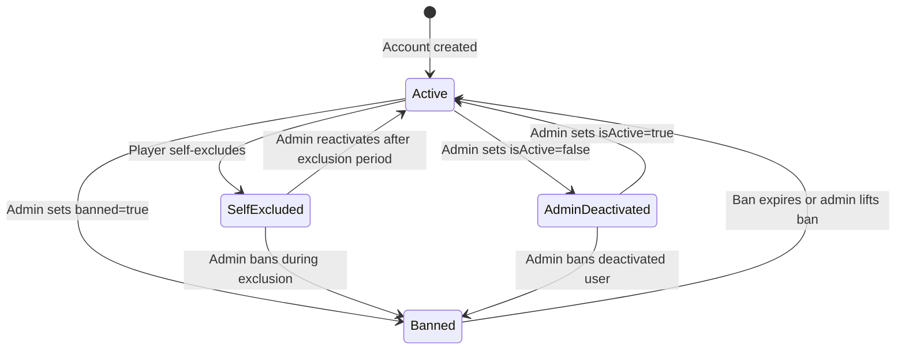
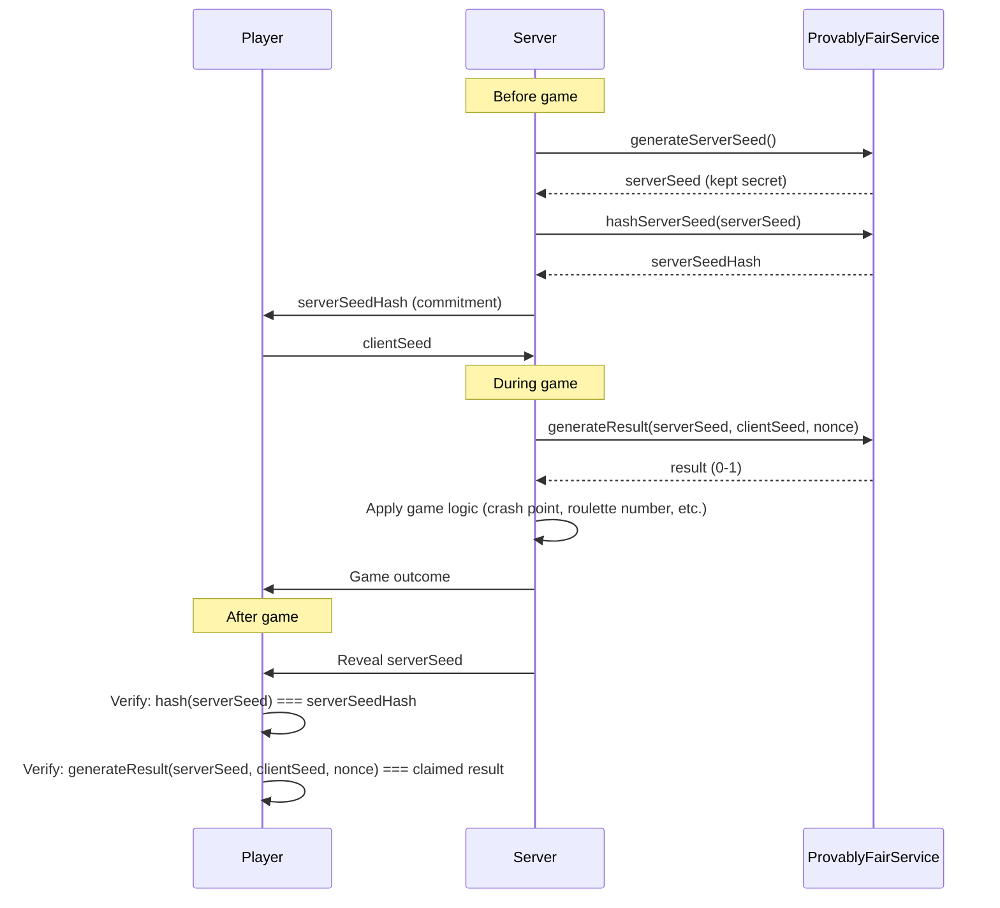

# Player Protection

This document describes the player protection mechanisms built into Platinum Casino. These features ensure account safety, financial transparency, game fairness, and administrative oversight. Together they form the foundation that a production gambling platform would build upon for regulatory compliance.

> **Note:** This is an educational/development project. The protections described here are functional but would need to be augmented with third-party verification services, external audits, and jurisdictional certifications before any production deployment.

## Implementation Status Summary

| Feature | Status | Source File(s) |
|---------|--------|----------------|
| Account banning (schema columns) | **Implemented** (columns exist in DB) | `server/drizzle/schema.ts` (`banned`, `banReason`, `banExpires` on `users` table) |
| Account banning (enforcement via Better Auth) | **Implemented** (handled by Better Auth admin plugin) | `server/lib/auth.ts` (admin plugin config) |
| Account banning (custom admin endpoints) | **Not implemented** | N/A -- no custom ban/unban routes in `server/routes/admin.ts` |
| Account deactivation (`isActive` flag) | **Implemented** | `server/routes/admin.ts`, `server/routes/responsible-gaming.ts`, `server/middleware/auth.ts` |
| Balance audit trail (dual-record pattern) | **Implemented** | `server/src/services/balanceService.ts` |
| Provably fair service (core algorithms) | **Implemented** | `server/src/services/provablyFairService.ts` |
| Provably fair verification API | **Implemented** | `server/routes/verify.ts` |
| Provably fair integration in game handlers | **Not implemented** | N/A -- game socket handlers do not import or use `ProvablyFairService` |
| Player-facing verification UI | **Not implemented** | N/A -- no client-side UI for verifying game fairness |
| Transaction voiding | **Implemented** | `server/routes/admin.ts` (PUT `/transactions/:id/void`) |
| Transaction filtering | **Implemented** | `server/routes/admin.ts` (GET `/transactions`) |
| Admin dashboard | **Implemented** | `server/routes/admin.ts` (GET `/dashboard`) |
| Admin player management | **Implemented** | `server/routes/admin.ts` (CRUD on `/users`) |
| Admin balance adjustment | **Implemented** | `server/routes/admin.ts` (POST `/users/:id/balance`) |
| Activity logging (database) | **Implemented** | `server/src/services/loggingService.ts` (writes to `game_logs` table) |
| Activity logging (file-based via Winston) | **Implemented** | `server/src/services/loggingService.ts` (combined.log, error.log) |
| Log cleanup utility | **Implemented** | `server/src/services/loggingService.ts` (`cleanupOldLogs()`) |
| Socket rate limiting (middleware) | **Implemented** (middleware exists) | `server/middleware/socket/socketRateLimit.ts` |
| Socket rate limiting (applied to handlers) | **Not implemented** | N/A -- no game socket handler imports `socketRateLimit` |
| Data retention (regulatory compliance) | **Not implemented** | N/A -- 30-day default cleanup is insufficient for production |

---

## Account Banning System

**Status: Implemented** (schema and Better Auth plugin; no custom admin ban endpoints)

The `users` table includes Better Auth admin plugin fields that support both permanent and time-limited bans:

```typescript
// From server/drizzle/schema.ts
export const users = mysqlTable('users', {
  // ...
  banned: boolean('banned').default(false),
  banReason: text('ban_reason'),
  banExpires: timestamp('ban_expires'),
  isActive: boolean('is_active').default(true).notNull(),
  // ...
});
```

The `banned`, `banReason`, and `banExpires` columns exist in the database schema. Ban enforcement is handled by the Better Auth admin plugin (configured in `server/lib/auth.ts`). However, there are **no custom admin endpoints** in `server/routes/admin.ts` for banning or unbanning users -- admins must use the Better Auth admin API directly or modify bans through database access.

### Ban vs. Deactivation

The system has two distinct mechanisms for restricting account access:

| Mechanism | Field(s) | Triggered By | Reversible | Status |
|-----------|----------|-------------|------------|--------|
| Ban | `banned`, `banReason`, `banExpires` | Better Auth admin plugin | Yes, by admin or on expiry | **Implemented** (via Better Auth) |
| Deactivation | `isActive` | Admin action or player self-exclusion | Yes, by admin | **Implemented** (custom endpoints) |

### Admin Account Management

**Status: Implemented**

Administrators can manage player accounts through the following endpoints in `server/routes/admin.ts`:

**Deactivate a player:**

```bash
PUT /api/admin/users/:id
Content-Type: application/json

{ "isActive": false }
```

**Soft-delete a player** (sets `isActive = false`, preserves all data):

```bash
DELETE /api/admin/users/:id
```

The soft-delete endpoint includes safeguards:

```typescript
// From server/routes/admin.ts
router.delete('/users/:id', auth, adminOnly, async (req, res) => {
  const user = await UserModel.findById(parseInt(id));
  if (!user) return res.status(404).json({ message: 'User not found' });

  // Prevent double-deletion of already deactivated users
  if (!user.isActive) {
    return res.status(400).json({ message: 'User is already deactivated' });
  }

  await UserModel.updateById(parseInt(id), {
    isActive: false,
    updatedAt: new Date(),
  });

  LoggingService.logSystemEvent('admin_soft_delete_user', {
    userId: parseInt(id),
    deletedBy: req.user.userId,
  });

  res.json({ message: 'User deactivated successfully' });
});
```

### Account Status Flow



---

## Balance Audit Trail

**Status: Implemented**

Every balance change in the system creates two database records within a single transaction, ensuring a complete and tamper-evident audit trail.

### Dual-Record Pattern

**File:** `server/src/services/balanceService.ts`

When `BalanceService.updateBalance()` is called, it:

1. Reads the current balance (with `SELECT ... FOR UPDATE` for deductions to prevent race conditions)
2. Calculates the new balance using `Decimal.js` for financial precision
3. Updates the user's balance
4. Creates a `transactions` record
5. Creates a `balances` history record

All five steps execute within a single database transaction:

```typescript
const result = await db.transaction(async (tx) => {
  // 1. Lock and read current balance
  const lockResult = await tx.execute(
    sql`SELECT balance FROM users WHERE id = ${userId} FOR UPDATE`
  );
  currentBalance = new Decimal(String(row.balance || '0'));

  // 2-3. Validate and update balance
  newBalance = currentBalance.minus(deduction);
  await tx.execute(
    sql`UPDATE users SET balance = ${newBalance.toFixed(2)} WHERE id = ${userId}`
  );

  // 4. Create transaction record
  await tx.execute(sql`INSERT INTO transactions (...) VALUES (...)`);

  // 5. Create balance history record
  await tx.execute(sql`INSERT INTO balances (...) VALUES (...)`);

  return { user: updatedUser, transaction };
});
```

### Transaction Record Structure

**Status: Implemented** -- defined in `server/drizzle/schema.ts`

Every transaction captures a full before/after snapshot:

| Column | Type | Purpose |
|--------|------|---------|
| `id` | `int` | Primary key |
| `user_id` | `int` | Player who owns the transaction |
| `type` | `enum` | `deposit`, `withdrawal`, `game_win`, `game_loss`, `admin_adjustment`, `bonus`, `login_reward` |
| `game_type` | `enum` | Which game generated the transaction (nullable) |
| `amount` | `decimal(15,2)` | Transaction amount |
| `balance_before` | `decimal(15,2)` | Balance before this transaction |
| `balance_after` | `decimal(15,2)` | Balance after this transaction |
| `status` | `enum` | `pending`, `completed`, `failed`, `voided`, `processing` |
| `created_by` | `int` | Admin who created the transaction (for adjustments) |
| `description` | `text` | Human-readable description |
| `metadata` | `json` | Structured data (bet details, multipliers, etc.) |
| `voided_by` | `int` | Admin who voided the transaction |
| `voided_reason` | `text` | Reason for voiding |
| `voided_at` | `timestamp` | When the transaction was voided |

### Balance History Record Structure

**Status: Implemented** -- defined in `server/drizzle/schema.ts`

The `balances` table provides a separate ledger for balance changes:

| Column | Type | Purpose |
|--------|------|---------|
| `user_id` | `int` | Player |
| `amount` | `decimal(15,2)` | New balance after change |
| `previous_balance` | `decimal(15,2)` | Balance before change |
| `change_amount` | `decimal(15,2)` | Delta (positive or negative) |
| `type` | `enum` | `deposit`, `withdrawal`, `win`, `loss`, `admin_adjustment`, `login_reward` |
| `game_type` | `enum` | Which game (nullable) |
| `transaction_id` | `int` | FK to the corresponding `transactions` record |
| `admin_id` | `int` | Admin who made the change (for adjustments) |

### Audit Trail Flow

```mermaid
flowchart LR
    subgraph "Single DB Transaction"
        direction TB
        A[Read balance<br/>SELECT ... FOR UPDATE] --> B[Validate<br/>sufficient funds?]
        B --> C[Update user.balance]
        C --> D[INSERT transactions<br/>type, amount, before, after]
        D --> E[INSERT balances<br/>previous, change, new amount]
    end

    GH[Game Handler] --> A
    E --> RC[Redis Cache<br/>invalidateBalance]

    style A fill:#1a1a2e,stroke:#e6c200
    style D fill:#1a1a2e,stroke:#4CAF50
    style E fill:#1a1a2e,stroke:#4CAF50
```



---

## Game Fairness -- Provably Fair

### Core Service

**Status: Implemented**

**File:** `server/src/services/provablyFairService.ts`

The platform implements a provably fair service based on HMAC-SHA256, providing cryptographically verifiable randomness. The service class includes methods for seed generation, hashing, result generation, and verification.

### How It Works

1. **Before the game:** The server generates a random `serverSeed` and shares its SHA-256 hash (`serverSeedHash`) with the player. The player provides a `clientSeed`.
2. **During the game:** The outcome is computed from `HMAC-SHA256(serverSeed, clientSeed:nonce)`.
3. **After the game:** The server reveals the original `serverSeed`. The player can verify that its hash matches the pre-committed `serverSeedHash`, and that the outcome was deterministically derived from the seeds.

### Core Methods

```typescript
class ProvablyFairService {
  // Generate a cryptographically random server seed
  static generateServerSeed(): string {
    return crypto.randomBytes(32).toString('hex');
  }

  // Hash shown to player BEFORE the game starts
  static hashServerSeed(serverSeed: string): string {
    return crypto.createHash('sha256').update(serverSeed).digest('hex');
  }

  // Deterministic result from seeds (returns 0-1)
  static generateResult(serverSeed: string, clientSeed: string, nonce: number): number {
    const hmac = crypto.createHmac('sha256', serverSeed);
    hmac.update(`${clientSeed}:${nonce}`);
    const hex = hmac.digest('hex');
    const intValue = parseInt(hex.substring(0, 8), 16);
    return intValue / 0xFFFFFFFF;
  }

  // Player verification
  static verifyResult(serverSeed, serverSeedHash, clientSeed, nonce) {
    const computedHash = this.hashServerSeed(serverSeed);
    const serverSeedHashMatch = computedHash === serverSeedHash;
    const result = this.generateResult(serverSeed, clientSeed, nonce);
    return { valid: serverSeedHashMatch, result, serverSeedHashMatch };
  }
}
```

### Verification API

**Status: Implemented**

**File:** `server/routes/verify.ts`

A REST endpoint exists at `POST /api/verify/verify-result` that accepts `serverSeed`, `serverSeedHash`, `clientSeed`, `nonce`, and `gameType`, then uses `ProvablyFairService.verifyResult()` to check fairness. A companion endpoint at `GET /api/verify/generate-client-seed` generates random client seeds.

### Integration with Game Handlers

**Status: Not implemented**

This is a significant gap. While `ProvablyFairService` exists and has game-specific methods (`generateCrashPoint`, `generateRouletteNumber`), **none of the game socket handlers** currently import or use it. The actual game handlers in `server/src/socket/` (crashHandler, rouletteHandler, plinkoHandler, wheelHandler, landminesHandler, blackjackHandler) use their own randomness logic rather than the provably fair service. This means:

- Game outcomes cannot currently be independently verified by players
- The verification API exists but has no real seeds to verify against
- Players are not provided `serverSeedHash` before games start

To fully implement provably fair games, each game handler would need to:
1. Generate a server seed and share its hash with the player before each round
2. Accept a client seed from the player
3. Use `ProvablyFairService.generateResult()` to determine game outcomes
4. Reveal the server seed after the round ends

### Player-Facing Verification UI

**Status: Not implemented**

There is no client-side UI that allows players to view seed information or verify past game results. A production implementation would need a page or modal showing:
- The server seed hash (before the game)
- The revealed server seed (after the game)
- A verification tool to independently check results

### Game-Specific Algorithms

| Game | Method | Output | House Edge |
|------|--------|--------|-----------|
| Crash | `generateCrashPoint()` | Crash multiplier (>= 1.00) | 1% |
| Roulette | `generateRouletteNumber()` | Number 0--36 | Standard roulette edge |

### Provably Fair Verification Flow



> **Note:** The flow above describes the intended design. Currently, game handlers do not follow this flow -- they generate outcomes without the provably fair seed exchange.

---

## Transaction Transparency

### Transaction Voiding

**Status: Implemented**

**File:** `server/routes/admin.ts`

Administrators can void completed transactions when errors or disputes occur. The voiding process preserves the original record and adds metadata about who voided it and why:

```typescript
// From server/routes/admin.ts
router.put('/transactions/:id/void', auth, adminOnly, async (req, res) => {
  const transaction = await Transaction.findById(parseInt(id));

  if (transaction.status === 'voided') {
    return res.status(400).json({ message: 'Transaction already voided' });
  }

  const voidedTransaction = await Transaction.updateById(parseInt(id), {
    status: 'voided',
    voidedReason: reason,
    voidedBy: req.user.userId,
    voidedAt: new Date(),
  });
});
```

### Transaction Filtering

**Status: Implemented**

**File:** `server/routes/admin.ts`

The admin transactions endpoint supports comprehensive filtering:

| Filter | Query Parameter | Example |
|--------|----------------|---------|
| By user | `userId` | `?userId=42` |
| By type | `type` | `?type=game_win` |
| By status | `status` | `?status=completed` |
| By date range | `startDate`, `endDate` | `?startDate=2026-01-01&endDate=2026-03-28` |
| Pagination | `page`, `limit` | `?page=2&limit=50` |
| Sorting | `sortBy`, `sortOrder` | `?sortBy=amount&sortOrder=desc` |

---

## Admin Oversight Capabilities

### Dashboard Metrics

**Status: Implemented**

**File:** `server/routes/admin.ts`

The admin dashboard (`GET /api/admin/dashboard`) provides at-a-glance visibility into platform health:

- **Total players** -- All registered users
- **Active players** -- Users with `isActive = true`
- **Total balance** -- Sum of all user balances
- **Total games** -- Aggregate game count across all game types
- **Recent transactions** -- Last 10 transactions with user details

### Player Management Actions

**Status: Implemented**

**File:** `server/routes/admin.ts`

| Action | Endpoint | Description | Status |
|--------|----------|-------------|--------|
| List all players | `GET /api/admin/users` | Returns username, role, balance, isActive, dates | **Implemented** |
| Create player | `POST /api/admin/users` | With Zod-validated body (`adminCreateUserSchema`) | **Implemented** |
| Update player | `PUT /api/admin/users/:id` | Change role, username, isActive, password | **Implemented** |
| Deactivate player | `DELETE /api/admin/users/:id` | Soft delete (isActive = false) | **Implemented** |
| Adjust balance | `POST /api/admin/users/:id/balance` | Credit or debit with reason and audit trail | **Implemented** |

All admin endpoints require both `authenticate` and `adminOnly` middleware (defined in `server/middleware/auth.ts`).

---

## Activity Logging

**Status: Implemented**

**File:** `server/src/services/loggingService.ts`

The `LoggingService` provides multi-layer logging for compliance:

### Log Categories

| Category | Method | Stored As | Example Events |
|----------|--------|-----------|----------------|
| Game actions | `logGameAction()` | `game_logs` table | Bet placed, game result, cashout |
| Auth events | `logAuthAction()` | `game_logs` (gameType=`system`) | Login, logout, failed login |
| Admin actions | `logAdminAction()` | `game_logs` (gameType=`admin`) | User update, balance adjustment |
| System events | `logSystemEvent()` | `game_logs` (gameType=`system`) + Winston files | Server start, errors, self-exclusion |
| Convenience | `logBetPlaced()`, `logBetResult()`, `logGameStart()`, `logGameEnd()` | `game_logs` | Structured game lifecycle events |

### Log Persistence

Logs are stored in two locations:

1. **Database** (`game_logs` table) -- Structured records queryable by user, game type, event type, and date range. Used for compliance auditing and player activity reports.

2. **Files** (via Winston) -- Console output plus rotating log files:
   - `server/logs/combined.log` -- All info-level and above events (10 MB max, 5 file rotation)
   - `server/logs/error.log` -- Error-level events only (10 MB max, 5 file rotation)

### Log Retrieval

```typescript
// Get all logs with filters
LoggingService.getLogs({ userId, gameType, eventType, startDate, endDate, limit });

// Get user-specific activity
LoggingService.getUserLogs(userId, limit);

// Get game-specific logs
LoggingService.getGameTypeLogs('crash', 100);
```

---

## Socket Rate Limiting

**Status: Partially implemented**

**File:** `server/middleware/socket/socketRateLimit.ts`

A socket rate limiting middleware exists and is functional. It tracks event counts per user per event name within a configurable time window, and rejects events that exceed the limit.

However, **no game socket handler currently imports or applies this middleware**. The handlers in `server/src/socket/` (crashHandler, rouletteHandler, plinkoHandler, wheelHandler, landminesHandler, blackjackHandler) register their event listeners directly without rate limiting. To activate socket rate limiting, each handler would need to wrap its event listeners using the `socketRateLimit()` function.

---

## Data Retention

### Current Implementation

**Status: Partially implemented**

The `LoggingService` includes a `cleanupOldLogs()` method that deletes `game_logs` records older than a configurable number of days:

```typescript
static async cleanupOldLogs(daysToKeep: number = 30): Promise<number> {
  const cutoffDate = new Date();
  cutoffDate.setDate(cutoffDate.getDate() - daysToKeep);

  const result = await db.delete(gameLogs)
    .where(lt(gameLogs.timestamp, cutoffDate));

  return result[0]?.affectedRows || 0;
}
```

Note: This cleanup method exists but is **not called automatically** by any scheduled task or cron job. It must be invoked manually.

### What Would Be Needed for Production

**Status: Recommended for Production**

A production gambling platform typically requires longer retention periods:

| Data Type | Typical Regulatory Requirement | Current Implementation |
|-----------|-------------------------------|----------------------|
| Transaction records | 5--7 years | No automatic deletion (adequate) |
| Game logs | 5--7 years | 30-day default cleanup (insufficient) |
| User account data | Duration of account + 5 years | No automatic deletion (adequate) |
| Self-exclusion records | Permanent | Logged to `game_logs` but not in a dedicated table |
| Login/auth events | 1--3 years | Logged to `game_logs` (subject to 30-day cleanup) |
| Admin action logs | 5--7 years | Logged to `game_logs` (subject to 30-day cleanup) |

To meet regulatory requirements, the `cleanupOldLogs` default should be extended significantly, and certain event categories (transactions, self-exclusion) should be exempt from cleanup entirely.

---

## Related Documents

- [Responsible Gaming](./responsible-gaming.md) -- Self-exclusion, activity summaries, limits
- [Regulatory Framework](./regulatory-framework.md) -- Regulatory overview and compliance checklist
- [Balance System](../03-features/balance-system.md) -- BalanceService architecture and methods
- [Admin Panel](../03-features/admin-panel.md) -- Admin dashboard and player management
- [Database Schema](../09-database/schema.md) -- Complete table definitions and ER diagram
- [Logging](../10-operations/logging.md) -- LoggingService configuration and usage
- [Security Overview](../07-security/security-overview.md) -- Authentication, authorization, rate limiting
