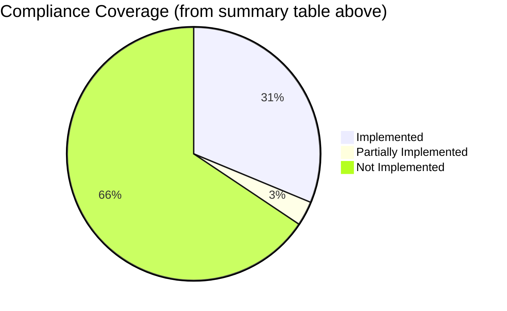
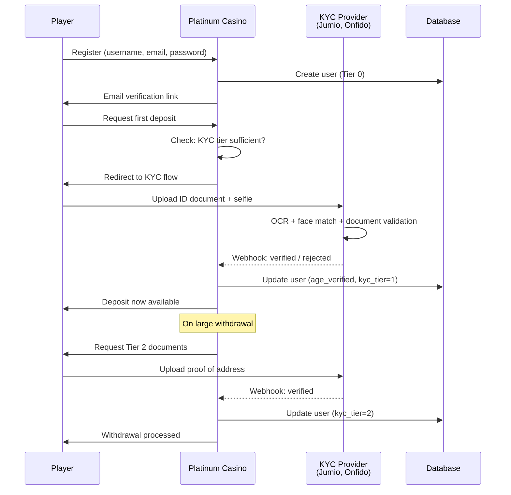
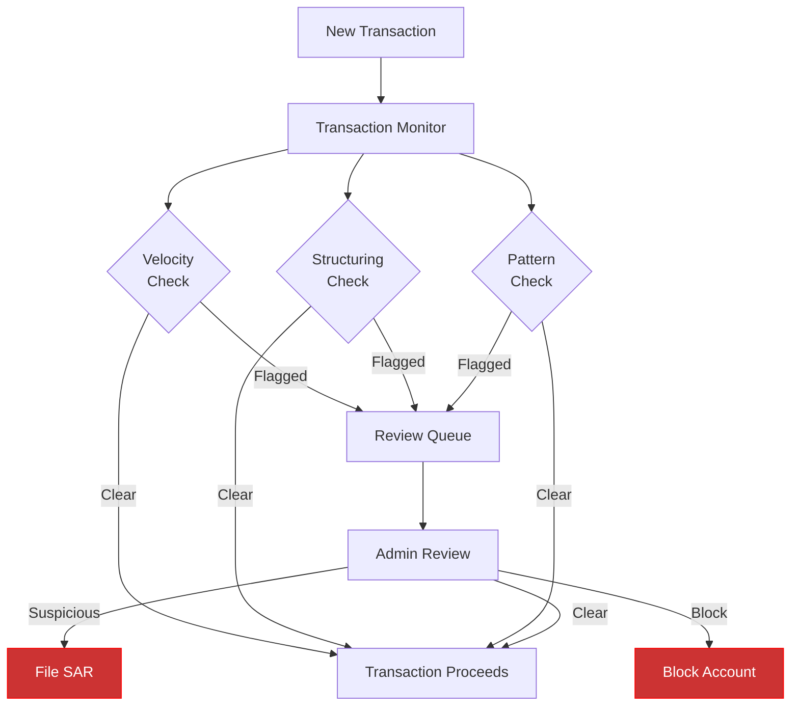

# Regulatory Framework

This document outlines the regulatory landscape for online gambling and maps Platinum Casino's current capabilities against what would be required for a licensed production deployment. It serves as both a reference for understanding gambling compliance and a gap analysis for the project.

> **Important:** Platinum Casino is an educational/development project and is **not licensed** for real-money gambling. This document is provided for informational purposes to illustrate the compliance considerations that a production online casino must address. None of the information here constitutes legal advice.

## Implementation Status Summary

| Feature | Status | Source File(s) |
|---------|--------|----------------|
| Gambling license | **Not implemented** | N/A -- educational project, no license held |
| Age verification | **Not implemented** | N/A -- registration requires only username/email/password |
| KYC (Know Your Customer) | **Not implemented** | N/A -- no identity verification system |
| Anti-money laundering (AML) monitoring | **Not implemented** | N/A -- no automated transaction monitoring or SAR filing |
| Self-exclusion mechanism | **Implemented** | `server/routes/responsible-gaming.ts`, `client/src/pages/ResponsibleGamingPage.jsx` |
| Activity summary for players | **Implemented** | `server/routes/responsible-gaming.ts`, `client/src/pages/ResponsibleGamingPage.jsx` |
| Deposit limits | **Not implemented** | N/A -- API stub returns `null`, no enforcement logic |
| Loss limits | **Not implemented** | N/A |
| Session time limits | **Not implemented** | N/A |
| Cool-off periods | **Not implemented** | N/A |
| Reality checks (periodic pop-ups) | **Not implemented** | N/A |
| Provably fair algorithm | **Implemented** (service only) | `server/src/services/provablyFairService.ts` |
| Provably fair integration in games | **Not implemented** | N/A -- game handlers do not use `ProvablyFairService` |
| Player-facing fairness verification UI | **Not implemented** | N/A |
| Independent RNG certification | **Not implemented** | N/A |
| Published RTP rates | **Not implemented** | N/A |
| HTTPS/TLS (Helmet middleware) | **Implemented** | `server/server.ts` (line 104: `app.use(helmet())`) |
| API rate limiting (express-rate-limit) | **Implemented** | `server/server.ts` (lines 108-114: 120 req/min on `/api`) |
| Socket rate limiting (middleware exists) | **Partially implemented** | `server/middleware/socket/socketRateLimit.ts` (exists but not applied to any handler) |
| Input validation with Zod | **Implemented** | `server/src/validation/schemas.ts` (game + admin schemas) |
| Password hashing with bcrypt | **Implemented** | `server/lib/auth.ts` (bcrypt hash/verify in Better Auth config) |
| HTTP-only session cookies | **Implemented** | `server/lib/auth.ts` (Better Auth session config) |
| Transaction audit trail | **Implemented** | `server/src/services/balanceService.ts` (dual-record in single DB transaction) |
| Activity logging | **Implemented** | `server/src/services/loggingService.ts` (database + Winston file logs) |
| Data retention (5-7 year compliance) | **Not implemented** | N/A -- `game_logs` default cleanup is 30 days |
| Regulatory reporting | **Not implemented** | N/A |
| PCI DSS compliance | **Not implemented** | N/A -- no payment processing |
| GDPR/CCPA compliance | **Not implemented** | N/A -- no data protection controls |
| Geographic access controls | **Not implemented** | N/A |
| Player fund segregation | **Not implemented** | N/A -- virtual currency only |
| Terms of service / privacy policy | **Not implemented** | N/A |
| Dispute resolution procedures | **Not implemented** | N/A |

---

## Online Gambling Regulatory Overview

Online gambling is regulated at multiple levels -- national, state/provincial, and sometimes municipal. The requirements vary significantly by jurisdiction, but most share common themes.

### Major Regulatory Bodies

| Jurisdiction | Regulator | Key Legislation |
|-------------|-----------|-----------------|
| United Kingdom | UK Gambling Commission (UKGC) | Gambling Act 2005 |
| Malta | Malta Gaming Authority (MGA) | Gaming Act 2018 |
| Gibraltar | Gibraltar Regulatory Authority | Gambling Act 2005 |
| Isle of Man | Isle of Man Gambling Supervision Commission | Online Gambling Regulation Act 2001 |
| United States | State-level (varies) | Wire Act, UIGEA, state laws |
| Curacao | Curacao Gaming Control Board | National Ordinance on Offshore Games of Hazard |
| European Union | National regulators (varies) | EU cross-border services framework |

### Common Regulatory Requirements

Most gambling jurisdictions require the following:

1. **Licensing** -- Operator must hold a valid gambling license
2. **Player verification** -- Age and identity verification (KYC)
3. **Anti-money laundering** -- Transaction monitoring and reporting (AML)
4. **Responsible gaming** -- Self-exclusion, deposit limits, player protection
5. **Game fairness** -- Certified RNG, published return-to-player (RTP) rates
6. **Data protection** -- GDPR, CCPA, or equivalent
7. **Financial controls** -- Segregated player funds, audit trails
8. **Record keeping** -- Multi-year retention of transactions and player activity
9. **Advertising standards** -- Responsible marketing, no targeting minors
10. **Technical standards** -- Security, uptime, disaster recovery

---

## Regulatory Requirements Matrix

The following matrix maps each major requirement area against what Platinum Casino currently implements and what would be needed for production.

### Implemented vs. Needed



---

## Age Verification

**Status: Not implemented**

The platform does not implement age verification. User registration requires only a username, email, and password (via Better Auth with the username plugin, configured in `server/lib/auth.ts`). There is no date-of-birth field, no age gate, and no document verification.

### What Would Be Needed

| Requirement | Description |
|-------------|-------------|
| Age gate | Require date of birth at registration; reject users under legal age (18 or 21 depending on jurisdiction) |
| Document verification | Integration with KYC providers (Jumio, Onfido, Veriff) for ID document verification |
| Database checks | Cross-reference against national age verification databases |
| Ongoing monitoring | Periodic re-verification, especially before large withdrawals |
| Underage account handling | Procedures for closing underage accounts and returning funds |

### Implementation Considerations

A production implementation would add these fields to the `users` table:

```sql
ALTER TABLE users ADD COLUMN date_of_birth DATE DEFAULT NULL;
ALTER TABLE users ADD COLUMN age_verified BOOLEAN DEFAULT FALSE;
ALTER TABLE users ADD COLUMN age_verified_at TIMESTAMP DEFAULT NULL;
ALTER TABLE users ADD COLUMN verification_method VARCHAR(50) DEFAULT NULL;
ALTER TABLE users ADD COLUMN verification_reference VARCHAR(255) DEFAULT NULL;
```

---

## KYC (Know Your Customer)

**Status: Not implemented**

The platform collects minimal user data: username, email, and password. There is no identity verification process. The `users` table (defined in `server/drizzle/schema.ts`) does not include fields for identity documents, verification status, or KYC tier.

### What Would Be Needed

#### KYC Tiers

Most regulated platforms implement tiered verification:

| Tier | Trigger | Required Documents |
|------|---------|-------------------|
| Tier 0 | Registration | Email verification only |
| Tier 1 | First deposit | Government-issued photo ID |
| Tier 2 | Cumulative deposits exceed threshold | Proof of address (utility bill, bank statement) |
| Tier 3 | Large withdrawal or suspicious activity | Source of funds documentation |

#### KYC Integration Flow



---

## Anti-Money Laundering (AML)

**Status: Not implemented**

The platform records all transactions with before/after balance snapshots (via `BalanceService` in `server/src/services/balanceService.ts`) and supports admin-initiated transaction voiding (via `server/routes/admin.ts`). However, there is **no** automated AML monitoring, suspicious activity detection, or regulatory reporting.

### What Would Be Needed

#### Transaction Monitoring

| Check | Description | Current Status |
|-------|-------------|----------------|
| Unusual deposit patterns | Multiple deposits in quick succession | **Not implemented** |
| Structuring detection | Deposits just below reporting thresholds | **Not implemented** |
| Velocity checks | Rapid deposits and withdrawals without play | **Not implemented** |
| Source of funds | Verify origin of large deposits | **Not implemented** |
| Suspicious Activity Reports (SARs) | Automated regulatory filing | **Not implemented** |
| Politically Exposed Persons (PEP) | Screen against PEP databases | **Not implemented** |
| Sanctions screening | Check against OFAC, EU, UN sanctions lists | **Not implemented** |

#### What the Codebase Provides as a Foundation

The existing transaction recording infrastructure (all implemented) provides a foundation for AML:

- Every balance change creates a `transactions` record with `balanceBefore` and `balanceAfter` (via `BalanceService.updateBalance()` in `server/src/services/balanceService.ts`)
- Transaction types are categorized (`deposit`, `withdrawal`, `game_win`, `game_loss`, `admin_adjustment`)
- Admin adjustments record who made the change (`createdBy`)
- Voided transactions record who voided them and why (`voidedBy`, `voidedReason`)
- The `game_logs` table captures all game events with timestamps (via `LoggingService` in `server/src/services/loggingService.ts`)
- Comprehensive database indexes support efficient querying of transaction patterns (11+ indexes on `transactions` table in `server/drizzle/schema.ts`)

#### AML Monitoring Architecture (Future)



---

## Record Keeping Requirements

### Current Implementation

| Record Type | Storage | Retention | Indexed | Status |
|-------------|---------|-----------|---------|--------|
| Transactions | `transactions` table | Indefinite (no auto-cleanup) | Yes (11 indexes including compound) | **Implemented** |
| Balance history | `balances` table | Indefinite | Yes (6 indexes) | **Implemented** |
| Game sessions | `game_sessions` table | Indefinite | Yes (6 indexes) | **Implemented** |
| Game logs | `game_logs` table | 30 days default (configurable) | Yes (7 indexes) | **Implemented** (but retention too short for production) |
| User accounts | `users` table | Indefinite | Yes (3 indexes) | **Implemented** |
| Auth sessions | `session` table | Until expiry | Yes (2 indexes) | **Implemented** |
| Chat messages | `messages` table | Indefinite | Yes (2 indexes) | **Implemented** |

All table definitions are in `server/drizzle/schema.ts`.

### Regulatory Requirements

**Status: Not implemented** (retention periods are insufficient)

Most jurisdictions require:

| Record Type | Minimum Retention | Current Status |
|-------------|------------------|----------------|
| Financial transactions | 5--7 years | No auto-deletion (adequate for retention, but no archival strategy) |
| Player identity data | Duration of relationship + 5 years | No auto-deletion (adequate, but no identity data collected) |
| Game results and outcomes | 5--7 years | 30-day default cleanup (**insufficient**) |
| Responsible gaming actions | Permanent | Logged to `game_logs` (subject to 30-day cleanup -- **insufficient**) |
| AML-related records | 5--7 years | No AML records exist |
| Complaints and disputes | 3--5 years | No complaint system exists |
| Marketing consent records | Duration of consent + 3 years | No marketing consent system exists |

### Gap

The main gap is the `game_logs` cleanup utility (`LoggingService.cleanupOldLogs()` in `server/src/services/loggingService.ts`), which defaults to 30-day retention. For production, this should be extended to meet the 5--7 year requirement, or game logs should be archived to cold storage rather than deleted. Additionally, responsible gaming events (self-exclusion, limit changes) should be stored in a dedicated table exempt from cleanup.

---

## Compliance Checklist for Going Live

This checklist summarizes what would need to be completed before Platinum Casino could be deployed as a licensed gambling platform.

### Licensing and Legal

- [ ] Obtain gambling license from target jurisdiction -- **Not implemented**
- [ ] Engage legal counsel specializing in gambling law -- **Not implemented**
- [ ] Establish legal entity in licensed jurisdiction -- **Not implemented**
- [ ] Set up player fund segregation (separate bank account) -- **Not implemented**
- [ ] Create terms of service and privacy policy -- **Not implemented**
- [ ] Establish dispute resolution procedures -- **Not implemented**
- [ ] Register with self-exclusion schemes (GamStop, etc.) -- **Not implemented**

### Player Verification

- [ ] Implement age verification at registration -- **Not implemented**
- [ ] Integrate KYC document verification service -- **Not implemented**
- [ ] Implement tiered verification triggers -- **Not implemented**
- [ ] Add PEP and sanctions screening -- **Not implemented**
- [ ] Build verification status tracking in user records -- **Not implemented**
- [ ] Create procedures for failed verification -- **Not implemented**

### Anti-Money Laundering

- [ ] Implement automated transaction monitoring -- **Not implemented**
- [ ] Build suspicious activity detection rules -- **Not implemented**
- [ ] Set up SAR filing procedures -- **Not implemented**
- [ ] Implement source of funds checks for large deposits -- **Not implemented**
- [ ] Create AML risk assessment framework -- **Not implemented**
- [ ] Train staff on AML obligations -- **Not implemented**
- [ ] Appoint MLRO (Money Laundering Reporting Officer) -- **Not implemented**

### Responsible Gaming

- [x] Self-exclusion mechanism -- **Implemented** (`server/routes/responsible-gaming.ts`)
- [x] Activity summary for players -- **Implemented** (`server/routes/responsible-gaming.ts`)
- [ ] Implement deposit limits -- **Not implemented** (API contract exists with `null` values, backend not active)
- [ ] Implement loss limits -- **Not implemented**
- [ ] Implement session time limits and warnings -- **Not implemented**
- [ ] Implement cool-off periods -- **Not implemented**
- [ ] Reality checks (periodic pop-ups during play) -- **Not implemented**
- [ ] Integrate with national self-exclusion databases -- **Not implemented**
- [x] Provide problem gambling support resources -- **Implemented** (`client/src/pages/ResponsibleGamingPage.jsx`, `ResourcesSection` component with links to NCPG, Gamblers Anonymous, GamCare, BeGambleAware)
- [ ] Implement underage gambling prevention -- **Not implemented**

### Game Fairness

- [x] Provably fair algorithm (HMAC-SHA256) -- **Implemented** (`server/src/services/provablyFairService.ts`)
- [ ] Integrate provably fair into game handlers -- **Not implemented** (service exists but game handlers use their own RNG)
- [ ] Independent RNG certification by accredited lab -- **Not implemented**
- [ ] Published RTP (Return to Player) rates for all games -- **Not implemented**
- [ ] Game logic audit by independent testing house (e.g., BMM, GLI, eCOGRA) -- **Not implemented**
- [ ] Implement player-facing verification UI for provably fair results -- **Not implemented**

### Technical and Security

- [x] HTTPS/TLS headers (Helmet middleware) -- **Implemented** (`server/server.ts`, `app.use(helmet())`)
- [x] API rate limiting on all endpoints -- **Implemented** (`server/server.ts`, `express-rate-limit` at 120 req/min on `/api`)
- [x] Input validation with Zod schemas -- **Implemented** (`server/src/validation/schemas.ts` for game and admin routes)
- [x] Password hashing with bcrypt -- **Implemented** (`server/lib/auth.ts`, bcrypt with 12 rounds in Better Auth config)
- [x] HTTP-only session cookies -- **Implemented** (`server/lib/auth.ts`, Better Auth session management)
- [ ] Socket event rate limiting applied to handlers -- **Not implemented** (middleware exists at `server/middleware/socket/socketRateLimit.ts` but is not imported by any handler)
- [ ] Penetration testing by accredited security firm -- **Not implemented**
- [ ] PCI DSS compliance for payment processing -- **Not implemented**
- [ ] GDPR/CCPA data protection compliance -- **Not implemented**
- [ ] Disaster recovery and business continuity plan -- **Not implemented**
- [ ] 99.9% uptime SLA -- **Not implemented**
- [ ] Geographic access controls (IP-based, geo-fencing) -- **Not implemented**

### Record Keeping and Reporting

- [x] Transaction audit trail with before/after balances -- **Implemented** (`server/src/services/balanceService.ts`, dual-record pattern in single DB transaction)
- [x] Activity logging for all game and admin events -- **Implemented** (`server/src/services/loggingService.ts`, database + Winston file logs)
- [ ] Extend data retention to 5--7 years -- **Not implemented** (current default is 30 days for `game_logs`)
- [ ] Implement regulatory reporting (financial returns, player statistics) -- **Not implemented**
- [ ] Set up data archival to cold storage -- **Not implemented**
- [ ] Implement GDPR right-to-erasure with regulatory exceptions -- **Not implemented**

### Operations

- [ ] 24/7 customer support -- **Not implemented**
- [ ] Staff training on responsible gaming and AML -- **Not implemented**
- [ ] Incident response procedures -- **Not implemented**
- [ ] Regular compliance audits (internal and external) -- **Not implemented**
- [ ] Annual responsible gaming review -- **Not implemented**

---

## Compliance Architecture (Target State)

```mermaid
flowchart TD
    subgraph "Player Facing"
        REG[Registration]
        LOGIN[Login]
        PLAY[Game Play]
        DEP[Deposits]
        WD[Withdrawals]
        RG[Responsible Gaming]
    end

    subgraph "Verification Layer (Not Implemented)"
        AGE[Age Verification]
        KYC[KYC Provider]
        PEP[PEP/Sanctions Check]
    end

    subgraph "Monitoring Layer (Not Implemented)"
        AML[AML Engine]
        TM[Transaction Monitor]
        PM[Pattern Monitor]
        RL[Responsible Gaming Limits]
    end

    subgraph "Compliance Layer (Partially Implemented)"
        SAR["SAR Filing (Not Implemented)"]
        REP["Regulatory Reports (Not Implemented)"]
        AUD["Audit Trail (Implemented)"]
        RET["Data Retention (Not Implemented)"]
    end

    subgraph "Admin Layer (Implemented)"
        AD[Admin Dashboard]
        REV["Review Queue (Not Implemented)"]
        LOG[Activity Logs]
    end

    REG --> AGE
    AGE --> KYC
    KYC --> PEP

    DEP --> TM
    WD --> TM
    TM --> AML
    AML --> PM

    PLAY --> RL
    RL -->|Limit exceeded| RG

    PM -->|Flagged| REV
    REV --> SAR
    REV --> AD

    TM --> AUD
    AUD --> RET
    RET --> REP

    AD --> LOG

    style SAR fill:#cc3333,stroke:#ff0000,color:#fff
    style AML fill:#1a1a2e,stroke:#e6c200
    style KYC fill:#1a1a2e,stroke:#e6c200
```



---

## Educational Project Disclaimer

Platinum Casino is built as a learning and demonstration project. It illustrates the technical patterns used in online gambling platforms but does not constitute a production-ready gambling system. Key limitations include:

- **No real-money transactions** -- The balance system uses virtual currency only
- **No gambling license** -- The project is not licensed by any gambling authority
- **No KYC/AML integration** -- Identity verification and anti-money laundering are not implemented
- **No age verification** -- Users are not verified to be of legal gambling age
- **No independent game audits** -- The provably fair service has not been certified by an accredited testing lab, and game handlers do not currently use it
- **No player fund segregation** -- There is no separation between operator and player funds
- **No regulatory reporting** -- Financial returns and player statistics are not filed with any authority

The project demonstrates best practices in software engineering -- including transactional integrity, audit trails, structured logging, and provably fair algorithms -- that form the technical foundation for a compliant gambling platform.

---

## Related Documents

- [Responsible Gaming](./responsible-gaming.md) -- Self-exclusion, activity summaries, support resources
- [Player Protection](./player-protection.md) -- Account banning, audit trails, game fairness, data retention
- [Security Overview](../07-security/security-overview.md) -- Authentication, rate limiting, security headers
- [Balance System](../03-features/balance-system.md) -- Transaction recording and financial operations
- [Database Schema](../09-database/schema.md) -- Table definitions, indexes, and relationships
- [Admin Panel](../03-features/admin-panel.md) -- Admin capabilities and oversight tools
- [Deployment Guide](../06-devops/deployment.md) -- Production deployment procedures
