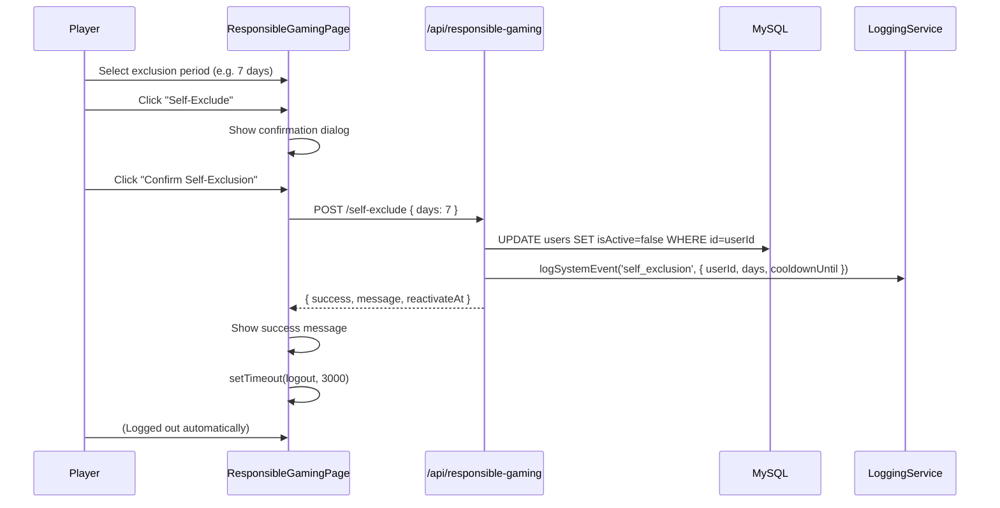
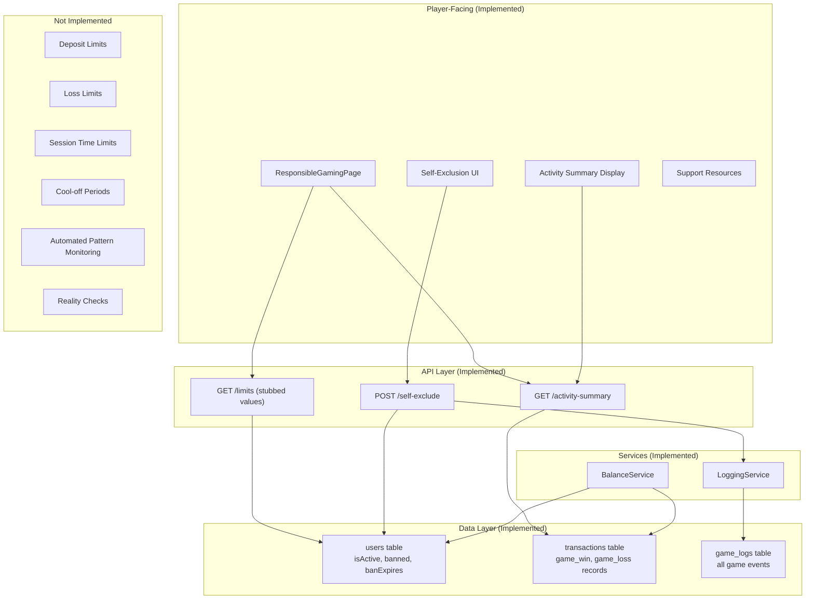

# Responsible Gaming

Platinum Casino provides a set of responsible gaming tools that help players stay in control of their gambling activity. These features include self-exclusion, activity summaries, and informational resources. Some capabilities -- such as deposit limits, loss limits, session time limits, and cool-off periods -- are defined in the API contract but not yet backed by dedicated database columns, making them straightforward to activate in a future migration.

> **Note:** This is an educational/development project. The responsible gaming features described here demonstrate the patterns a production casino would implement. A production deployment would require integration with licensed responsible gaming frameworks and jurisdictional compliance testing.

## Implementation Status Summary

| Feature | Status | Source File(s) |
|---------|--------|----------------|
| Self-exclusion | **Implemented** | `server/routes/responsible-gaming.ts`, `client/src/pages/ResponsibleGamingPage.jsx` |
| Activity summary (7-day / 30-day) | **Implemented** | `server/routes/responsible-gaming.ts`, `client/src/pages/ResponsibleGamingPage.jsx` |
| Limits API contract (stubbed) | **Implemented** (returns placeholder `null` values) | `server/routes/responsible-gaming.ts` |
| Deposit limits | **Not implemented** | N/A -- no database columns or enforcement logic exist |
| Loss limits | **Not implemented** | N/A -- no database columns or enforcement logic exist |
| Session time limits | **Not implemented** | N/A -- no database columns or enforcement logic exist |
| Cool-off periods | **Not implemented** | N/A -- no database columns or enforcement logic exist |
| Support resources (external links) | **Implemented** | `client/src/pages/ResponsibleGamingPage.jsx` |
| Admin account deactivation | **Implemented** | `server/routes/admin.ts` (PUT `/users/:id`, DELETE `/users/:id`) |
| Admin balance adjustment | **Implemented** | `server/routes/admin.ts` (POST `/users/:id/balance`) |
| Admin transaction voiding | **Implemented** | `server/routes/admin.ts` (PUT `/transactions/:id/void`) |
| Player activity monitoring (automated pattern detection) | **Not implemented** | N/A -- no automated detection of rapid betting, loss chasing, etc. |
| Reality checks (periodic pop-ups) | **Not implemented** | N/A |
| Integration with national self-exclusion databases | **Not implemented** | N/A |

---

## Self-Exclusion

**Status: Implemented**

Self-exclusion allows a player to voluntarily deactivate their account for a configurable number of days (1--365). While excluded, the player cannot log in or place bets because the `authenticate` middleware checks the `isActive` flag on every request.

### How It Works

1. The player selects an exclusion period on the Responsible Gaming page.
2. The frontend sends a `POST /api/responsible-gaming/self-exclude` request with `{ days }`.
3. The server sets `isActive = false` on the user record and logs the event via `LoggingService.logSystemEvent`.
4. The player is logged out after a 3-second delay so they can read the confirmation message.
5. The account remains deactivated until an admin manually reactivates it after the exclusion period expires.

### Backend Implementation

**File:** `server/routes/responsible-gaming.ts`

The self-exclusion endpoint validates the `days` parameter (clamped to 1--365), deactivates the user, and logs the action:

```typescript
router.post('/self-exclude', authenticate, async (req: Request, res: Response) => {
  const rawDays = parseInt(req.body?.days, 10);
  const days = Number.isFinite(rawDays) && rawDays >= 1 && rawDays <= 365 ? rawDays : 1;

  const cooldownUntil = new Date(Date.now() + days * 24 * 60 * 60 * 1000);

  await db
    .update(users)
    .set({ isActive: false, updatedAt: new Date() })
    .where(eq(users.id, userId));

  LoggingService.logSystemEvent('self_exclusion', {
    userId,
    days,
    cooldownUntil: cooldownUntil.toISOString(),
  }, 'info');

  res.json({
    success: true,
    message: `Account self-excluded for ${days} day(s). You will be logged out.`,
    reactivateAt: cooldownUntil.toISOString(),
  });
});
```

### Frontend Implementation

**File:** `client/src/pages/ResponsibleGamingPage.jsx`

The page provides a dropdown with predefined exclusion periods and a two-step confirmation flow:

1. Player selects a duration (1 day, 3 days, 1 week, 2 weeks, 1 month, 3 months, 6 months, 1 year).
2. Player clicks "Self-Exclude" to reveal a confirmation panel with a warning message.
3. Player clicks "Confirm Self-Exclusion" to execute.
4. On success, the player is automatically logged out after 3 seconds.

### Self-Exclusion Flow



---

## Activity Summary

**Status: Implemented**

The activity summary gives players visibility into their recent gambling behavior, helping them make informed decisions about whether to continue playing.

### What It Shows

The endpoint returns two time windows:

| Period | Metrics |
|--------|---------|
| Last 7 days | Total games, total wins, total losses, net result |
| Last 30 days | Total games, total wins, total losses, net result |

### Backend Implementation

**File:** `server/routes/responsible-gaming.ts`

The activity summary endpoint executes raw SQL to aggregate transaction data:

```typescript
router.get('/activity-summary', authenticate, async (req: Request, res: Response) => {
  const [summary7d] = await db.execute(rawSql`
    SELECT
      COUNT(*) as totalTransactions,
      COALESCE(SUM(CASE WHEN type = 'game_loss'
        THEN CAST(amount AS DECIMAL(15,2)) ELSE 0 END), 0) as totalLosses,
      COALESCE(SUM(CASE WHEN type = 'game_win'
        THEN CAST(amount AS DECIMAL(15,2)) ELSE 0 END), 0) as totalWins
    FROM transactions
    WHERE user_id = ${userId}
      AND type IN ('game_win', 'game_loss')
      AND created_at >= DATE_SUB(NOW(), INTERVAL 7 DAY)
  `);

  // ... (same query for 30 days)

  res.json({
    last7Days: { totalGames, totalWins, totalLosses, netResult },
    last30Days: { totalGames, totalWins, totalLosses, netResult },
  });
});
```

### Frontend Display

The `ResponsibleGamingPage` renders the activity summary in two side-by-side cards. Wins are shown in green, losses in red, and the net result is color-coded based on whether the player is up or down.

---

## Limits (Stubbed)

**Status: API contract implemented, enforcement NOT implemented**

The limits endpoint is defined and returns placeholder values. This establishes the API contract so the frontend can integrate immediately, and the backend can add real database columns later without a breaking change.

**File:** `server/routes/responsible-gaming.ts` -- the `GET /limits` endpoint reads the user's `isActive` status from the database and returns it alongside hardcoded `null` values for all limit fields.

### Current Response

```json
{
  "isActive": true,
  "selfExcluded": false,
  "dailyDepositLimit": null,
  "dailyLossLimit": null,
  "sessionTimeLimit": null,
  "cooldownUntil": null
}
```

### Not Yet Implemented: Deposit Limits

**Status: Recommended for Production**

This feature is not yet implemented. A daily deposit cap would prevent the player from depositing more than a configured amount within a 24-hour window. Implementation would require:

- Adding a `daily_deposit_limit` column to the `users` table
- Modifying `BalanceService.updateBalance()` to check the limit before processing `deposit` transactions
- Adding a UI for players to set/change their deposit limit
- Enforcing a cooling-off period before limits can be increased

### Not Yet Implemented: Loss Limits

**Status: Recommended for Production**

This feature is not yet implemented. A daily loss cap would prevent further bets once the player's cumulative losses for the day exceed the configured threshold. Implementation would require:

- Adding a `daily_loss_limit` column to the `users` table
- Modifying game socket handlers to query the limit before accepting a bet
- Aggregating daily losses from the `transactions` table in real time

### Not Yet Implemented: Session Time Limits

**Status: Recommended for Production**

This feature is not yet implemented. A maximum session duration (in minutes) after which the player receives a warning and is eventually disconnected. Implementation would require:

- Adding a `session_time_limit` column to the `users` table
- Tracking session start time in the socket auth middleware
- Sending periodic warnings to the client as the limit approaches
- Disconnecting the player when the limit is reached

### Not Yet Implemented: Cool-off Periods

**Status: Recommended for Production**

This feature is not yet implemented. A temporary lockout triggered automatically or manually. Implementation would require:

- Adding a `cooldown_until` column to the `users` table
- Modifying the auth middleware to block login attempts when `cooldown_until` is set to a future timestamp
- Providing admin and/or automated triggers to set cool-off periods

### Database Migration (Future)

The following columns would need to be added to the `users` table to support the above features:

```sql
ALTER TABLE users ADD COLUMN daily_deposit_limit DECIMAL(15,2) DEFAULT NULL;
ALTER TABLE users ADD COLUMN daily_loss_limit DECIMAL(15,2) DEFAULT NULL;
ALTER TABLE users ADD COLUMN session_time_limit INT DEFAULT NULL;
ALTER TABLE users ADD COLUMN cooldown_until TIMESTAMP DEFAULT NULL;
```

---

## Player Activity Monitoring

### Automated Monitoring

**Status: Recommended for Production**

Automated pattern detection for problematic gambling behavior is **not yet implemented**. The data infrastructure exists (the `LoggingService` records all game actions, bets, and results to the `game_logs` table), but no automated analysis runs against this data. A production system would need to detect:

- **Rapid betting** -- High-frequency bet placement within short time windows
- **Chasing losses** -- Increasing bet sizes after consecutive losses
- **Extended sessions** -- Continuous play without breaks
- **Unusual deposit patterns** -- Multiple deposits in quick succession

### Admin Monitoring

**Status: Implemented**

Administrators have access to the following endpoints (all in `server/routes/admin.ts`):

- **Dashboard** (`GET /api/admin/dashboard`) -- Overview of active players, total balance, recent transactions
- **Player list** (`GET /api/admin/users`) -- All players with their `isActive` status
- **Transaction history** (`GET /api/admin/transactions`) -- Filterable by user, type, status, and date range
- **Game statistics** (`GET /api/admin/games`) -- Per-game play counts and house profit

See [Admin Panel](../03-features/admin-panel.md) for full details on admin capabilities.

---

## API Endpoints

**Status: Implemented**

All endpoints require authentication via the `authenticate` middleware and are mounted under `/api/responsible-gaming` (wired in `server/server.ts` line 123).

| Method | Path | Description | Status |
|--------|------|-------------|--------|
| `GET` | `/api/responsible-gaming/limits` | Get current limits and self-exclusion status | Implemented (returns stubbed limit values) |
| `POST` | `/api/responsible-gaming/self-exclude` | Self-exclude for a number of days | Implemented |
| `GET` | `/api/responsible-gaming/activity-summary` | Get 7-day and 30-day activity summaries | Implemented |

### Request/Response Examples

#### Get Limits

```bash
GET /api/responsible-gaming/limits
Cookie: better-auth.session_token=...
```

```json
{
  "isActive": true,
  "selfExcluded": false,
  "dailyDepositLimit": null,
  "dailyLossLimit": null,
  "sessionTimeLimit": null,
  "cooldownUntil": null
}
```

#### Self-Exclude

```bash
POST /api/responsible-gaming/self-exclude
Cookie: better-auth.session_token=...
Content-Type: application/json

{ "days": 7 }
```

```json
{
  "success": true,
  "message": "Account self-excluded for 7 day(s). You will be logged out.",
  "reactivateAt": "2026-04-04T12:00:00.000Z"
}
```

#### Activity Summary

```bash
GET /api/responsible-gaming/activity-summary
Cookie: better-auth.session_token=...
```

```json
{
  "last7Days": {
    "totalGames": 42,
    "totalWins": 150.00,
    "totalLosses": 200.00,
    "netResult": -50.00
  },
  "last30Days": {
    "totalGames": 180,
    "totalWins": 620.00,
    "totalLosses": 750.00,
    "netResult": -130.00
  }
}
```

---

## Admin Tools for Player Protection

**Status: Implemented**

All of the following endpoints exist and are functional in `server/routes/admin.ts`:

| Action | Endpoint | Effect | Status |
|--------|----------|--------|--------|
| Deactivate account | `PUT /api/admin/users/:id` with `{ isActive: false }` | Blocks login and play | **Implemented** |
| Soft-delete user | `DELETE /api/admin/users/:id` | Sets `isActive = false` (no data deleted) | **Implemented** |
| Adjust balance | `POST /api/admin/users/:id/balance` | Credit or debit with audit trail | **Implemented** |
| Void transaction | `PUT /api/admin/transactions/:id/void` | Mark a transaction as voided with reason | **Implemented** |

All admin actions are logged via `LoggingService` and create corresponding records in the `transactions` and `balances` tables for a complete audit trail.

---

## Support Resources

**Status: Implemented**

**File:** `client/src/pages/ResponsibleGamingPage.jsx` (the `ResourcesSection` component)

The Responsible Gaming page displays links to recognized problem gambling organizations, visible to both authenticated and unauthenticated users:

| Organization | Website | Phone |
|-------------|---------|-------|
| National Council on Problem Gambling | ncpgambling.org | 1-800-522-4700 |
| Gamblers Anonymous | gamblersanonymous.org | -- |
| GamCare | gamcare.org.uk | 0808 8020 133 |
| BeGambleAware | begambleaware.org | 0808 8020 133 |

---

## Responsible Gaming Architecture



---

## Related Documents

- [Player Protection](./player-protection.md) -- Account banning, audit trails, game fairness
- [Regulatory Framework](./regulatory-framework.md) -- Regulatory overview and compliance checklist
- [Balance System](../03-features/balance-system.md) -- Transaction recording and balance management
- [Admin Panel](../03-features/admin-panel.md) -- Admin dashboard and player management
- [Security Overview](../07-security/security-overview.md) -- Authentication, rate limiting, security checklist
- [REST API Reference](../04-api/rest-api.md) -- Full API endpoint documentation
- [Logging](../10-operations/logging.md) -- LoggingService and audit trail details
