# Documentation Map

Visual map of all 73 documentation files in the Platinum Casino project.

```mermaid
graph TD
    Portal["docs/README.md<br/>Documentation Portal"]

    Portal --> Overview["01-overview/"]
    Portal --> Arch["02-architecture/"]
    Portal --> Features["03-features/"]
    Portal --> API["04-api/"]
    Portal --> Dev["05-development/"]
    Portal --> DevOps["06-devops/"]
    Portal --> Security["07-security/"]
    Portal --> Testing["08-testing/"]
    Portal --> DB["09-database/"]
    Portal --> Ops["10-operations/"]
    Portal --> Roadmap["11-roadmap/"]
    Portal --> Troubleshoot["12-troubleshooting/"]
    Portal --> Integrations["13-integrations/"]
    Portal --> AIAgents["14-ai-agents/"]
    Portal --> Compliance["15-compliance/"]
    Portal --> Archive["archive/"]
    Portal --> Meta["Meta Files"]

    Overview --> PS[project-summary.md]
    Overview --> TS[technology-stack.md]

    Arch --> SA[system-architecture.md]
    Arch --> DF[data-flow.md]
    Arch --> SOC[socket-architecture.md]
    Arch --> ADR["decisions/ (6 ADRs)"]

    Features --> GO[games-overview.md]
    Features --> GA[game-algorithms.md]
    Features --> Auth[authentication.md]
    Features --> Admin[admin-panel.md]
    Features --> Bal[balance-system.md]
    Features --> LR[login-rewards.md]
    Features --> Chat[chat-system.md]
    Features --> CSM[client-state-management.md]
    Features --> CL[component-library.md]
    Features --> PF[provably-fair.md]
    Features --> RG[responsible-gaming.md]
    Features --> LB[leaderboard.md]
    Features --> VS[validation-schemas.md]

    API --> REST[rest-api.md]
    API --> SE[socket-events.md]
    API --> EC[error-codes.md]
    API --> OA[openapi.yaml]
    API --> OAG[openapi-guide.md]
    API --> AV[api-versioning.md]

    Dev --> GS[getting-started.md]
    Dev --> NS[npm-scripts.md]
    Dev --> PSt[project-structure.md]
    Dev --> CS[coding-standards.md]
    Dev --> Contrib[contributing.md]
    Dev --> Onboard[onboarding.md]
    Dev --> I18n[internationalization.md]
    Dev --> Mobile[mobile-responsiveness.md]

    DevOps --> CI[ci-cd.md]
    DevOps --> Deploy[deployment.md]

    Security --> SO[security-overview.md]
    Security --> EV[environment-variables.md]

    Testing --> TSt[testing-strategy.md]
    Testing --> TE[test-examples.md]
    Testing --> TI[test-infrastructure.md]

    DB --> Schema[schema.md]
    DB --> Mig[migrations.md]
    DB --> DM[data-models.md]

    Ops --> Log[logging.md]
    Ops --> Mon[monitoring.md]
    Ops --> Perf[performance.md]

    Roadmap --> Status[current-status.md]
    Roadmap --> RM[roadmap.md]

    Troubleshoot --> Issues[common-issues.md]
    Troubleshoot --> FAQ[faq.md]

    Integrations --> BAI[better-auth-integration.md]
    Integrations --> Docker[docker-setup.md]
    Integrations --> Redis[redis-integration.md]
    Integrations --> SIO[socket-io-architecture.md]

    AIAgents --> CCS[claude-code-setup.md]
    AIAgents --> AKS[agent-knowledge-system.md]
    AIAgents --> DW[development-workflows.md]

    Compliance --> PP[player-protection.md]
    Compliance --> RF[regulatory-framework.md]
    Compliance --> RGC[responsible-gaming.md]

    Archive --> ARC1[legacy-docs-index.md]

    Meta --> CLog[CHANGELOG.md]
    Meta --> DHR[DOC_HEALTH_REPORT.md]
    Meta --> DMap[DOC_MAP.md]
    Meta --> DTodo[DOC_TODO.md]
```

## File Index (73 files)

### Root Documentation
| File | Description |
|------|-------------|
| `README.md` | Main project README |
| `SECURITY.md` | Security policy |
| `ACTION_PLAN.md` | Development action plan (legacy) |
| `PROJECT_REVIEW.md` | Comprehensive project review (legacy) |
| `QUICK_FIXES.md` | Quick fix guide (legacy) |
| `FIXES_NEEDED.md` | Outstanding fixes list (legacy) |
| `project.md` | Original project plan (legacy) |

### docs/ Meta Files (5 files)
| Path | Description |
|------|-------------|
| `docs/README.md` | Documentation portal (entry point) |
| `docs/DOC_MAP.md` | This file -- documentation map |
| `docs/DOC_HEALTH_REPORT.md` | Documentation quality scores |
| `docs/DOC_TODO.md` | Documentation tasks |
| `docs/CHANGELOG.md` | Version history (Keep a Changelog format) |

### 01-overview/ (2 files)
| File | Description |
|------|-------------|
| `project-summary.md` | Project overview, key facts, capabilities |
| `technology-stack.md` | Complete technology inventory |

### 02-architecture/ (10 files)
| File | Description |
|------|-------------|
| `system-architecture.md` | High-level system design with Mermaid diagrams |
| `data-flow.md` | Authentication, game bet, and admin data flows |
| `socket-architecture.md` | Socket.IO namespace design, 3 init patterns, middleware |
| `decisions/README.md` | Architecture Decision Records index |
| `decisions/001-mongodb-to-mysql.md` | ADR: MongoDB to MySQL migration |
| `decisions/002-jwt-httponly-cookies.md` | ADR: JWT in HTTP-only cookies (historical) |
| `decisions/003-namespace-per-game.md` | ADR: Socket.IO namespace per game |
| `decisions/004-esm-modules.md` | ADR: ES Modules adoption |
| `decisions/005-context-over-redux.md` | ADR: Context API over Redux |
| `decisions/006-better-auth-migration.md` | ADR: Migration from JWT to Better Auth |

### 03-features/ (13 files)
| File | Description |
|------|-------------|
| `games-overview.md` | All 6 casino games overview |
| `game-algorithms.md` | Game math: formulas, house edges, payout tables, RNG |
| `authentication.md` | Better Auth session-based auth system |
| `admin-panel.md` | Admin dashboard features and API |
| `balance-system.md` | Balance service, transactions, audit trail |
| `login-rewards.md` | Daily login reward system |
| `chat-system.md` | Global chat (ChatBox, handler, socket events) |
| `client-state-management.md` | AuthContext, ToastContext, hooks, services |
| `component-library.md` | 18 UI components with props and usage examples |
| `provably-fair.md` | HMAC-SHA256 provably fair verification system |
| `responsible-gaming.md` | Self-exclusion, activity summaries, limits |
| `leaderboard.md` | Player rankings by period |
| `validation-schemas.md` | Zod validation schemas for all game events |

### 04-api/ (6 files)
| File | Description |
|------|-------------|
| `rest-api.md` | Complete REST API reference (~31 endpoints) |
| `socket-events.md` | Socket.IO events (68+ events, 8 namespaces) |
| `error-codes.md` | Error response reference with catalogs |
| `openapi.yaml` | OpenAPI 3.0.3 specification (machine-readable) |
| `openapi-guide.md` | How to use the OpenAPI spec |
| `api-versioning.md` | API versioning strategy and migration plan |

### 05-development/ (8 files)
| File | Description |
|------|-------------|
| `getting-started.md` | Setup guide (local, Docker, Makefile, tests) |
| `npm-scripts.md` | All npm scripts reference (including test scripts) |
| `project-structure.md` | Full directory tree with descriptions |
| `coding-standards.md` | Code conventions and patterns |
| `contributing.md` | PR workflow, code review, branch naming |
| `onboarding.md` | 3-day developer onboarding walkthrough |
| `internationalization.md` | i18n guide with react-i18next |
| `mobile-responsiveness.md` | Responsive design and PWA guide |

### 06-devops/ (2 files)
| File | Description |
|------|-------------|
| `ci-cd.md` | GitHub Actions CI pipeline (4 jobs: lint, build, test, security) |
| `deployment.md` | Docker, nginx, Makefile, production deployment |

### 07-security/ (2 files)
| File | Description |
|------|-------------|
| `security-overview.md` | Better Auth sessions, rate limiting, request IDs, Helmet, CORS |
| `environment-variables.md` | Environment variable reference |

### 08-testing/ (3 files)
| File | Description |
|------|-------------|
| `testing-strategy.md` | Vitest setup, test examples, coverage config |
| `test-examples.md` | Socket.IO, game logic, admin, E2E test patterns |
| `test-infrastructure.md` | Vitest configs, coverage thresholds, test directory structure |

### 09-database/ (3 files)
| File | Description |
|------|-------------|
| `schema.md` | Complete schema with ER diagram (11 tables including Better Auth) |
| `migrations.md` | Migration history and Drizzle Kit commands |
| `data-models.md` | 100+ ORM model methods with signatures |

### 10-operations/ (3 files)
| File | Description |
|------|-------------|
| `logging.md` | Winston LoggingService (every method documented) |
| `monitoring.md` | Health checks, alerting, Grafana dashboards |
| `performance.md` | Indexes, caching, scaling, optimization |

### 11-roadmap/ (2 files)
| File | Description |
|------|-------------|
| `current-status.md` | Feature completion with progress bars |
| `roadmap.md` | 5-phase plan with Gantt chart and risks |

### 12-troubleshooting/ (2 files)
| File | Description |
|------|-------------|
| `common-issues.md` | 8 issue categories with solutions |
| `faq.md` | Frequently asked questions |

### 13-integrations/ (4 files)
| File | Description |
|------|-------------|
| `better-auth-integration.md` | Better Auth framework integration guide |
| `docker-setup.md` | Docker and Docker Compose configuration |
| `redis-integration.md` | Optional Redis caching and Socket.IO adapter |
| `socket-io-architecture.md` | Socket.IO integration patterns |

### 14-ai-agents/ (3 files)
| File | Description |
|------|-------------|
| `claude-code-setup.md` | Claude Code AI assistant configuration |
| `agent-knowledge-system.md` | Agent memory and knowledge management |
| `development-workflows.md` | AI-assisted development workflows |

### 15-compliance/ (3 files)
| File | Description |
|------|-------------|
| `player-protection.md` | Player protection measures |
| `regulatory-framework.md` | Regulatory compliance overview |
| `responsible-gaming.md` | Responsible gaming compliance requirements |

### archive/ (2 files)
| File | Description |
|------|-------------|
| `README.md` | Archive purpose and navigation |
| `legacy-docs-index.md` | Root doc relevance assessment |

## Cross-Reference Matrix

| Topic | Architecture | Features | API | Database | Operations | Integrations |
|-------|-------------|----------|-----|----------|-----------|-------------|
| Authentication | data-flow.md | authentication.md | rest-api.md | schema.md (users, session) | logging.md | better-auth-integration.md |
| Games | socket-architecture.md | games-overview.md, game-algorithms.md | socket-events.md | schema.md (game_sessions) | performance.md | socket-io-architecture.md |
| Provably Fair | -- | provably-fair.md | rest-api.md (verify) | -- | -- | -- |
| Admin | system-architecture.md | admin-panel.md | rest-api.md | schema.md (transactions) | monitoring.md | -- |
| Balance | data-flow.md | balance-system.md | rest-api.md | schema.md (balances) | logging.md | redis-integration.md |
| Chat | socket-architecture.md | chat-system.md | socket-events.md | schema.md (messages) | -- | socket-io-architecture.md |
| Rewards | -- | login-rewards.md | rest-api.md | schema.md (login_rewards) | -- | -- |
| Leaderboard | -- | leaderboard.md | rest-api.md | schema.md (transactions) | -- | -- |
| Responsible Gaming | -- | responsible-gaming.md | rest-api.md | schema.md (users) | logging.md | -- |
| Security | decisions/002, 006 | authentication.md | error-codes.md | -- | monitoring.md | better-auth-integration.md |
| Validation | -- | validation-schemas.md | rest-api.md | -- | -- | -- |
| State | decisions/005 | client-state-management.md | -- | -- | -- | -- |
| UI | -- | component-library.md | -- | -- | -- | -- |
| Docker | -- | -- | -- | -- | -- | docker-setup.md |
| Redis | -- | -- | -- | -- | performance.md | redis-integration.md |
