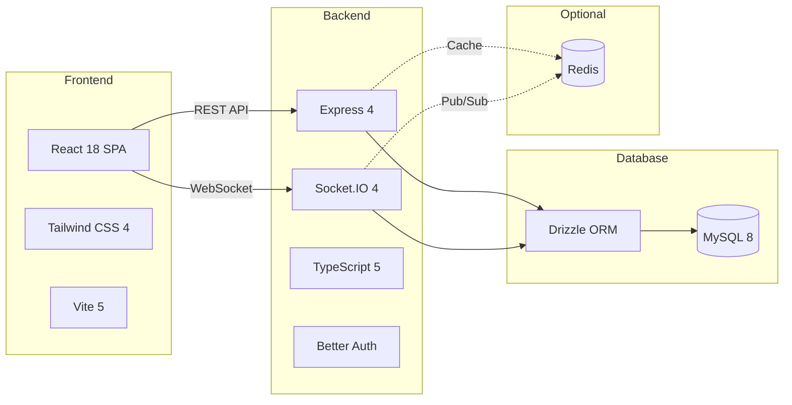

# Platinum Casino - Documentation Portal

Welcome to the Platinum Casino documentation. **73 files, 29,259 lines** of comprehensive technical documentation across **15 sections**.

**Health Score: 97/100** | [Health Report](./DOC_HEALTH_REPORT.md) | [Doc Map](./DOC_MAP.md) | [Changelog](./CHANGELOG.md)

---

## Quick Navigation

| Section | Files | Key Documents |
|---------|-------|--------------|
| [Overview](./01-overview/project-summary.md) | 2 | [Project Summary](./01-overview/project-summary.md), [Tech Stack](./01-overview/technology-stack.md) |
| [Architecture](./02-architecture/system-architecture.md) | 10 | [System Design](./02-architecture/system-architecture.md), [Data Flow](./02-architecture/data-flow.md), [Socket Design](./02-architecture/socket-architecture.md), [ADRs](./02-architecture/decisions/README.md) |
| [Features](./03-features/games-overview.md) | 13 | [Games](./03-features/games-overview.md), [Algorithms](./03-features/game-algorithms.md), [Auth](./03-features/authentication.md), [Provably Fair](./03-features/provably-fair.md), [Admin](./03-features/admin-panel.md), [Balance](./03-features/balance-system.md), [Leaderboard](./03-features/leaderboard.md), [Responsible Gaming](./03-features/responsible-gaming.md) |
| [API Reference](./04-api/rest-api.md) | 6 | [REST API](./04-api/rest-api.md), [Socket Events](./04-api/socket-events.md), [OpenAPI Spec](./04-api/openapi.yaml), [Errors](./04-api/error-codes.md) |
| [Development](./05-development/getting-started.md) | 8 | [Setup](./05-development/getting-started.md), [Contributing](./05-development/contributing.md), [Onboarding](./05-development/onboarding.md), [Standards](./05-development/coding-standards.md) |
| [DevOps](./06-devops/ci-cd.md) | 2 | [CI/CD](./06-devops/ci-cd.md), [Deployment](./06-devops/deployment.md) |
| [Security](./07-security/security-overview.md) | 2 | [Security Overview](./07-security/security-overview.md), [Env Vars](./07-security/environment-variables.md) |
| [Testing](./08-testing/testing-strategy.md) | 3 | [Strategy](./08-testing/testing-strategy.md), [Test Examples](./08-testing/test-examples.md), [Infrastructure](./08-testing/test-infrastructure.md) |
| [Database](./09-database/schema.md) | 3 | [Schema](./09-database/schema.md), [Migrations](./09-database/migrations.md), [Models](./09-database/data-models.md) |
| [Operations](./10-operations/logging.md) | 3 | [Logging](./10-operations/logging.md), [Monitoring](./10-operations/monitoring.md), [Performance](./10-operations/performance.md) |
| [Roadmap](./11-roadmap/roadmap.md) | 2 | [Current Status](./11-roadmap/current-status.md), [Roadmap](./11-roadmap/roadmap.md) |
| [Troubleshooting](./12-troubleshooting/common-issues.md) | 2 | [Common Issues](./12-troubleshooting/common-issues.md), [FAQ](./12-troubleshooting/faq.md) |
| [Integrations](./13-integrations/redis-integration.md) | 4 | [Redis](./13-integrations/redis-integration.md), [Better Auth](./13-integrations/better-auth-integration.md), [Docker](./13-integrations/docker-setup.md), [Socket.IO](./13-integrations/socket-io-architecture.md) |
| [AI Agents](./14-ai-agents/claude-code-setup.md) | 3 | [Claude Code Setup](./14-ai-agents/claude-code-setup.md), [Knowledge System](./14-ai-agents/agent-knowledge-system.md), [Workflows](./14-ai-agents/development-workflows.md) |
| [Compliance](./15-compliance/responsible-gaming.md) | 3 | [Responsible Gaming](./15-compliance/responsible-gaming.md), [Player Protection](./15-compliance/player-protection.md), [Regulatory](./15-compliance/regulatory-framework.md) |

---

## System Overview

Platinum Casino is a full-stack web application featuring **6 real-time casino games** with admin controls, user authentication, and comprehensive analytics.



### Games

| Game | Type | House Edge | Algorithm Doc |
|------|------|-----------|--------------|
| Crash | Multiplier betting | ~1% | [Details](./03-features/game-algorithms.md#1-crash-game) |
| Roulette | Table game | 2.7% | [Details](./03-features/game-algorithms.md#4-roulette) |
| Blackjack | Card game | ~0.5% | [Details](./03-features/game-algorithms.md#5-blackjack) |
| Plinko | Physics-based | ~2% | [Details](./03-features/game-algorithms.md#2-plinko) |
| Wheel | Spin-to-win | ~4% | [Details](./03-features/game-algorithms.md#3-wheel-of-fortune) |
| Landmines | Grid reveal | Variable | [Details](./03-features/game-algorithms.md#6-landmines) |

### Key Features

- **6 real-time casino games** with documented algorithms and house edges
- **68+ Socket.IO events** across 8 namespaces ([full reference](./04-api/socket-events.md))
- **~31 REST API endpoints** with [OpenAPI 3.0 spec](./04-api/openapi.yaml)
- **Better Auth** session-based authentication with role-based access control
- **Provably fair** HMAC-SHA256 game verification ([docs](./03-features/provably-fair.md))
- **Admin dashboard** for player management, balance adjustments, game statistics
- **Balance service** with full transaction audit trail (7 transaction types)
- **Leaderboard** with daily/weekly/allTime rankings ([docs](./03-features/leaderboard.md))
- **Responsible gaming** with self-exclusion and activity summaries ([docs](./03-features/responsible-gaming.md))
- **18 UI components** documented with props and usage ([library](./03-features/component-library.md))
- **6 architecture decision records** documenting key design choices
- **4-stage CI/CD pipeline** via GitHub Actions (lint, build, test, security)
- **Zod validation** on all socket events and admin operations ([schemas](./03-features/validation-schemas.md))
- **Structured logging** via Winston with comprehensive event tracking
- **Optional Redis** for caching and horizontal scaling (graceful degradation)
- **Docker** production deployment with nginx reverse proxy ([deployment](./06-devops/deployment.md))

---

## Getting Started

```bash
# Clone
git clone <repo-url>
cd online-casino

# Server
cd server
npm install
cp .env.example .env   # Edit with your DB credentials and BETTER_AUTH_SECRET
npm run db:push
npm run seed
npm run dev

# Client (new terminal)
cd client
npm install
npm run dev
```

**Access:** Client at `http://localhost:5173` | API at `http://localhost:5000`

**Default Logins:** `admin/admin123` | `player1/password123`

See [Getting Started Guide](./05-development/getting-started.md) for full instructions or [Developer Onboarding](./05-development/onboarding.md) for a 3-day walkthrough.

---

## For New Developers

1. [Getting Started](./05-development/getting-started.md) - Set up your local environment
2. [Onboarding Walkthrough](./05-development/onboarding.md) - 3-day guided tour of the codebase
3. [Architecture Overview](./02-architecture/system-architecture.md) - Understand the system design
4. [Contributing Guide](./05-development/contributing.md) - PR workflow and code review process
5. [Coding Standards](./05-development/coding-standards.md) - Code conventions and patterns
6. [AI-Assisted Development](./14-ai-agents/development-workflows.md) - Using Claude Code with this project
